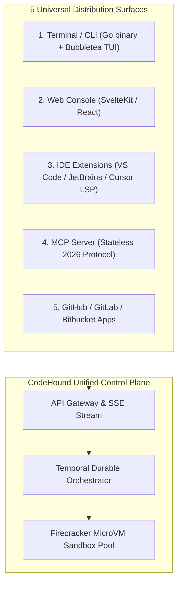

# Product Requirements Document (PRD) — CodeHound (ForgeGuard)

**Document:** 01-PRD.md  
**Status:** Approved Master PRD  
**Target:** Autonomous AI DevSecOps & QA Engineering Platform  
**Date:** 2026-08-25  

---

## 1. Executive Summary

**CodeHound (ForgeGuard)** is an autonomous, repository-wide software verification, DevSecOps, and QA engineering platform. Moving beyond shallow pull-request diff commenters, CodeHound operates as a **closed-loop verification platform**. The system does not trust an LLM finding merely because a model generated it; it attempts to prove findings using AST data-flow evidence, sandboxed test execution, runtime traces, mutation testing, dynamic fuzzing, and consensus arbitration.

It unifies:
1. **Repository-Wide Code Intelligence**: Tree-sitter multilingual AST parsing, cross-file symbol graphs, and interprocedural taint flow analysis.
2. **Deterministic Static & Secret Assurance**: Semgrep SAST, Gitleaks regex/entropy detection, TruffleHog live credential verification, and Syft/Trivy SBOM & license conflict analysis.
3. **3-Tier Multi-Model Reasoning Core**: Cost-optimized routing (Fast Triage $\rightarrow$ Dual Logic & Security Analysis $\rightarrow$ Arbiter / Judge).
4. **Isolated MicroVM Sandboxed QA**: Sub-120ms Firecracker microVMs executing generated unit, integration, and regression test suites with zero default network egress.
5. **AST-Level Mutation Testing**: Injects AST mutations (Stryker / Mutmut) to enforce $>80\%$ mutation kill scores, eliminating shallow AI tests.
6. **Distributed Spike Load Lab (k6 Engine)**: AI-synthesized k6 load tests executing stepped surges (1k $\rightarrow$ 10k $\rightarrow$ 50k VUs) with automated bottleneck diagnosis (N+1 queries, memory leaks, DB pool starvation).
7. **Authorized Dynamic Application Security Testing (DAST)**: Containerized OWASP ZAP & Nuclei fuzzing protected by cryptographic target authorization (DNS TXT / OIDC challenges).
8. **API Contract Diffing & Chaos Simulation**: OpenAPI breaking change detection and fault injection (latency, 429 backoff verification).
9. **Database Migration & Lock Risk Lab**: Scans Prisma/Flyway/Alembic migrations for table lock hazards and unindexed foreign keys.
10. **Blast Radius & Downstream Risk Scorer**: Calculates a 0–100 risk score based on caller depth, public API exposure, and data sensitivity.
11. **Self-Healing Auto-Patch Verification Loop**: Proves fixes in clean microVM git worktrees with zero-regression guarantees before creating draft PRs.
12. **Universal 5-Surface Distribution**: Terminal CLI (Bubbletea TUI), Web Console, IDE LSP (VS Code, JetBrains, Cursor), Stateless MCP Server (2026 spec), and GitHub/GitLab Apps.

---

## 2. Problem Statement & Market Analysis

### 2.1 The Problem
Modern engineering teams are forced to stitch together 10+ disconnected tools:
- **Diff-Only AI Review Bots** (CodeRabbit, Copilot): Lack full repository context, produce noisy hallucinations, and miss cross-file regressions.
- **Disconnected Static Analyzers** (Snyk, SonarQube, Semgrep): Overwhelm developers with unproven, out-of-context warnings.
- **Weak AI Test Synthesis**: AI models write "tautological" tests (checking `status === 200` without asserting state transitions or payload integrity).
- **Manual Load & Security Testing**: Performance profiling (k6) and dynamic security (DAST) are treated as post-deployment afterthoughts rather than automated pre-merge gates.
- **Manual Remediation**: Engineers spend hours diagnosing failures, reading stack traces, and writing repetitive boilerplate fixes.

### 2.2 Competitive Positioning

| Capability | CodeRabbit | Greptile | Qodo (Cover) | **CodeHound** |
| :--- | :---: | :---: | :---: | :---: |
| **Analysis Scope** | Diff-focused | Whole repo | Test generation | **Full Lifecycle (Code, Tests, DAST, Load)** |
| **Finding Proof Engine** | ❌ No | ❌ No | ⚠️ Partial | **✅ Proves findings via MicroVM & Test Traces** |
| **Mutation Testing** | ❌ No | ❌ No | ❌ No | **✅ AST Mutation (>80% kill score required)** |
| **Spike Load Testing** | ❌ No | ❌ No | ❌ No | **✅ Stepped 1k $\rightarrow$ 10k $\rightarrow$ 50k VU k6 Surges** |
| **Authorized DAST** | ❌ No | ❌ No | ❌ No | **✅ Cryptographically gated OWASP ZAP / Nuclei** |
| **Blast Radius Scoring** | ❌ Basic | ⚠️ Partial | ❌ No | **✅ 0–100 score (Depth + Public Exposure + PII)** |
| **API Contract / Chaos** | ❌ No | ❌ No | ❌ No | **✅ OpenAPI diffing + 429/Latency simulation** |
| **DB Migration Lab** | ❌ No | ❌ No | ❌ No | **✅ Table lock & non-null column hazard detection** |
| **Self-Healing Patches** | Suggestion | Suggestion | Suggestion | **✅ Sandboxed fix verification with zero regressions** |
| **MCP Integration** | ❌ Legacy | ❌ No | ❌ No | **✅ Native Stateless MCP 2026 Server** |

---

## 3. Universal Client Distribution Surfaces

CodeHound is built with a **Headless Core Engine** accessible across 5 universal client surfaces:

1. **Terminal / CLI (`codehound-cli`)**:
   - Single standalone Go binary with an interactive terminal UI built using Charmbracelet Bubbletea.
   - `codehound scan` for full repo audits, `codehound check --diff` for fast pre-commit checks, and `codehound load` for load tests.
2. **Web Console**:
   - Real-time audit visualizer with live log streaming.
   - 2D/3D interactive codebase call-graph and blast radius explorer.
   - Grafana-grade telemetry studio displaying RPS, p50/p95/p99 latency spikes, and memory leak curves.
3. **IDE Extensions (VS Code, JetBrains, Cursor)**:
   - Language Server Protocol (LSP) provider providing inline squiggles, tainted input call traces, and CodeLens quick actions (*"Run Sandboxed Test"*, *"Calculate Blast Radius"*, *"Apply Verified Patch"*).
4. **Model Context Protocol (MCP) Server**:
   - Strictly conforms to the **2026-07-28 stateless MCP protocol**.
   - Exposes tools (`codehound_audit_repository`, `codehound_run_sandboxed_test`, `codehound_verify_patch`, `codehound_trigger_load_test`) to Claude Desktop, Google Antigravity IDE, Cursor, and Windsurf.
5. **GitHub / GitLab / Bitbucket Apps**:
   - Webhook-driven PR reviews, check runs with inline annotations, merge gates, and bot commands (`@codehound fix`).

---

## 4. Comprehensive Feature & Module Breakdown

### Module 1: Repository Intelligence & Interprocedural Taint Flow
- Multilingual AST parsing via **Tree-sitter** (TypeScript/JavaScript, Python, Go, Rust, Java, C/C++, PHP, Ruby).
- Cross-file symbol tables, call hierarchies, inheritance trees, and API route mappings.
- **Taint Flow Analysis**: Tracks untrusted user inputs (HTTP query params, headers, body) across functions and files directly into database queries or shell execution sinks to detect SQLi, Command Injection, and SSRF.

### Module 2: Deterministic Static, Secret & SBOM Scanning
- **SAST**: High-speed AST pattern scanning with Semgrep.
- **Dual Secret Detection**: Gitleaks for regex/entropy detection + TruffleHog for cryptographic verification of live API keys.
- **SBOM & License Compliance**: Syft generates CycloneDX/SPDX SBOMs matched against the OSV database; flags GPL/AGPL copyleft licenses in proprietary repos.
- **IaC Scanning**: Checkov and Tfsec parse Terraform, Helm, K8s manifests, and Dockerfiles for misconfigurations.

### Module 3: 3-Tier Multi-Model Reasoning Core & Arbiter
- **Tier 1 (Fast Triage)**: Gemini 2.5 Flash / GPT-4o-mini filters linter noise and boilerplate (~$0.15 / 1M tokens), triaging 75% of clean code cheaply.
- **Tier 2 (Dual Specialized Reasoning)**: Parallel analysis by Agent A (Logic Bug Hunter) and Agent B (Security Analyst) using Claude 3.7 Sonnet / DeepSeek-R1 (~$3.00 / 1M tokens).
- **Tier 3 (Arbiter / Judge)**: Disagreements or high-risk ambiguities escalate to an Arbiter model (OpenAI o3 / Claude Opus) to synthesize evidence and calibrate confidence.

### Module 4: Firecracker MicroVM Sandboxed QA
- Bare-metal Linux KVM **Firecracker microVM pools** execute generated test suites in under 120ms from pre-warmed memory snapshots.
- Ephemeral read-only base images with memory-backed `tmpfs` overlays and **zero default network egress**.

### Module 5: AST Mutation Testing for AI Test Quality
- Injects AST-level code mutations into target functions (Stryker for TS/JS, Mutmut for Python, go-mutesting for Go).
- Rejects shallow AI tests that pass unconditionally. A test is accepted only if its **Mutation Score > 80%** (kills over 80% of injected mutants).

### Module 6: Distributed Spike Load Lab (k6 Engine)
- Synthesizes distributed k6 load testing scripts directly from discovered API route declarations.
- **Stepped Surge Schedule**:
  - Warmup: 1,000 Virtual Users (VUs)
  - Spike Surge: 10,000 VUs
  - Peak Stress Surge: 50,000 VUs
  - Cooldown: 1,000 VUs
- **Automated Bottleneck Classifier**: Identifies N+1 SQL queries, memory growth slopes that persist post-surge, and database connection pool starvation.

### Module 7: Authorized DAST & Dynamic Security Lab
- Safe, non-destructive dynamic fuzzing using OWASP ZAP and Nuclei against authorized staging endpoints.
- Detects Broken Object Level Authorization (BOLA/IDOR), JWT algorithm confusion (`alg: none`), and unhandled 500 crashes.
- **Cryptographic Target Authorization**: Requires DNS TXT records or OIDC tokens before network testing begins. Includes automatic abort circuit breakers (>25% error rate or >5s latency).

### Module 8: API Contract Diffing & Chaos Simulation
- Compares OpenAPI/GraphQL schemas before and after changes to detect breaking API diffs (removed fields, altered types, required parameters without defaults).
- Injects simulated latency (500ms), 429 Rate Limits, and 503 Server Errors in the sandbox to verify client retry jitter and exponential backoff.

### Module 9: Database Migration & Table Lock Risk Lab
- Inspects SQL migration scripts (Prisma, Flyway, Alembic) for dangerous production operations:
  - Adding `NOT NULL` columns without defaults on large tables.
  - Adding unindexed foreign keys that trigger full-table share locks.
  - Dangerous column type downcasting resulting in data loss.

### Module 10: Blast Radius & Downstream Risk Scorer
- Calculates a numerical risk index (0–100) based on:
  - Depth of downstream callers in the dependency graph.
  - Public exposure (is the function reachable from an unauthenticated public route?).
  - Data sensitivity (does the function touch PII, crypto keys, or payment primitives?).

### Module 11: Production-to-Code Correlation & Architecture Drift
- Ingests OpenTelemetry traces and maps production runtime spans back to source code symbols and route handlers.
- Detects architecture drift by comparing declared dependency boundaries against actual code import/call graphs.

### Module 12: Self-Healing Auto-Patch Verification Loop
- AI generates unified git diffs targeting minimal blast radius.
- Applies patches in an isolated git worktree inside a Firecracker microVM.
- Re-executes native test suites, generated tests, and security scans to prove the bug is resolved with **zero regressions**.
- Automatically creates a verified draft Pull Request with attached evidence.

---

## 5. Output Artifacts & Deliverables

Every audit run generates standardized, machine-readable, and human-readable artifacts:
1. `AUDIT_REPORT.md` — Master executive summary and posture score (0–100).
2. `SECURITY_REPORT.md` — Detailed OWASP/CWE vulnerability matrix with taint paths.
3. `TEST_REPORT.md` — Test suite execution results with mutation scores and stack traces.
4. `PERFORMANCE_REPORT.md` — k6 surge analytics (RPS, p50/p95/p99 latency, bottleneck root cause).
5. `results.sarif` — SARIF v2.1.0 output for native GitHub Code Scanning and IDE tabs.
6. `junit.xml` — Standard JUnit XML test execution reports.
7. `sbom.json` — CycloneDX / SPDX Software Bill of Materials.
8. `load-telemetry.json` — Detailed time-series metrics from k6 surges.

---

## 6. Success Metrics & Performance KPIs

| Metric Category | Metric Name | Production Target |
| :--- | :--- | :--- |
| **Accuracy** | Finding Precision | $> 92\%$ verified true positive rate |
| **Accuracy** | False Positive Rate | $< 8\%$ (guaranteed by microVM proof requirement) |
| **QA Quality** | AI Test Mutation Score | $> 80\%$ mutation kill rate |
| **Speed** | MicroVM Sandbox Boot Time | $< 120\text{ ms}$ (pre-warmed snapshot restore) |
| **Cost** | Inference Cost Reduction | $> 70\%$ savings via Tier-1 fast triage filtering |
| **Safety** | Auto-Patch Regression Rate | $0\%$ (enforced by sandbox test re-execution gate) |
| **Scale** | Maximum Load Concurrency | $50,000\text{ concurrent VUs}$ across distributed runners |
| **Availability**| Control Plane Uptime | $99.95\%$ initial SLA |
