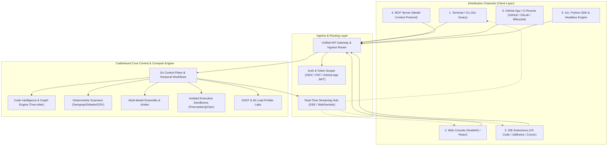
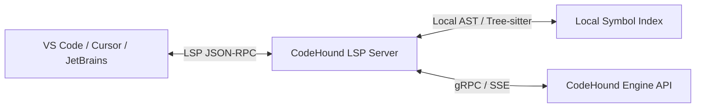

# Interface & Distribution Specifications — CodeHound (ForgeGuard)

**Document:** 02-Interface-and-Distribution-Specifications.md  
**Status:** Approved Architectural Specification  
**Target:** Terminal (CLI), Web Console, IDE Extensions, MCP Server, GitHub/GitLab Apps, REST/gRPC API  
**Date:** 2026-08-25  

---

## 1. Overview & Universal Client Architecture

CodeHound is designed with a **Headless-First & Unified Core Engine** architecture. The core analysis, verification, dynamic testing, and reporting pipelines are decoupled from client interfaces. All distribution channels interact with the platform through unified gRPC/REST APIs, SSE event streams, or local embedded engine bindings.



---

## 2. Channel 1: Terminal / CLI (`codehound-cli`)

The CLI is a single, self-contained Go binary compiled for macOS, Linux (x86_64, ARM64), and Windows. It supports both **Local Offline Mode** (using local Docker/parsers) and **Cloud Connected Mode** (streaming live progress from the cluster).

### 2.1 CLI Commands & Subcommands

```bash
# 1. Full codebase scan & audit
codehound scan [path] --mode=[fast|deep|audit] --output=AUDIT_REPORT.md --sarif=results.sarif

# 2. PR / Diff-Aware Gate (Pre-commit / CI mode)
codehound check --diff --fail-on=[critical|high|breaking-change]

# 3. Dynamic Load / Spike Test Lab
codehound load --target=https://staging.internal.example.com --profile=spike --vus=1000,10000,50000 --auth-token-env=TEST_TOKEN

# 4. Authorized DAST & Security Penetration Scan
codehound pentest --target=https://staging.internal.example.com --auth-proof=dns-txt:ch-verify=xyz123

# 5. Interactive Terminal TUI (Bubbletea-based)
codehound tui

# 6. Auto-Remediate and Apply Patches
codehound fix --finding-id=FND-1042 --verify --auto-apply
```

### 2.2 Interactive TUI (Terminal User Interface)
- Built using **Charmbracelet Bubbletea + Lipgloss**.
- Renders live progress bars for Tree-sitter parsing, Semgrep AST, Multi-Model debate, Sandboxed test runs, and k6 load generation.
- Displays interactive diff previews, allowing developers to press `[y]` to apply verified patches immediately to their local git worktree.

---

## 3. Channel 2: Web Console (SvelteKit / Modern Web App)

A high-performance, real-time web portal (similar to CodeRabbit / Snyk dashboard) for team collaboration, posture tracking, and deep audit exploration.

### 3.1 Key Pages & Views
1. **Repository Explorer & Graph View**: Interactive 2D/3D visualization of codebase symbol hierarchies, call graphs, taint paths, and blast radius maps (using WebGL / Canvas / Cytoscape).
2. **Live Audit Stream**: Real-time log streaming of running audits with timeline stages (Ingest $\rightarrow$ SAST $\rightarrow$ Model Debate $\rightarrow$ Sandbox QA $\rightarrow$ Load Run $\rightarrow$ Report).
3. **Finding Proof Workbench**: For every finding, displays:
   - File, line number, and tainted execution trace.
   - Deterministic analyzer raw evidence.
   - Generated unit test with sandboxed pass/fail execution results.
   - Multi-model consensus score & judge explanation.
   - Auto-generated patch with side-by-side diff.
4. **Load & Stress Telemetry Studio**:
   - Interactive Grafana-grade charts showing RPS, p50/p95/p99 latency spikes during 1k $\rightarrow$ 10k $\rightarrow$ 50k virtual user surges.
   - Bottleneck classification (N+1 queries, memory growth slopes, DB pool exhaustion).
5. **Policy & Authorization Vault**:
   - Target domain verification (DNS TXT, HTTP well-known token, AWS IAM OIDC).
   - Team coding standards, secret ignore rules, and compliance profiles (SOC2, HIPAA, OWASP).

---

## 4. Channel 3: IDE Extensions (VS Code, JetBrains, Cursor)

The IDE integration operates as a **Language Server Protocol (LSP)** provider paired with a native UI sidebar extension.



### 4.1 Features & User Experience
1. **Inline Diagnostics & Squiggles**: Instant warnings for tainted inputs, logic flaws, broken error handling, and exposed secrets directly in the editor.
2. **CodeLens & Quick Fixes**:
   - `CodeHound: Run Sandboxed Test on this Function`
   - `CodeHound: Calculate Blast Radius (Downstream Callers: 14)`
   - `CodeHound: Apply Verified AI Patch (Passes 100% Mutation Tests)`
3. **Side-by-Side Diff Verification**: Review AI patches with one-click sandbox test re-execution before applying to disk.
4. **Offline Mode**: Operates lightweight Tree-sitter & Semgrep rules locally when disconnected from the cloud.

---

## 5. Channel 4: Model Context Protocol (MCP) Server

CodeHound exposes an enterprise-grade MCP server conforming strictly to the **MCP 2026-07-28 stateless protocol specification**. This allows any MCP-compatible AI client (Google Antigravity IDE, Claude Desktop, Cursor, OpenCode, Windsurf) to natively invoke CodeHound capabilities.

### 5.1 Exposed MCP Tools

| MCP Tool Name | Description | Arguments |
| :--- | :--- | :--- |
| `codehound_audit_repository` | Runs full multi-engine audit on a repository commit | `{ repo_url, commit_sha, depth }` |
| `codehound_query_symbol_graph` | Queries symbol definitions, call hierarchies, and blast radius | `{ symbol_name, file_path, direction }` |
| `codehound_run_sandboxed_test` | Executes generated or native test suite inside isolated microVM | `{ test_code, framework, timeout_sec }` |
| `codehound_verify_patch` | Applies a unified diff in a clean sandbox and runs regression verification | `{ patch_diff, base_commit }` |
| `codehound_trigger_load_test` | Initiates authorized k6 load/spike surge against verified target | `{ target_id, profile, max_vus }` |
| `codehound_get_finding_evidence` | Fetches full cryptographic evidence bundle for a finding ID | `{ finding_id }` |

### 5.2 Exposed MCP Resources
- `codehound://repository/{project_id}/ast-graph`: Real-time dependency and symbol graph.
- `codehound://audit/{audit_id}/report.md`: The generated comprehensive markdown audit report.
- `codehound://audit/{audit_id}/sarif`: SARIF v2.1.0 output for IDE security tabs.

---

## 6. Channel 5: GitHub App / GitLab / Bitbucket CI

### 6.1 GitHub App Workflows
1. **Pull Request Reviewer Bot**:
   - Triggers on `pull_request.opened` / `pull_request.synchronize`.
   - Computes diff-aware blast radius (evaluates only modified files + transitive callers).
   - Posts concise summary comment with expandable proof details, security badges, and test results.
   - Emits GitHub Check Runs with inline line annotations.
2. **Automated Fix PR Generator (`@codehound fix`)**:
   - When a developer comments `/codehound fix` on a PR finding, CodeHound generates the patch, verifies it in the microVM sandbox, and opens a child branch / draft PR.
3. **Pre-Merge Security & Load Gate**:
   - Blocks PR merge if critical CVEs, unmasked secrets, or p99 latency regressions are detected.

---

## 7. Universal API & Protocol Matrix

| Interface | Transport Protocol | Authentication | Latency Characteristic |
| :--- | :--- | :--- | :--- |
| **CLI** | gRPC / HTTP/2 + SSE | API Key / Personal Access Token | Ultra-fast streaming output |
| **Web Console** | HTTPS / GraphQL / WebSockets | OIDC / OAuth2 + Session Cookie | Interactive SPA (<100ms UI responses) |
| **IDE LSP** | JSON-RPC over stdio / WebSocket | Local workspace token / Cloud PAT | Sub-50ms local typing diagnostics |
| **MCP Server** | HTTP POST (Stateless 2026 spec) / stdio | Bearer Token / Mutual TLS | Tool-call request/response |
| **GitHub App** | Webhook HTTPS + GitHub App JWT | HMAC-SHA256 signature verification | Async durable Temporal workflow |
