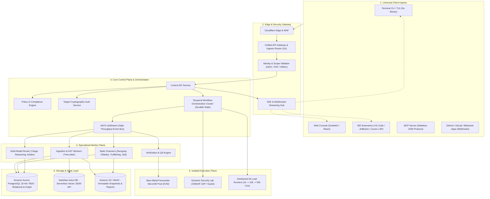
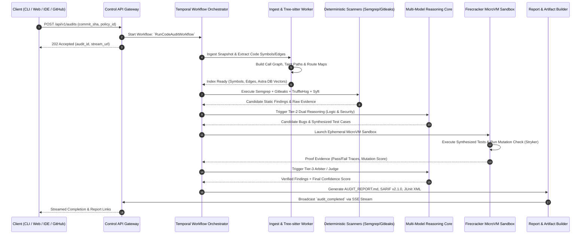
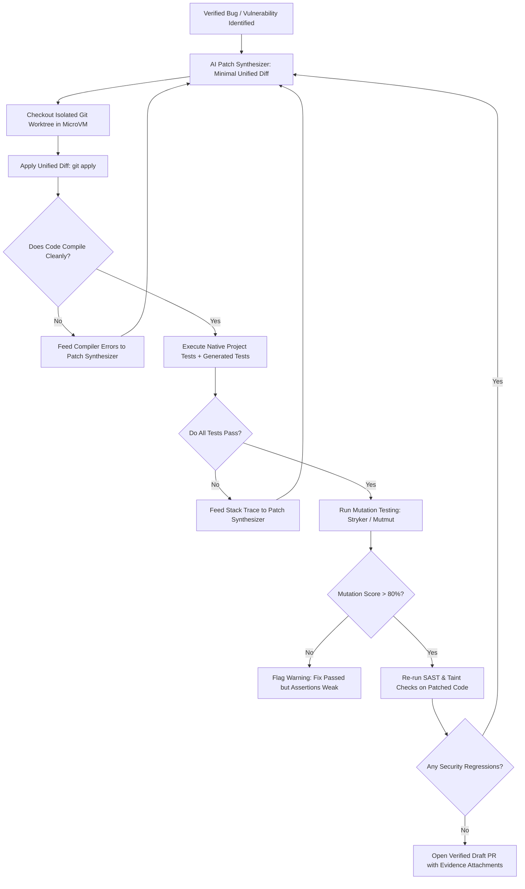

# System Architecture & Technical Design — CodeHound (ForgeGuard)

**Document:** 03-System-Architecture.md  
**Status:** Approved Master Architecture  
**Target:** Distributed Control Plane, Temporal Workflows, Firecracker MicroVMs & Data Pipelines  
**Date:** 2026-08-25  

---

## 1. High-Level System Context & Ingress

CodeHound is an autonomous engineering platform designed to process codebase snapshots, run deterministic analysis, orchestrate multi-model reasoning, execute sandboxed QA, run authorized DAST/load surges, and generate verified auto-remediation patches.

---

## 2. End-to-End Audit & Scan Pipeline Lifecycle

---

## 3. The Self-Healing Auto-Patch Verification Loop

CodeHound does not merely offer text suggestions; it proves fixes by running a closed-loop verification cycle:

---

## 4. Trust Boundaries & Network Security Tiers

| Tier | Name | Components | Network & Access Restrictions |
| :--- | :--- | :--- | :--- |
| **Tier A** | **Trusted Control Plane** | Control APIs, Temporal, Identity, PostgreSQL | Strict private VPC, TLS 1.3, IAM role isolation. |
| **Tier B** | **Semi-Trusted Workers** | AST Parsers, SARIF normalizers, LLM Gateway | Egress locked strictly to AI API providers and DB. |
| **Tier C** | **Untrusted Execution Sandbox** | Firecracker microVMs executing repository builds and tests | **Egress Deny-All** by default. Memory-backed ephemeral tmpfs. Process jailed with minimal seccomp and cgroup v2. |
| **Tier D** | **Authorized Dynamic Lab** | DAST fuzzers (ZAP/Nuclei), k6 load generators | Dedicated network egress proxy locked to cryptographic allowlist targets. Hard rate ceilings and emergency circuit breakers. |

---

## 5. Architectural Non-Functional Guarantees

1. **Deterministic Reproducibility**: Every scan is pinned to an immutable git commit content hash and policy version.
2. **Sub-120ms MicroVM Startup**: Maintained by a pre-warmed snapshot pool on bare-metal KVM worker nodes.
3. **Resilience & Durable Execution**: Temporal ensures that any worker crash or network blip during long-running 50k VU load tests or whole-repo audits resumes automatically from the exact state step without data loss.
4. **Cost-Aware AI Orchestration**: 70%+ of clean code is filtered at Tier 1 ($0.15/1M tokens), reserving expensive reasoning models ($3.00+/1M tokens) strictly for high-risk ambiguities and arbiter rulings.
