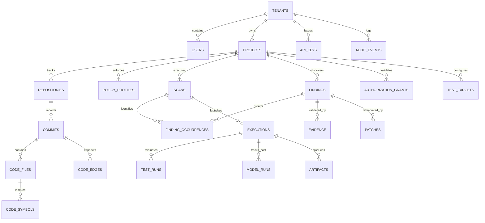

# Database Schema & Data Architecture — CodeHound (ForgeGuard)

**Document:** 04-Database-Schema.md  
**Engine:** Amazon Aurora PostgreSQL 18 HA / AWS RDS PostgreSQL (Relational / System of Record) + DataStax Astra DB Serverless (Vector / Semantic Search) + Amazon S3 (Immutable Artifacts)  
**Status:** Approved DBMS Specification & Production DDL  
**Date:** 2026-08-25  

---

## 1. Core DBMS Architectural Principles

The CodeHound data layer adheres to enterprise DBMS best practices for mission-critical, multi-tenant engineering platforms running within a private Amazon VPC:

1. **Enterprise Cloud Hosting (Amazon Aurora / RDS PostgreSQL 18)**: Hosted in private subnets with Multi-AZ automated failover, IAM IRSA database authentication, and KMS encryption at rest. Directly peered with EKS Control Plane pods and EC2 Bare-Metal Firecracker worker nodes without cross-cloud network hops or BaaS PostgREST overhead.
2. **3NF Relational Integrity & Directed Dependency Hierarchy**: Eliminates anomalies and data duplication while maintaining explicit foreign key constraints (`ON DELETE CASCADE` / `ON DELETE RESTRICT`).
3. **UUIDv7 Primary Keys**: Uses time-ordered UUIDv7 for all primary keys. This avoids the B-Tree index fragmentation and write-amplification typical of random UUIDv4, while guaranteeing global uniqueness across distributed nodes.
4. **Strict Multi-Tenant Isolation with PostgreSQL RLS**: Every tenant-owned table features a direct `tenant_id` column protected by native PostgreSQL **Row Level Security (RLS)** policies.
5. **Time-Series Table Partitioning**: High-volume tables (`audit_events`, `model_runs`, `executions`, `finding_occurrences`) are range-partitioned by `timestamptz` to maintain sub-millisecond query latencies and enable zero-downtime data lifecycle management (partition dropping instead of slow `DELETE` queries).
6. **Advanced Indexing Strategy**:
   - **Partial Indexes** for active tasks (`WHERE status = 'RUNNING'`).
   - **Composite Covering Indexes** (`INCLUDE` clause) for index-only scans on high-throughput lookups.
   - **GIN Indexes** with `jsonb_path_ops` for structured payload search.
7. **Optimistic Concurrency & Idempotency**: State mutations utilize atomic updates with `version` counters and dedicated idempotency key hashes to eliminate race conditions in distributed Temporal workflows.

---

## 2. Entity Relationship Diagram (ERD)



---

## 3. Production-Ready PostgreSQL 18 DDL

### 3.1 Extensions, Custom Types & Enums

```sql
-- Enable necessary core extensions
CREATE EXTENSION IF NOT EXISTS "uuid-ossp";
CREATE EXTENSION IF NOT EXISTS "pgcrypto";
CREATE EXTENSION IF NOT EXISTS "btree_gist";

-- Define Enums for strong type safety and minimal storage footprint (4 bytes)
CREATE TYPE tenant_plan_enum AS ENUM ('COMMUNITY', 'TEAM', 'ENTERPRISE');
CREATE TYPE tenant_status_enum AS ENUM ('ACTIVE', 'SUSPENDED', 'PENDING_DELETION');

CREATE TYPE scan_type_enum AS ENUM ('FULL', 'DIFF_AWARE', 'SECURITY_ONLY', 'PERFORMANCE');
CREATE TYPE scan_status_enum AS ENUM ('QUEUED', 'INITIALIZING', 'INGESTING', 'SCANNING', 'VERIFYING', 'COMPLETED', 'FAILED', 'ABORTED');

CREATE TYPE finding_severity_enum AS ENUM ('CRITICAL', 'HIGH', 'MEDIUM', 'LOW', 'INFO');
CREATE TYPE finding_state_enum AS ENUM ('SUSPECTED', 'VERIFIED_PROVEN', 'RESOLVED', 'FALSE_POSITIVE', 'ACCEPTED_RISK');
CREATE TYPE finding_category_enum AS ENUM ('SECURITY_VULN', 'LOGIC_BUG', 'SECRET_LEAK', 'PERFORMANCE_BOTTLENECK', 'BREAKING_API_DIFF', 'IAC_MISCONFIG', 'LICENSE_CONFLICT');

CREATE TYPE execution_type_enum AS ENUM ('AST_PARSER', 'STATIC_SAST', 'AI_REASONING', 'SANDBOX_TEST', 'MUTATION_TEST', 'DYNAMIC_DAST', 'K6_LOAD_SURGE', 'PATCH_VERIFICATION');
CREATE TYPE sandbox_tier_enum AS ENUM ('TIER_A_GVISOR', 'TIER_B_FIRECRACKER_MICROVM', 'TIER_C_NETWORK_LAB');
CREATE TYPE execution_status_enum AS ENUM ('QUEUED', 'RUNNING', 'PASSED', 'FAILED', 'TIMED_OUT', 'RESOURCE_EXCEEDED');

CREATE TYPE patch_status_enum AS ENUM ('PROPOSED', 'SANDBOX_VALIDATING', 'VERIFIED_PASSING', 'VERIFICATION_FAILED', 'PR_OPENED', 'MERGED', 'REJECTED');
```

---

### 3.2 Tenant, Identity & Access Layer

```sql
-- 1. Tenants (Organizations / Accounts)
CREATE TABLE tenants (
    id UUID PRIMARY KEY DEFAULT gen_random_uuid(),
    slug VARCHAR(64) NOT NULL UNIQUE,
    name VARCHAR(255) NOT NULL,
    plan tenant_plan_enum NOT NULL DEFAULT 'TEAM',
    status tenant_status_enum NOT NULL DEFAULT 'ACTIVE',
    settings JSONB NOT NULL DEFAULT '{}'::jsonb,
    created_at TIMESTAMPTZ NOT NULL DEFAULT clock_timestamp(),
    updated_at TIMESTAMPTZ NOT NULL DEFAULT clock_timestamp()
);

-- 2. Users & Team Members
CREATE TABLE users (
    id UUID PRIMARY KEY DEFAULT gen_random_uuid(),
    tenant_id UUID NOT NULL REFERENCES tenants(id) ON DELETE RESTRICT,
    external_auth_id VARCHAR(255) NOT NULL, -- OIDC / Auth0 / Clerk Sub
    email VARCHAR(255) NOT NULL,
    display_name VARCHAR(255) NOT NULL,
    role VARCHAR(32) NOT NULL DEFAULT 'DEVELOPER', -- 'ADMIN', 'SECURITY_LEAD', 'DEVELOPER', 'READONLY'
    is_active BOOLEAN NOT NULL DEFAULT true,
    created_at TIMESTAMPTZ NOT NULL DEFAULT clock_timestamp(),
    updated_at TIMESTAMPTZ NOT NULL DEFAULT clock_timestamp(),
    CONSTRAINT uq_tenant_user UNIQUE (tenant_id, external_auth_id),
    CONSTRAINT uq_tenant_email UNIQUE (tenant_id, email)
);

CREATE INDEX idx_users_tenant ON users (tenant_id);

-- 3. Scoped API Keys (CLI, CI/CD, IDE, MCP)
CREATE TABLE api_keys (
    id UUID PRIMARY KEY DEFAULT gen_random_uuid(),
    tenant_id UUID NOT NULL REFERENCES tenants(id) ON DELETE CASCADE,
    created_by_user_id UUID REFERENCES users(id) ON DELETE SET NULL,
    name VARCHAR(128) NOT NULL,
    key_prefix VARCHAR(16) NOT NULL,
    key_hash VARCHAR(128) NOT NULL, -- Argon2id or SHA-256 hash
    scopes TEXT[] NOT NULL DEFAULT '{"read:audit", "write:audit"}',
    last_used_at TIMESTAMPTZ,
    expires_at TIMESTAMPTZ,
    revoked_at TIMESTAMPTZ,
    created_at TIMESTAMPTZ NOT NULL DEFAULT clock_timestamp(),
    CONSTRAINT uq_key_hash UNIQUE (key_hash)
);

CREATE INDEX idx_api_keys_prefix ON api_keys (key_prefix) WHERE revoked_at IS NULL;
```

---

### 3.3 Projects, Repositories & Policy Management

```sql
-- 4. Policy Profiles
CREATE TABLE policy_profiles (
    id UUID PRIMARY KEY DEFAULT gen_random_uuid(),
    tenant_id UUID NOT NULL REFERENCES tenants(id) ON DELETE CASCADE,
    name VARCHAR(128) NOT NULL,
    is_default BOOLEAN NOT NULL DEFAULT false,
    rules JSONB NOT NULL DEFAULT '{"block_on_critical": true, "require_mutation_score": 0.80}'::jsonb,
    created_at TIMESTAMPTZ NOT NULL DEFAULT clock_timestamp(),
    updated_at TIMESTAMPTZ NOT NULL DEFAULT clock_timestamp(),
    CONSTRAINT uq_tenant_policy_name UNIQUE (tenant_id, name)
);

-- 5. Projects
CREATE TABLE projects (
    id UUID PRIMARY KEY DEFAULT gen_random_uuid(),
    tenant_id UUID NOT NULL REFERENCES tenants(id) ON DELETE RESTRICT,
    policy_profile_id UUID REFERENCES policy_profiles(id) ON DELETE SET NULL,
    slug VARCHAR(64) NOT NULL,
    name VARCHAR(255) NOT NULL,
    default_branch VARCHAR(128) NOT NULL DEFAULT 'main',
    version INT NOT NULL DEFAULT 1, -- Optimistic concurrency control
    created_at TIMESTAMPTZ NOT NULL DEFAULT clock_timestamp(),
    updated_at TIMESTAMPTZ NOT NULL DEFAULT clock_timestamp(),
    CONSTRAINT uq_tenant_project_slug UNIQUE (tenant_id, slug)
);

CREATE INDEX idx_projects_tenant ON projects (tenant_id);

-- 6. Repositories Connected to Projects
CREATE TABLE repositories (
    id UUID PRIMARY KEY DEFAULT gen_random_uuid(),
    tenant_id UUID NOT NULL REFERENCES tenants(id) ON DELETE RESTRICT,
    project_id UUID NOT NULL REFERENCES projects(id) ON DELETE CASCADE,
    provider VARCHAR(32) NOT NULL, -- 'GITHUB', 'GITLAB', 'BITBUCKET', 'CUSTOM_GIT'
    external_repo_id VARCHAR(128),
    clone_url TEXT NOT NULL,
    default_branch VARCHAR(128) NOT NULL DEFAULT 'main',
    last_indexed_commit_sha VARCHAR(64),
    last_indexed_at TIMESTAMPTZ,
    created_at TIMESTAMPTZ NOT NULL DEFAULT clock_timestamp(),
    CONSTRAINT uq_project_repo UNIQUE (project_id, provider, external_repo_id)
);

CREATE INDEX idx_repositories_project ON repositories (project_id);
```

---

### 3.4 Code Intelligence & AST Symbol Graph

```sql
-- 7. Commits (Immutable Snapshots)
CREATE TABLE commits (
    id UUID PRIMARY KEY DEFAULT gen_random_uuid(),
    repository_id UUID NOT NULL REFERENCES repositories(id) ON DELETE CASCADE,
    sha VARCHAR(64) NOT NULL,
    parent_shas TEXT[] NOT NULL DEFAULT '{}',
    author_name TEXT,
    author_email TEXT,
    commit_message TEXT,
    committed_at TIMESTAMPTZ NOT NULL,
    created_at TIMESTAMPTZ NOT NULL DEFAULT clock_timestamp(),
    CONSTRAINT uq_repo_commit UNIQUE (repository_id, sha)
);

CREATE INDEX idx_commits_repo_sha ON commits (repository_id, sha);

-- 8. Code Files (per Snapshot)
CREATE TABLE code_files (
    id UUID PRIMARY KEY DEFAULT gen_random_uuid(),
    repository_id UUID NOT NULL REFERENCES repositories(id) ON DELETE CASCADE,
    commit_id UUID NOT NULL REFERENCES commits(id) ON DELETE CASCADE,
    file_path TEXT NOT NULL,
    language VARCHAR(64) NOT NULL,
    size_bytes BIGINT NOT NULL,
    content_hash VARCHAR(64) NOT NULL, -- SHA-256 of file content
    object_store_uri TEXT NOT NULL,    -- S3 reference to file content
    created_at TIMESTAMPTZ NOT NULL DEFAULT clock_timestamp(),
    CONSTRAINT uq_commit_filepath UNIQUE (commit_id, file_path)
);

CREATE INDEX idx_code_files_lookup ON code_files (repository_id, commit_id, file_path);

-- 9. Code Symbols (Extracted by Tree-sitter)
CREATE TABLE code_symbols (
    id UUID PRIMARY KEY DEFAULT gen_random_uuid(),
    code_file_id UUID NOT NULL REFERENCES code_files(id) ON DELETE CASCADE,
    symbol_key TEXT NOT NULL, -- e.g. "com.app.auth.validateToken"
    name VARCHAR(255) NOT NULL,
    kind VARCHAR(64) NOT NULL, -- 'FUNCTION', 'CLASS', 'INTERFACE', 'API_ROUTE', 'VARIABLE'
    start_line INT NOT NULL,
    end_line INT NOT NULL,
    start_column INT NOT NULL,
    end_column INT NOT NULL,
    signature TEXT,
    visibility VARCHAR(32) DEFAULT 'PUBLIC',
    tainted_inputs TEXT[] DEFAULT '{}',
    created_at TIMESTAMPTZ NOT NULL DEFAULT clock_timestamp()
);

CREATE INDEX idx_symbols_file_name ON code_symbols (code_file_id, name);
CREATE INDEX idx_symbols_key ON code_symbols (symbol_key);

-- 10. Code Edges (Call Graph, Data Flow, Dependencies)
CREATE TABLE code_edges (
    id UUID PRIMARY KEY DEFAULT gen_random_uuid(),
    commit_id UUID NOT NULL REFERENCES commits(id) ON DELETE CASCADE,
    from_symbol_id UUID NOT NULL REFERENCES code_symbols(id) ON DELETE CASCADE,
    to_symbol_id UUID NOT NULL REFERENCES code_symbols(id) ON DELETE CASCADE,
    edge_type VARCHAR(32) NOT NULL, -- 'CALLS', 'IMPLEMENTS', 'IMPORTS', 'TAINT_FLOWS_TO'
    confidence NUMERIC(3,2) NOT NULL DEFAULT 1.00,
    created_at TIMESTAMPTZ NOT NULL DEFAULT clock_timestamp()
);

CREATE INDEX idx_edges_from ON code_edges (from_symbol_id, edge_type);
CREATE INDEX idx_edges_to ON code_edges (to_symbol_id, edge_type);
```

---

### 3.5 Scans, Findings, Evidence & Auto-Remediation

```sql
-- 11. Scans (Audit Runs)
CREATE TABLE scans (
    id UUID PRIMARY KEY DEFAULT gen_random_uuid(),
    tenant_id UUID NOT NULL REFERENCES tenants(id) ON DELETE RESTRICT,
    project_id UUID NOT NULL REFERENCES projects(id) ON DELETE CASCADE,
    repository_id UUID NOT NULL REFERENCES repositories(id) ON DELETE CASCADE,
    commit_id UUID NOT NULL REFERENCES commits(id) ON DELETE RESTRICT,
    scan_type scan_type_enum NOT NULL DEFAULT 'FULL',
    status scan_status_enum NOT NULL DEFAULT 'QUEUED',
    health_score INT CHECK (health_score BETWEEN 0 AND 100),
    initiated_by_user_id UUID REFERENCES users(id) ON DELETE SET NULL,
    workflow_id VARCHAR(128) NOT NULL, -- Temporal Workflow Execution ID
    error_message TEXT,
    started_at TIMESTAMPTZ,
    completed_at TIMESTAMPTZ,
    created_at TIMESTAMPTZ NOT NULL DEFAULT clock_timestamp()
);

CREATE INDEX idx_scans_project_status ON scans (project_id, status);
CREATE INDEX idx_scans_tenant ON scans (tenant_id);

-- 12. Canonical Findings (Deduplicated across Scans)
CREATE TABLE findings (
    id UUID PRIMARY KEY DEFAULT gen_random_uuid(),
    tenant_id UUID NOT NULL REFERENCES tenants(id) ON DELETE RESTRICT,
    project_id UUID NOT NULL REFERENCES projects(id) ON DELETE CASCADE,
    canonical_key VARCHAR(128) NOT NULL, -- SHA-256(rule_id + relative_path + symbol_key)
    category finding_category_enum NOT NULL,
    severity finding_severity_enum NOT NULL,
    state finding_state_enum NOT NULL DEFAULT 'SUSPECTED',
    confidence NUMERIC(3,2) NOT NULL DEFAULT 0.50,
    blast_radius_score INT CHECK (blast_radius_score BETWEEN 0 AND 100),
    title VARCHAR(255) NOT NULL,
    description TEXT NOT NULL,
    primary_file TEXT NOT NULL,
    primary_line INT NOT NULL,
    cwe_id VARCHAR(32),
    cve_id VARCHAR(32),
    first_seen_scan_id UUID NOT NULL REFERENCES scans(id) ON DELETE RESTRICT,
    last_seen_scan_id UUID NOT NULL REFERENCES scans(id) ON DELETE RESTRICT,
    created_at TIMESTAMPTZ NOT NULL DEFAULT clock_timestamp(),
    updated_at TIMESTAMPTZ NOT NULL DEFAULT clock_timestamp(),
    CONSTRAINT uq_project_canonical_finding UNIQUE (project_id, canonical_key)
);

CREATE INDEX idx_findings_project_sev_state ON findings (project_id, severity, state);

-- 13. Finding Occurrences (Range-Partitioned by Date)
CREATE TABLE finding_occurrences (
    id UUID NOT NULL DEFAULT gen_random_uuid(),
    finding_id UUID NOT NULL,
    scan_id UUID NOT NULL,
    commit_sha VARCHAR(64) NOT NULL,
    file_path TEXT NOT NULL,
    start_line INT NOT NULL,
    end_line INT NOT NULL,
    code_snippet_hash VARCHAR(64) NOT NULL,
    created_at TIMESTAMPTZ NOT NULL DEFAULT clock_timestamp(),
    PRIMARY KEY (id, created_at)
) PARTITION BY RANGE (created_at);

-- Example Monthly Partition
CREATE TABLE finding_occurrences_y2026m08 PARTITION OF finding_occurrences
    FOR VALUES FROM ('2026-08-01 00:00:00+00') TO ('2026-09-01 00:00:00+00');

-- 14. Evidence Bundles Supporting Findings
CREATE TABLE evidence (
    id UUID PRIMARY KEY DEFAULT gen_random_uuid(),
    finding_id UUID NOT NULL REFERENCES findings(id) ON DELETE CASCADE,
    evidence_type VARCHAR(64) NOT NULL, -- 'AST_TAINT_PATH', 'SANDBOX_FAILING_TEST', 'MUTATION_TRACE', 'DAST_PAYLOAD_ECHO'
    source_analyzer VARCHAR(64) NOT NULL, -- 'SEMGREP', 'CLAUDE_REASONING', 'FIRECRACKER_RUNNER', 'ZAP'
    strength VARCHAR(32) NOT NULL DEFAULT 'HIGH',
    summary TEXT NOT NULL,
    payload JSONB NOT NULL DEFAULT '{}'::jsonb,
    artifact_uri TEXT, -- S3 URI for large traces/dumps
    created_at TIMESTAMPTZ NOT NULL DEFAULT clock_timestamp()
);

CREATE INDEX idx_evidence_finding ON evidence (finding_id);

-- 15. Verified Auto-Patches
CREATE TABLE patches (
    id UUID PRIMARY KEY DEFAULT gen_random_uuid(),
    finding_id UUID NOT NULL REFERENCES findings(id) ON DELETE CASCADE,
    scan_id UUID NOT NULL REFERENCES scans(id) ON DELETE CASCADE,
    status patch_status_enum NOT NULL DEFAULT 'PROPOSED',
    unified_diff TEXT NOT NULL,
    diff_hash VARCHAR(64) NOT NULL,
    mutation_score NUMERIC(3,2),
    pr_url TEXT,
    pr_number INT,
    applied_by_user_id UUID REFERENCES users(id) ON DELETE SET NULL,
    created_at TIMESTAMPTZ NOT NULL DEFAULT clock_timestamp(),
    updated_at TIMESTAMPTZ NOT NULL DEFAULT clock_timestamp()
);

CREATE INDEX idx_patches_finding ON patches (finding_id);
```

---

### 3.6 Sandboxed Executions, Model Accounting & Dynamic Testing Labs

```sql
-- 16. Executions (MicroVM & Sandbox Tasks - Partitioned)
CREATE TABLE executions (
    id UUID NOT NULL DEFAULT gen_random_uuid(),
    tenant_id UUID NOT NULL,
    project_id UUID NOT NULL,
    scan_id UUID NOT NULL,
    execution_type execution_type_enum NOT NULL,
    sandbox_tier sandbox_tier_enum NOT NULL,
    status execution_status_enum NOT NULL DEFAULT 'QUEUED',
    exit_code INT,
    duration_ms BIGINT,
    cpu_usage_seconds NUMERIC(10,3),
    peak_memory_bytes BIGINT,
    log_artifact_uri TEXT,
    started_at TIMESTAMPTZ,
    completed_at TIMESTAMPTZ,
    created_at TIMESTAMPTZ NOT NULL DEFAULT clock_timestamp(),
    PRIMARY KEY (id, created_at)
) PARTITION BY RANGE (created_at);

CREATE TABLE executions_y2026m08 PARTITION OF executions
    FOR VALUES FROM ('2026-08-01 00:00:00+00') TO ('2026-09-01 00:00:00+00');

-- 17. LLM Model Runs & Token Accounting (Partitioned)
CREATE TABLE model_runs (
    id UUID NOT NULL DEFAULT gen_random_uuid(),
    tenant_id UUID NOT NULL,
    project_id UUID NOT NULL,
    scan_id UUID NOT NULL,
    role VARCHAR(64) NOT NULL, -- 'TRIAGE', 'BUG_HUNTER', 'SECURITY_ANALYST', 'ARBITER_JUDGE'
    provider VARCHAR(64) NOT NULL, -- 'ANTHROPIC', 'OPENAI', 'GOOGLE', 'DEEPSEEK'
    model_name VARCHAR(128) NOT NULL,
    prompt_tokens INT NOT NULL,
    completion_tokens INT NOT NULL,
    total_cost_usd NUMERIC(10,6) NOT NULL,
    latency_ms INT NOT NULL,
    status VARCHAR(32) NOT NULL DEFAULT 'COMPLETED',
    created_at TIMESTAMPTZ NOT NULL DEFAULT clock_timestamp(),
    PRIMARY KEY (id, created_at)
) PARTITION BY RANGE (created_at);

CREATE TABLE model_runs_y2026m08 PARTITION OF model_runs
    FOR VALUES FROM ('2026-08-01 00:00:00+00') TO ('2026-09-01 00:00:00+00');

-- 18. Dynamic Target Cryptographic Authorization Grants
CREATE TABLE authorization_grants (
    id UUID PRIMARY KEY DEFAULT gen_random_uuid(),
    tenant_id UUID NOT NULL REFERENCES tenants(id) ON DELETE RESTRICT,
    project_id UUID NOT NULL REFERENCES projects(id) ON DELETE CASCADE,
    target_base_url TEXT NOT NULL,
    proof_method VARCHAR(32) NOT NULL, -- 'DNS_TXT', 'HTTP_WELL_KNOWN', 'OIDC_ROLE'
    challenge_record_name TEXT NOT NULL,
    expected_token_hash VARCHAR(128) NOT NULL,
    is_verified BOOLEAN NOT NULL DEFAULT false,
    verified_at TIMESTAMPTZ,
    valid_until TIMESTAMPTZ NOT NULL,
    approved_by_user_id UUID REFERENCES users(id) ON DELETE RESTRICT,
    created_at TIMESTAMPTZ NOT NULL DEFAULT clock_timestamp(),
    CONSTRAINT uq_project_target_url UNIQUE (project_id, target_base_url)
);

-- 19. Dynamic Test Targets & Load Ceilings
CREATE TABLE test_targets (
    id UUID PRIMARY KEY DEFAULT gen_random_uuid(),
    project_id UUID NOT NULL REFERENCES projects(id) ON DELETE CASCADE,
    authorization_grant_id UUID NOT NULL REFERENCES authorization_grants(id) ON DELETE RESTRICT,
    environment VARCHAR(32) NOT NULL DEFAULT 'STAGING', -- 'STAGING', 'DEV', 'CANARY' (Production blocked by policy)
    base_url TEXT NOT NULL,
    max_vu_ceiling INT NOT NULL DEFAULT 50000,
    max_duration_seconds INT NOT NULL DEFAULT 600,
    scope_path_allowlist TEXT[] NOT NULL DEFAULT '{"/api/v1/*"}',
    headers_vault_ref TEXT, -- Reference to encrypted token in secrets manager
    created_at TIMESTAMPTZ NOT NULL DEFAULT clock_timestamp(),
    updated_at TIMESTAMPTZ NOT NULL DEFAULT clock_timestamp()
);
```

---

### 3.7 Idempotency & Audit Logging

```sql
-- 20. Idempotency Keys (Deduplication for Webhooks and Async Retries)
CREATE TABLE idempotency_keys (
    id UUID PRIMARY KEY DEFAULT gen_random_uuid(),
    tenant_id UUID NOT NULL REFERENCES tenants(id) ON DELETE CASCADE,
    key_hash VARCHAR(128) NOT NULL,
    operation VARCHAR(128) NOT NULL,
    request_payload_hash VARCHAR(64) NOT NULL,
    response_body JSONB,
    status_code INT,
    locked_until TIMESTAMPTZ NOT NULL,
    expires_at TIMESTAMPTZ NOT NULL,
    created_at TIMESTAMPTZ NOT NULL DEFAULT clock_timestamp(),
    CONSTRAINT uq_tenant_key_op UNIQUE (tenant_id, key_hash, operation)
);

CREATE INDEX idx_idempotency_expiry ON idempotency_keys (expires_at);

-- 21. Immutable Audit Events (Range-Partitioned)
CREATE TABLE audit_events (
    id UUID NOT NULL DEFAULT gen_random_uuid(),
    tenant_id UUID NOT NULL,
    user_id UUID,
    actor_type VARCHAR(32) NOT NULL, -- 'USER', 'API_KEY', 'GITHUB_BOT', 'TEMPORAL_SYSTEM'
    action VARCHAR(128) NOT NULL,    -- 'SCAN_LAUNCHED', 'TARGET_VERIFIED', 'PATCH_APPLIED', 'API_KEY_REVOKED'
    resource_type VARCHAR(64) NOT NULL,
    resource_id UUID NOT NULL,
    ip_address INET,
    user_agent TEXT,
    payload JSONB NOT NULL DEFAULT '{}'::jsonb,
    created_at TIMESTAMPTZ NOT NULL DEFAULT clock_timestamp(),
    PRIMARY KEY (id, created_at)
) PARTITION BY RANGE (created_at);

CREATE TABLE audit_events_y2026m08 PARTITION OF audit_events
    FOR VALUES FROM ('2026-08-01 00:00:00+00') TO ('2026-09-01 00:00:00+00');
```

---

## 4. Multi-Tenant Row Level Security (RLS) Policies

To guarantee that tenant data remains strictly partitioned at the storage engine level, RLS is enabled across all tenant tables:

```sql
-- Enable Row Level Security
ALTER TABLE projects ENABLE ROW LEVEL SECURITY;
ALTER TABLE scans ENABLE ROW LEVEL SECURITY;
ALTER TABLE findings ENABLE ROW LEVEL SECURITY;

-- Dynamic Tenant Context Policy (Session Variable populated by Control API on connection checkout)
-- SET LOCAL app.current_tenant_id = '9b1deb4d-3b7d-4bad-9bdd-2b0d7b3dcb6d';

CREATE POLICY tenant_isolation_projects ON projects
    FOR ALL
    USING (tenant_id = NULLIF(current_setting('app.current_tenant_id', true), '')::uuid);

CREATE POLICY tenant_isolation_scans ON scans
    FOR ALL
    USING (tenant_id = NULLIF(current_setting('app.current_tenant_id', true), '')::uuid);

CREATE POLICY tenant_isolation_findings ON findings
    FOR ALL
    USING (tenant_id = NULLIF(current_setting('app.current_tenant_id', true), '')::uuid);
```

---

## 5. Performance Tuning & Database Configuration Checklist

| PostgreSQL Parameter | Recommended Production Value | Rationale |
| :--- | :--- | :--- |
| `shared_buffers` | 25% of total server RAM | Caches hot table and index blocks |
| `work_mem` | `64MB` | Accelerates sorting and hash joins in complex code graph traversals |
| `maintenance_work_mem` | `2GB` | Speeds up index builds on large `code_symbols` and partitions |
| `effective_cache_size` | 75% of total server RAM | Informs query planner of available filesystem cache |
| `wal_level` | `replica` | Supports read-replica scaling for audit dashboards |
| `max_connections` | `200` (backed by PgBouncer) | Eliminates connection fork thrashing |
