# Task Breakdown & Implementation Roadmap — CodeHound (ForgeGuard)

**Document:** 06-Task-Breakdown.md  
**Status:** Approved Master Roadmap  
**Target:** 14-Phase Production Implementation Plan (Phases 0–13)  
**Date:** 2026-08-25  

---

## Delivery Principle
**Build the verification loop first, then broaden scanner coverage.** Every phase leaves the platform in a fully deployable, testable, and demonstrable state.

```mermaid
flowchart LR
    P0["Phase 0: Threat Model & Specs"] --> P1["Phase 1: Foundation & Local Stack"]
    P1 --> P2["Phase 2: Identity & Multi-Tenancy"]
    P2 --> P3["Phase 3: Tree-sitter Ingestion"]
    P3 --> P4["Phase 4: Code Graph & Astra DB"]
    P4 --> P5["Phase 5: Static & Secret Scanners"]
    P5 --> P6["Phase 6: Multi-Model AI Router"]
    P6 --> P7["Phase 7: Firecracker Sandbox QA"]
    P7 --> P8["Phase 8: Authorized DAST Lab"]
    P8 --> P9["Phase 9: Distributed k6 Load Lab"]
    P9 --> P10["Phase 10: Auto-Patching Verifier"]
    P10 --> P11["Phase 11: Multi-Interface Clients"]
    P11 --> P12["Phase 12: Reporting & SARIF"]
    P12 --> P13["Phase 13: Enterprise Hardening"]
```

---

## Phase 0 — Architecture, Specifications & Threat Model
- `A0001` — Finalize System Context & Trust Boundaries ([03-System-Architecture.md](file:///home/tarun/Pictures/CodeHound/03-System-Architecture.md))
- `A0002` — Complete STRIDE Threat Model for Untrusted Repositories ([05-Security-Threat-Model-and-Sandboxing.md](file:///home/tarun/Pictures/CodeHound/05-Security-Threat-Model-and-Sandboxing.md))
- `A0003` — Finalize PostgreSQL 18 Schema & RLS Policies ([04-Database-Schema.md](file:///home/tarun/Pictures/CodeHound/04-Database-Schema.md))
- `A0004` — Define REST, SSE Stream & gRPC Protobuf Contracts ([09-API-Reference-and-OpenAPI-Contracts.md](file:///home/tarun/Pictures/CodeHound/09-API-Reference-and-OpenAPI-Contracts.md))
- `A0005` — Define Universal Distribution Channel Specifications ([02-Interface-and-Distribution-Specifications.md](file:///home/tarun/Pictures/CodeHound/02-Interface-and-Distribution-Specifications.md))
- `A0006` — Define Multi-Model Prompts & Routing Rules ([10-Multi-Model-Orchestration-and-Prompts.md](file:///home/tarun/Pictures/CodeHound/10-Multi-Model-Orchestration-and-Prompts.md))

---

## Phase 1 — Platform Foundation & Local Stack
- `P1001` — Monorepo structure with Go workspace (`/core`, `/cli`, `/web`, `/workers`)
- `P1002` — One-command local Docker Compose stack ([13-Developer-Environment-and-Local-Setup.md](file:///home/tarun/Pictures/CodeHound/13-Developer-Environment-and-Local-Setup.md))
- `P1003` — PostgreSQL 18 schema migration runner (`golang-migrate`)
- `P1004` — Go Control API HTTP/2 gateway with Gin/Echo
- `P1005` — S3/MinIO blob storage adapter with presigned URL support
- `P1006` — NATS JetStream event stream configuration
- `P1007` — Temporal workflow orchestrator client setup
- `P1008` — OpenTelemetry distributed tracing & structured logging setup

---

## Phase 2 — Identity, Multi-Tenancy & Access Control
- `I2001` — OIDC / OAuth2 authentication provider integration
- `I2002` — Tenant and Organization data access layer with RLS session variables
- `I2003` — Scoped API Key hashing & validation engine (`Argon2id`)
- `I2004` — Role-Based Access Control (RBAC) middleware
- `I2005` — Immutable Audit Event logging pipeline (range-partitioned)
- `I2006` — Comprehensive multi-tenant isolation unit & integration tests

---

## Phase 3 — Repository Ingestion & Tree-sitter AST Engine
- `R3001` — Git provider adapters (GitHub, GitLab, Bitbucket, generic Git)
- `R3002` — Immutable commit snapshot ingestion & S3 archiving
- `R3003` — File inventory, ignore-file parser (`.gitignore`, `.codehoundignore`)
- `R3004` — Tree-sitter multilingual AST parser bindings (TS/JS, Python, Go, Rust, Java, C/C++)
- `R3005` — Symbol extraction engine (Functions, Classes, Interfaces, API Endpoints)
- `R3006` — Interprocedural Call Graph & Inheritance Tree builder
- `R3007` — Taint Analysis Engine (Source-to-Sink flow tracking for SQLi, Command Injection, SSRF)

---

## Phase 4 — Code Graph & Vector Retrieval Engine
- `M4001` — PostgreSQL relational graph traversal queries (`code_symbols` & `code_edges`)
- `M4002` — DataStax Astra DB Serverless collection setup with payload metadata filtering by tenant and project
- `M4003` — AST-aware intelligent code chunking strategy
- `M4004` — Hybrid retrieval engine (Vector similarity + BM25 keyword + Graph expansion)
- `M4005` — Blast Radius calculation engine (0–100 risk score based on downstream callers)

---

## Phase 5 — Deterministic Scanning Engine (SAST, Secrets, SBOM)
- `S5001` — Semgrep worker integration with custom OWASP / CWE rule packs
- `S5002` — Gitleaks worker for high-speed regex & entropy secret detection
- `S5003` — TruffleHog verification worker for live API credential validation
- `S5004` — Syft SBOM generation worker (CycloneDX & SPDX JSON)
- `S5005` — OSV / Trivy Software Composition Analysis (SCA) worker
- `S5006` — Checkov / Tfsec Infrastructure-as-Code (IaC) scanner worker
- `S5007` — Finding normalizer and cross-scanner deduplication engine

---

## Phase 6 — 3-Tier Multi-Model Reasoning Core
- `L6001` — LiteLLM / Custom LLM Gateway with provider failover & load balancing
- `L6002` — Tier-1 Fast Triage Agent (Gemini 2.5 Flash / GPT-4o-mini)
- `L6003` — Tier-2 Logic Bug Hunter Agent (Claude 3.7 Sonnet / DeepSeek-R1)
- `L6004` — Tier-2 Security Analyst Agent (Claude 3.7 Sonnet / DeepSeek-R1)
- `L6005` — Tier-3 Arbiter / Judge Model for conflict resolution & confidence calibration
- `L6006` — Repository prompt-injection sanitizer & raw data delimiter wrapper
- `L6007` — Token expenditure & cost accounting tracker

---

## Phase 7 — Firecracker MicroVM Sandboxed QA & Mutation Testing
- `V7001` — Bare-metal Linux KVM Firecracker lifecycle manager with jailer
- `V7002` — Pre-warmed snapshot pool daemon (<120ms VM boot)
- `V7003` — Ephemeral copy-on-write `tmpfs` overlay and zero-egress network namespace
- `V7004` — Native test framework detection (Jest, Pytest, Go testing, Cargo test)
- `V7005` — AI Test Generator Agent synthesizing failing test cases
- `V7006` — Sandboxed test execution and stack trace capture
- `V7007` — AST Mutation Testing engine integration (Stryker / Mutmut) requiring >80% kill score

---

## Phase 8 — Authorized Dynamic Application Security Testing (DAST)
- `D8001` — Cryptographic Target Authorization Grant engine (DNS TXT & HTTP well-known)
- `D8002` — Target allowlist and scope path enforcer
- `D8003` — OWASP ZAP & Nuclei containerized automation runners
- `D8004` — BOLA / IDOR dynamic fuzzer agent
- `D8005` — JWT & auth bypass dynamic probe runner
- `D8006` — Automatic emergency abort circuit breaker (trips on >25% error rate or >5s latency)

---

## Phase 9 — Distributed Spike Load Lab (k6 Engine)
- `K9001` — API route discovery & OpenAPI schema parser
- `K9002` — AI k6 load testing script generator
- `K9003` — Distributed k6 runner orchestrator
- `K9004` — Stepped surge executor (1,000 $\rightarrow$ 10,000 $\rightarrow$ 50,000 VUs)
- `K9005` — Real-time telemetry ingestion (RPS, p50/p95/p99 latency, error rates)
- `K9006` — Automated Bottleneck Classifier (N+1 queries, memory leak slopes, DB pool exhaustion)

---

## Phase 10 — Self-Healing Auto-Patch Verification Loop
- `F10001` — AI Patch Synthesizer generating minimal unified git diffs
- `F10002` — Isolated git worktree checkout inside Firecracker microVM
- `F10003` — Patch application and compiler diagnostic loop
- `F10004` — Re-execution of native test suite and mutation tests against patched code
- `F10005` — Security regression scan on patched code
- `F10006` — Automated draft Pull Request creator with attached cryptographic evidence

---

## Phase 11 — Multi-Interface Client Distribution
- `C11001` — Go CLI (`codehound-cli`) with Charmbracelet Bubbletea interactive TUI
- `C11002` — SvelteKit Web Console with 2D/3D graph explorer & live audit stream
- `C11003` — Language Server Protocol (LSP) daemon for VS Code, JetBrains, and Cursor
- `C11004` — Stateless Model Context Protocol (MCP 2026) Server implementation
- `C11005` — GitHub App webhook handler, check run emitter, and `@codehound fix` bot

---

## Phase 12 — Report Generation & Artifact Delivery
- `O12001` — Master `AUDIT_REPORT.md` markdown generator with posture matrix
- `O12002` — SARIF v2.1.0 exporter for GitHub Security tab & IDE code scanning
- `O12003` — JUnit XML test result exporter
- `O12004` — CycloneDX / SPDX SBOM exporter
- `O12005` — Cryptographic evidence bundle integrity manifest (`SHA-256`)

---

## Phase 13 — Enterprise Hardening, Scale & Launch
- `H13001` — MicroVM sandbox escape security audit & fuzzing
- `H13002` — Prompt injection attack test corpus validation
- `H13003` — Platform self-load test (simulating 10,000 concurrent audits)
- `H13004` — Multi-region disaster recovery and PostgreSQL backup-restore drill
- `H13005` — Production OpenTofu deployment to bare-metal KVM fleet & EKS/GKE cluster
