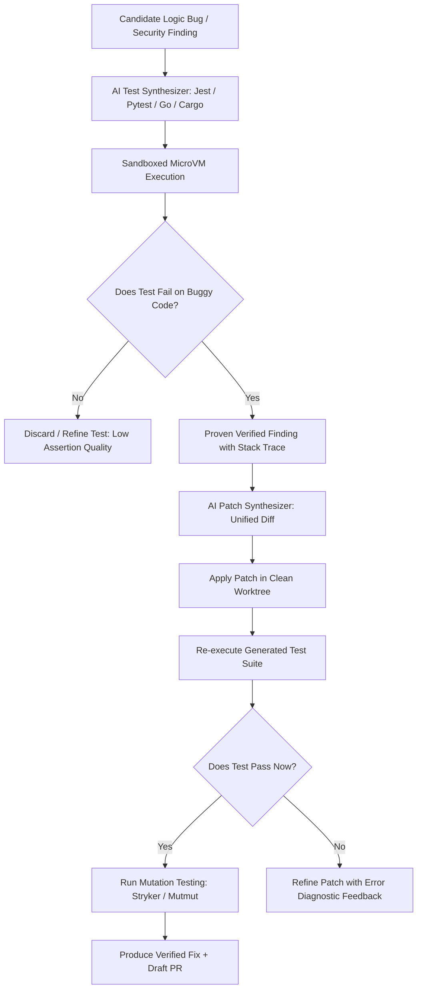
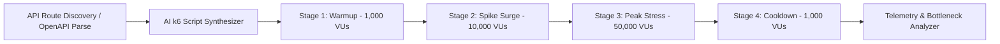

# Testing, Verification & Dynamic Labs Specification — CodeHound (ForgeGuard)

**Document:** 07-Testing-Verification-and-Dynamic-Labs.md  
**Status:** Approved Technical Specification  
**Target:** AI Test Synthesis, Mutation Testing, k6 Load Profiler, DAST/Fuzzing Lab, Self-Healing Verification Loop  
**Date:** 2026-08-25  

---

## 1. Automated Verification Engine & QA Loop

Unlike traditional AI code reviewers that merely generate text suggestions, CodeHound employs a closed-loop **Verification Engine**. Every candidate bug or patch must be validated by generating and executing native test suites inside isolated microVM sandboxes.

---

## 2. Mutation Testing for AI Test Quality Assurance

### 2.1 The Problem of Shallow AI Tests
AI models frequently generate "tautological" or "shallow" tests (e.g., checking only `expect(res.status).toBe(200)` without asserting response body properties or state transitions).

### 2.2 Mutation Testing Implementation
CodeHound injects AST-level code mutations into the target function using language-specific mutation engines (Stryker for TS/JS, Mutmut for Python, go-mutesting for Go):
- **Boundary Mutation**: `if (x > 10)` $\rightarrow$ `if (x >= 10)`
- **Logical Inversion**: `if (user.isAdmin && user.isActive)` $\rightarrow$ `if (user.isAdmin || user.isActive)`
- **Statement Deletion**: Removing critical sanitization or permission checks.

**Scoring Threshold**: A generated test suite is accepted as high-confidence evidence only if it achieves a **Mutation Score > 80%** (kills over 80% of injected mutants).

---

## 3. Distributed Load & Spike Surge Lab (k6 Engine)

CodeHound automatically inspects route declarations (OpenAPI, Express, FastAPI, Django, Gin, Spring) and synthesizes distributed k6 load testing scripts.

### 3.1 Stepped Surge Schedule

| Stage | Duration | Virtual Users (VUs) | Objective |
| :--- | :--- | :--- | :--- |
| **1. Warmup** | 2 min | 1,000 VUs | Establish baseline RPS and nominal latency (p50/p95) |
| **2. Moderate Spike** | 3 min | 10,000 VUs | Detect connection pool saturation & initial thread contention |
| **3. Peak Stress Surge** | 3 min | 50,000 VUs | Test system breakpoint, memory slopes, and 429/5xx error rates |
| **4. Recovery Cooldown** | 2 min | 1,000 VUs | Verify GC recovery and connection pool draining |

### 3.2 Automated Root Cause Bottleneck Classifier
- **N+1 SQL Queries**: Correlates spike latency with repetitive SQL execution traces.
- **Memory Leaks**: Detects positive memory growth slope that persists through cooldown.
- **Connection Starvation**: Identifies DB pool queue wait times exceeding 200ms.
- **CPU Throttling**: Flags container CFS throttle spikes.

---

## 4. Dynamic Security Testing (DAST) & API Fuzzing

The Security Lab executes safe, non-destructive dynamic penetration scans using OWASP ZAP, Nuclei, and custom AI fuzzing agents against authorized staging targets.

### 4.1 Fuzzing Vectors
- **Broken Object Level Authorization (BOLA / IDOR)**: Swapping user IDs across session tokens to verify object isolation.
- **JWT & Auth Bypass**: Testing `alg: none`, expired signatures, and token substitution.
- **SQLi & Command Injection Fuzzing**: Context-aware injection payloads targeting tainted input routes.
- **Rate-Limit & Brute-Force Testing**: Verifying exponential backoff and IP/user rate-limiting policies.
