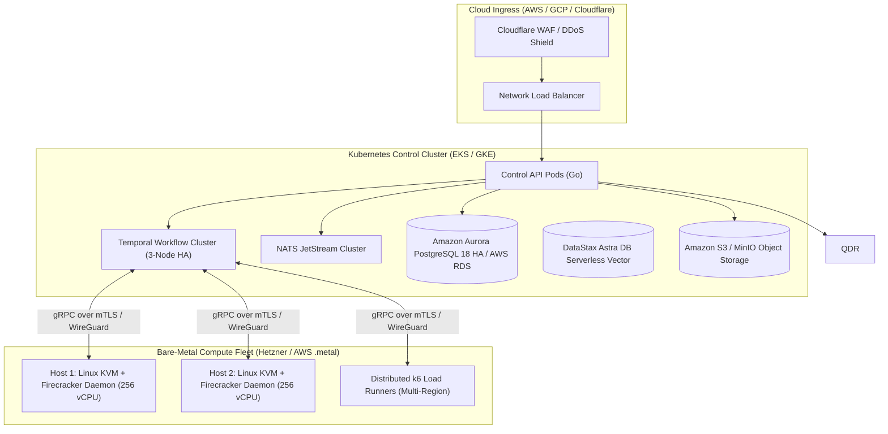

# Infrastructure Deployment & DevOps Blueprint — CodeHound (ForgeGuard)

**Document:** 11-Infrastructure-Deployment-and-DevOps.md  
**Status:** Approved Specification  
**Target:** Kubernetes Cluster Architecture, Bare-Metal KVM / Firecracker Pool, IaC (OpenTofu) & CI/CD  
**Date:** 2026-08-25  

---

## 1. Infrastructure Topology

The CodeHound production platform separates the **Control Plane** (orchestration, APIs, databases) from the **Execution Plane** (bare-metal Firecracker microVM pools and distributed k6 load runners).



---

## 2. Bare-Metal Firecracker Node Configuration

Firecracker requires access to `/dev/kvm` and cannot run inside standard nested virtualized containers. Dedicated bare-metal instances (e.g. AWS `c6i.metal` or Hetzner AX-line) host the microVM pools.

### 2.1 Host Kernel & System Setup
```bash
# 1. Enable KVM kernel modules
modprobe kvm
modprobe kvm_intel # or kvm_amd

# 2. Grant jailer permissions to KVM
setfacl -m u:firecracker:rw /dev/kvm

# 3. Configure IP forwarding and bridge networking for isolated taps
sysctl -w net.ipv4.ip_forward=1
iptables -t nat -A POSTROUTING -o eth0 -j MASQUERADE
```

### 2.2 MicroVM Pool Pre-Warming
- A local Go daemon maintains a pre-warmed pool of **50–100 suspended microVM snapshots** with pre-allocated 2 vCPU and 4GB RAM.
- Startup time for a new untrusted execution drops from 2.5 seconds (full cold boot) to **under 110 milliseconds** (memory restore snapshot).

---

## 3. Infrastructure as Code (OpenTofu / Terraform)

The entire cloud infrastructure is defined in declarative OpenTofu modules:
```text
infra/
├── modules/
│   ├── control_plane_k8s/     # EKS/GKE cluster definitions
│   ├── database_postgres/     # AWS Aurora PostgreSQL 18 HA
│   ├── vector_astradb/        # DataStax Astra DB Serverless Vector configuration
│   ├── queue_nats/            # NATS JetStream with NVMe storage
│   ├── bare_metal_metal_pool/ # Firecracker worker fleet
│   └── security_iam/          # Zero-trust IAM policies
└── environments/
    ├── staging/
    └── production/
```

---

## 4. Production Observability Stack

- **OpenTelemetry Collector**: Ingests metrics, structured JSON logs, and distributed traces from all Go services and Firecracker worker nodes.
- **Prometheus & Grafana**: Monitors system health, queue lag, sandbox boot latency, and model API token spend.
- **Temporal Web UI**: Provides real-time visual inspection of running and historical audit workflows.
