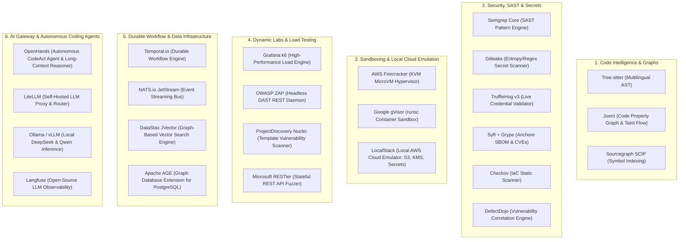

# Open-Source Ecosystem & Self-Hosted Building Blocks — CodeHound (ForgeGuard)

**Document:** 15-Open-Source-Ecosystem-and-References.md  
**Status:** Approved Reference Architecture  
**Target:** Curated Open-Source Libraries, Self-Hosted Engines, Hypervisors & Frameworks  
**Date:** 2026-08-25  

---

## 1. Overview & Architectural Primitives

Building CodeHound efficiently requires integrating high-performance, battle-tested open-source primitives. Rather than creating custom parsers, hypervisors, load generators, or AST pattern matchers from scratch, the platform orchestrates existing open-source tools under an intelligent, multi-agent evidence engine.

---

## 2. Curated Open-Source & Self-Hosted Directory

### 2.1 Code Intelligence, AST & Taint Analysis
| Project | License | Purpose in CodeHound | Integration Strategy |
| :--- | :--- | :--- | :--- |
| **[Tree-sitter](https://github.com/tree-sitter/tree-sitter)** | MIT | Multilingual AST Parsing | Use C/Go bindings (`go-tree-sitter`) to parse source code into syntax trees in $<10\text{ms}$ across TS/JS, Python, Go, Rust, Java, C/C++, PHP, and Ruby. |
| **[Joern](https://github.com/joernio/joern)** | Apache 2.0 | **Code Property Graph & Taint Flow** | An open-source code analysis platform that generates Code Property Graphs (CPG) to trace untrusted user input directly to dangerous sinks (SQLi, Command Injection, SSRF). |
| **[SCIP](https://github.com/sourcegraph/scip)** | Apache 2.0 | Cross-File Symbol Indexing | Sourcegraph's protocol for indexing definitions, references, and hover documentation across large codebases. |

---

### 2.2 Deterministic Security, Secrets & SBOM Analyzers
| Project | License | Purpose in CodeHound | Integration Strategy |
| :--- | :--- | :--- | :--- |
| **[Semgrep Core](https://github.com/semgrep/semgrep)** | LGPL / Proprietary rules | Static Application Security (SAST) | Run Semgrep CLI / binary in your Go workers to match custom OWASP Top 10 and CWE rules against the AST. |
| **[Gitleaks](https://github.com/gitleaks/gitleaks)** | MIT | High-Speed Secret Scanner | Embed Gitleaks as a Go library to scan commit diffs for 700+ regex and high-entropy secret patterns. |
| **[TruffleHog v3](https://github.com/trufflesecurity/trufflehog)** | AGPL-3.0 | Live Credential Verification | Uses active cryptographic handshakes to test if exposed AWS, Stripe, GitHub, or OpenAI keys are live. |
| **[Syft](https://github.com/anchore/syft) + [Grype](https://github.com/anchore/grype)** | Apache 2.0 | SBOM & Dependency Vulnerabilities | Generates CycloneDX / SPDX SBOMs from package manifests and matches against CVE/OSV vulnerability databases. |
| **[Checkov](https://github.com/bridgecrewio/checkov)** | Apache 2.0 | Infrastructure-as-Code (IaC) Scanning | Scans Terraform, Dockerfiles, and Kubernetes manifests for misconfigurations (e.g. open S3 buckets, root containers). |
| **[OWASP DefectDojo](https://github.com/DefectDojo/django-DefectDojo)** | BSD-3-Clause | Vulnerability Correlation | Reference its data models for deduplicating, tracking, and grading findings across 100+ scanner types. |

---

### 2.3 Execution Sandboxing & Cloud Emulation
| Project | License | Purpose in CodeHound | Integration Strategy |
| :--- | :--- | :--- | :--- |
| **[AWS Firecracker](https://github.com/firecracker-microvm/firecracker)** | Apache 2.0 | Hardware-Isolated MicroVMs | The hypervisor behind AWS Lambda. Provides sub-120ms boot times and KVM hardware isolation to safely run untrusted user code and tests. |
| **[Google gVisor](https://github.com/google/gvisor)** | Apache 2.0 | User-Space Kernel Sandbox | Intercepts system calls via `runsc` for lower-risk static analysis and container isolation. |
| **[LocalStack](https://github.com/localstack/localstack)** | Apache 2.0 / Pro | Local AWS Cloud Emulator | Emulates Amazon S3, Secrets Manager, KMS, IAM, and CloudWatch in local Docker on `localhost:4566` for zero-cloud-cost testing before production deployment. |

---

### 2.4 Dynamic Security (DAST) & Load Testing
| Project | License | Purpose in CodeHound | Integration Strategy |
| :--- | :--- | :--- | :--- |
| **[Grafana k6](https://github.com/grafana/k6)** | AGPL-3.0 | High-Performance Load Testing | Go-based load generator capable of simulating **50,000+ concurrent Virtual Users (VUs)** with minimal memory footprint. |
| **[OWASP ZAP](https://github.com/zaproxy/zaproxy)** | Apache 2.0 | Dynamic Application Security (DAST) | Run ZAP in headless daemon mode (`zap.sh -daemon`) and control it via REST APIs for dynamic vulnerability fuzzing. |
| **[Nuclei](https://github.com/projectdiscovery/nuclei)** | MIT | Fast Vulnerability Scanner | Uses YAML-based templates to rapidly probe APIs for misconfigurations, auth bypasses, and CVEs. |
| **[Microsoft RESTler](https://github.com/microsoft/restler-fuzzer)** | MIT | Stateful REST API Fuzzing | Automatically generates stateful dynamic fuzz test suites directly from OpenAPI / Swagger schemas. |

---

### 2.5 Durable Workflow Orchestration & Data Infrastructure
| Project | License | Purpose in CodeHound | Integration Strategy |
| :--- | :--- | :--- | :--- |
| **[Temporal.io](https://github.com/temporalio/temporal)** | MIT | Durable Workflow Orchestration | Manages the multi-stage audit lifecycle, ensuring that long-running scans and 50k load tests survive crashes and automatically retry. |
| **[NATS JetStream](https://github.com/nats-io/nats-server)** | Apache 2.0 | Event Streaming & Worker Bus | Lightweight, ultra-fast pub/sub message broker connecting the Control Plane to worker pools. |
| **[DataStax JVector](https://github.com/datastax/jvector)** | Apache 2.0 | High-Performance Vector Search Engine | State-of-the-art embedded graph-based vector index powering Astra DB Serverless with high memory compression and sub-millisecond search. |
| **[Apache AGE](https://github.com/apache/age)** | Apache 2.0 | Graph Extension for PostgreSQL | Turns PostgreSQL into a Graph database, allowing OpenCypher graph queries across `code_symbols` and call edges directly in Postgres. |

---

### 2.6 Autonomous Coding Agents & AI Gateway
| Project | License | Purpose in CodeHound | Integration Strategy |
| :--- | :--- | :--- | :--- |
| **[OpenHands (All-Hands AI)](https://github.com/All-Hands-AI/OpenHands)** | MIT | Autonomous Software Engineer & Long-Context Agent | Executes CodeAct agentic loops in sandboxes to perform long-context repository reasoning (1M+ tokens), multi-file refactoring, and automated patch synthesis with test self-healing. |
| **[LiteLLM](https://github.com/BerriAI/litellm)** | MIT | Self-Hosted AI Proxy | Unified proxy for 100+ LLMs (OpenAI, Anthropic, Gemini, DeepSeek) with built-in load balancing, fallback routing, and token cost tracking. |
| **[vLLM](https://github.com/vllm-project/vllm) / [Ollama](https://github.com/ollama/ollama)** | Apache 2.0 / MIT | Self-Hosted Local AI Models | Host high-performance local coding models (e.g. **DeepSeek-R1-Distill-Qwen**, **Qwen 2.5 Coder 32B**) on your own GPUs for zero data leakage. |
| **[Langfuse](https://github.com/langfuse/langfuse)** | MIT | LLM Observability & Tracing | Open-source prompt management, hallucination evaluation, latency tracking, and token analytics. |

---

### 2.7 Terminal UI & Web Visualization Libraries
| Project | License | Purpose in CodeHound | Integration Strategy |
| :--- | :--- | :--- | :--- |
| **[Charm Bubbletea](https://github.com/charmbracelet/bubbletea)** | MIT | Terminal User Interface (TUI) | The Elm-architecture Go framework used to build `codehound`'s interactive terminal progress bars and diff viewers. |
| **[Cytoscape.js](https://github.com/cytoscape/cytoscape.js)** | MIT | 2D Graph Visualizer | Renders interactive, zoomable codebase call graphs and taint flow trees in the Web Console. |
| **[3D Force Graph](https://github.com/vasturiano/3d-force-graph)** | MIT | 3D Blast Radius Visualizer | WebGL/Three.js-based 3D dependency graph for visualizing repository blast radius and critical path hubs. |
