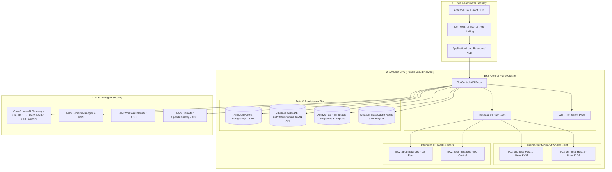

# AWS Cloud Architecture & Services Blueprint — CodeHound (ForgeGuard)

**Document:** AWS-ARCHITECTURE-AND-SERVICES.md (Docs/AWS-ARCHITECTURE-AND-SERVICES.md)  
**Status:** Approved Cloud Infrastructure Specification  
**Target:** Production Cloud Topology, Compute Fleets, Storage, AI Bedrock, Security & Observability  
**Date:** 2026-08-25  

---

## 1. High-Level AWS Architecture Diagram

---

## 2. Complete Catalog of AWS Services for CodeHound

### 🖥️ 1. Compute & Sandboxed Execution
| AWS Service | Specific Instance / Tier | Purpose in CodeHound |
| :--- | :--- | :--- |
| **Amazon EC2 Bare Metal** | `c6i.metal`, `c7i.metal`, `m6i.metal` | **Critical for Firecracker MicroVMs.** Bare-metal instances provide direct hardware virtualization access (`/dev/kvm`) to run isolated microVMs with sub-120ms boot times. |
| **Amazon EKS (Elastic Kubernetes Service)** | Kubernetes `v1.30+` | Hosts and autoscales the Go Control API, Temporal workflow orchestrator, NATS JetStream, and deterministic scanner workers. |
| **AWS Fargate** | Serverless Linux Containers | Runs ephemeral, isolated batch jobs (e.g. Syft SBOM generation, Semgrep SAST scans) without managing EC2 nodes. |
| **Amazon EC2 Spot Instances** | `c6i.2xlarge`, `c6i.4xlarge` (Multi-Region) | Spins up cheap, distributed **Grafana k6 load generation runners** across multiple regions to simulate 50,000+ Virtual Users at 70–90% cost savings. |
| **AWS Lambda** | Serverless Node.js / Go | Handles lightweight ingress events (e.g. GitHub webhook intake, S3 file creation event triggers, Slack notifications). |

---

### 🗄️ 2. Storage, Databases & Caching
| AWS Service / Integration | Configuration | Purpose in CodeHound |
| :--- | :--- | :--- |
| **Amazon Aurora PostgreSQL** | PostgreSQL 18 compatible, Multi-AZ HA | High-performance relational database hosting the 23 tables, native Row Level Security (RLS), and time-series range partitions. |
| **DataStax Astra DB (Serverless)** | Serverless Vector JSON API (AWS Region Co-located) | **Primary Semantic Vector Database.** Stores code chunk embeddings with multi-tenant metadata filtering (`tenant_id`, `project_id`, `file_path`) and hybrid search, leveraging the $25/mo recurring free tier and JVector search engine. |
| **Amazon S3 (Simple Storage Service)** | S3 Standard + S3 Glacier Instant Retrieval | Stores immutable git commit snapshots, raw execution logs, SARIF artifacts, SBOM files, and master `AUDIT_REPORT.md` bundles. |
| **Amazon ElastiCache for Redis** | Redis 7+ / Valkey Cluster | In-memory distributed cache for API rate-limiting, user session tokens, and deduplication keys. |
| **Amazon EBS (Elastic Block Store)** | `gp3` / `io2` Block Storage | High-throughput NVMe SSD storage attached to EKS nodes for NATS JetStream and Temporal persistence. |

---

### 🌐 3. Networking, Edge & API Gateway
| AWS Service | Configuration | Purpose in CodeHound |
| :--- | :--- | :--- |
| **Amazon CloudFront** | Global Content Delivery Network (CDN) | Accelerates Web Console delivery, terminates SSL/TLS at the edge, and caches static assets globally. |
| **AWS WAF (Web Application Firewall)** | Managed Rule Sets + Rate Limiting | Protects API endpoints against DDoS attacks, SQL injection probes, and credential stuffing. |
| **Application Load Balancer (ALB) / NLB** | Dual-Stack IPv4/IPv6, HTTP/2, gRPC | Routes external REST and SSE streaming traffic to Control API pods and internal gRPC traffic to worker nodes. |
| **Amazon VPC (Virtual Private Cloud)** | Multi-AZ, Public & Private Subnets, NAT Gateways | Isolates trusted Control Plane services in private subnets with strict Security Groups and VPC Endpoints. |
| **Amazon Route 53** | Low-Latency DNS Routing + Health Checks | Manages domain routing and dynamic target verification challenges. |

---

### 🔒 4. Security, Identity & Cryptography
| AWS Service | Configuration | Purpose in CodeHound |
| :--- | :--- | :--- |
| **AWS Secrets Manager** | Automated Secret Rotation | Securely stores sensitive credentials (LLM API keys, GitHub App private keys, database passwords) without hardcoding. |
| **AWS KMS (Key Management Service)** | FIPS 140-3 Hardware Security Modules | Encrypts S3 artifacts, database volumes, and API tokens at rest with customer-managed keys (CMKs). |
| **AWS IAM & IAM Roles for Service Accounts (IRSA)** | Zero-Trust Least Privilege | Grants fine-grained AWS permissions directly to Kubernetes pods via OIDC federation. |
| **Amazon GuardDuty** | Intelligent Threat Detection | Monitors AWS account activity, VPC flow logs, and EKS audit logs for unauthorized access or compromised credentials. |

---

### 🤖 5. AI, Machine Learning & Model Routing (OpenRouter Unified Gateway)
| Component / Service | Configuration | Purpose in CodeHound |
| :--- | :--- | :--- |
| **OpenRouter Unified API Gateway** | Serverless Multi-Model Routing (`https://openrouter.ai/api/v1`) | **Primary AI Gateway.** Single API key and unified billing providing instant access to all 3 model tiers (Gemini 2.5 Flash, Claude 3.7 Sonnet, DeepSeek-R1, OpenAI o3/o1, Qwen 2.5 Coder) with built-in automatic failover, latency routing, and zero fixed infrastructure costs. |
| **AWS Secrets Manager** | Encrypted Key Vault | Securely stores the `OPENROUTER_API_KEY` and handles automated rotation without hardcoding in repository code. |

---

### 📊 6. Observability, Telemetry & Operations
| AWS Service | Configuration | Purpose in CodeHound |
| :--- | :--- | :--- |
| **AWS Distro for OpenTelemetry (ADOT)** | OpenTelemetry Collector DaemonSet | Ingests distributed traces, metrics, and structured JSON logs from all Go microservices and Firecracker workers. |
| **Amazon CloudWatch** | CloudWatch Metrics, Logs & Alarms | Centralized log group aggregation and alerting on error rate spikes. |
| **Amazon Managed Service for Prometheus (AMP)** | Scalable Prometheus Ingestion | Stores high-cardinality time-series metrics from k6 load testing runs and cluster queues. |
| **Amazon Managed Grafana (AMG)** | Enterprise Dashboards | Real-time visual dashboards for SREs and security leads tracking cluster health, p95/p99 latency, and token spend. |

---

### 📦 7. Container Registry & Deployment
| AWS Service | Configuration | Purpose in CodeHound |
| :--- | :--- | :--- |
| **Amazon ECR (Elastic Container Registry)** | Private Registry + Automated Vulnerability Scanning | Stores container images for Control APIs, Semgrep workers, ZAP DAST scanners, and k6 runners. |
