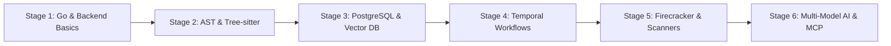

# Developer Learning Roadmap & Master Study Guide — CodeHound

**Document:** LEARNING-ROADMAP.md  
**Target:** From Basic Knowledge to Building a Production-Grade AI DevSecOps Platform  
**Date:** 2026-08-25  

---

## 🎯 Welcome to the Journey

Building **CodeHound** is an incredible engineering journey. It combines **systems programming, compilers/ASTs, distributed systems, cybersecurity, and AI orchestration**.

You do **not** need to master everything all at once. The platform is broken down into **6 progressive learning stages**, designed so that you can learn by doing—building real components step by step.

---

## 📚 Stage 1: Core Backend & Go Systems Programming

### 🧠 Concepts to Master
1. **Go Fundamentals**:
   - Structs, Interfaces, Pointers, and Type Embedding.
   - Concurrency: Goroutines, Channels, `sync.WaitGroup`, and `sync.Mutex`.
   - `context.Context`: Propagating deadlines, cancellations, and request tracing.
   - Idiomatic error handling: `if err != nil` and error wrapping (`fmt.Errorf("...: %w", err)`).
2. **HTTP & REST in Go**:
   - Routing with **Gin** or **Echo**.
   - Server-Sent Events (SSE) streaming for real-time progress.
3. **Docker & Containers**:
   - Multi-stage Dockerfiles.
   - `docker compose` networking, environment variables, and volume mounts.

### 📖 Recommended Resources (Free)
- **Interactive**: [Go by Example](https://gobyexample.com/) (The fastest way to learn Go syntax).
- **Test-Driven**: [Learn Go with Tests](https://quii.gitbook.io/learn-go-with-tests/) (Teaches Go + TDD simultaneously).
- **Video**: "Go in 100 Seconds" & freeCodeCamp's 6-hour Go Course on YouTube.

---

## 🌳 Stage 2: Code Parsing, ASTs & Tree-sitter

### 🧠 Concepts to Master
1. **What is an AST (Abstract Syntax Tree)?**
   - Code is not just raw text; it is a nested tree of nodes (e.g. `FunctionDeclaration` $\rightarrow$ `ParameterList` $\rightarrow$ `BlockStatement`).
2. **How Tree-sitter Works**:
   - High-speed, language-agnostic parsing that produces syntax trees in milliseconds.
   - Writing S-expression queries (e.g. `(function_declaration name: (identifier) @func.name)`).
3. **Basic Taint Analysis**:
   - **Source** (Where untrusted user input enters, e.g. `req.query.id`).
   - **Propagator** (Functions that pass the tainted variable along).
   - **Sink** (Dangerous operations, e.g. `db.raw(...)` or `exec(...)`).

### 📖 Recommended Resources
- **Interactive Playground**: [Tree-sitter Online Playground](https://tree-sitter.github.io/tree-sitter/playground) (Paste code in any language and see the AST live).
- **Guide**: [Getting Started with Tree-sitter](https://tree-sitter.github.io/tree-sitter/using-parsers).

---

## 🗄️ Stage 3: Database Engineering & Vector Search

### 🧠 Concepts to Master
1. **PostgreSQL 18 Essentials**:
   - 3NF Relational Normalization and Foreign Key cascading rules (`ON DELETE CASCADE`).
   - B-Tree indexes, Partial indexes (`WHERE status = 'RUNNING'`), and GIN indexes on JSONB.
   - **Row-Level Security (RLS)**: Enforcing tenant data isolation at the database layer using session variables (`SET LOCAL app.current_tenant_id`).
   - **Table Partitioning**: Range partitioning monthly tables for high-volume logs.
2. **Vector Databases & Semantic Search**:
   - What are vector embeddings? (Converting code snippets into numerical coordinates).
   - What is DataStax Astra DB? Serverless vector collections, cosine similarity, and metadata filtering.

### 📖 Recommended Resources
- **PostgreSQL**: [PostgreSQL Tutorial (postgresqltutorial.com)](https://www.postgresqltutorial.com/)
- **PostgreSQL RLS Official Guide**: [PostgreSQL Official Documentation: Row Security Policies](https://www.postgresql.org/docs/current/ddl-rowsecurity.html)
- **AWS Aurora PostgreSQL Guide**: [AWS Aurora PostgreSQL Best Practices & Security](https://docs.aws.amazon.com/AmazonRDS/latest/AuroraUserGuide/CHAP_PostgreSQL.html)
- **Astra DB Vector**: [DataStax Astra DB Vector Quickstart](https://docs.datastax.com/en/astra-db-serverless/databases/vector-search.html)

---

## ⚙️ Stage 4: Durable Workflows & Event Streaming

### 🧠 Concepts to Master
1. **Why Distributed Workflows?**
   - If a scan or 50k load test runs for 20 minutes and a server crashes, traditional queues (like Celery/BullMQ) lose state.
   - **Temporal** saves execution state step-by-step and automatically resumes from the exact last line of code.
2. **Temporal Core Primitives**:
   - **Workflow**: Deterministic business logic (e.g. Ingest $\rightarrow$ Scan $\rightarrow$ Verify $\rightarrow$ Report).
   - **Activity**: Non-deterministic tasks (calling an external LLM API, booting a container, querying a DB).
3. **NATS JetStream**:
   - Ultra-fast pub/sub messaging between workers.

### 📖 Recommended Resources
- **Temporal Official**: [Temporal Go SDK Documentation & 101 Tutorial](https://learn.temporal.io/getting_started/go/hello_world_in_go/)
- **NATS**: [NATS by Example](https://nbyexample.com/)

---

## 🛡️ Stage 5: Execution Sandboxing, SAST & Load Testing

### 🧠 Concepts to Master
1. **Linux Isolation Primitives**:
   - Linux namespaces (network, mount, pid), cgroups v2 (CPU/memory limits), and chroot.
   - **Firecracker**: AWS open-source microVM hypervisor running on Linux KVM (`/dev/kvm`) with sub-120ms boot times.
2. **Static & Secret Scanners**:
   - How **Semgrep** matches code patterns against AST rules.
   - How **Gitleaks** detects high-entropy secret keys.
3. **Mutation Testing (QA Quality)**:
   - What is mutation testing? Inverting `>` to `<` or deleting checks to see if generated AI tests actually fail when a bug is injected.
4. **Load & Stress Testing (k6)**:
   - Writing JavaScript load scripts in Grafana k6.
   - Understanding Virtual Users (VUs), p95/p99 latency curves, and RPS.

### 📖 Recommended Resources
- **Firecracker**: [Firecracker Getting Started Guide](https://github.com/firecracker-microvm/firecracker/blob/main/docs/getting-started.md)
- **k6**: [Grafana k6 Documentation & Tutorial](https://k6.io/docs/)
- **Semgrep**: [Semgrep Rule Writing Tutorial](https://semgrep.dev/docs/writing-rules/overview/)

---

## 🤖 Stage 6: Multi-Model AI Orchestration & MCP

### 🧠 Concepts to Master
1. **Tiered Model Routing & Economics**:
   - Using cheap models (Gemini Flash / GPT-4o-mini) for syntax triage, and reasoning models (Claude 3.7 Sonnet / DeepSeek-R1) only for complex security logic.
2. **Prompt Injection Defense**:
   - Treating untrusted repository code as passive data in XML/JSON tags.
3. **Model Context Protocol (MCP)**:
   - Implementing tools, resources, and prompts under the stateless 2026 protocol.

### 📖 Recommended Resources
- **LiteLLM**: [LiteLLM Proxy Documentation](https://docs.litellm.ai/)
- **MCP Spec**: [Model Context Protocol Specification](https://modelcontextprotocol.io/)

---

## 🗺️ Suggested Learning by Building Path

| Week | Focus Area | Hands-On Milestone to Build |
| :---: | :--- | :--- |
| **Week 1** | Go Fundamentals & Docker Stack | Build `docker-compose.yml` (Postgres, Temporal, NATS) and scaffold a basic Go REST API. |
| **Week 2** | PostgreSQL Schema & RLS | Apply database migrations and write Go tests verifying multi-tenant isolation. |
| **Week 3** | Tree-sitter AST & Ingestion | Build a Go CLI command that parses a JavaScript/Python file and prints all function names. |
| **Week 4** | Semgrep & Secret Scanners | Integrate Semgrep and Gitleaks into a worker that returns normalized JSON findings. |
| **Week 5** | Multi-Model AI Router | Write a LiteLLM gateway script that routes code diffs to Gemini Flash or Claude Sonnet. |
| **Week 6** | Sandboxed Test Execution | Run generated tests inside a Docker/Firecracker container and capture pass/fail status. |
| **Week 7** | k6 Load Surges & DAST | Synthesize a k6 script from an API endpoint and run a 1k VU load test. |
| **Week 8** | Auto-Patching & Report Generation | Apply verified diffs in a git worktree and output the master `AUDIT_REPORT.md`. |
| **Week 9** | Multi-Interface UI | Build the Bubbletea Terminal TUI and the SvelteKit Web Console. |

---

### 💡 Pair Programming Philosophy

You are not doing this alone. We will **pair-program every single step together**:
- Whenever we write code, I will explain **why** it is structured that way.
- You can ask questions about any line of Go, SQL, or Tree-sitter code at any moment.
- We will build the system incrementally, with automated tests validating every milestone.
