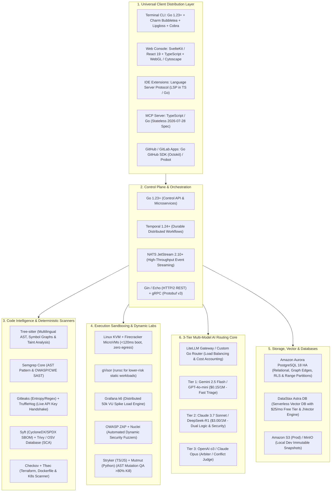

# Technology Stack & Tooling Architecture — CodeHound (ForgeGuard)

**Document:** TECH-STACK.md (14-Technology-Stack-and-Tooling.md)  
**Status:** Approved Master Technology Stack  
**Target:** Core Control Plane, AI Ensemble, MicroVM Sandboxes, Dynamic Labs, Storage & Client Distribution  
**Date:** 2026-08-25  

---

## 1. Master Technology Stack Architecture

CodeHound unifies high-performance systems programming (Go), hardware virtualization (Firecracker KVM), multilingual AST parsing (Tree-sitter), 3-tier multi-model AI reasoning, and universal client surfaces (TUI, Web, IDE LSP, MCP).

---

## 2. Comprehensive Layer-by-Layer Tech Stack Breakdown

### Layer 1: Core Backend & Control Plane
| Component | Technology | Exact Version / Spec | Primary Responsibility |
| :--- | :--- | :--- | :--- |
| **Core Language** | **Go (Golang)** | `1.23+` | High-throughput Control API, ingestion services, CLI, and worker orchestration. Native goroutines eliminate concurrency bottlenecks. |
| **Durable Workflow Engine** | **Temporal** | `1.24+` | Guarantees that long-running 50k VU load tests, multi-model audits, and sandboxed test runs survive crashes with automatic state resumption. |
| **Event Bus & Queues** | **NATS JetStream** | `2.10+` | Ultra-low latency pub/sub message streaming between analyzers, Temporal orchestrators, and Firecracker microVM workers. |
| **REST API Gateway** | **Gin / Echo** | Latest Stable | Sub-millisecond HTTP/2 REST APIs and Server-Sent Events (SSE) progress streaming. |
| **Internal RPC Protocol** | **gRPC + Protobuf v3** | `proto3` | High-performance binary communication between Control Plane and worker daemon nodes. |

---

### Layer 2: Code Intelligence & Deterministic Scanners
| Component | Technology | Exact Version / Spec | Primary Responsibility |
| :--- | :--- | :--- | :--- |
| **Multilingual AST Parsing** | **Tree-sitter** | `0.22+` (C/Go bindings) | High-speed AST parsing for TypeScript/JS, Python, Go, Rust, Java, C/C++, PHP, Ruby. Extracts symbols and call graphs. |
| **Taint Flow Analysis** | **Custom Tree-sitter Engine** | Proprietary Core | Traces unvalidated user inputs (HTTP query params, headers, body) across functions directly into database or command sinks. |
| **Static Code Analysis (SAST)**| **Semgrep Core** | `1.80+` | Executes tailored OWASP Top 10 and CWE rules across ASTs with normalized SARIF output. |
| **Fast Secrets Scanning** | **Gitleaks** | `8.18+` | Shannon-entropy and regex scanning across entire commit history for 700+ secret token types. |
| **Live Credential Verification**| **TruffleHog** | `3.80+` | Performs cryptographic API handshakes to prove whether discovered AWS, Stripe, GitHub, or OpenAI keys are active. |
| **SBOM & Supply Chain (SCA)** | **Syft + Trivy** | Latest Stable | Generates CycloneDX/SPDX SBOMs and scans dependencies against the OSV vulnerability database; detects GPL/AGPL copyleft conflicts. |
| **Infrastructure-as-Code (IaC)**| **Checkov + Tfsec** | Latest Stable | Scans Terraform, Dockerfiles, and Kubernetes manifests for security misconfigurations. |

---

### Layer 3: 3-Tier Multi-Model Reasoning Core (via OpenRouter)
| Model Tier | Selected AI Models (OpenRouter IDs) | Cost Target | Primary Role |
| :--- | :--- | :--- | :--- |
| **Unified AI Gateway** | **OpenRouter (`https://openrouter.ai/api/v1`)** | Single API Key | Multi-provider load balancing, automatic failover, latency routing, and unified token billing across all providers. |
| **Tier 1 (Fast Filter)** | `google/gemini-2.5-flash` / `openai/gpt-4o-mini` | $\approx \$0.15$ / 1M tokens | Filters syntactic noise, linter warnings, and boilerplate. Passes $>75\%$ of clean code cheaply. |
| **Tier 2 (Dual Reasoning)** | `anthropic/claude-3.7-sonnet` / `deepseek/deepseek-r1` | $\approx \$3.00$ / 1M tokens | **Agent A (Logic Bug Hunter)**: Off-by-one errors, race conditions, memory leaks. **Agent B (Security Analyst)**: Taint flow vulnerabilities, auth bypasses. |
| **Tier 3 (Arbiter / Judge)** | `openai/o3-mini` / `anthropic/claude-3.7-sonnet:thinking` | High-tier reasoning | Evaluates analyzer disagreements, inspects runtime traces, and assigns final calibrated confidence scores. |

---

### Layer 4: Execution Sandboxing, Dynamic Labs & QA
| Component | Technology | Exact Version / Spec | Primary Responsibility |
| :--- | :--- | :--- | :--- |
| **Hardware MicroVMs** | **Linux KVM + Firecracker** | `1.8+` with Jailer | Hardware-isolated microVMs with $<120\text{ms}$ snapshot boots, cgroups v2, minimal seccomp filters, and zero default network egress. |
| **Container Sandbox** | **gVisor (`runsc`)** | Latest Stable | User-space kernel sandbox for lower-risk static analysis tasks. |
| **AST Mutation Testing** | **Stryker (TS/JS) / Mutmut (Python)** | Latest Stable | Injects code mutations (flipping operators, deleting statements) to enforce a **Mutation Score > 80%** on generated AI tests. |
| **Distributed Load Engine** | **Grafana k6** | `0.52+` (Go-based) | Executes stepped surge schedules (1k $\rightarrow$ 10k $\rightarrow$ 50k VUs) with automated N+1 query and memory leak detection. |
| **Dynamic Security (DAST)** | **OWASP ZAP + Nuclei** | Latest Stable | Containerized headless dynamic vulnerability fuzzing (BOLA/IDOR, auth bypasses). |

---

### Layer 5: Databases, Vector Search & Storage
| Component | Technology | Configuration & Strategy | Primary Responsibility |
| :--- | :--- | :--- | :--- |
| **Relational Database** | **Amazon Aurora PostgreSQL 18 / AWS RDS PostgreSQL** | Multi-AZ High Availability (HA) | 23 tables with native Row-Level Security (RLS) for tenant isolation, UUIDv7 keys, and monthly range partitioning for high-volume logs. Direct private VPC connectivity to EKS and bare-metal nodes. |
| **Vector Database** | **DataStax Astra DB (Serverless Vector)** | Serverless Vector JSON API (JVector / HNSW) with $25/mo recurring free tier | Stores semantic code chunk embeddings with multi-tenant metadata filtering (`tenant_id`, `project_id`, `file_path`) and hybrid search capabilities. Co-located in target AWS region. |
| **Blob & Artifact Storage** | **Amazon S3 (Prod) / MinIO (Local Dev)** | S3-Compatible API + VPC Endpoints | Stores immutable commit snapshots, raw test logs, SARIF artifacts, and load telemetry data with S3 lifecycle rules. |
| **Distributed Caching** | **Amazon ElastiCache for Redis** | Redis 7+ / Valkey Cluster | In-memory distributed session management, API rate limiting, and deduplication keys. |

---

### Layer 6: Universal 5-Surface Client Distribution
| Client Surface | Technology & Libraries | Key User Capabilities |
| :--- | :--- | :--- |
| **Terminal / CLI** | **Go + Charmbracelet Bubbletea, Lipgloss, Cobra** | Interactive TUI with live progress animations, side-by-side diff previews, pre-commit hook support (`codehound check --diff`), and single-key patch application. |
| **Web Console** | **SvelteKit / React 19 + TypeScript + WebGL / Cytoscape + ECharts** | Interactive 2D/3D codebase call-graph explorer, live audit streaming via SSE, finding proof workbenches, and Grafana-grade load telemetry charts. |
| **IDE Extensions** | **Language Server Protocol (LSP) Daemon** | Native squiggles, tainted input call traces, and CodeLens quick actions (*"Run Sandboxed Test"*, *"Calculate Blast Radius"*, *"Apply Verified Patch"*) in VS Code, JetBrains, and Cursor. |
| **MCP Server** | **Stateless MCP 2026 SDK (TypeScript / Go)** | Implements the **2026-07-28 stateless protocol**, allowing Claude Desktop, Google Antigravity IDE, Cursor, and Windsurf to execute audits and tests. |
| **GitHub / GitLab Apps** | **Go GitHub SDK (Octokit) / Probot** | Handles pull request webhooks, check runs with inline line annotations, merge gates, and `@codehound fix` bot commands. |

---

### Layer 7: DevOps, Infrastructure as Code & Observability
| Component | Technology | Configuration | Primary Responsibility |
| :--- | :--- | :--- | :--- |
| **Infrastructure as Code** | **OpenTofu / Terraform** | `1.8+` | Declarative provisioning of AWS/GCP clusters and bare-metal KVM worker fleets. |
| **Container Orchestration**| **Kubernetes (EKS / GKE) + Helm** | `v1.30+` | Manages Control Plane APIs, Temporal clusters, NATS JetStream, and database statefulsets. |
| **Distributed Telemetry** | **OpenTelemetry (OTel) Collector**| Latest Stable | Vendor-neutral ingestion of distributed traces, metrics, and structured JSON logs. |
| **Metrics & Alerts** | **Prometheus + Grafana** | Latest Stable | Real-time monitoring of queue lag, microVM boot latencies, and AI model token spend. |

---

## 3. Technology Selection Matrix & Rationale

| Requirement | Selected Technology | Rejected Alternative | Why Selected? |
| :--- | :--- | :--- | :--- |
| **Control Plane Runtime** | **Go (Golang)** | Node.js / Python | Go provides true multi-core parallel concurrency, ultra-low memory usage, sub-millisecond execution, and single-binary packaging. |
| **Primary Database & Storage Tier** | **AWS Aurora / RDS PostgreSQL 18 HA + Amazon S3** | **Supabase / Firebase (BaaS)** | CodeHound uses a dedicated Go Control Plane (gRPC/REST), Temporal orchestration, and private VPC networking with bare-metal microVMs. BaaS layers like Supabase introduce PostgREST overhead, public network hops, connection bottlenecks under 50k VU dynamic loads, and lack native integration with AWS IAM IRSA, KMS CMKs, and VPC peering. |
| **Workflow Engine** | **Temporal** | Celery / BullMQ | Celery/BullMQ lack durable execution state; Temporal guarantees that a 40-minute 50k VU test survives worker reboots without losing state. |
| **Untrusted Code Sandbox** | **Firecracker MicroVMs** | Standard Docker | Docker shares the host Linux kernel and is vulnerable to container escapes; Firecracker uses KVM hardware virtualization with sub-120ms boot times. |
| **Load Testing Engine** | **Grafana k6** | JMeter / Locust | JMeter has high Java memory overhead; Locust has Python GIL constraints; k6 is Go-based and easily handles 50,000+ VUs on minimal hardware. |
| **Multi-Tenancy Security** | **PostgreSQL RLS** | App-level `WHERE` filters | RLS enforces tenant isolation at the database engine level, eliminating human developer omissions. |
| **AI Test Quality** | **Stryker / Mutmut Mutation QA** | Code Coverage % alone | Code coverage only measures executed lines; mutation testing proves that the generated assertions actually catch bugs. |
