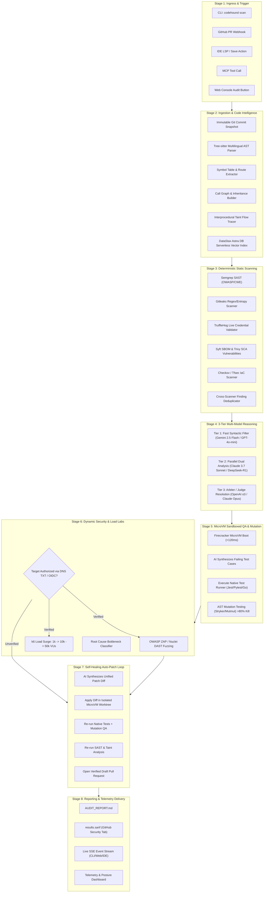
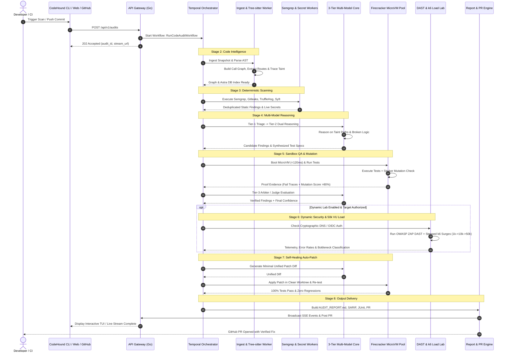
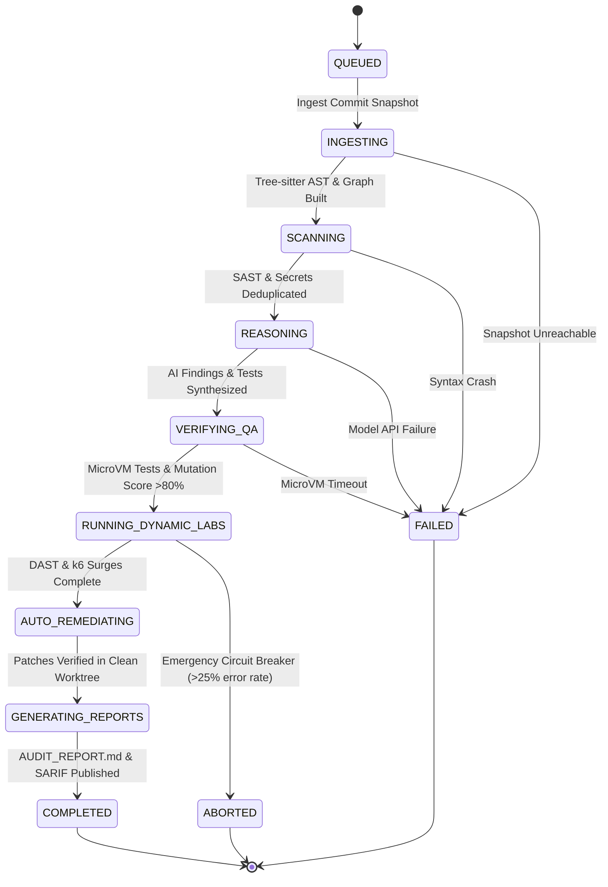

# Complete End-to-End System Workflow — CodeHound (ForgeGuard)

**Document:** WORKFLOW.md  
**Status:** Approved Master Workflow Specification  
**Target:** Complete Lifecycle, Step-by-Step Data Flow, State Machines & User Interaction Scenarios  
**Date:** 2026-08-25  

---

## 1. Master System Workflow Diagram

CodeHound executes an **8-Stage Closed-Loop Verification Pipeline** that transforms a repository snapshot into verified findings, executable test suites, performance telemetry, and regression-free patches.



---

## 2. Step-by-Step Lifecycle (The 8 Stages)

### Stage 1: Trigger & Request Ingress
- **Trigger Sources**:
  - `codehound scan` from developer terminal.
  - Pull Request opened/updated on GitHub/GitLab.
  - File save event or CodeLens click in VS Code / JetBrains / Cursor.
  - MCP tool call `codehound_audit_repository` from Claude Desktop or Antigravity IDE.
  - Manual trigger via Web Console.
- **Action**: Ingress API Gateway validates authentication (JWT, API key, HMAC webhook signature), creates a scan record in PostgreSQL, and launches a durable **Temporal Workflow** (`RunCodeAuditWorkflow`).
- **Response**: Returns HTTP 202 Accepted with `audit_id` and a real-time SSE stream endpoint (`/api/v1/audits/{id}/stream`).

---

### Stage 2: Repository Ingestion & Code Intelligence
- **Snapshot Isolation**: Git worker clones/fetches the exact target commit SHA, tarballs the source, and saves an immutable snapshot to S3.
- **Tree-sitter Multilingual Parsing**:
  - Parses code into Concrete Syntax Trees (CSTs) and Abstract Syntax Trees (ASTs) for TypeScript, Python, Go, Rust, Java, C/C++, PHP, and Ruby.
  - Identifies symbol definitions (functions, classes, variables) with line/column coordinates.
  - Extracts API routes and input parameters (e.g., Express `app.get()`, FastAPI `@app.post()`, Spring `@GetMapping`).
- **Graph & Taint Flow Construction**:
  - Constructs directional call graphs (`A() calls B()`) and inheritance trees.
  - Performs interprocedural **Taint Analysis**: tracks untrusted entry points (`req.query`, `req.body`, `headers`) across downstream function invocations to identify untrusted sinks (`db.query()`, `exec()`, `fetch()`).
- **Vector & Keyword Indexing**:
  - Chunks code along AST function/class boundaries.
  - Ingests symbol embeddings into **DataStax Astra DB Serverless** paired with BM25 metadata keywords for fast hybrid retrieval.

---

### Stage 3: Deterministic Static Scanning & Secrets Assurance
- **Parallel Deterministic Workers**:
  1. **Semgrep Worker**: Executes customized OWASP Top 10 and CWE rules across the AST.
  2. **Gitleaks Worker**: High-speed regex and Shannon-entropy scanning to detect 700+ secret types.
  3. **TruffleHog Worker**: Takes candidate secrets and executes live cryptographic handshakes against provider APIs (AWS, Stripe, GitHub, OpenAI) to verify if the secret is active.
  4. **Syft & Trivy Worker**: Generates a CycloneDX/SPDX SBOM and cross-references dependencies against the OSV vulnerability database; detects GPL/AGPL copyleft license conflicts in proprietary repos.
  5. **Checkov / Tfsec Worker**: Scans IaC files (Terraform, Dockerfiles, K8s manifests) for misconfigurations.
- **Normalization & Deduplication**:
  - Cross-scanner findings are mapped into canonical keys (`SHA-256(rule_id + file_path + symbol_key)`), eliminating duplicate alerts.

---

### Stage 4: 3-Tier Multi-Model Reasoning Core & Arbiter
- **Prompt Injection Defense**:
  - All source code and comments are wrapped in strict `<untrusted_repository_source>` data tags.
  - Instruction delimiters (`SYSTEM:`, `[INST]`, `<|im_start|>`) are stripped from code comments.
- **Tier 1: Fast Syntactic Filter** (Gemini 2.5 Flash / GPT-4o-mini):
  - Filters linter noise, syntax issues, and boilerplate (~$0.15 / 1M tokens). Over 75% of clean code is passed immediately.
- **Tier 2: Parallel Dual Analysis** (Claude 3.7 Sonnet / DeepSeek-R1):
  - **Agent A (Logic Bug Hunter)**: Analyzes call graphs for edge cases, null pointers, race conditions, memory leaks, and broken async promises.
  - **Agent B (Security Analyst)**: Analyzes taint flow paths for SQLi, BOLA, IDOR, SSRF, and broken session management.
- **Tier 3: Arbiter / Judge Model** (OpenAI o3 / Claude Opus):
  - When analyzers disagree or high-risk ambiguity exists, the Arbiter evaluates AST evidence, downstream callers, and test outputs to issue a final verdict and calibrated confidence score (0–100).

---

### Stage 5: MicroVM Sandboxed Test Generation & Mutation QA
- **Firecracker MicroVM Boot**:
  - Dedicated bare-metal KVM host restores a pre-warmed memory snapshot in **under 120ms**.
  - Attaches an ephemeral `tmpfs` overlay and enforces **zero default network egress**.
- **AI Test Synthesis**:
  - The AI synthesizes native unit and integration tests (Jest, Pytest, Go testing, Cargo test) designed to deterministically reproduce the identified flaw.
- **Sandboxed Execution**:
  - Executes the generated test suite against the target codebase inside the microVM. Captures stdout, stderr, exit codes, and execution stack traces.
- **AST Mutation Testing (Quality Gate)**:
  - Injects AST-level code mutations (flipping operators, deleting statements) via Stryker or Mutmut.
  - Generated tests are only accepted as verified evidence if they achieve a **Mutation Score > 80%** (killing shallow or tautological tests).

---

### Stage 6: Authorized Dynamic Security (DAST) & Distributed Load Labs
- **Cryptographic Target Authorization Gate**:
  - Checks if the user has verified ownership of the staging URL via DNS TXT record (`_codehound-challenge...`) or OIDC tokens. If unverified, dynamic network testing is safely skipped.
- **Authorized DAST & API Fuzzing**:
  - Containerized OWASP ZAP and Nuclei fire non-destructive payloads (invalid JWTs, IDOR parameter swaps, SQL payloads) against discovered API routes.
- **Distributed k6 Load & Spike Surge**:
  - Synthesizes k6 scripts from discovered route schemas.
  - Executes stepped load schedules:
    1. **Warmup**: 1,000 Virtual Users (VUs) $\rightarrow$ establishes baseline latency.
    2. **Spike 1**: 10,000 VUs $\rightarrow$ tests connection pool saturation.
    3. **Peak Stress**: 50,000 VUs $\rightarrow$ tests system breaking points and memory slopes.
    4. **Cooldown**: 1,000 VUs $\rightarrow$ verifies garbage collection recovery.
- **Automated Root Cause Bottleneck Classifier**:
  - Classifies bottlenecks: **N+1 SQL Queries**, **Memory Leaks**, **Connection Starvation**, or **CPU CFS Throttling**.

---

### Stage 7: Self-Healing Auto-Patch Verification Loop
- **Patch Synthesis**:
  - The AI synthesizes a minimal unified git diff (`.patch`) specifically targeting the root cause with zero unrelated refactors.
- **Sandboxed Worktree Verification**:
  - Checks out a clean git worktree inside a Firecracker microVM.
  - Applies the diff via `git apply`.
  - Re-executes native test suites, generated tests, and mutation suites.
  - Re-runs Semgrep and taint analysis to ensure **zero security or logic regressions**.
- **Draft Pull Request**:
  - If all checks pass, CodeHound uses the GitHub/GitLab integration to open a draft PR containing the verified patch and attached evidence.

---

### Stage 8: Output Delivery & Telemetry Streaming
- **Artifact Compilation**:
  - Compiles `AUDIT_REPORT.md` (master executive summary with health score 0–100).
  - Compiles `SECURITY_REPORT.md`, `TEST_REPORT.md`, and `PERFORMANCE_REPORT.md`.
  - Generates standard `results.sarif` for GitHub Code Scanning and IDE tabs.
  - Generates standard `junit.xml` and CycloneDX `sbom.json`.
- **Live Distribution**:
  - Emits `audit_completed` over the SSE stream to CLI, Web Console, and IDE extensions.
  - Posts GitHub Check Run with inline line annotations and summary comment.

---

## 3. Detailed Sequence Diagram: Complete Audit Lifecycle



---

## 4. User Interaction Scenarios & Workflows

### Scenario A: Terminal Developer (`codehound scan` & TUI)
1. Developer runs `codehound scan . --mode=deep` in their terminal.
2. The CLI launches an interactive **Charmbracelet Bubbletea TUI** showing live animated progress bars for each stage (AST Ingestion $\rightarrow$ Static Scan $\rightarrow$ Multi-Model Debate $\rightarrow$ MicroVM QA $\rightarrow$ Load Run).
3. Findings appear in real time. For verified findings, the TUI displays a side-by-side diff preview.
4. The developer presses `[y]` on a finding to immediately apply the verified patch to their local working directory.

```text
┌─────────────────────────────────────────────────────────────┐
│ 🛡️ CodeHound Autonomous Audit Engine                        │
├─────────────────────────────────────────────────────────────┤
│ [✔] Ingestion & Tree-sitter Graph ...... 1,420 symbols (0.8s)│
│ [✔] Deterministic Scanners ............. 0 leaks, 2 SAST   │
│ [✔] Multi-Model Reasoning .............. Consensus 96%     │
│ [✔] Firecracker MicroVM Sandbox ........ Tests Pass (0.3s)  │
│ [✔] k6 Load Surge (1k -> 10k -> 50k) ... p95: 142ms, 0 errs │
├─────────────────────────────────────────────────────────────┤
│ 🚨 Verified Finding #1: SQLi in src/controllers/user.ts:48  │
│    Proof: Jest test failed on source, passes on patch.      │
│    Mutation Score: 92% (High Assertion Quality)             │
│                                                             │
│ [y] Apply Verified Patch   [d] View Full Diff   [q] Exit    │
└─────────────────────────────────────────────────────────────┘
```

---

### Scenario B: Automated GitHub PR Review & `@codehound fix`
1. Developer opens a Pull Request on GitHub.
2. CodeHound GitHub App detects `pull_request.opened` and computes the **Diff-Aware Blast Radius** (analyzing only changed files + transitive callers).
3. Posts a concise PR summary comment with security posture score and GitHub Check Runs with inline annotations on buggy lines.
4. Developer comments `@codehound fix` on a finding.
5. CodeHound triggers the Self-Healing loop: generates the patch, verifies it in a Firecracker microVM, re-executes mutation tests, and pushes a commit directly to a child branch / opens a verified fix PR.

---

### Scenario C: IDE Extension (VS Code, JetBrains, Cursor LSP)
1. Developer edits code in their IDE.
2. CodeHound's Language Server Protocol (LSP) daemon analyzes the active buffer with local Tree-sitter and Semgrep.
3. If an unvalidated taint path or logic flaw is detected, inline red squiggles appear immediately.
4. Hovering over the error reveals CodeLens options:
   - **`CodeHound: Run Sandboxed Test on this Function`**
   - **`CodeHound: Calculate Blast Radius (14 Downstream Callers)`**
   - **`CodeHound: Apply Verified AI Patch (Passes 100% Tests)`**

---

### Scenario D: AI Coding Assistant via MCP (Claude / Antigravity)
1. User asks Claude Desktop / Google Antigravity IDE: *"Audit this authentication module, test it for vulnerabilities, and verify if it can handle 50k users."*
2. The AI assistant calls CodeHound's stateless MCP server:
   - Invokes `codehound_audit_repository` to retrieve symbol graphs and verified findings.
   - Invokes `codehound_run_sandboxed_test` to execute generated tests in Firecracker.
   - Invokes `codehound_trigger_load_test` to trigger authorized 50k VU k6 surges.
3. The AI assistant returns the verified evidence directly to the user.

---

### Scenario E: Web Console Security Lead / SRE Studio
1. Security Lead logs into the SvelteKit Web Console.
2. Opens the **Interactive 2D/3D Codebase Graph Explorer** to visualize cross-module dependencies, blast radius heatmaps, and tainted data flow paths.
3. Opens the **Load & Stress Telemetry Studio** to view real-time Grafana charts of RPS, p50/p95/p99 latency spikes during 1k $\rightarrow$ 10k $\rightarrow$ 50k VU surges, highlighting database connection pool bottlenecks.
4. Manages target ownership challenges (DNS TXT records) and organization compliance policies (SOC2, OWASP).

---

## 5. State Machine & Durable Workflow Transitions

The entire workflow is managed by **Temporal**, guaranteeing that any network blip, container restart, or infrastructure crash resumes from the exact last checkpoint without losing state.



---

## 6. Summary of Workflow Guarantees

| Capability | Guarantee |
| :--- | :--- |
| **Deterministic Isolation** | All execution is pinned to an immutable commit SHA and run in zero-egress Firecracker microVMs. |
| **Zero False Confidence** | Tests are mutation-checked ($>80\%$ kill rate) to prevent shallow AI tests. |
| **Cost Optimization** | 75% of clean code is triaged cheaply by Tier-1 models ($0.15/1M tokens). |
| **Safe Dynamic Testing** | Cryptographic DNS TXT / OIDC verification prevents unauthorized scanning or load testing. |
| **Zero-Regression Patches** | Auto-patches are re-tested in isolated microVM worktrees before PR generation. |
| **Universal Availability** | Accessible via CLI (Bubbletea TUI), Web Console, IDE LSP, MCP 2026 server, and GitHub Apps. |
