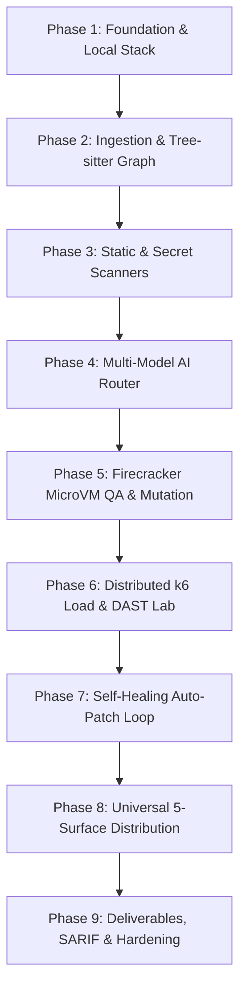

# Implementation Plan: Building CodeHound (ForgeGuard)

**Document:** implementation-plan.md  
**Status:** Ready for Execution  
**Target:** 9 Phased Milestones to Build the Autonomous AI DevSecOps & QA Platform  
**Date:** 2026-08-25  

---

## 1. Executive Summary & Core Decisions

CodeHound is an autonomous, repository-wide software verification, DevSecOps, and QA platform. It unifies multilingual AST code intelligence, deterministic security analyzers, 3-tier multi-model reasoning, hardware-isolated Firecracker microVM test execution, mutation testing, 50,000 VU k6 spike load testing, authorized DAST fuzzing, self-healing auto-patching, and universal distribution across Terminal CLI (Bubbletea TUI), Web Console, IDE LSP, Stateless MCP Server (2026 spec), and GitHub/GitLab Apps.

### Key Architecture Decisions:
1. **Core Language & Backend**: Control Plane and CLI are built in **Go 1.23+** for high concurrency and single-binary distribution. **Temporal** orchestrates durable multi-step workflows.
2. **Execution Sandboxing**: Default untrusted code execution uses **Linux KVM + Firecracker MicroVMs** with pre-warmed snapshot pools (<120ms boot). A local Docker-based simulation mode is provided for macOS/Windows development.
3. **AI Model Tiering**: Inference costs are managed via 3-Tier routing: Tier 1 (Gemini 2.5 Flash / GPT-4o-mini for fast triage) $\rightarrow$ Tier 2 (Claude 3.7 Sonnet / DeepSeek-R1 for dual logic & security reasoning) $\rightarrow$ Tier 3 (OpenAI o3 / Claude Opus for Arbiter conflict resolution).
4. **Target Authorization Gating**: Network-based DAST and 50k VU load testing strictly require cryptographic DNS TXT record or OIDC token challenges before probes fire.

---

## 2. Phased Implementation Roadmap

---

## 3. Detailed Milestone Breakdown

### Milestone 1: Platform Foundation & Local Stack
- Set up monorepo structure with Go workspace (`/core`, `/cli`, `/web`, `/workers`, `/sandbox`).
- Create `docker-compose.yml` for PostgreSQL 18, Qdrant, NATS JetStream, MinIO S3, and Temporal.
- Apply PostgreSQL 18 migrations implementing all 23 tables, ENUM types, Row Level Security (RLS) policies, and time-series partition tables ([04-Database-Schema.md](file:///home/tarun/Pictures/CodeHound/04-Database-Schema.md)).
- Build Go Control API gateway implementing REST endpoints and SSE real-time event streaming ([09-API-Reference-and-OpenAPI-Contracts.md](file:///home/tarun/Pictures/CodeHound/09-API-Reference-and-OpenAPI-Contracts.md)).

---

### Milestone 2: Repository Ingestion & Tree-sitter Code Intelligence Graph
- Build git ingestion adapters and S3 immutable snapshot archiver.
- Integrate multilingual **Tree-sitter** AST parsers (TypeScript/JavaScript, Python, Go, Rust, Java, C/C++).
- Extract functions, classes, interfaces, and API endpoints into `code_symbols`.
- Construct directional call graphs and interprocedural **Taint Analysis** (source-to-sink flow tracking for SQLi, Command Injection, and SSRF).
- Set up **DataStax Astra DB Serverless** hybrid code chunk vector + BM25 keyword metadata index.

---

### Milestone 3: Deterministic Static, Secret & SBOM Scanning Engine
- Implement **Semgrep** worker with custom OWASP Top 10 and CWE rules.
- Implement dual secret detection worker: **Gitleaks** for regex/entropy scans + **TruffleHog** for cryptographic API credential validity checking.
- Implement **Syft** SBOM worker generating CycloneDX & SPDX JSON; match against OSV vulnerability database and detect copyleft license conflicts (GPL/AGPL).
- Implement finding normalizer and cross-scanner deduplication engine.

---

### Milestone 4: 3-Tier Multi-Model Reasoning Core & Arbiter
- Build LiteLLM / multi-provider gateway with automatic failover, load balancing, and token cost tracking.
- Implement **Tier-1 Fast Triage Agent** (Gemini 2.5 Flash / GPT-4o-mini) to filter linter noise cheaply.
- Implement **Tier-2 Dual Specialized Reasoning Agents** (Claude 3.7 Sonnet / DeepSeek-R1): Agent A (Logic Bug Hunter) and Agent B (Security Analyst).
- Implement **Tier-3 Arbiter / Judge Agent** (OpenAI o3 / Claude Opus) to synthesize evidence, resolve analyzer conflicts, and assign calibrated confidence scores.
- Wrap all repository code in strict XML/JSON data boundaries and strip comment instruction delimiters to neutralize prompt injection.

---

### Milestone 5: Firecracker MicroVM Sandboxed QA & Mutation Testing
- Build Linux KVM Firecracker microVM lifecycle manager with jailer, cgroups v2, minimal seccomp filters, and zero-egress network namespaces.
- Build pre-warmed snapshot pool daemon maintaining sub-120ms boot times.
- Implement AI Test Synthesizer generating self-contained unit and integration tests (Jest, Pytest, Go testing, Cargo test).
- Integrate **AST Mutation Testing** (Stryker / Mutmut) requiring a **Mutation Score > 80%** before accepting generated tests as verified evidence.

---

### Milestone 6: Distributed k6 Load Profiler & DAST Security Lab
- Build API route discovery engine and AI k6 script synthesizer.
- Execute stepped surge schedules (1,000 $\rightarrow$ 10,000 $\rightarrow$ 50,000 VUs).
- Build automated Bottleneck Root Cause Classifier (N+1 queries, memory leak slopes, DB connection pool starvation).
- Integrate containerized OWASP ZAP & Nuclei dynamic fuzzers for BOLA/IDOR and auth bypasses.
- Implement Cryptographic Target Authorization (DNS TXT record challenge & OIDC tokens) and emergency abort circuit breakers.

---

### Milestone 7: Self-Healing Auto-Patch Verification Engine
- Build AI Patch Synthesizer generating minimal unified git diffs.
- Check out clean git worktree inside Firecracker microVM, apply diff via `git apply`, and re-run native test suites and mutation tests.
- Re-run security scans on patched code to verify zero regressions.
- Integrate with GitHub/GitLab APIs to open verified draft Pull Requests with attached evidence bundles.

---

### Milestone 8: Universal 5-Surface Distribution Channels
- Build Go CLI (`codehound-cli`) with Charmbracelet Bubbletea interactive TUI, `codehound scan`, `codehound check --diff`, and `codehound load`.
- Build SvelteKit Web Console with 2D/3D codebase call-graphs, live audit timeline streaming, and Grafana-grade load telemetry charts.
- Build Language Server Protocol (LSP) daemon for VS Code, JetBrains, and Cursor with CodeLens quick actions.
- Build Stateless Model Context Protocol (MCP 2026) Server.
- Build GitHub App webhook receiver, check run emitter, and `@codehound fix` bot.

---

### Milestone 9: Deliverables, Artifacts & Enterprise Hardening
- Compile master `AUDIT_REPORT.md`, `SECURITY_REPORT.md`, `TEST_REPORT.md`, and `PERFORMANCE_REPORT.md`.
- Export SARIF v2.1.0 JSON reports for GitHub Security tab integration.
- Export JUnit XML and CycloneDX / SPDX SBOMs.
- Execute microVM sandbox escape audit, prompt injection attack test corpus, and disaster recovery drills.

---

## 4. Verification Plan

### Automated Tests:
1. `go test ./core/pkg/db/...` — Verify PostgreSQL RLS policies, multi-tenant isolation, and partition routing.
2. `go test ./core/pkg/parser/...` — Test Tree-sitter AST extraction across TS, Python, Go, Rust, Java, and C/C++.
3. `go test ./sandbox/...` — Test Firecracker jailer isolation, memory snapshot restoration, and network egress blocks.
4. `go test ./workers/pkg/mutation/...` — Test mutation killing thresholds.

### Manual & E2E Verification:
1. **CLI Full Audit**: Run `codehound scan ./sample-repo` and confirm terminal TUI rendering, SSE streaming, and final `AUDIT_REPORT.md` output.
2. **MCP Tool Invocation**: Query `codehound_audit_repository` from Claude / Antigravity IDE and inspect the returned evidence graph.
3. **Self-Healing PR Scenario**: Introduce an intentional SQL injection bug, verify that the test generator writes a failing test, confirm the patch passes in the microVM, and verify that the draft PR is created.
