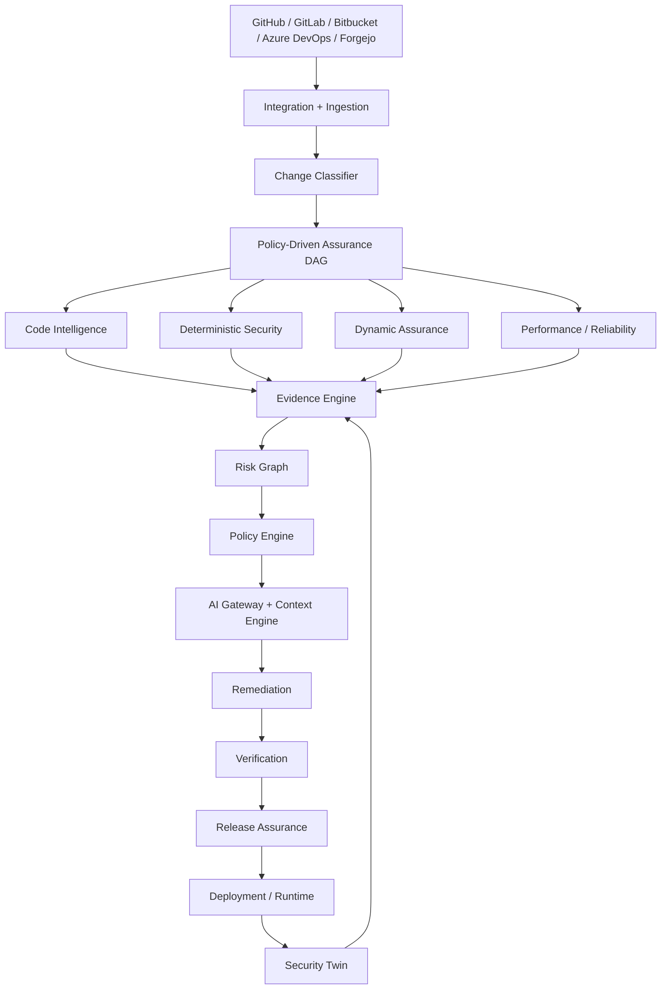
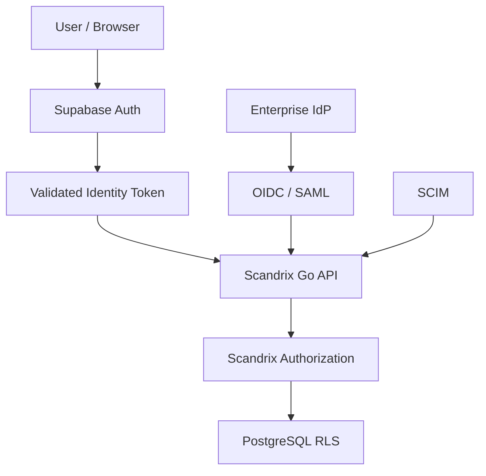
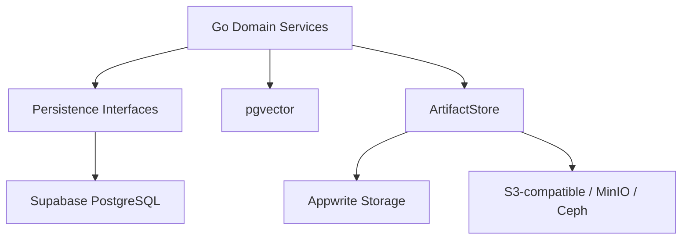
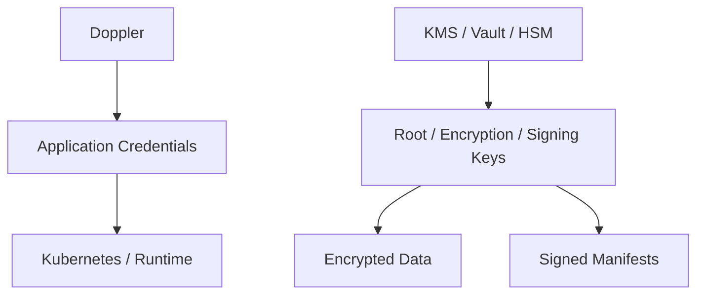
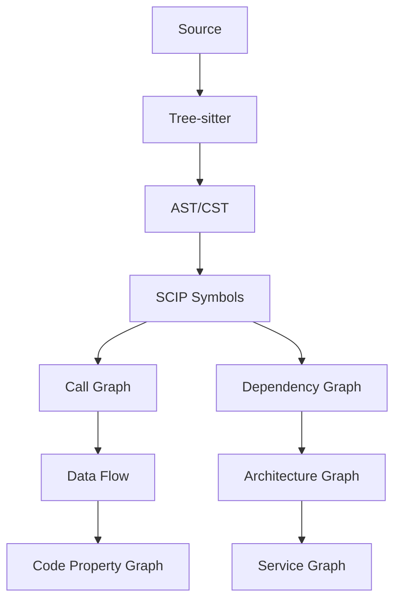
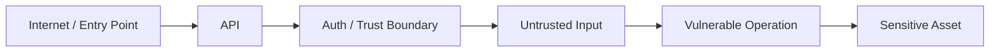
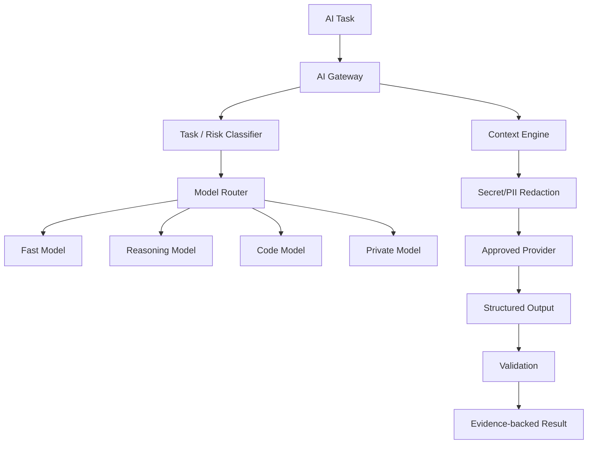
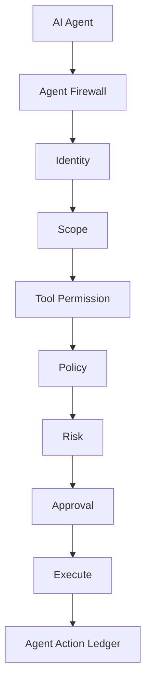
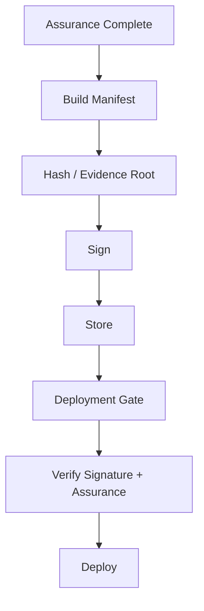
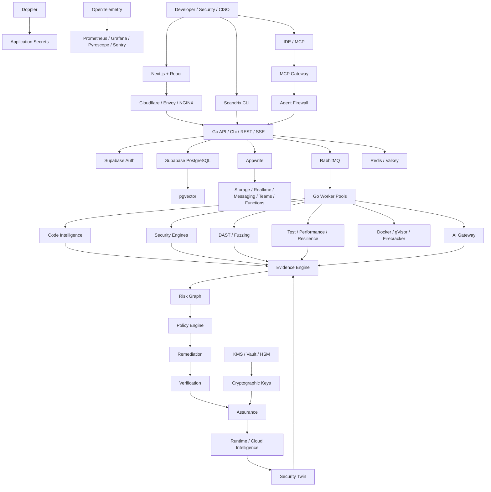

# Scandrix — Full Enterprise Technology Stack & Architecture

**Status:** Authoritative technology baseline
**Scope:** Product platform, core services, data, security, AI, agents, analysis engines, deployment, enterprise operations, and future evolution.

## 1. Executive architecture

Scandrix is a continuous software-assurance and software-risk intelligence platform. It connects source code, dependencies, builds, artifacts, containers, infrastructure, deployments, runtime exposure, business assets, policies, evidence, AI reasoning, remediation, and verification.



The central principle is:

> **Deterministic engines provide evidence. Code intelligence provides context. Policy defines acceptable behavior. The risk graph determines what matters. AI reasons and proposes action. Verification proves whether action worked. Assurance records what was established.**

---

# 2. Final stack at a glance

| Layer | Technology / Service | Role |
|---|---|---|
| Frontend | Next.js + React | Enterprise dashboard |
| UI | Radix UI + Tailwind CSS | Accessible design system |
| Client state | TanStack Query | Server-state/cache |
| Graph UI | React Flow | Code/Risk/Attack graph visualization |
| Backend | Go | Core Scandrix APIs/services/workers |
| HTTP | Chi | Routing + middleware |
| Streaming | SSE | PR/scan/AI/agent progress |
| Internal RPC | gRPC + Protobuf | Internal service communication |
| Database | **Supabase PostgreSQL** | Transactional source of truth |
| Vector | **pgvector** | Security Memory / semantic retrieval |
| Authentication | **Supabase Auth** | Canonical application identity |
| Enterprise SSO | OIDC + SAML 2.0 | Enterprise identity providers |
| Provisioning | SCIM 2.0 | User/group provisioning |
| Authorization | Go RBAC + ABAC + PostgreSQL RLS | Application + DB controls |
| Application platform | **Appwrite** | Storage, Realtime, Messaging, Teams, Functions, Webhooks, Sites, Avatars, Presence |
| Artifact storage | Appwrite Storage + `ArtifactStore` | Scan artifacts and files |
| Queue | RabbitMQ | Durable asynchronous execution |
| Cache | Redis / Valkey | Cache, locks, rate limiting |
| Secrets | **Doppler** | Application secrets/configuration |
| Crypto | KMS / Vault / HSM | Root encryption/signing keys |
| Signing | Ed25519 + Sigstore Cosign | Manifest/artifact signatures |
| Parser | Tree-sitter | Multi-language parsing |
| Symbol indexing | SCIP | Cross-file symbols/references |
| Code graph | CPG/custom graph | Calls, data-flow, dependency, architecture |
| SAST | Semgrep + ast-grep + Scandrix analyzers | Static security |
| SCA | OSV + Trivy | Dependency security |
| Secrets scanning | Gitleaks + TruffleHog | Secrets |
| IaC | Checkov + Trivy | Infrastructure security |
| Containers | Trivy + Hadolint | Image/Docker security |
| SBOM | CycloneDX + SPDX | Supply-chain inventory |
| VEX | OpenVEX | Vulnerability applicability |
| DAST | Scandrix DAST Engine | Authorized dynamic testing |
| Fuzzing | Native fuzzers + Scandrix orchestration | Dynamic robustness/security |
| Tests | Go/Jest/Vitest/PyTest/JUnit/Cargo | Multi-language validation |
| Performance | k6 / Vegeta / custom | Load/stress/soak |
| Sandbox | Docker + gVisor | Standard untrusted execution |
| Strong sandbox | Firecracker / KVM | High-isolation execution |
| AI Gateway | Scandrix | Model abstraction/governance |
| Model Registry | Scandrix | Model metadata/policies |
| Model Router | Scandrix | Task/risk/cost routing |
| Private AI | vLLM / Ollama / customer endpoint | On-prem/air-gapped AI |
| Agent Firewall | Scandrix | AI tool governance |
| MCP | Stdio + Streamable HTTP | Agent/IDE integration |
| Scheduler | Go scheduler + K8s CronJobs | Scheduled tasks |
| Workflow | Scandrix Workflow Engine | Multi-step automation |
| Email | Appwrite Messaging + provider adapters | Transactional mail |
| Notifications | Scandrix Notification Service | Email/Slack/Teams/PagerDuty/Webhooks |
| Billing | Stripe adapter | SaaS billing |
| Entitlements | Scandrix Entitlement Service | Plan/feature enforcement |
| Search | PostgreSQL FTS → OpenSearch | Global search |
| Analytics | PostgreSQL → ClickHouse | Security/product analytics |
| Observability | OpenTelemetry | Vendor-neutral telemetry |
| Metrics | Prometheus | Metrics |
| Dashboards | Grafana | Operations |
| Error tracking | Sentry | Application diagnostics |
| Profiling | Grafana Pyroscope | Continuous profiling |
| Edge | Cloudflare / Envoy / NGINX | WAF/TLS/routing |
| Kubernetes | Kubernetes | Deployment |
| Autoscaling | KEDA | Queue-based worker scaling |
| Admission | Kyverno / OPA Gatekeeper | Deployment assurance |
| Registry | Harbor / GHCR / ECR / GCR / ACR | Container images |
| PKI | cert-manager / Vault PKI / customer PKI | TLS/mTLS |
| CI/CD | GitHub Actions / GitLab CI / Jenkins / Azure Pipelines | Delivery |
| DR | WAL-G + object replication + backups | Disaster recovery |

---

# 3. Architecture ownership boundaries

## Supabase owns

- Authentication
- PostgreSQL
- pgvector
- managed database infrastructure
- database backups/operations supplied by the chosen Supabase plan

Supabase uses PostgreSQL as its core database and integrates Auth with Postgres; Auth information lives in a dedicated schema and can be connected to application tables. citeturn970806search0turn970806search8turn970806search11

## Appwrite owns

- Storage
- Realtime
- Messaging
- Teams
- Functions
- Webhooks/events
- Sites
- Avatars
- Presence

Appwrite currently exposes Auth, Databases, Functions, Sites, Messaging, Storage, Avatars, Realtime and APIs; in this architecture Auth/DB are not the canonical identity/database services because those roles belong to Supabase. citeturn970806search2turn970806search14

## Doppler owns

- application secrets
- environment configuration
- secret distribution
- secret synchronization

Doppler provides a Kubernetes Secrets Operator that synchronizes secrets into Kubernetes and can reload deployments after changes. citeturn970806search1turn970806search10

## KMS / Vault / HSM owns

- customer-controlled root keys
- encryption key material
- signing keys where policy requires
- enterprise cryptographic trust

## Scandrix owns

- Code Intelligence
- Security Twin
- Evidence Engine
- Risk Graph
- Attack Path Engine
- Policy Engine
- Security Memory
- AI Gateway
- Agent Firewall
- SAST/SCA/DAST orchestration
- Testing
- Performance Assurance
- Remediation
- Verification
- Release Assurance
- Service/Release Passports

---

# 4. Core backend

## Go

Go is the primary implementation language for:

- APIs
- domain services
- job workers
- orchestration
- CLI
- scanner adapters
- evidence processing
- risk calculations
- policy evaluation
- AI gateway
- agent governance

Use a toolchain policy such as:

```text
Current stable Go release + N-1
Production = latest validated patch
CI = Current + N-1
```

Do not make performance claims such as “zero GC pauses”; define measurable service SLOs instead.

## HTTP middleware

Recommended order:

```text
Edge/WAF
→ request ID
→ authentication
→ tenant resolution
→ rate limit
→ input validation
→ authorization
→ tracing
→ handler
```

## gRPC

Use gRPC only where internal service boundaries justify it:

- scanner services
- sandbox control
- AI gateway
- internal worker daemons
- platform control channels

---

# 5. Authentication and enterprise identity



Supabase Auth becomes the canonical application authentication system. Enterprise customers can connect identity providers through OIDC/SAML as supported by the selected Supabase/auth configuration.

Scandrix must normalize external identities into its own principal model:

```text
Principal
 ├── user_id
 ├── organization_id
 ├── memberships
 ├── roles
 ├── attributes
 └── source_identity
```

Never trust a browser-supplied tenant ID as an authorization source.

Use:

```text
Supabase session/JWT
→ server-side validation
→ organization membership lookup
→ RBAC/ABAC
→ PostgreSQL RLS
```

RLS is a defense-in-depth layer, not a replacement for business authorization.

---

# 6. Appwrite platform layer

Appwrite is used as the application-services platform.

## Storage

Use for:

- reports
- SBOM files
- evidence exports
- test logs
- coverage artifacts
- DAST evidence
- assurance manifests
- non-critical application files

## Realtime

Use for UI synchronization:

- dashboard updates
- finding lifecycle updates
- collaboration
- notifications

Scandrix SSE remains the preferred stream for long-running job progress. Appwrite Realtime uses authenticated subscriptions and permissions. citeturn970806search3

## Messaging

Use for:

- transactional email
- critical alerts
- approval requests
- weekly digests
- optional SMS/push

Appwrite documents Messaging for email, SMS and push. citeturn970806search2

## Teams

Use Appwrite Teams where useful for collaboration, while keeping Scandrix's canonical team/business model in PostgreSQL.

## Functions

Use only for lightweight event-driven work. Heavy scanning remains on Scandrix workers.

## Webhooks

Use with signature verification, replay protection and idempotency.

---

# 7. Persistence architecture



## Canonical relational objects

- organization
- user profile
- team
- repository
- service
- environment
- asset
- commit
- pull request
- scan
- review
- finding
- evidence
- rule
- policy
- exception
- fix
- verification
- release
- assurance manifest
- incident
- workflow
- agent
- agent action
- model
- integration
- audit event

## PostgreSQL use

Use relational integrity for:

- tenant ownership
- finding relationships
- state transitions
- policy hierarchy
- approvals
- audit metadata
- billing/entitlement metadata

## pgvector

Use for:

- semantic finding similarity
- Security Memory
- documentation retrieval
- rule/example similarity
- code/context retrieval

Embedding dimension must be selected by the embedding model and configuration rather than hardcoded into the architecture.

---

# 8. Cache architecture

Redis/Valkey is for transient data:

- rate limiting
- locks
- hot context
- provider health
- short-lived cache
- coordination state

Do not store the canonical security record in Redis.

---

# 9. Queue architecture

RabbitMQ is the durable internal job/event transport.

Queues:

```text
review
index
sast
sca
secrets
iac
container
sbom
dast
test
fuzz
performance
ai
remediation
verification
notification
report
```

Every task has:

```text
job_id
idempotency_key
tenant_id
resource_id
priority
attempt
deadline
trace_id
```

Use quorum queues, bounded retries and DLQs as appropriate.

---

# 10. Scheduler and workflow

## Scheduler

Use Go scheduling and Kubernetes CronJobs for:

- nightly deep scans
- CVE re-evaluation
- dependency refresh
- SLA checks
- report generation
- graph reconciliation
- Security Memory maintenance

## Workflow engine

Separate workflow semantics from queues.

Example:

```text
Critical Finding
→ Assign Owner
→ Create Jira
→ Notify Security
→ Start SLA
→ Await Fix
→ Verify
→ Close
```

For very complex durable workflows, keep the architecture open to a dedicated workflow engine later.

---

# 11. Secrets and cryptography



Doppler is the recommended application secret/configuration system. Its Kubernetes integration can sync secrets into Kubernetes. Kubernetes secret encryption at rest should also be enabled in high-security deployments. citeturn970806search1turn970806search15

Use KMS/Vault/HSM separately for cryptographic trust.

Recommended cryptography:

- AES-256-GCM or ChaCha20-Poly1305 for appropriate symmetric encryption
- Ed25519 for signatures where appropriate
- Cosign/Sigstore for signed artifacts
- SHA-256 for content addressing/hashing
- Merkle trees for tamper-evident evidence structures

True immutability requires immutable/WORM storage or an external trust anchor; hashing alone is not enough.

---

# 12. Code intelligence



Capabilities:

- AST/CST parsing
- symbol resolution
- cross-file references
- call graph
- data-flow
- dependency graph
- API graph
- architecture graph
- ownership graph
- monorepo graph
- change blast radius

Never rely on a huge LLM context window as a replacement for structural code analysis.

---

# 13. Security Twin

The Security Twin is a living model of the software estate:

```text
Repository
→ Code
→ Dependency
→ Build
→ Artifact
→ Container
→ Infrastructure
→ Deployment
→ Runtime
→ Business Asset
```

Every important fact should include:

```text
source
observed_at
confidence
freshness
status
```

Possible fact states:

```text
DECLARED
OBSERVED
INFERRED
STALE
CONFLICT
```

The reconciliation model should preserve conflicts rather than silently overwriting data.

---

# 14. Code-to-Cloud graph

Nodes:

```text
Repository
Commit
PR
File
Symbol
Function
Service
Package
Container
Image
Infrastructure
Kubernetes Workload
Cloud Resource
Environment
API
Database
Owner
Business Unit
Business Asset
```

Edges:

```text
CHANGES
CALLS
IMPORTS
DEPENDS_ON
BUILDS
PACKAGES
DEPLOYS_AS
RUNS_ON
EXPOSED_BY
OWNS
READS
WRITES
AUTHENTICATES
AUTHORIZES
```

This enables questions such as:

> Which production internet-facing services are affected by a reachable vulnerable dependency?

---

# 15. Deterministic security engines

## SAST

- Semgrep
- ast-grep
- Scandrix analyzers
- pattern rules
- AST rules
- taint analysis
- interprocedural analysis

## SCA

- OSV
- Trivy
- lockfile analysis
- direct/transitive dependency graph
- reachability
- license governance
- upgrade recommendations

## Secrets

- Gitleaks for fast detection
- TruffleHog for deeper candidate analysis/authorized validation
- Scandrix provider-specific detectors

## IaC

- Checkov
- Trivy
- Terraform/OpenTofu
- Kubernetes
- Helm
- CloudFormation
- Dockerfiles
- Pulumi

## Containers

- Trivy
- Hadolint
- image configuration
- privilege/capability checks
- OS/application dependency analysis

## Supply chain

- CycloneDX
- SPDX
- OpenVEX
- provenance
- package integrity
- SBOM diff

---

# 16. Evidence Engine

Evidence types:

```text
Static
Graph
Dependency
Dynamic
Runtime
Policy
Historical
Human
AI
```

Every finding gets an evidence packet containing, where available:

- tool
- rule
- exact location
- source artifact
- dataflow
- dependency chain
- runtime exposure
- reproduction
- policy
- verification

AI agreement is never a substitute for evidence.

---

# 17. Proof of Risk

Evidence maturity:

```text
L0 Pattern
L1 Static Evidence
L2 Reachability Confirmed
L3 Dynamic Reproduction
L4 End-to-End Reproduction
```

Expose uncertainty rather than forcing a yes/no result.

Possible finding states:

```text
OBSERVED
SUSPECTED
CONFIRMED
REPRODUCED
VERIFIED
UNKNOWN
```

---

# 18. Risk Graph

Risk should incorporate:

- severity
- confidence
- exploitability
- reachability
- exposure
- business criticality
- data sensitivity
- blast radius
- environment
- threat context
- compensating controls
- remediation availability

Do not hardcode universal multipliers as truth. Use calibrated/configurable scoring.

Maintain separate posture scores where useful:

```text
Security
Reliability
Architecture
Supply Chain
Performance
Compliance
```

---

# 19. Attack Path Engine



Rank paths using:

- reachability
- exposure
- privilege requirements
- asset criticality
- impact
- evidence strength

---

# 20. Authorization Graph

Model:

```text
Principal
→ Role
→ Permission
→ Middleware Guard
→ Endpoint
→ Business Operation
→ Resource / Tenant
```

Look for:

- BOLA
- BFLA
- privilege escalation
- missing tenant checks
- authorization bypass

---

# 21. Sensitive Data Intelligence

Classify data such as:

```text
Credentials
Authentication Data
Financial Data
PII
Health Data
Confidential Business Data
```

Track flows across:

```text
API
→ Service
→ Database
→ Cache
→ Queue
→ Logs
→ Third Party
```

Do not encode legal statements such as “consent is always required” into technical architecture. Customer legal/privacy policies determine applicable obligations.

---

# 22. Multi-tenant security

Analyze tenant isolation across:

- API
- services
- database
- cache
- queues
- storage
- search
- AI context

Detect:

```text
Missing tenant filter
Missing tenant authorization
Missing tenant cache key
Cross-tenant data flow
```

---

# 23. API intelligence

Support:

- REST
- OpenAPI
- GraphQL
- gRPC
- protobuf

Analyze:

- authentication
- authorization
- input validation
- rate limiting
- schema changes
- breaking changes
- sensitive output
- endpoint exposure

---

# 24. Change Intelligence

Every change gets structured information:

```text
change type
security boundary changes
API changes
architecture changes
dependency changes
infrastructure changes
sensitive-data changes
blast radius
affected services
business criticality
```

The classifier can identify:

```text
Documentation
Refactor
Bug Fix
Security Sensitive
Authentication
Authorization
API
Database
Dependency
Infrastructure
Sensitive Data
Performance
Production Configuration
```

---

# 25. Policy-driven Assurance DAG

Scandrix must not perform expensive analysis blindly on every PR.

## Fast PR

```text
Diff
→ Secrets
→ Lightweight SAST
→ Context
→ AI Review
→ Policy
```

## Standard

```text
Static Engines
→ Evidence Correlation
→ AI
→ Risk
→ Policy
```

## Deep Security

```text
Static
→ Authorization Graph
→ Data Flow
→ Reachability
→ Targeted DAST
→ Attack Path
→ Verification
```

## Pre-Release

```text
Full Security
→ DAST
→ SBOM Diff
→ Tests
→ Performance
→ Assurance
```

## Performance

```text
Baseline
→ Load
→ Stress
→ Spike
→ Soak
→ Regression
```

## Scheduled Deep Scan

```text
Full Graph
→ Full Dependency Analysis
→ Systemic Root Cause
→ Risk Re-index
```

---

# 26. Analysis status semantics

Every stage returns exactly one of:

| Status | Meaning |
|---|---|
| `PASS` | Completed with no blocking result |
| `PASS_WITH_WARNINGS` | Completed with non-blocking issues |
| `FAIL` | Completed and found blocking issues |
| `PARTIAL_ANALYSIS` | Ran incompletely |
| `NOT_TESTED` | Intentionally skipped |
| `ERROR` | Failed operationally |

`NOT_TESTED` is never equivalent to `PASS`.

---

# 27. Autonomous testing

Support:

- unit-test generation
- integration-test generation
- property testing
- fuzzing
- API contract tests
- authorization tests
- security regression tests
- mutation testing

All generated code executes in isolated environments.

---

# 28. Sandbox architecture

```text
Repository
→ Ephemeral Worker
→ Sandbox
→ Test / Scan / Build
→ Artifact
→ Destroy
```

Standard sandbox:

```text
Docker + gVisor
```

High-isolation sandbox:

```text
Firecracker / KVM
```

Controls:

- no production credentials
- resource limits
- network policy
- filesystem restrictions
- execution timeout
- ephemeral lifecycle
- automatic cleanup

---

# 29. DAST

DAST is policy-controlled and requires:

```text
Explicit authorization
Approved target
Approved environment
Domain allowlist
Rate limits
Credential policy
Abort conditions
```

Profiles:

```text
Passive
Safe Active
Authenticated
Deep Security
```

Never treat “DAST not executed” as “DAST passed.”

---

# 30. Performance and resilience

Performance profiles:

```text
Smoke
Baseline
Load
Stress
Spike
Soak
Recovery
Capacity
```

Measure:

- throughput
- RPS
- p50/p90/p95/p99
- errors
- saturation
- CPU
- memory
- DB latency
- cache behavior

Use performance tests primarily in Performance and Pre-Release profiles unless policy explicitly triggers targeted tests.

Resilience checks can cover:

- timeout handling
- retries/backoff
- circuit breakers
- idempotency
- dependency outage
- queue delay
- database latency

---

# 31. AI architecture



The architecture must be model-agnostic.

Do not hardcode specific model versions in the master architecture. Store them in a model registry/configuration.

Model classes:

- fast classifier
- general coding model
- long-context model
- reasoning model
- security reasoning model
- embedding model
- private/local model

---

# 32. AI model routing

Example:

```text
Low complexity
→ fast model

Medium complexity
→ strong single model

High complexity
→ multiple models / stronger reasoning

Critical security
→ model ensemble + deterministic evidence + optional reproduction
```

Multiple models are a confidence signal, not proof.

---

# 33. AI governance

Enterprise controls:

- approved providers
- approved models
- regional restrictions
- BYOK
- private endpoints
- local inference
- prompt retention policy
- response retention policy
- external network restrictions
- cost limits

---

# 34. AI data firewall

```text
Code / Finding / Docs
→ Classification
→ Secret Detection
→ PII Redaction
→ Tenant Validation
→ Provider Policy
→ Approved Model
```

Treat repository instructions, comments and source text as untrusted content.

---

# 35. Agent Firewall



Tool danger classes:

```text
Read-only
Analysis
Active Security
Mutating
Production-impacting
```

Higher-risk tools require stronger authentication, authorization and human approval.

---

# 36. MCP

Support:

- Stdio for local IDEs
- Streamable HTTP for remote/enterprise agent gateways

All MCP requests go through the Agent Firewall.

MCP tool permissions must be tenant-scoped and audited.

---

# 37. Agent Action Ledger

Record:

```text
agent
user
organization
repository
tool
scope
policy
approval
result
timestamp
trace_id
```

Never store raw secrets in the ledger.

---

# 38. Security Memory

Security Memory contains:

- accepted findings
- false positives
- rejected findings
- exceptions
- architecture decisions
- remediation patterns
- repository conventions
- recurring vulnerabilities

Hierarchy:

```text
Global
→ Organization
→ Business Unit
→ Team
→ Repository
→ Service
```

Security precedence:

```text
Policy > Security Memory > Developer Preference
```

---

# 39. Remediation

```text
Finding
→ Context Retrieval
→ Patch Generation
→ Sandbox
→ Build
→ Tests
→ Security Rescan
→ Regression
→ Verification
```

Fix states:

```text
CANDIDATE
PARTIALLY_VERIFIED
VERIFIED
FAILED
UNKNOWN
```

---

# 40. Regression Shield

A verified fix can generate:

- regression test
- static rule
- security guard
- policy assertion

If the defect returns:

```text
REGRESSION DETECTED
```

---

# 41. Service Passport

Every service should have:

```text
Owner
Criticality
Repositories
Dependencies
APIs
Data classes
Environments
Deployments
Security posture
Reliability posture
Performance posture
Policies
Open risks
Assurance level
```

---

# 42. Release Passport

Every release should capture:

```text
Commit
Build
Artifact
SBOM
Security
Tests
Performance
Policy
Approvals
Risk
Assurance Level
```

---

# 43. Assurance Manifest

A machine-readable artifact containing:

```text
commit
release
scan IDs
tool versions
rule versions
policy snapshot
evidence IDs
finding state
verification state
approvals
assurance level
signature
```

Lifecycle:



---

# 44. Assurance levels

```text
L0 Observed
L1 Reviewed
L2 Security Reviewed
L3 Deeply Assured
L4 Production Assured
```

Each level must have explicit evidence requirements.

---

# 45. Runtime and cloud intelligence

Adapters:

- AWS
- GCP
- Azure
- Kubernetes
- service catalog
- cloud inventory

Connect:

```text
Code
→ Artifact
→ Container
→ Deployment
→ Runtime Asset
→ Exposure
→ Business Asset
```

This allows risk to reflect actual deployment state.

---

# 46. Incident intelligence

First-class objects:

```text
Incident
→ Findings
→ Services
→ Releases
→ Assets
→ Timeline
→ Root Cause
→ Remediation
→ Verification
```

Support incident locking, forensic preservation and security approvals.

---

# 47. Emergency Security Lockdown

Supported controls:

```text
BLOCK_PRODUCTION_MERGES
REQUIRE_SECURITY_APPROVAL
DISABLE_EXTERNAL_AI
ENABLE_DEEP_SECURITY
PRESERVE_FORENSIC_ARTIFACTS
INCREASE_SCAN_FREQUENCY
```

Every activation/deactivation is audited.

---

# 48. Notification architecture

```text
Event
→ Notification Service
→ Channel Adapter
```

Channels:

- Appwrite Messaging
- Email provider
- Slack
- Teams
- PagerDuty
- Webhook
- in-app
- optional SMS/push

Appwrite Messaging can cover email/SMS/push, while the Scandrix service remains provider-neutral. citeturn970806search2

---

# 49. Billing and entitlement

Separate:

```text
Billing
→ Usage Metering
→ Entitlement
→ Feature Flag
```

Meter:

- users
- repositories
- scans
- AI usage
- sandbox minutes
- DAST
- performance jobs
- storage

---

# 50. Search and analytics

Start with PostgreSQL for moderate workloads.

Search evolution:

```text
PostgreSQL FTS / GIN / trigram
→ OpenSearch when justified
```

Analytics evolution:

```text
PostgreSQL
→ ClickHouse when analytical workload justifies it
```

Do not introduce a second database solely because it is fashionable.

---

# 51. API architecture

Public API domains:

```text
/auth
/organizations
/users
/teams
/repositories
/services
/environments
/scans
/reviews
/findings
/evidence
/risk
/policies
/rules
/exceptions
/fixes
/verification
/releases
/assurance
/models
/integrations
/agents
/workflows
/incidents
/audit
/reports
```

API requirements:

- versioning
- pagination
- filtering
- authorization
- idempotency
- rate limits
- structured errors
- auditability

---

# 52. Webhook architecture

All inbound webhooks should support:

- authenticity verification
- replay protection
- schema validation
- idempotency
- retry
- DLQ
- tenant resolution

---

# 53. Data retention

Configure retention separately for:

```text
source snapshots
artifacts
findings
audit logs
AI traces
test logs
telemetry
```

Data classification:

```text
PUBLIC
INTERNAL
CONFIDENTIAL
RESTRICTED
SECRET
```

---

# 54. Multi-tenant isolation

Tenant isolation exists at:

```text
API
Service layer
PostgreSQL/RLS
Object storage
Search
Queue metadata
AI context
Sandbox
Logs/telemetry
```

Never depend on only one layer.

---

# 55. Sandbox threat model

Repository code is hostile by default.

Defenses:

- ephemeral execution
- non-root users
- dropped capabilities
- read-only roots
- controlled network
- CPU/memory/process limits
- no ambient credentials
- timeouts
- artifact sanitization

---

# 56. Secure AI/agent threat model

Threats:

- indirect prompt injection
- malicious repository instructions
- tool poisoning
- unsafe generated patches
- credential leakage
- unauthorized merge/deploy
- tenant crossover

Control stack:

```text
Input Classification
→ Policy
→ Scope
→ Tool Permission
→ Model
→ Output Validation
→ Human Approval
→ Audit
```

---

# 57. Infrastructure

## Kubernetes

Deploy:

```text
API
Workers
Scanners
AI Gateway
Scheduler
Notification
Reporting
```

## KEDA

Scale workers based on:

- RabbitMQ queue depth
- processing latency
- resource utilization

## Admission

Use Kyverno or OPA Gatekeeper for:

- image policies
- assurance manifest verification
- environment restrictions
- deployment gates

---

# 58. Deployment modes

## Managed SaaS

Scandrix-managed control/data plane.

## Dedicated SaaS

Dedicated tenant infrastructure.

## Private VPC

Customer-network deployment.

## Self-hosted

Customer-operated Kubernetes.

## On-prem

Customer infrastructure.

## Air-gapped

No external dependency for core functions; local AI and registries supported.

---

# 59. Enterprise data-plane abstraction

The architecture must support swapping:

```text
Supabase Postgres
↔ customer PostgreSQL

Appwrite Storage
↔ S3/MinIO/Ceph

Supabase Auth
↔ enterprise identity implementation

Doppler
↔ customer secret-management system where required

Managed AI
↔ private AI
```

The domain contracts stay stable.

---

# 60. Observability

Use:

```text
OpenTelemetry
Prometheus
Grafana
Pyroscope
Sentry
```

Track:

- API latency
- worker latency
- queue latency
- scanner duration
- AI latency
- sandbox utilization
- error rates
- job failure
- partial-analysis frequency

Self-hosted and air-gapped deployments must be able to run without mandatory external telemetry.

---

# 61. Disaster recovery

Use:

- PostgreSQL backups
- WAL-G
- object-store replication
- configuration backups
- tested restore process

Define measurable:

```text
RPO
RTO
Backup retention
Restore test schedule
```

Never claim an RPO/RTO until the architecture has been tested against that target.

---

# 62. Capacity model

Infrastructure sizing should be based on:

```text
repositories
PR/day
average diff size
full scans/day
AI tasks/day
sandbox minutes
DAST runs/day
performance runs/day
artifact GB/day
retention
```

Keep separate cost buckets:

```text
Fixed infrastructure
Variable analysis compute
AI/model spend
```

---

# 63. CI/CD and SCM

SCM:

- GitHub
- GitLab
- Bitbucket
- Azure DevOps
- Forgejo

CI/CD:

- GitHub Actions
- GitLab CI
- Jenkins
- Azure Pipelines
- CircleCI
- Buildkite
- generic CLI

All platforms should use one canonical Scandrix finding identity.

---

# 64. CLI

Commands:

```bash
scandrix login
scandrix scan .
scandrix review --pr 123
scandrix policy check
scandrix sbom generate
scandrix fix FINDING_ID
scandrix assurance verify
scandrix diagnostics
```

---

# 65. Developer experience

Developer surfaces:

- GitHub/GitLab review
- CLI
- IDE integration
- MCP
- web dashboard

Every finding should expose:

```text
What happened?
Why does it matter?
Where is the evidence?
What is affected?
How do I fix it?
Was the fix verified?
```

---

# 66. Executive / CISO experience

Provide:

- overall software posture
- critical risks
- security trends
- MTTR
- SLA breaches
- exposed production risks
- supply-chain posture
- compliance evidence
- assurance levels

Avoid individual developer scoring.

---

# 67. Compliance architecture

Use evidence-driven controls.

Framework mappings may include:

- SOC 2
- ISO 27001
- PCI-oriented controls
- NIST mappings
- GDPR/privacy controls
- customer-specific frameworks

Do not claim certification before certification exists.

---

# 68. License and open-source strategy

Potential model:

```text
Community
→ AGPLv3

Commercial Enterprise
→ Enterprise license
```

Potential enterprise features:

- SSO/SCIM
- advanced governance
- dedicated deployments
- private AI
- air-gapped deployment
- advanced compliance
- fleet/risk management

Legal review is required before launch.

---

# 69. Architecture Decision Records

Maintain ADRs for:

```text
Database
Authentication
Queue
Storage
Sandbox
Code Graph
AI Gateway
Risk Graph
Policy Engine
Agent Firewall
Deployment
Observability
Secrets
```

ADR format:

```text
Context
Decision
Alternatives
Tradeoffs
Security impact
Operational impact
Revisit conditions
```

---

# 70. Testing Scandrix itself

Scandrix must continuously test its own:

- API
- authentication
- tenant isolation
- RBAC/ABAC
- policy engine
- scanner infrastructure
- sandbox
- MCP
- AI gateway
- agent firewall
- artifact storage
- release signing

Use a golden corpus of intentionally vulnerable/complex repositories.

---

# 71. AI evaluation

Measure:

- precision
- recall
- false positives
- false negatives
- severity accuracy
- context relevance
- fix success rate
- regression rate
- verification success

Numeric values are targets until validated; never document target numbers as achieved performance.

---

# 72. Release quality gate

A Scandrix release itself should pass:

```text
Build
→ Unit Tests
→ Integration Tests
→ SAST
→ SCA
→ Secrets
→ Container Security
→ SBOM
→ Security Tests
→ Regression Corpus
→ Performance
→ Assurance Manifest
```

Scandrix should dogfood its own platform.

---

# 73. Systemic Root Cause Engine

When the same issue appears across multiple repositories:

```text
Repeated Pattern
→ Cross-Repository Correlation
→ Root Cause
→ Organization Rule
→ Shared Remediation
→ Regression Guard
```

This moves Scandrix from individual bug detection to organization-wide prevention.

---

# 74. Fix Once, Prevent Everywhere

Example:

```text
Unsafe pattern detected in 20 repositories
→ create secure replacement
→ generate policy
→ create migration guidance
→ track adoption
→ enforce regression guard
```

---

# 75. Final reference architecture



---

# 76. Final technology philosophy

## Use managed services for commodity capabilities

Examples:

- Supabase PostgreSQL/Auth
- Appwrite Storage/Realtime/Messaging
- Doppler

## Own the Scandrix intelligence

Examples:

- Code Graph
- Security Twin
- Evidence Engine
- Risk Graph
- Policy Engine
- AI Gateway
- Agent Firewall
- Remediation
- Assurance

## Isolate dangerous workloads

Use dedicated sandbox infrastructure.

## Keep expensive analysis policy-triggered

DAST, large load tests and deep assurance are conditional.

## Keep providers replaceable

Use adapters for:

- database
- identity
- storage
- secrets
- KMS
- AI
- queue
- notifications
- sandbox

---

# 77. Final architecture decision

The final baseline is:

```text
SUPABASE
├── Auth
├── PostgreSQL
└── pgvector

APPWRITE
├── Storage
├── Realtime
├── Messaging
├── Teams
├── Functions
├── Webhooks
├── Sites
├── Avatars
└── Presence

DOPPLER
└── Application Secrets / Configuration

KMS / VAULT / HSM
└── Cryptographic Root / Encryption / Signing Keys

SCANDRIX GO
├── API
├── Workers
├── Code Intelligence
├── Security Twin
├── Evidence
├── Risk Graph
├── Attack Paths
├── Policy
├── Security Memory
├── AI Gateway
├── Agent Firewall
├── DAST
├── Testing
├── Performance
├── Remediation
├── Verification
├── Assurance
├── Runtime Intelligence
└── Incident Intelligence

INFRASTRUCTURE
├── RabbitMQ
├── Redis / Valkey
├── Docker / gVisor
├── Firecracker / KVM
├── Kubernetes
├── KEDA
├── Kyverno / OPA
├── OpenTelemetry
├── Prometheus
├── Grafana
└── Cosign
```

This is the recommended authoritative technology baseline for Scandrix.
