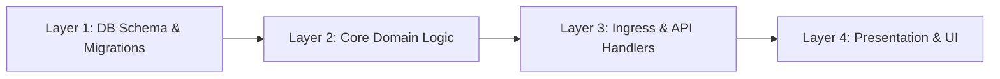
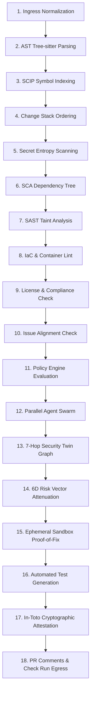
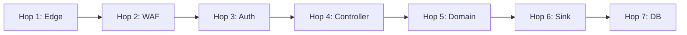
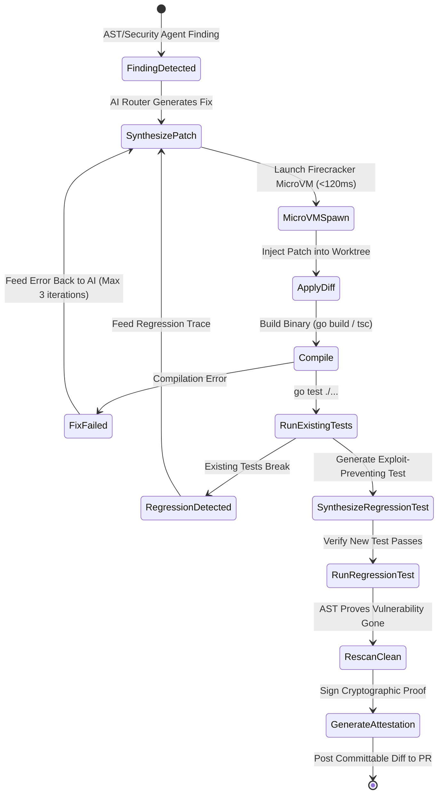
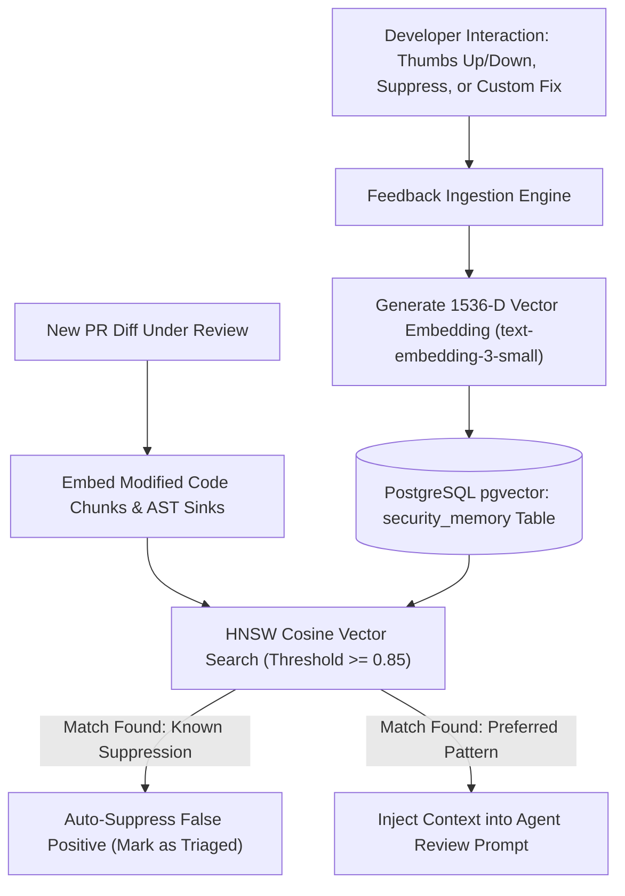
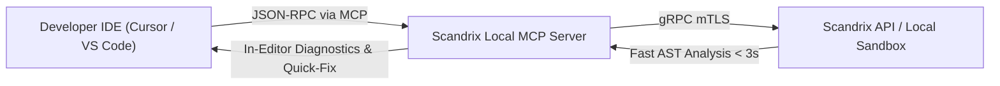

# Scandrix — Detailed Feature Specifications

**Classification:** NORMATIVE TECHNICAL SPECIFICATION  
**Status:** APPROVED FOR IMPLEMENTATION  
**Version:** 3.0.0  
**Target Platform:** Scandrix Enterprise Core (Go 1.24+ / Next.js 15)

---

## 1. Feature Spectrum Overview

```mermaid
flowchart TD
    FS1["1. Multi-Agent Investigative Review"] --> FS_CORE["Scandrix Unified Core"]
    FS2["2. Change Stack & Auto Sequence Diagrams"] --> FS_CORE
    FS3["3. Interactive @scandrix Bot Commands"] --> FS_CORE
    FS4["4. Issue Alignment & Verification Engine"] --> FS_CORE
    FS5["5. 18-Stage Continuous Assurance DAG"] --> FS_CORE
    FS6["6. 6D Continuous Risk Vector Engine"] --> FS_CORE
    FS7["7. 7-Hop Code-to-Cloud Security Twin"] --> FS_CORE
    FS8["8. Closed-Loop Sandboxed Proof-of-Fix"] --> FS_CORE
    FS9["9. Policy Engine & What-If Simulator"] --> FS_CORE
    FS10["10. In-Toto / SLSA Cryptographic Assurance"] --> FS_CORE
```



---

## 2. Feature Spec 1: Multi-Agent Investigative Review (Kodus + Scandrix)

### 2.1 Capability & Purpose
Replaces single-shot LLM prompts with a coordinated swarm of four specialized domain agents that proactively investigate code changes using sandboxed tools.

### 2.2 Sub-Components
1. **Agent Review Orchestrator**: Receives parsed diffs, repository context, and active policies; assigns investigation scopes.
2. **Bug & Logic Agent**: Investigates edge cases, off-by-one errors, nil-pointer dereferences, unhandled errors, and goroutine races.
3. **Security Agent**: Traces untrusted user inputs to dangerous execution/storage sinks (SQL injection, XSS, SSRF, command injection, path traversal).
4. **Performance Agent**: Detects database N+1 query patterns, unbuffered channel deadlocks, excessive heap allocations, and lock contention.
5. **Architecture & Compliance Agent**: Enforces clean domain boundaries, prevents circular package imports, checks license compatibility, and identifies public API breaking changes.

### 2.3 Sandboxed Tool Execution Interface
Agents interact with the repository through isolated tools executing within a gVisor user-space sandbox:
- `readFile(path, startLine, endLine)`: Retrieves exact file slices.
- `grep(regex, pathPattern)`: Searches codebase for references and declarations.
- `astGrep(pattern, language)`: Performs structural Tree-sitter AST queries.
- `queryCodeGraph(symbol, direction)`: Queries callers, callees, and taint paths from the Code Property Graph.
- `shell(command)`: Executes linters (`go vet`, `golangci-lint`, `eslint`) in a read-only environment.

### 2.4 Data Contract
```json
{
  "finding_id": "find_01HXYZ789",
  "agent": "BUG_LOGIC",
  "rule_id": "GO-CONC-004",
  "file": "internal/services/payment.go",
  "line_range": [42, 48],
  "severity": "CRITICAL",
  "evidence": {
    "ast_node": "go_statement",
    "variable": "tx",
    "taint_path": ["r.Body", "decodeJSON", "processTx"],
    "merkle_root": "e3b0c44298fc1c149afbf4c8996fb92427ae41e4649b934ca495991b7852b855"
  },
  "recommendation": "Pass tx pointer via closure parameter or synchronize with sync.WaitGroup"
}
```

---

## 3. Feature Spec 2: Change Stack & Automated Logic Sequence Diagrams (CodeRabbit)

### 3.1 Capability & Purpose
Reorganizes chaotic flat PR diffs into logical architectural cohorts and automatically generates Mermaid sequence diagrams that explain how data moves through modified functions.

### 3.2 Change Stack Layering
The engine parses file extensions and AST imports, sorting diffs into four sequential cohorts:
1. **Layer 1: Data Model & Storage**: Database migrations (`*.sql`), ORM entities, schemas.
2. **Layer 2: Core Domain Logic**: Business services, calculations, domain validation rules.
3. **Layer 3: Ingress & API**: HTTP Chi handlers, gRPC servlets, DTOs, route registrations.
4. **Layer 4: Presentation & UI**: React/Next.js components, CSS styles, client state.



### 3.3 Automated Logic Sequence Diagram Generator
- When a PR modifies function call flows across multiple packages or services, the engine extracts the call graph using Tree-sitter and renders a valid, formatted Mermaid sequence diagram directly into the PR description or walkthrough comment.
- Diagrams are verified to ensure zero unquoted special characters, avoiding parser failures.

---

## 4. Feature Spec 3: Interactive `@scandrix` Bot Commands & Developer Chat (CodeRabbit + Kodus)

### 4.1 Capability & Purpose
Enables bi-directional developer conversation inside pull request review threads, allowing developers to query, challenge, or instruct the AI reviewer.

### 4.2 Supported Slash Commands

| Command | Arguments | Behavior |
| :--- | :--- | :--- |
| `@scandrix review` | `[--profile=assertive\|chill]` | Performs an incremental review of new commits using the specified profile. |
| `@scandrix full review` | None | Flushes cached results and executes a full 18-stage analysis from scratch. |
| `@scandrix explain` | `[--trace]` | Generates an in-depth technical explanation of a finding, including call hierarchy. |
| `@scandrix generate-tests` | `[--framework=testify\|pytest]` | Synthesizes comprehensive unit tests matching existing repository patterns. |
| `@scandrix sequence-diagram` | `[function_name]` | Generates a Mermaid sequence diagram visualizing the execution path. |
| `@scandrix proof-of-fix` | None | Spawns a Firecracker microVM to compile and verify the proposed fix in real time. |
| `@scandrix resolve` | None | Automatically resolves review threads when underlying issues are fixed. |

---

## 5. Feature Spec 4: Issue Alignment & Verification Engine (CodeRabbit + Kodus)

### 5.1 Capability & Purpose
Validates that code changes in a pull request accurately fulfill the requirements of linked project management issues (Jira, Linear, GitHub Issues) without introducing scope creep.

### 5.2 Verification Pipeline
1. **Issue Extraction**: Detects linked ticket keys (e.g., `PROJ-1234`, `LIN-567`) in branch names, PR titles, and PR descriptions.
2. **Context Retrieval**: Fetches ticket summaries, acceptance criteria, user stories, and priority from the Jira/Linear API.
3. **Semantic Alignment Check**:
   - Matches PR diff changes against issue acceptance criteria.
   - Flags missing requirements: *"Ticket PROJ-1234 specifies rate limiting of 100 req/min, but no rate limiting middleware was added."*
   - Flags unexpected scope additions: *"PR modifies authentication logic, but ticket is scoped strictly to billing exports."*
4. **Automated Status Transition**: Automatically moves verified tickets to `In QA` or `Done` when the PR is merged with valid Scandrix attestations.

---

## 6. Feature Spec 5: 18-Stage Continuous Assurance DAG (Scandrix Master)

### 6.1 Capability & Purpose
An immutable, high-concurrency pipeline executing eighteen discrete deterministic analysis stages across the repository snapshot:



### 6.2 Strict 6-State Outcome Model
Every stage records an explicit outcome in PostgreSQL:
- `PASS`: Stage executed and zero violations were found.
- `PASS_WITH_WARNINGS`: Non-blocking advisories surfaced.
- `FAIL`: Blocking policy violations or critical vulnerabilities detected.
- `PARTIAL_ANALYSIS`: Stage partially completed due to timeout or missing context.
- `NOT_TESTED`: Stage was skipped; explicitly prevented from being treated as passed.
- `ERROR`: Unhandled engine exception or runtime crash.

---

## 7. Feature Spec 6: 6D Continuous Risk Vector Engine (Scandrix Master)

### 7.1 Mathematical Model
Evaluates software risk across six orthogonal dimensions:

$$\vec{R} = \langle R_{\text{sec}}, R_{\text{rel}}, R_{\text{arch}}, R_{\text{sup}}, R_{\text{perf}}, R_{\text{comp}} \rangle \in [0.0, 10.0]^6$$

### 7.2 Composite Formulation with Defense Attenuation
$$R_{\text{composite}} = \left( \sum_{d \in D} w_d \cdot R_d \right) \times \left( 1 + \alpha \cdot (1 - C) \right) \times A_{\text{criticality}} \times E_{\text{exposure}} \times \prod_{m \in M} (1 - \delta_m)$$

Where:
- $w_d$: Dimensional weights ($\sum w_d = 1.0$)
- $C$: Confidence score of static evidence ($C \in [0.0, 1.0]$)
- $A_{\text{criticality}}$: Asset criticality multiplier ($1.0$ internal to $2.0$ crown-jewel)
- $E_{\text{exposure}}$: Reachability exposure ($0.2$ offline batch to $1.0$ public internet)
- $\delta_m$: Attenuation factors for active runtime mitigations:
  - WAF / Ingress Rate Limiting: $\delta_{\text{WAF}} = 0.40$
  - Kubernetes NetworkPolicy Isolation: $\delta_{\text{NetPol}} = 0.35$
  - Memory-Safe Runtime (Go/Rust): $\delta_{\text{MemSafe}} = 0.85$ (against buffer overflows)

---

## 8. Feature Spec 7: 7-Hop Code-to-Cloud Security Twin (Scandrix Master)

### 8.1 Graph Schema & Nodes
Represents application attack paths across seven discrete topological layers:
1. **Hop 1: Internet Edge** (Cloudflare, AWS CloudFront, Route53)
2. **Hop 2: Ingress & WAF** (NGINX Ingress, AWS ALB, Envoy Gateway)
3. **Hop 3: Auth & Identity Boundary** (Supabase Auth, OIDC, JWT Gate)
4. **Hop 4: API Controller & Routing** (Chi Handler, Spring Controller, Express Route)
5. **Hop 5: Domain Service & Business Logic** (OrderProcessor, UserService)
6. **Hop 6: AST Vulnerable Sink** (SQL Query Concatenation, Exec Call, Deserialization)
7. **Hop 7: Sensitive Storage & Data Sink** (PostgreSQL Database, AWS S3 Bucket, Redis)



### 8.2 Shortest Exploit Path Algorithm
Executes modified Dijkstra traversal with edge friction:
$$F(u, v) = \frac{1}{\text{Exploitability}(u, v) \times (1 - \text{Mitigation}(u, v)) + \epsilon}$$
Identifies and highlights the highest-risk path to sensitive assets in the Next.js 15 React Flow cockpit.

---

## 9. Feature Spec 8: Closed-Loop Ephemeral Sandbox Proof-of-Fix (Scandrix Master)

### 9.1 The Proof-of-Fix State Machine



### 9.2 Committable Suggestion Output
Emits GitHub/GitLab-compliant unified diff blocks that developers can accept with a single click:
````markdown
```suggestion
	if req.Limit <= 0 || req.Limit > 100 {
		req.Limit = 50
	}
	rows, err := db.QueryContext(ctx, "SELECT id, name FROM users WHERE tenant_id = $1 LIMIT $2", tenantID, req.Limit)
```
````

---

## 10. Feature Spec 9: Multi-Tier Policy Engine & What-If Simulation (Kodus + Scandrix)

### 10.1 Four-Tier Policy Hierarchy
1. **Tier 1: Global Organization Policy**: Enterprise-wide non-negotiable guardrails (e.g., zero plain-text secrets, mandatory MFA, FIPS cryptography).
2. **Tier 2: Workspace / Team Policy**: Team-specific standards (e.g., Go concurrency rules for backend team, accessibility rules for frontend team).
3. **Tier 3: Repository Policy (`.scandrix/policy.yaml`)**: Path filters, review profiles (`assertive` vs `chill`), custom AST patterns.
4. **Tier 4: Branch Policy**: Protected branch release criteria (`main` vs `develop`).

### 10.2 What-If Historical Simulation
- Evaluates candidate policy changes against historical PRs (up to 500 recent PRs) in Supabase PostgreSQL without notifying developers or blocking merges.
- Computes the **Blast Radius Matrix**:
  $$\text{Impact Ratio} = \frac{\text{PRs Blocked under New Policy}}{\text{Total Historical PRs analyzed}} \times 100\%$$
- Displays a visual impact projection in the Next.js 15 dashboard before policy activation.

---

## 11. Feature Spec 10: Cryptographic Assurance & Kubernetes Admission (Scandrix Master)

### 11.1 In-Toto v1.0 / SLSA Level 3 Envelope
Upon successful PR merge or release tag, Scandrix generates an immutable provenance attestation:
```json
{
  "_type": "https://in-toto.io/Statement/v1",
  "subject": [
    {
      "name": "registry.company.com/scandrix/api",
      "digest": { "sha256": "4b825dc642cb6eb9a060e54bf8d69288fbee4904..." }
    }
  ],
  "predicateType": "https://slsa.dev/provenance/v1",
  "predicate": {
    "buildDefinition": {
      "buildType": "https://scandrix.io/build/v1",
      "externalParameters": { "commit": "a1b2c3d4", "pr": 104 }
    },
    "runDetails": {
      "builder": { "id": "https://scandrix.io/builder" },
      "metadata": {
        "scandrixRiskVector": [0.2, 0.1, 0.4, 0.0, 0.1, 0.0],
        "assuranceLevel": "L3",
        "proofOfFixCount": 4
      }
    }
  }
}
```

### 11.2 Kubernetes Kyverno Admission Policy
```yaml
apiVersion: kyverno.io/v1
kind: ClusterPolicy
metadata:
  name: check-scandrix-assurance-attestation
spec:
  validationFailureAction: Enforce
  rules:
    - name: verify-release-passport
      match:
        any:
          - resources:
              kinds: ["Pod", "Deployment"]
      verifyImages:
        - imageReferences: ["registry.company.com/*"]
          attestors:
            - entries:
                - keys:
                    publicKeys: |-
                      -----BEGIN PUBLIC KEY-----
                      MCowBQYDK2VwAyEA9Z9H1u4...
                      -----END PUBLIC KEY-----
          conditions:
            - all:
                - key: "{{ @.scandrixRiskVector[0] }}"
                  operator: LessThanOrEquals
                  value: 3.0
```

---

## 12. Feature Spec 11: Continuous Organizational Security Memory & Auto-Learning (FSS-001)

### 12.1 Capability & Purpose
Eliminates repetitive false positives and captures tribal engineering wisdom across repositories by indexing developer interactions into a vector-searchable organizational memory store.

### 12.2 Auto-Learning Lifecycle & Feedback Loop


### 12.3 Cosine Similarity Thresholding & Retrieval
During Stage 4 of the 18-Stage Assurance DAG, the Code Intelligence service retrieves top-$k$ ($k=5$) past memories where:

$$\text{CosineSimilarity}(\vec{q}_{\text{diff}}, \vec{v}_{\text{memory}}) = \frac{\vec{q}_{\text{diff}} \cdot \vec{v}_{\text{memory}}}{\|\vec{q}_{\text{diff}}\| \|\vec{v}_{\text{memory}}\|} \ge 0.85$$

If a developer previously dismissed a finding citing a valid architectural justification (e.g., "Safe internal network interface protected by Envoy ingress filter"), the memory attenuates future findings on matching AST signatures across all repositories in the workspace.

---

## 13. Feature Spec 12: Cognitive Budget Prioritization Algorithm (FSS-002)

### 13.1 The Developer Fatigue Problem
When automated code reviewers generate 30+ comments on a pull request, developers suffer cognitive overload and instinctively ignore or bulk-resolve comments. Scandrix enforces a strict **Cognitive Budget** (`max_suggestions: 6` by default) to maximize review engagement.

### 13.2 Prioritization & Selection Algorithm
When a scan identifies $N > 6$ valid findings, the engine sorts and selects the top findings using a normalized **Priority Utility Metric** $U(f_i)$:

$$U(f_i) = S(f_i) \times \left(1.0 + 0.4 \cdot \mathbb{I}_{\text{ProofOfFix}}\right) \times \left(1.0 + 0.3 \cdot \mathbb{I}_{\text{ComplianceGate}}\right) \times \mathcal{D}(f_i)$$

Where:
- $S(f_i)$ is the individual finding risk score $\in [0.1, 10.0]$.
- $\mathbb{I}_{\text{ProofOfFix}} = 1$ if the finding has a sandboxed, verified 1-click committable fix, incentivizing actionable reviews.
- $\mathbb{I}_{\text{ComplianceGate}} = 1$ if the finding violates a blocking organizational policy rule.
- $\mathcal{D}(f_i) \in [0.5, 1.0]$ is a **File Diversity Penalty**:
  $$\mathcal{D}(f_i) = 0.7^{\text{ExistingSelectedCount}(\text{file}(f_i))}$$
  This prevents a single noisy file from consuming the developer's entire cognitive budget.

### 13.3 Quota Allocation & Collapsible Accordion Output
The selected comments are slotted into prioritized categories:
- **Slots 1–3**: Critical & High security / compliance findings (blocking).
- **Slots 4–5**: High-confidence logic defects with sandboxed 1-click Proof-of-Fix.
- **Slot 6**: Top architectural improvement or performance optimization.

All remaining $N - 6$ findings are cleanly grouped into a single collapsible `<details>` summary table in the PR header comment, ensuring complete auditability without comment spam.

---

## 14. Feature Spec 13: Local IDE & Model Context Protocol (MCP) Integration (FSS-003)

### 14.1 Architecture & Developer Workflow
Scandrix exposes a native Model Context Protocol (MCP) server over `stdio` and local SSE, allowing Cursor, VS Code, JetBrains, and Windsurf to perform pre-commit assurance checks before git push.



### 14.2 Standard MCP Tools Exposed
1. `scandrix_precommit_review`: Scans uncommitted or staged changes (`git diff --cached`) using local Tree-sitter AST queries, returning in-editor diagnostic markers.
2. `scandrix_explain_finding`: Queries the 7-Hop Security Twin to explain how an uncommitted change connects to runtime infrastructure sinks.
3. `scandrix_simulate_policy`: Tests whether current local code changes would satisfy organizational branch protection policies upon PR submission.
```
