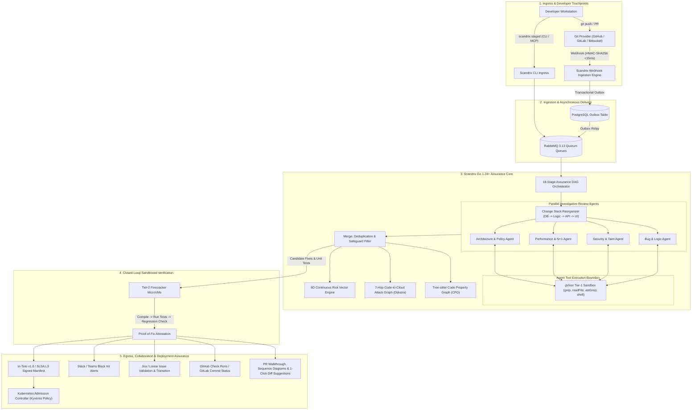
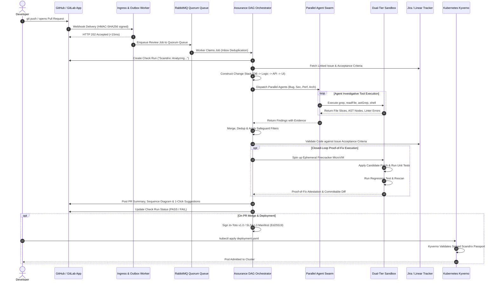

# Scandrix — Enterprise Product Requirements Document (PRD)

**Document Version:** 3.0.0  
**Classification:** ENTERPRISE PRODUCT ARCHITECTURE  
**Status:** APPROVED FOR IMPLEMENTATION  
**Product Line:** Continuous Software-Assurance & Autonomous Risk Intelligence Platform  
**Target Release:** Scandrix Enterprise v1.0 (Clean-Room Go 1.24+ Core)

---

## 1. Executive Summary & Market Problem

Software engineering teams are under unprecedented pressure to ship code faster. However, existing code review and application security testing (AST) tools suffer from catastrophic structural shortcomings:

1. **The Single-Shot LLM Hallucination Trap**: First-generation AI code review tools dump raw git diffs into single-shot prompt templates. Offline benchmarks show that single-shot generation achieves a dismal **13.8% precision**, drowning engineering teams in false-positive noise, stylistic nitpicks, and fabricated vulnerabilities.
2. **Context-Blind Static Analysis (SAST/SCA)**: Traditional AST tools operate in silos. SAST flags hundreds of theoretically vulnerable code patterns that are dead code or unreachable from public network endpoints; SCA tools alert on CVEs in transitive libraries that are never imported or invoked.
3. **Speculative Comments vs. Actionable Fixes**: AI reviewers post vague markdown comments without verifying whether proposed recommendations actually compile, pass unit tests, or introduce regressions.
4. **Disjointed Workflow Disconnect**: Teams must constantly context-switch between disparate tools for PR summaries, code reviews, issue tracking (Jira/Linear), security scanning, container signing, and Kubernetes deployment admission.

### The Scandrix Vision

**Scandrix** is the industry's first **Continuous Software-Assurance & Autonomous Risk Intelligence Platform**. Scandrix bridges the gap between developer velocity and enterprise security by unifying:
- The **investigative multi-agent review architecture** of Kodus (specialized agents with tool access to repository files, Tree-sitter AST, and linters),
- The **developer-first PR walkthrough, automated sequence diagrams, change stack, and interactive chat** of CodeRabbit, and
- The **mathematically grounded 18-stage assurance DAG, 6D continuous risk vector, 7-hop Code-to-Cloud security twin, and closed-loop sandboxed Proof-of-Fix engine** of the Scandrix Master Architecture.

---

## 2. High-Level End-to-End System Architecture

Scandrix operates across the entire software delivery lifecycle—from local IDE staging to Git provider pull requests, background worker orchestration, isolated sandbox verification, and production Kubernetes deployment gates.

---

## 3. Comprehensive Feature Matrix (Kodus + CodeRabbit + Scandrix)

Scandrix delivers an enterprise feature set divided into ten foundational capabilities:

### 3.1 Agent-First Investigative Review Pipeline (Kodus + Scandrix)
- **Specialized Parallel Agents**: Dispatches concurrent domain agents (Bug & Logic, Security, Performance, Architecture) instead of an unguided single prompt.
- **Sandboxed Tool Execution Loop**: Agents do not guess; they invoke `readFile`, `grep`, `astGrep` (Tree-sitter queries), `queryCodeGraph`, and `shell` (running linters inside isolated gVisor containers) to gather corroborating evidence.
- **Merge & Deduplication Safeguards**: Eliminates overlapping reports, filters hallucinated symbols against the AST, and checks historical suppressions in `pgvector` (`security_memory`).
- **Cognitive Budget Capping**: Strictly caps inline PR comments to the top **5 to 8 highest-priority actionable items**, consolidating secondary warnings into an expandable summary table to eliminate review fatigue.

### 3.2 Change Stack & Automated Logic Diagrams (CodeRabbit)
- **Change Stack Reorganization**: Flattens raw, chaotic PR diffs into logical architectural layers:
  $$\text{Database Schema / Migrations} \longrightarrow \text{Domain Business Logic} \longrightarrow \text{API Controllers} \longrightarrow \text{Frontend UI}$$
- **Automated Mermaid Sequence Diagrams**: Automatically parses modified function call flows and generates clear, accurate Mermaid sequence diagrams illustrating how data moves through modified services.
- **Comprehensive PR Walkthrough**: Formulates a high-level executive summary, key architectural highlights, bulleted file-by-file breakdown, and review time / complexity estimates.

### 3.3 Interactive Chat & `@scandrix` Slash Commands (CodeRabbit + Kodus)
Developers interact with Scandrix directly inside PR discussion threads:
- `@scandrix review`: Triggers an incremental review of newly pushed commits.
- `@scandrix full review`: Triggers a comprehensive re-evaluation of the entire PR.
- `@scandrix explain --trace`: Provides a step-by-step trace of how user input reaches a flagged sink.
- `@scandrix generate-tests`: Synthesizes production-grade unit and table-driven tests matching repository idioms.
- `@scandrix sequence-diagram`: Generates an updated Mermaid sequence diagram of modified logic.
- `@scandrix proof-of-fix`: Triggers the Firecracker MicroVM to compile and prove a proposed fix.
- `@scandrix resolve`: Auto-resolves threads where underlying code has been amended.

### 3.4 Issue Alignment & PM Validation Engine (CodeRabbit + Kodus)
- **Bi-Directional Ticket Sync**: Deeply integrates with Jira, Linear, and GitHub Issues.
- **Requirement Verification**: Automatically checks PR diffs against linked ticket descriptions and acceptance criteria, highlighting unfulfilled requirements or scope creep before merge.
- **Automated Issue Transitioning**: Automatically marks Jira/Linear tickets as resolved once the PR is merged with verified assurance attestations.

### 3.5 18-Stage Continuous Assurance DAG (Scandrix Master)
- Executes an immutable 18-stage pipeline: AST parsing, symbol indexing, dependency reachability, taint flow tracking, secret entropy scanning, license compliance, IaC evaluation, and supply chain verification.
- Enforces unambiguous 6-state status outcomes: `PASS`, `PASS_WITH_WARNINGS`, `FAIL`, `PARTIAL_ANALYSIS`, `NOT_TESTED`, or `ERROR`. "Not Tested" is never masked as passed.

### 3.6 6D Continuous Risk Vector Engine (Scandrix Master)
- Replaces one-dimensional CVSS numbers with a 6-dimensional risk vector:
  $$\vec{R} = \langle R_{\text{Security}}, R_{\text{Reliability}}, R_{\text{Architecture}}, R_{\text{SupplyChain}}, R_{\text{Performance}}, R_{\text{Compliance}} \rangle$$
- **Dynamic Attenuation**: Dampens risk scores when verifiable runtime controls exist (e.g., WAF rules, Kubernetes NetworkPolicies, memory-safe language constructs).

### 3.7 7-Hop Code-to-Cloud Security Twin (Scandrix Master)
- Maps the complete structural continuum:
  $$\text{Internet Edge} \to \text{WAF/Ingress} \to \text{Auth Guard} \to \text{Controller} \to \text{Domain Service} \to \text{Vulnerable Sink} \to \text{Data Store}$$
- Executes a modified Dijkstra shortest-path algorithm with edge friction to calculate the true exploitability of any vulnerability.
- Renders an interactive React Flow graph in the Next.js 15 dashboard.

### 3.8 Closed-Loop Ephemeral Sandbox Proof-of-Fix (Scandrix Master)
- Operates a **Dual-Tier Sandbox Architecture**:
  - **Tier 1 (gVisor `runsc`)**: User-space kernel syscall interception for sub-second static analysis and linter execution.
  - **Tier 2 (Firecracker MicroVMs)**: Hardware-isolated KVM microVMs with jailer process containment for untrusted test execution, patch compilation, and active DAST verification.
- Synthesizes candidate code fixes, compiles them in the microVM, runs the existing test suite, synthesizes a regression test, and asserts that the vulnerability is eliminated without breaking functionality.

### 3.9 Multi-Tier Policy Engine & What-If Simulation (Kodus + Scandrix)
- **Hierarchical Inheritance**:
  $$\text{Global Org Policy} \longrightarrow \text{Team / Workspace Policy} \longrightarrow \text{Repo Policy (.scandrix/policy.yaml)} \longrightarrow \text{Branch Policy}$$
- **Review Profiles**: Supports `assertive` (strict security & compliance gates) and `chill` (educational, bug-focused) modes.
- **Pre-Built Policy Catalog**: Out-of-the-box policies for OWASP Top 10, CWE Top 25, SOC2, PCI-DSS, Go Concurrency Safety, and TypeScript strictness.
- **What-If Historical Simulation**: Allows security architects to simulate a new rule against the last 500 pull requests to measure blast radius and false-positive rates before activation.

### 3.10 Cryptographic Release Assurance & K8s Admission (Scandrix Master)
- Generates **In-Toto v1.0 and SLSA Level 3** compliant provenance manifests signed with Ed25519 keys or Sigstore Cosign.
- **Kyverno Admission Controller Integration**: Rejects unauthorized container image deployments at the Kubernetes cluster boundary if the image lacks a signed Scandrix release passport.

---

## 4. End-to-End Execution Sequence Diagram

---

## 5. Quantitative Service Level Objectives (SLOs) & OKRs

| Target Category | Objective Metric | Traditional Tools | Scandrix v1.0 Target | Measurement Mechanism |
| :--- | :--- | :--- | :--- | :--- |
| **Precision** | False Positive Rate | $45\% - 75\%$ | $< 5\%$ | Automated CI evaluation against 500+ golden benchmark repositories |
| **Recall** | True Positive Identification | $40\% - 50\%$ | $\ge 90\%$ | Benchmark suite covering OWASP Top 10, CWE-89, CWE-79, CWE-22, concurrency leaks |
| **Latency** | PR Diff Analysis SLA | $3 - 15 \text{ min}$ | $< 25 \text{ sec}$ | p95 wall-clock time for typical (<500 LOC) enterprise pull requests |
| **Fix Velocity** | Proof-of-Fix Acceptance | $< 15\%$ | $\ge 70\%$ | Ratio of synthesized 1-click patches merged without manual developer edits |
| **Throughput** | Concurrent Webhook Ingress | Bottlenecked | $\ge 10,000 \text{ req/s}$ | Go 1.24+ Chi router with transactional outbox pattern |
| **Isolation** | Host Boundary Leakage | High (Docker socket) | **Zero** | gVisor user-space kernel interception + Firecracker microVM KVM isolation |
| **Assurance** | Production Deployment Gate | Manual / Ignored | $100\%$ Enforced | Kubernetes Kyverno / OPA admission controller verification |

---

## 6. System Boundaries & Clean-Room IP Protection

1. **Clean-Room Go 1.24+ Implementation**: The entirety of Scandrix is authored in compiled Go 1.24+, using Chi HTTP routing, gRPC internal daemons, Supabase PostgreSQL 16 (`pgvector`), Appwrite, and Doppler. Zero lines of code, internal NestJS modules, TypeORM entities, or RabbitMQ queue topologies from Kodus AI or any proprietary legacy bot are incorporated.
2. **Deterministic Mathematical Formulations**: Risk modeling, graph traversal, and Merkle root calculations follow open scientific literature and industry standards (SLSA, In-Toto, Dijkstra, Shannon Entropy).
3. **Enterprise Compliance**: Meets SOC2 Type II, ISO 27001, and GDPR requirements, providing zero-data-retention options for proprietary enterprise source code.

### 6.1 Sources of Independent Inspiration & IP Provenance Declaration
- **Public Domain Standards**: IEEE Software Assurance Standards, NIST SP 800-218 (SSDF), SLSA Level 3 Framework, In-Toto Provenance Specification v1.0.
- **Formal Graph Algorithms**: Dijkstra's shortest path on edge friction, Tarjan's strongly connected components for cyclic dependencies.
- **Clean-Room Protocol**: Scandrix was architected de novo from first principles. No confidential source code, proprietary algorithms, or unpublished internal trade secrets from legacy commercial platforms were examined, referenced, or decomposed during the design or implementation of Scandrix.

---
