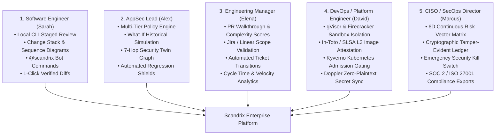

# Scandrix — Enterprise User Stories, Personas & Enterprise Workflows

**Classification:** NORMATIVE PRODUCT SPECIFICATION  
**Status:** APPROVED FOR IMPLEMENTATION  
**Version:** 3.0.0  
**Domain:** Enterprise Customer Requirements & User Experience

---

## 1. Enterprise Personas & Workflow Map

Scandrix unifies development velocity, product management tracking, and enterprise security governance across five key organizational roles:

---

## 2. Exhaustive Persona User Stories

### Persona 1: Sarah — Senior Full-Stack Software Engineer
*Persona Profile: Writes complex features under tight sprint deadlines. Dislikes noisy linters, unverified AI suggestions, and slow CI runs.*

- **Story 1.1: Local Pre-Commit Instant Review via CLI**
  - *As a software engineer*, I want to run `scandrix review --staged` in my local terminal,
  - *So that* I catch syntax errors, exposed API keys, and AST concurrency leaks in $< 1\text{ second}$ before committing or pushing to GitHub.
- **Story 1.2: Layered Change Stack Review**
  - *As a software engineer reviewing a 40-file PR*, I want the diff presented in architectural layers (Database Schema $\to$ Core Logic $\to$ API Handlers $\to$ Frontend UI),
  - *So that* I understand the changes in the exact logical order they were built rather than wading through alphabetical file lists.
- **Story 1.3: Automated Logic Sequence Diagrams**
  - *As a software engineer*, I want Scandrix to automatically generate an accurate Mermaid sequence diagram of modified service call flows,
  - *So that* I can visually understand complex inter-service interactions directly within the PR description.
- **Story 1.4: Interactive Unit Test Synthesis (`@scandrix generate-tests`)**
  - *As a software engineer*, I want to comment `@scandrix generate-tests` on my PR,
  - *So that* Scandrix synthesizes idiomatic, runnable unit and table-driven tests covering edge cases and error paths matching my repo's testing framework.
- **Story 1.5: One-Click Committable Suggestion with Proof-of-Fix**
  - *As a software engineer*, I want code fix suggestions provided as native GitHub committable diff blocks backed by a verified sandbox build,
  - *So that* I can accept the fix with a single click knowing it already compiled and passed unit tests in an isolated Firecracker microVM.

---

### Persona 2: Alex — Application Security Lead & Security Champion
*Persona Profile: Responsible for threat modeling, compliance, and vulnerability triage across 400+ microservices.*

- **Story 2.1: Multi-Tier Hierarchical Policy Authoring**
  - *As an AppSec Lead*, I want to define security policies at the organization level that automatically cascade down to repositories while allowing teams to tune repository `.scandrix/policy.yaml`,
  - *So that* global security baselines are strictly maintained while giving service owners autonomy over path filtering.
- **Story 2.2: What-If Historical Simulation & Blast Radius Modeling**
  - *As an AppSec Lead*, I want to test a proposed security rule against the last 500 merged PRs across all repositories,
  - *So that* I can measure the exact false-positive rate and potential developer friction before activating the rule in production CI.
- **Story 2.3: 7-Hop Code-to-Cloud Security Twin Exploration**
  - *As an AppSec Lead*, I want an interactive React Flow graph showing the shortest path from public internet ingress down to the database sink,
  - *So that* I can verify whether a reported CVE is truly reachable or neutralized by upstream authentication and WAF filters.
- **Story 2.4: Automated AST Regression Shield**
  - *As an AppSec Lead*, I want every accepted vulnerability fix to automatically produce an immutable AST regression test pattern,
  - *So that* future pull requests can never reintroduce the same vulnerable pattern into the codebase.

---

### Persona 3: Elena — Engineering Manager & Delivery Lead
*Persona Profile: Focused on developer productivity, sprint commitments, code quality, and delivery predictability.*

- **Story 3.1: Executive PR Walkthrough & Complexity Estimation**
  - *As an Engineering Manager*, I want every PR to include a high-level summary, estimated review time (e.g., "12 min review"), and complexity score,
  - *So that* my team can allocate review capacity efficiently and unblock critical path PRs faster.
- **Story 3.2: Jira / Linear Scope & Acceptance Criteria Validation**
  - *As an Engineering Manager*, I want Scandrix to validate PR diffs against linked Jira or Linear tickets,
  - *So that* developers don't accidentally miss acceptance criteria or introduce unapproved scope creep.
- **Story 3.3: Automated Issue Status Transitions**
  - *As an Engineering Manager*, I want linked Jira/Linear tickets to automatically transition to `In QA` or `Done` upon PR merge with verified assurance,
  - *So that* sprint burndown charts and project boards stay accurate without requiring manual ticket administration.
- **Story 3.4: Review Friction & Cognitive Budget Analytics**
  - *As an Engineering Manager*, I want metrics showing how many PR comments were generated, how many were resolved with 1-click fixes, and developer sentiment,
  - *So that* I can ensure AI review is speeding up our cycle times rather than causing review fatigue.

---

### Persona 4: David — Platform & DevOps Engineer
*Persona Profile: Manages Kubernetes clusters, CI/CD runners, secret stores, and container supply chains.*

- **Story 4.1: Secure Dual-Tier Sandbox Execution**
  - *As a DevOps Engineer*, I want all AI agent tool executions and patch test suites contained within gVisor and Firecracker microVMs with `CAP_DROP_ALL` and zero host network access,
  - *So that* untrusted third-party code in pull requests cannot exploit the build runner or access internal cluster infrastructure.
- **Story 4.2: Cryptographic In-Toto & SLSA Level 3 Provenance**
  - *As a DevOps Engineer*, I want release builds to automatically generate Ed25519-signed In-Toto v1.0 attestations attached to the OCI image registry via Sigstore Cosign,
  - *So that* our container images have verifiable, tamper-evident cryptographic provenance.
- **Story 4.3: Kubernetes Kyverno Admission Control Gating**
  - *As a DevOps Engineer*, I want our Kubernetes clusters running Kyverno admission controllers to reject any pod deployment lacking a valid Scandrix release passport,
  - *So that* vulnerable or unverified code cannot be deployed to production under any circumstances.
- **Story 4.4: Centralized Zero-Plaintext Secret Sync via Doppler**
  - *As a DevOps Engineer*, I want all Scandrix microservice API keys and credentials synchronized via Doppler and the Kubernetes Secrets Operator,
  - *So that* secrets are automatically rotated without requiring manual restarts or plain-text configuration files.

---

### Persona 5: Marcus — Chief Information Security Officer (CISO)
*Persona Profile: Accountable for enterprise risk posture, regulatory compliance (SOC 2, ISO 27001), and crisis management.*

- **Story 5.1: 6D Continuous Risk Vector Executive Dashboard**
  - *As a CISO*, I want a real-time executive dashboard tracking our organization-wide 6D Risk Vector ($\vec{R} \in \mathbb{R}^6$) across Security, Reliability, Architecture, Supply Chain, Performance, and Compliance,
  - *So that* I can present an objective, mathematically rigorous software health posture to the board of directors.
- **Story 5.2: Cryptographic Tamper-Evident Audit Ledger**
  - *As a CISO*, I want an immutable, append-only PostgreSQL ledger recording every scan outcome, policy exception, and patch signature linked with SHA-256 Merkle roots,
  - *So that* we can pass SOC 2 Type II and ISO 27001 audits with zero manual evidence gathering.
- **Story 5.3: Emergency Security Lockdown (Kill Switch)**
  - *As a CISO*, I want a single-click Emergency Lockdown button in the executive cockpit during an active zero-day incident,
  - *So that* I can immediately block all production merges across all 400 repositories and revoke automated bot privileges across all Git providers within $\le 30\text{ seconds}$.
