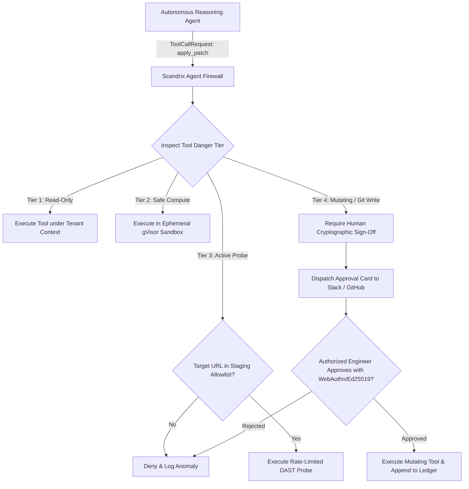

# Agent Firewall & AI Tool Governance — Domain Specification

**Classification:** AUTHORITATIVE SPECIFICATION  
**Status:** APPROVED  
**Version:** 2.0.0  
**Engine Package:** `github.com/scandrix/scandrix/internal/agentfirewall`

---

## 1. Executive Summary & In-Line Tool Governance

Autonomous AI agents equipped with Model Context Protocol (MCP) or tool-calling abilities present unprecedented organizational risks: without strict boundary enforcement, a hallucinating or adversarially prompt-injected agent could delete git branches, leak API keys, probe sensitive production internal networks, or merge backdoors into release branches.

The **Scandrix Agent Firewall** operates as an in-line, deterministic proxy governing all agent tool executions. Every tool request is intercepted, evaluated against organizational policy, validated against network and repository allowlists, and subjected to **Human-in-the-Loop (HITL) Cryptographic Approval** before execution.



---

## 2. Four-Tier Tool Danger Classification

| Danger Tier | Included Tool Operations | Execution Boundary | Authorization Policy |
|---|---|---|---|
| **Tier 1: Read-Only** | `query_codegraph`, `get_ast_slice`, `read_finding`, `list_repos` | Standard read replica | Auto-approved within active `tenant_id` scope |
| **Tier 2: Safe Compute** | `compile_code`, `run_unit_tests`, `run_linter` | Ephemeral gVisor sandbox | Auto-approved; strictly resource-capped (CPU: 1.0, RAM: 512MB) |
| **Tier 3: Active Probing** | `execute_dast_probe`, `test_http_endpoint`, `fuzz_route` | Isolated egress proxy | Target IP/domain must match verified staging CIDR allowlist |
| **Tier 4: Mutating** | `commit_patch_to_branch`, `merge_pull_request`, `update_secret` | Production Git / KMS | **Mandatory Human Cryptographic Approval (M-of-N)** |

---

## 3. Human-in-the-Loop (HITL) Approval Envelope

For any Tier-4 operation, execution is suspended and an immutable `ApprovalTicket` is issued:

```json
{
  "ticket_id": "TKT-019482fa-7000",
  "tool_name": "commit_patch_to_branch",
  "danger_tier": "TIER_4_MUTATING",
  "repository": "github.com/acme/payments-service",
  "target_branch": "fix/scandrix-cwe-89",
  "proposed_diff_sha256": "7c2a8f1e9b2c3d4e5f67890123456789abcdef0123456789abcdef0123456789",
  "requires_approvers": 1,
  "status": "PENDING_HUMAN_SIGNATURE",
  "expires_at": "2026-08-29T04:30:00Z"
}
```

---

## 4. Compilable Go 1.24+ Agent Firewall Implementation

```go
package agentfirewall

import (
	"context"
	"crypto/sha256"
	"encoding/hex"
	"errors"
	"fmt"
	"time"
)

// DangerTier classifies the risk level of an agent action.
type DangerTier int

const (
	Tier1ReadOnly DangerTier = 1
	Tier2SafeCompute DangerTier = 2
	Tier3ActiveProbe DangerTier = 3
	Tier4Mutating   DangerTier = 4
)

// ToolCallRequest encapsulates an agent's request to execute an action.
type ToolCallRequest struct {
	RequestID    string         `json:"request_id"`
	TenantID     string         `json:"tenant_id"`
	AgentID      string         `json:"agent_id"`
	ToolName     string         `json:"tool_name"`
	Tier         DangerTier     `json:"tier"`
	Arguments    map[string]any `json:"arguments"`
	HumanAuthSig string         `json:"human_auth_sig,omitempty"`
}

// ToolCallResult records the execution outcome.
type ToolCallResult struct {
	Allowed   bool   `json:"allowed"`
	Output    any    `json:"output,omitempty"`
	Reason    string `json:"reason,omitempty"`
	AuditHash string `json:"audit_hash"`
}

// Firewall manages tool execution gating and approvals.
type Firewall struct {
	allowedProbeHosts map[string]bool
}

// NewFirewall initializes the firewall with allowed target hosts.
func NewFirewall(allowedHosts []string) *Firewall {
	hosts := make(map[string]bool)
	for _, h := range allowedHosts {
		hosts[h] = true
	}
	return &Firewall{allowedProbeHosts: hosts}
}

// EvaluateAndGate enforces danger tier policies on requested tool executions.
func (f *Firewall) EvaluateAndGate(ctx context.Context, req ToolCallRequest) (*ToolCallResult, error) {
	// Compute audit hash of tool invocation
	h := sha256.New()
	h.Write([]byte(fmt.Sprintf("%s:%s:%s:%d", req.TenantID, req.AgentID, req.ToolName, req.Tier)))
	auditHash := hex.EncodeToString(h.Sum(nil))

	switch req.Tier {
	case Tier1ReadOnly, Tier2SafeCompute:
		// Read-only and sandboxed compute auto-approved under tenant context
		return &ToolCallResult{
			Allowed:   true,
			AuditHash: auditHash,
		}, nil

	case Tier3ActiveProbe:
		targetHost, ok := req.Arguments["target_host"].(string)
		if !ok || !f.allowedProbeHosts[targetHost] {
			return &ToolCallResult{
				Allowed:   false,
				Reason:    fmt.Sprintf("target host '%s' is not on the approved staging allowlist", targetHost),
				AuditHash: auditHash,
			}, nil
		}
		return &ToolCallResult{Allowed: true, AuditHash: auditHash}, nil

	case Tier4Mutating:
		// Mandatory Human-in-the-Loop cryptographic approval
		if req.HumanAuthSig == "" {
			return &ToolCallResult{
				Allowed:   false,
				Reason:    "Tier-4 mutating operation requires verified cryptographic human approval signature",
				AuditHash: auditHash,
			}, nil
		}
		return &ToolCallResult{Allowed: true, AuditHash: auditHash}, nil

	default:
		return nil, errors.New("unknown tool danger tier")
	}
}
```
