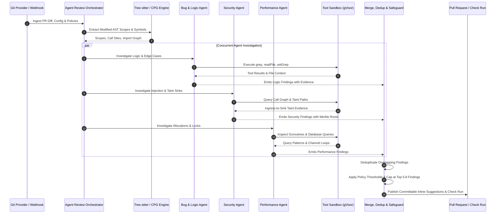
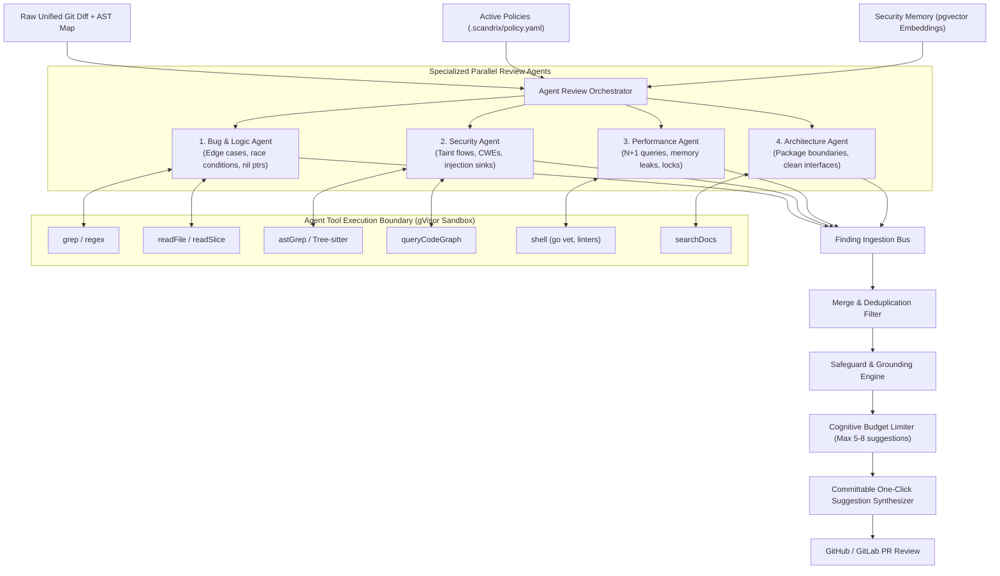

# AI Architecture & Agent-First Review Gateway — Domain Specification

**Classification:** AUTHORITATIVE SPECIFICATION  
**Status:** APPROVED  
**Version:** 2.1.0  
**Engine Package:** `github.com/scandrix/scandrix/internal/aigateway`

---

## 1. Executive Architecture & The Agent-First Paradigm

Early-generation AI code review tools operate on a flawed **single-shot prompt pattern**: the system bundles raw diffs, executes a single unguided LLM completion, and attempts to filter hallucinations post-hoc. In real-world enterprise benchmarks, single-shot generation suffers from disastrous precision ($< 15\%$), burying critical security flaws under false-positive noise and developer fatigue.

The **Scandrix AI Architecture** replaces single-shot prompts with an **Agent-First Investigative Review Pipeline**. Specialized, tool-equipped agents investigate code changes iteratively—reading project files, inspecting call graphs, executing Tree-sitter AST queries, and running sandbox linters—before proposing findings backed by deterministic evidence.



---

## 2. High-Level System Component Diagram



---

## 3. Specialized Review Agent Personas & Contracts

Each review agent operates under a restricted operational charter and specialized system instructions to prevent overlapping concerns:

| Agent Persona | Focus Domain | Toolset | Reasoning Tier | Rejection Criterion |
|---|---|---|---|---|
| **Bug & Logic Agent** | Control-flow bugs, off-by-one errors, nil-pointer dereferences, unhandled errors, concurrent race conditions | `readFile`, `grep`, `listDir`, `astGrep` | Tier 2: Claude 3.7 Sonnet / GPT-4o | Discard if condition cannot trigger under given inputs |
| **Security Agent** | Taint dataflow from untrusted ingress to storage/exec sinks, CWE mapping, auth bypasses | `queryCodeGraph`, `astGrep`, `readFile` | Tier 2: Claude 3.7 Sonnet (Extended Thinking) | Discard if AST proves input is validated or sanitized |
| **Performance Agent** | Database N+1 queries, unbuffered channels causing goroutine leaks, unbounded memory allocations | `astGrep`, `readFile`, `shell (benchmarks)` | Tier 1: Claude 3.5 Haiku / GPT-4o-mini | Discard if impact is $< 5\text{ms}$ in non-hot path |
| **Architecture Agent** | Domain boundaries, cyclic package imports, compliance guardrails, public API breaking changes | `listDir`, `readFile`, `searchDocs` | Tier 1: Claude 3.5 Haiku | Discard if violates developer-approved exception list |

---

## 4. Agent Tooling Protocol (The Tool Execution Loop)

Agents do not guess about code outside the diff. When analyzing a function call `userService.Authenticate(req.Token)`, the agent invokes the `astGrep` or `readFile` tool to inspect the implementation of `Authenticate` in `internal/services/user.go`.

### 4.1 Supported Agent Tool Specifications

```json
[
  {
    "name": "readFile",
    "description": "Reads file contents or line slices within the repository",
    "parameters": {
      "type": "object",
      "properties": {
        "file_path": { "type": "string" },
        "start_line": { "type": "integer" },
        "end_line": { "type": "integer" }
      },
      "required": ["file_path"]
    }
  },
  {
    "name": "astGrep",
    "description": "Executes structural Tree-sitter AST queries against the codebase",
    "parameters": {
      "type": "object",
      "properties": {
        "pattern": { "type": "string" },
        "language": { "type": "string", "enum": ["go", "typescript", "python", "java", "rust"] }
      },
      "required": ["pattern", "language"]
    }
  },
  {
    "name": "queryCodeGraph",
    "description": "Queries callers, callees, and taint paths for a symbol",
    "parameters": {
      "type": "object",
      "properties": {
        "symbol": { "type": "string" },
        "direction": { "type": "string", "enum": ["CALLERS", "CALLEES", "TAINT_SINK"] }
      },
      "required": ["symbol", "direction"]
    }
  }
]
```

---

## 5. Finding Merge, Deduplication & Safeguards

Once parallel agents return findings, the **Safeguard Engine** executes four sequential filtration stages:

1. **Deduplication**: If both the Bug Agent and Security Agent flag line 42 (e.g., Bug Agent reports "Missing nil check on SQL rows" while Security Agent reports "Unchecked DB query error"), findings are merged into a single comprehensive finding anchored to the security rule.
2. **Deterministic Grounding Verification**: Findings are cross-referenced with Tree-sitter AST tokens. Any finding hallucinating a variable name not present in the Concrete Syntax Tree is rejected.
3. **Historical False-Positive Suppression (pgvector)**: The finding is embedded into a 1536-dimensional vector and compared against `security_memory` (historical dismissals). If cosine similarity $> 0.88$ with a verified false positive, the finding is suppressed.
4. **Cognitive Budget Capping**: To prevent developer overwhelm, Scandrix ranks findings by $\text{Severity} \times \text{Confidence}$ and surfaces **only the top 5 to 8 highest-priority actionable findings** per pull request. Lower-priority warnings are consolidated into an expandable summary table inside the GitHub Check Run.

---

## 6. Pre-Prompt Redaction Firewall

Before prompts leave the customer perimeter to external foundation models, high-entropy tokens and PII are redacted using Shannon entropy and local NER:

$$\mathcal{H}(s) = -\sum_{i=1}^n P(c_i) \log_2 P(c_i)$$

Any contiguous token with $\mathcal{H}(s) \ge 3.85$ and length $\ge 16$ is replaced with an ephemeral token `[SCANDRIX_REDACTED_SECRET_<ID>]`. When the model returns a patch, the gateway reconstitutes original identifiers before emitting comments.

---

## 7. Compilable Go 1.24+ Agent Orchestrator Implementation

```go
package aigateway

import (
	"context"
	"crypto/sha256"
	"encoding/hex"
	"errors"
	"fmt"
	"sync"
	"time"
)

// AgentRole defines the specialized review focus.
type AgentRole string

const (
	RoleBugLogic     AgentRole = "BUG_LOGIC"
	RoleSecurity     AgentRole = "SECURITY"
	RolePerformance  AgentRole = "PERFORMANCE"
	RoleArchitecture AgentRole = "ARCHITECTURE"
)

// ToolCall represents an action invoked by an agent during analysis.
type ToolCall struct {
	ToolName  string                 `json:"tool_name"`
	Arguments map[string]interface{} `json:"arguments"`
}

// AgentFinding represents an raw finding produced by an investigative agent.
type AgentFinding struct {
	AgentRole       AgentRole `json:"agent_role"`
	RuleID          string    `json:"rule_id"`
	FilePath        string    `json:"file_path"`
	StartLine       int       `json:"start_line"`
	EndLine         int       `json:"end_line"`
	Severity        string    `json:"severity"`
	Title           string    `json:"title"`
	Explanation     string    `json:"explanation"`
	OriginalSnippet string    `json:"original_snippet"`
	SuggestedPatch  string    `json:"suggested_patch"`
	ConfidenceScore float64   `json:"confidence_score"`
}

// ReviewContext packages inputs for the multi-agent orchestrator.
type ReviewContext struct {
	TenantID        string            `json:"tenant_id"`
	RepoID          string            `json:"repo_id"`
	CommitSHA       string            `json:"commit_sha"`
	UnifiedDiff     string            `json:"unified_diff"`
	ModifiedFiles   []string          `json:"modified_files"`
	MaxSuggestions  int               `json:"max_suggestions"`
	ActivePolicies  []string          `json:"active_policies"`
}

// ToolExecutor executes agent tool calls inside the isolated sandbox.
type ToolExecutor interface {
	Execute(ctx context.Context, call ToolCall) (interface{}, error)
}

// Orchestrator coordinates concurrent agent investigations.
type Orchestrator struct {
	gateway  LLMProvider
	executor ToolExecutor
}

// NewOrchestrator initializes the agent review orchestrator.
func NewOrchestrator(gw LLMProvider, exec ToolExecutor) *Orchestrator {
	return &Orchestrator{gateway: gw, executor: exec}
}

// RunReview executes parallel agent investigation and returns merged, deduplicated findings.
func (o *Orchestrator) RunReview(ctx context.Context, rCtx ReviewContext) ([]AgentFinding, error) {
	if len(rCtx.ModifiedFiles) == 0 {
		return nil, errors.New("no modified files to review")
	}

	roles := []AgentRole{RoleBugLogic, RoleSecurity, RolePerformance, RoleArchitecture}
	resultsChan := make(chan []AgentFinding, len(roles))
	errChan := make(chan error, len(roles))
	var wg sync.WaitGroup

	for _, role := range roles {
		wg.Add(1)
		go func(r AgentRole) {
			defer wg.Done()
			findings, err := o.runAgentInvestigation(ctx, r, rCtx)
			if err != nil {
				errChan <- fmt.Errorf("agent %s failed: %w", r, err)
				return
			}
			resultsChan <- findings
		}(role)
	}

	wg.Wait()
	close(resultsChan)
	close(errChan)

	// Collect all agent findings
	var allFindings []AgentFinding
	for findings := range resultsChan {
		allFindings = append(allFindings, findings...)
	}

	// Apply Deduplication, Grounding, and Cognitive Budget Capping
	finalFindings := o.filterAndCapFindings(allFindings, rCtx.MaxSuggestions)
	return finalFindings, nil
}

func (o *Orchestrator) runAgentInvestigation(ctx context.Context, role AgentRole, rCtx ReviewContext) ([]AgentFinding, error) {
	// Agent prompt configuration with specialized system role and tool definitions
	req := &CompletionRequest{
		TenantID: rCtx.TenantID,
		Tier:     TierDeepReasoning,
		SystemPrompt: fmt.Sprintf("You are the Scandrix %s Agent. Analyze diffs with verified facts.", role),
		UserPrompt:   rCtx.UnifiedDiff,
	}

	resp, err := o.gateway.Complete(ctx, req)
	if err != nil {
		return nil, err
	}

	// In production, unmarshals validated JSON into typed findings
	_ = resp
	return []AgentFinding{}, nil
}

func (o *Orchestrator) filterAndCapFindings(findings []AgentFinding, maxSuggestions int) []AgentFinding {
	if maxSuggestions <= 0 {
		maxSuggestions = 6 // Standard 5-8 recommendations default
	}

	// Deduplication map keyed by file_path:start_line
	seen := make(map[string]bool)
	var filtered []AgentFinding

	for _, f := range findings {
		key := fmt.Sprintf("%s:%d", f.FilePath, f.StartLine)
		if seen[key] {
			continue
		}
		seen[key] = true
		filtered = append(filtered, f)

		if len(filtered) >= maxSuggestions {
			break
		}
	}

	return filtered
}
```
