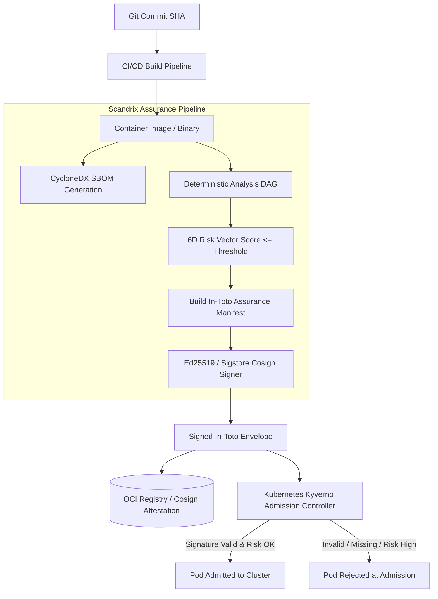

# Release Assurance & Manifests — Domain Architecture

**Classification:** AUTHORITATIVE SPECIFICATION  
**Status:** APPROVED  
**Version:** 2.0.0  
**Engine Package:** `github.com/scandrix/scandrix/internal/assurance`

---

## 1. Executive Summary: The Assurance Paradigm

Rather than relying on ephemeral CI build logs that are discarded or easily manipulated, Scandrix enforces release security through **Cryptographically Signed Assurance Manifests**. An Assurance Manifest represents an immutable In-Toto v1.0 and SLSA Level 3 compliant provenance envelope that binds the compiled container artifact or binary release to the full audit trail of tests, AST scans, risk evaluations, and human authorizations that approved it.



---

## 2. The Assurance Artifact Triad & Levels

Scandrix maintains three complementary assurance entities:

1. **Service Passport**: A living, continuously updated dashboard record tracking a service's ongoing vulnerability backlog, dependency hygiene, and 6D risk vector.
2. **Release Passport**: A point-in-time snapshot created at tag or release candidate generation, aggregating test logs, SBOMs, and commit author provenance.
3. **Assurance Manifest**: The cryptographically sealed, portable payload signed by the Scandrix cluster key, consumable by runtime orchestrators (Kubernetes, AWS ECS, Nomad).

### 2.1 Formal Assurance Levels Matrix

| Level | Designation | Requirements | Deployment Admissibility |
|---|---|---|---|
| **L0** | Observed | Commit recorded, no automated checks executed. | Denied in all production environments. |
| **L1** | Reviewed | AST linting passed, zero high-entropy secrets, basic tests green. | Ephemeral preview environments only. |
| **L2** | Security Reviewed | Semgrep, Gitleaks, Trivy clean; CVSS $\ge 7.0$ neutralized. | Staging / QA environments. |
| **L3** | Deeply Assured | Dual-tier sandbox verification passed; Attack Path Engine confirms zero reachable sinks; SBOM signed. | Production standard workloads. |
| **L4** | Mission Critical | SLSA Level 3 provenance; Ed25519 signed; Human-in-the-loop SecOps cryptographic sign-off attached. | Financial, healthcare, and air-gapped workloads. |

---

## 3. In-Toto v1.0 Statement & SLSA Provenance Envelope

The signed manifest conforms strictly to the In-Toto v1.0 specification with SLSA v1.0 provenance predicate:

```json
{
  "_type": "https://in-toto.io/Statement/v1",
  "subject": [
    {
      "name": "registry.scandrix.internal/payments/order-service",
      "digest": {
        "sha256": "e3b0c44298fc1c149afbf4c8996fb92427ae41e4649b934ca495991b7852b855"
      }
    }
  ],
  "predicateType": "https://scandrix.dev/assurance/v1",
  "predicate": {
    "assurance_level": "L3",
    "git_commit": "a1b2c3d4e5f67890123456789abcdef012345678",
    "risk_vector": {
      "security": 12.4,
      "reliability": 4.2,
      "architecture": 8.1,
      "supply_chain": 0.0,
      "performance": 15.0,
      "compliance": 0.0,
      "composite_score": 6.6
    },
    "scanners_executed": [
      { "name": "semgrep", "version": "1.78.0", "status": "PASS" },
      { "name": "gitleaks", "version": "8.18.0", "status": "PASS" },
      { "name": "trivy", "version": "0.52.0", "status": "PASS" },
      { "name": "scandrix-attackpath", "version": "2.0.0", "status": "ZERO_PATH_FOUND" }
    ],
    "sbom_sha256": "4b227777d4dd1fc61c6f884f48641d02b4d121d3fd328cb08b5531fcacdabf8a",
    "issued_at": "2026-08-29T03:30:00Z"
  }
}
```

---

## 4. Compilable Go 1.24+ Assurance Engine Implementation

```go
package assurance

import (
	"crypto/ed25519"
	"crypto/sha256"
	"encoding/base64"
	"encoding/json"
	"errors"
	"fmt"
	"time"
)

// AssuranceLevel represents the compliance maturity tier.
type AssuranceLevel string

const (
	LevelL0 AssuranceLevel = "L0_OBSERVED"
	LevelL1 AssuranceLevel = "L1_REVIEWED"
	LevelL2 AssuranceLevel = "L2_SECURITY_REVIEWED"
	LevelL3 AssuranceLevel = "L3_DEEPLY_ASSURED"
	LevelL4 AssuranceLevel = "L4_MISSION_CRITICAL"
)

// ResourceDigest stores the cryptographic checksum of a built artifact.
type ResourceDigest struct {
	SHA256 string `json:"sha256"`
}

// InTotoSubject identifies the artifact being attested.
type InTotoSubject struct {
	Name   string         `json:"name"`
	Digest ResourceDigest `json:"digest"`
}

// AssurancePredicate contains Scandrix verification measurements.
type AssurancePredicate struct {
	AssuranceLevel    AssuranceLevel `json:"assurance_level"`
	GitCommit         string         `json:"git_commit"`
	CompositeRiskScore float64        `json:"composite_risk_score"`
	SBOMLocation      string         `json:"sbom_location"`
	IssuedAt          time.Time      `json:"issued_at"`
}

// InTotoStatement is the canonical In-Toto v1 envelope.
type InTotoStatement struct {
	Type          string             `json:"_type"`
	Subject       []InTotoSubject    `json:"subject"`
	PredicateType string             `json:"predicateType"`
	Predicate     AssurancePredicate `json:"predicate"`
}

// SignedEnvelope contains the statement and detached Ed25519 signature.
type SignedEnvelope struct {
	PayloadType string `json:"payloadType"` // "application/vnd.in-toto+json"
	Payload     string `json:"payload"`     // Base64 encoded InTotoStatement
	Signature   string `json:"signature"`   // Base64 encoded Ed25519 signature
	KeyID       string `json:"key_id"`
}

// Signer generates signed envelopes using an Ed25519 private key.
type Signer struct {
	keyID      string
	privateKey ed25519.PrivateKey
}

// NewSigner creates a signer with the provided private key.
func NewSigner(keyID string, privKey ed25519.PrivateKey) *Signer {
	return &Signer{keyID: keyID, privateKey: privKey}
}

// CreateAndSignManifest serializes and signs an assurance manifest.
func (s *Signer) CreateAndSignManifest(stmt InTotoStatement) (*SignedEnvelope, error) {
	rawJSON, err := json.Marshal(stmt)
	if err != nil {
		return nil, fmt.Errorf("failed to marshal statement: %w", err)
	}

	payloadB64 := base64.StdEncoding.EncodeToString(rawJSON)
	sig := ed25519.Sign(s.privateKey, rawJSON)
	sigB64 := base64.StdEncoding.EncodeToString(sig)

	return &SignedEnvelope{
		PayloadType: "application/vnd.in-toto+json",
		Payload:     payloadB64,
		Signature:   sigB64,
		KeyID:       s.keyID,
	}, nil
}

// VerifyEnvelope verifies an incoming signed envelope with a public key.
func VerifyEnvelope(pubKey ed25519.PublicKey, env *SignedEnvelope) (*InTotoStatement, error) {
	rawJSON, err := base64.StdEncoding.DecodeString(env.Payload)
	if err != nil {
		return nil, errors.New("invalid base64 payload")
	}

	rawSig, err := base64.StdEncoding.DecodeString(env.Signature)
	if err != nil {
		return nil, errors.New("invalid base64 signature")
	}

	if !ed25519.Verify(pubKey, rawJSON, rawSig) {
		return nil, errors.New("cryptographic signature verification failed")
	}

	var stmt InTotoStatement
	if err := json.Unmarshal(rawJSON, &stmt); err != nil {
		return nil, fmt.Errorf("failed to unmarshal verified payload: %w", err)
	}

	return &stmt, nil
}
```
