# Attack Path Engine — Graph Data Structures & Dijkstra Traversal

**Classification:** AUTHORITATIVE SPECIFICATION  
**Status:** APPROVED  
**Version:** 2.0.0  
**Engine Package:** `github.com/scandrix/scandrix/internal/attackpath`

---

## 1. Executive Summary & Graph Theory Fundamentals

The Scandrix Attack Path Engine models application security as a directed, weighted multigraph known as the **Code-to-Cloud Graph** ($\mathcal{G} = (\mathcal{V}, \mathcal{E})$). Rather than evaluating static vulnerabilities in isolation, the engine determines whether an entrypoint (such as a public HTTP API route) has an unbroken, low-friction traversal path terminating at a high-value data sink (such as an unencrypted database table or cloud storage bucket).

### 7-Hop Canonical Path Decomposition:

```mermaid

flowchart LR
    N1["1. INGRESS<br/>(Public API Route / ALB)"] -->|CALLS| N2["2. AUTH_BOUNDARY<br/>(JWT / OAuth Guard)"]
    N2 -->|AUTHORIZES| N3["3. DATAFLOW_HOP<br/>(Controller Handler)"]
    N3 -->|FLOWS_TO| N4["4. DATAFLOW_HOP<br/>(Service Domain Logic)"]
    N4 -->|CALLS| N5["5. VULNERABILITY<br/>(SQLi / RCE / SSRF Sink)"]
    N5 -->|EXPOSES| N6["6. DATAFLOW_HOP<br/>(ORM Driver / Exec)"]
    N6 -->|DEPLOYS_TO| N7["7. ASSET_SINK<br/>(Postgres Orders Table)"]

```


---

## 2. Graph Invariants & Edge Friction Formulation

1. **Edge Friction Cost ($F(e)$)**: In standard graph routing, lower weight represents shorter physical distance. In the Scandrix Attack Path Engine, **lower edge friction represents higher exploitability and ease of attacker traversal**.
2. **Edge Weight Formula**:
   $$F(e) = \frac{1.0}{\text{Exploitability}(e) \times (1.0 - \text{Mitigation}(e)) + \epsilon}$$
   - Where $\text{Exploitability}(e) \in [0.10, 1.00]$ is the ease of traversing edge $e$.
   - $\text{Mitigation}(e) \in [0.00, 0.95]$ is the presence of verified defensive controls along edge $e$.
   - $\epsilon = 10^{-4}$ prevents division by zero.
3. **Exploitability Index of a Complete Path ($P$)**:
   - Where $\text{Reachability}(n) \in [0.0, 1.0]$ is the runtime reachability factor of node $n$.
   - *Design Invariant*: If any intermediate node $n \in P$ has $\text{Reachability}(n) = 0.0$ (e.g., dead code unreferenced in call graph or an air-gapped subnet boundary), $\prod \text{Reachability}(n) = 0.0$, intentionally nullifying the entire path's exploitability index. This enforces automated dead-code and unreachable-sink pruning without heuristic approximations.

---

## 3. Compilable Go 1.24+ Implementation

```go
package attackpath

import (
	"container/heap"
	"context"
	"errors"
	"fmt"
	"math"
	"sync"
)

// NodeType represents the categorical role of a node in the Code-to-Cloud graph.
type NodeType string

const (
	NodeIngress       NodeType = "INGRESS"        // ALB, API Gateway, Route Handler
	NodeAuthBoundary  NodeType = "AUTH_BOUNDARY"   // JWT, OAuth Guard, Session Validator
	NodeDataflowHop   NodeType = "DATAFLOW_HOP"    // Function call, ORM query, Controller
	NodeVulnerability NodeType = "VULNERABILITY"   // AST finding, CVE sink, Deserialization
	NodeAssetSink     NodeType = "ASSET_SINK"      // Database table, S3 bucket, KMS Key
)

// EdgeType represents the nature of the relationship between two nodes.
type EdgeType string

const (
	EdgeCalls       EdgeType = "CALLS"
	EdgeFlowsTo     EdgeType = "FLOWS_TO"
	EdgeExposes     EdgeType = "EXPOSES"
	EdgeDependsOn   EdgeType = "DEPENDS_ON"
	EdgeDeploysTo   EdgeType = "DEPLOYS_TO"
	EdgeAuthorizes  EdgeType = "AUTHORIZES"
)

// GraphNode defines an entity within the Code-to-Cloud topology.
type GraphNode struct {
	ID           string            `json:"id"`
	Type         NodeType          `json:"type"`
	Name         string            `json:"name"`
	ResourceURN  string            `json:"resource_urn"`
	AssetTier    int               `json:"asset_tier"`    // 0 = Crown Jewel, 3 = Low
	Reachability float64           `json:"reachability"`  // 0.0 to 1.0
	Metadata     map[string]string `json:"metadata"`
}

// GraphEdge defines a directed traversal hop with dynamic friction cost.
type GraphEdge struct {
	FromID         string   `json:"from_id"`
	ToID           string   `json:"to_id"`
	EdgeType       EdgeType `json:"edge_type"`
	Exploitability float64  `json:"exploitability"` // 0.1 to 1.0
	Mitigation     float64  `json:"mitigation"`     // 0.0 to 0.95
	FrictionCost   float64  `json:"friction_cost"`  // Computed: 1.0 / (exploit * (1-mitig))
}

// CodeToCloudGraph maintains the adjacency list representation.
type CodeToCloudGraph struct {
	mu    sync.RWMutex
	Nodes map[string]*GraphNode
	Edges map[string][]*GraphEdge
}

// NewCodeToCloudGraph initializes an empty CodeToCloudGraph.
func NewCodeToCloudGraph() *CodeToCloudGraph {
	return &CodeToCloudGraph{
		Nodes: make(map[string]*GraphNode),
		Edges: make(map[string][]*GraphEdge),
	}
}

// AddNode inserts a node into the graph.
func (g *CodeToCloudGraph) AddNode(node *GraphNode) error {
	if node == nil || node.ID == "" {
		return errors.New("invalid node: ID cannot be empty")
	}
	g.mu.Lock()
	defer g.mu.Unlock()
	
	if node.Reachability <= 0.0 {
		node.Reachability = 1.0
	}
	if node.Metadata == nil {
		node.Metadata = make(map[string]string)
	}
	g.Nodes[node.ID] = node
	return nil
}

// AddEdge calculates friction cost and adds a directed edge.
func (g *CodeToCloudGraph) AddEdge(fromID, toID string, edgeType EdgeType, exploitability, mitigation float64) error {
	g.mu.Lock()
	defer g.mu.Unlock()

	if _, exists := g.Nodes[fromID]; !exists {
		return fmt.Errorf("source node %s does not exist in graph", fromID)
	}
	if _, exists := g.Nodes[toID]; !exists {
		return fmt.Errorf("destination node %s does not exist in graph", toID)
	}

	// Clamp boundaries
	exploit := math.Max(0.10, math.Min(1.00, exploitability))
	mitig := math.Max(0.00, math.Min(0.95, mitigation))
	
	// F(e) calculation with epsilon safeguard
	const epsilon = 1e-4
	friction := 1.0 / ((exploit * (1.0 - mitig)) + epsilon)

	edge := &GraphEdge{
		FromID:         fromID,
		ToID:           toID,
		EdgeType:       edgeType,
		Exploitability: exploit,
		Mitigation:     mitig,
		FrictionCost:   friction,
	}

	g.Edges[fromID] = append(g.Edges[fromID], edge)
	return nil
}

// PathItem represents an element in the min-priority queue.
type PathItem struct {
	NodeID   string
	RiskCost float64 // Cumulative minimum friction
	Index    int
}

// PriorityQueue implements heap.Interface for Dijkstra traversal.
type PriorityQueue []*PathItem

func (pq PriorityQueue) Len() int           { return len(pq) }
func (pq PriorityQueue) Less(i, j int) bool { return pq[i].RiskCost < pq[j].RiskCost }
func (pq PriorityQueue) Swap(i, j int) {
	pq[i], pq[j] = pq[j], pq[i]
	pq[i].Index = i
	pq[j].Index = j
}
func (pq *PriorityQueue) Push(x any) {
	n := len(*pq)
	item := x.(*PathItem)
	item.Index = n
	*pq = append(*pq, item)
}
func (pq *PriorityQueue) Pop() any {
	old := *pq
	n := len(old)
	item := old[n-1]
	old[n-1] = nil
	item.Index = -1
	*pq = old[0 : n-1]
	return item
}

// AttackPathResult contains the reconstructed path and risk metrics.
type AttackPathResult struct {
	StartNodeID        string       `json:"start_node_id"`
	TargetSinkID       string       `json:"target_sink_id"`
	ExploitabilityIdx  float64      `json:"exploitability_index"` // 0.0 to 100.0
	CumulativeFriction float64      `json:"cumulative_friction"`
	PathNodes          []*GraphNode `json:"path_nodes"`
	HopsCount          int          `json:"hops_count"`
	PathEdges          []*GraphEdge `json:"path_edges"`
}

// FindShortestAttackPath computes the lowest-friction attack path using Modified Dijkstra.
func (g *CodeToCloudGraph) FindShortestAttackPath(
	ctx context.Context,
	startNodeID string,
	targetSinkID string,
) (*AttackPathResult, error) {
	g.mu.RLock()
	defer g.mu.RUnlock()

	if _, exists := g.Nodes[startNodeID]; !exists {
		return nil, fmt.Errorf("start node %q not found", startNodeID)
	}
	if _, exists := g.Nodes[targetSinkID]; !exists {
		return nil, fmt.Errorf("target sink node %q not found", targetSinkID)
	}

	dist := make(map[string]float64, len(g.Nodes))
	prevNode := make(map[string]string, len(g.Nodes))
	prevEdge := make(map[string]*GraphEdge, len(g.Nodes))

	for id := range g.Nodes {
		dist[id] = math.Inf(1)
	}
	dist[startNodeID] = 0.0

	pq := make(PriorityQueue, 0, len(g.Nodes))
	heap.Init(&pq)
	heap.Push(&pq, &PathItem{NodeID: startNodeID, RiskCost: 0.0})

	visited := make(map[string]bool, len(g.Nodes))

	for pq.Len() > 0 {
		select {
		case <-ctx.Done():
			return nil, ctx.Err()
		default:
		}

		current := heap.Pop(&pq).(*PathItem)
		u := current.NodeID

		// Cycle detection & skip already finalized shortest distances
		if visited[u] {
			continue
		}
		visited[u] = true

		if u == targetSinkID {
			break // Early exit: Target reached with minimal friction
		}

		for _, edge := range g.Edges[u] {
			v := edge.ToID
			if visited[v] {
				continue
			}

			alt := dist[u] + edge.FrictionCost
			if alt < dist[v] {
				dist[v] = alt
				prevNode[v] = u
				prevEdge[v] = edge
				heap.Push(&pq, &PathItem{NodeID: v, RiskCost: alt})
			}
		}
	}

	if math.IsInf(dist[targetSinkID], 1) {
		return nil, fmt.Errorf("no viable attack path exists between %s and %s", startNodeID, targetSinkID)
	}

	// Reconstruct path nodes and edges in forward order
	var pathNodes []*GraphNode
	var pathEdges []*GraphEdge
	curr := targetSinkID
	reachabilityProduct := 1.0

	for curr != "" {
		node := g.Nodes[curr]
		pathNodes = append([]*GraphNode{node}, pathNodes...)
		reachabilityProduct *= node.Reachability

		if edge, exists := prevEdge[curr]; exists {
			pathEdges = append([]*GraphEdge{edge}, pathEdges...)
		}
		curr = prevNode[curr]
	}

	cumFriction := dist[targetSinkID]
	exploitIndex := (100.0 / (1.0 + cumFriction)) * reachabilityProduct

	return &AttackPathResult{
		StartNodeID:        startNodeID,
		TargetSinkID:       targetSinkID,
		ExploitabilityIdx:  exploitIndex,
		CumulativeFriction: cumFriction,
		PathNodes:          pathNodes,
		HopsCount:          len(pathNodes),
		PathEdges:          pathEdges,
	}, nil
}
```

---

## 4. Algorithmic Complexity & Correctness Proof

### Complexity:
- **Time Complexity**: $\mathcal{O}(|\mathcal{E}| + |\mathcal{V}| \log |\mathcal{V}|)$ using binary heap operations.
- **Space Complexity**: $\mathcal{O}(|\mathcal{V}| + |\mathcal{E}|)$ for adjacency representation and distance maps.

### Correctness Invariant (Non-Negative Edge Weights):
Because $\text{Exploitability} \in [0.10, 1.00]$ and $\text{Mitigation} \in [0.00, 0.95]$, the denominator is strictly positive:
$$\text{Exploitability} \times (1.0 - \text{Mitigation}) + \epsilon > 0 \implies F(e) > 0$$
Since all edge weights $F(e)$ are strictly non-negative, Dijkstra's greedy invariant holds unconditionally: when node $u$ is popped from the priority queue, $\text{dist}[u]$ is optimal. Cycles with non-negative weights cannot decrease distance and are naturally pruned by the `visited[u]` set. $\blacksquare$
