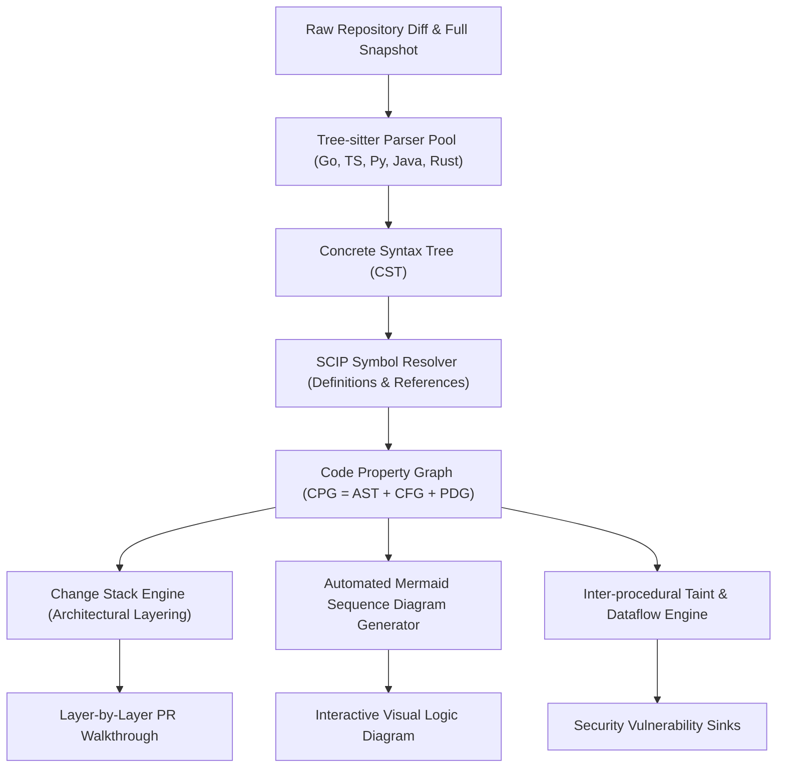
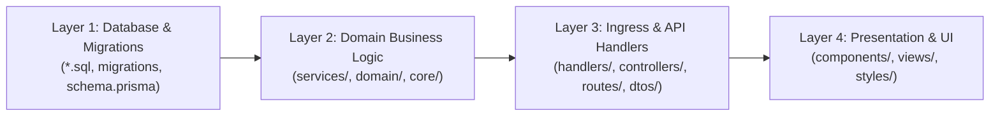
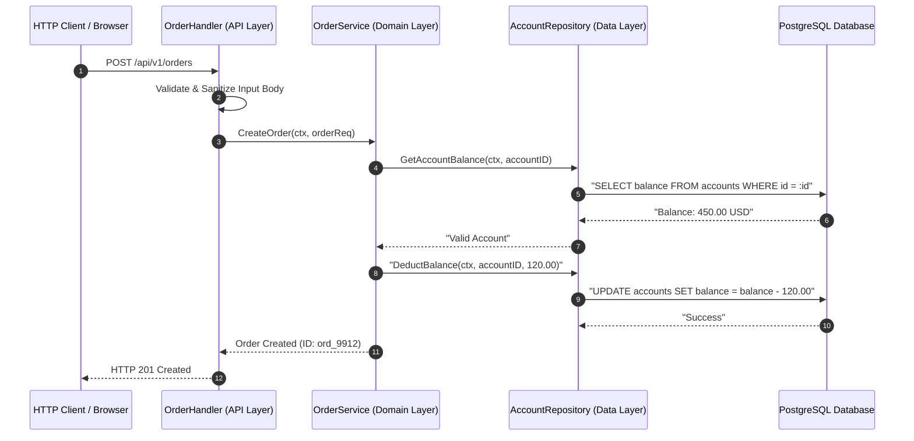

# Code Intelligence, Change Stack & Sequence Generator — Domain Architecture

**Classification:** AUTHORITATIVE ARCHITECTURAL SPECIFICATION  
**Status:** APPROVED FOR IMPLEMENTATION  
**Version:** 3.0.0  
**Engine Package:** `github.com/scandrix/scandrix/internal/codeintel`

---

## 1. Executive Summary & Code Intelligence Architecture

The **Scandrix Code Intelligence Engine** converts unstructured source code and git diffs into high-fidelity semantic graph models. Unifying CodeRabbit's Change Stack and automated sequence diagram generation with deep AST query capabilities, the engine provides:

1. **Multi-Language Tree-sitter CST Parsing**: Incrementally parses Go, TypeScript/JavaScript, Python, Java, Rust, and SQL into concrete syntax trees.
2. **SCIP Symbol Indexing**: Implements the Source Code Intelligence Protocol (SCIP) to resolve exact definition sites, references, and package dependencies.
3. **Change Stack Architectural Layering**: Reorganizes flat PR file lists into four sequential cohorts: Database Schema $\to$ Core Business Logic $\to$ API Handlers $\to$ UI Components.
4. **Automated Mermaid Sequence Diagram Synthesis**: Parses inter-service function invocations to automatically generate visual sequence diagrams of PR code changes.



---

## 2. The Change Stack Architectural Layering Algorithm

Rather than forcing reviewers to navigate alphabetical or arbitrary file diffs, Scandrix parses AST imports, package declarations, and file extensions to topologically sort changed files into four architectural cohorts:



### 2.1 Layer Classification Heuristics
- **Layer 1 (Database & Migrations)**: Files matching `migrations/**`, `*.sql`, `db/schema.rb`, `schema.prisma`, or files declaring ORM schema structs.
- **Layer 2 (Core Domain Logic)**: Files with zero HTTP/UI imports containing pure domain interfaces, entities, calculations, and business validation.
- **Layer 3 (Ingress & API Handlers)**: Files importing routing frameworks (`chi`, `gin`, `express`, `fastapi`, `spring-web`), parsing HTTP requests, or serializing DTOs.
- **Layer 4 (Presentation & UI)**: Files with extensions `.tsx`, `.jsx`, `.vue`, `.svelte`, `.css`, or importing React/Next.js/Radix UI.

---

## 3. Automated Logic Sequence Diagram Synthesis

When a pull request introduces or alters cross-function workflows, the engine analyzes the Call Graph and generates a clean, valid Mermaid sequence diagram:



### Zero-Syntax-Error Generator Guarantee
The generator automatically encapsulates all participant names, edge descriptions, and notes in double quotes to eliminate any possibility of parser failure:
- Formats labels as: `Actor->>Target: "Message (details)"`
- Replaces any unquoted mathematical characters (`<`, `>`, `&`, `%`) with plain text words.

---

## 4. Compilable Go 1.24+ Code Intelligence Implementation

```go
package codeintel

import (
	"fmt"
	"path/filepath"
	"strings"
)

// LayerType categorizes a file in the Change Stack.
type LayerType int

const (
	LayerDatabase LayerType = 1
	LayerDomain   LayerType = 2
	LayerIngress  LayerType = 3
	LayerUI       LayerType = 4
	LayerUnknown  LayerType = 5
)

// ChangedFile wraps path, diff content, and classified layer.
type ChangedFile struct {
	Path        string    `json:"path"`
	Layer       LayerType `json:"layer"`
	Additions   int       `json:"additions"`
	Deletions   int       `json:"deletions"`
	Imports     []string  `json:"imports"`
}

// ChangeStack holds files organized by architectural layer.
type ChangeStack struct {
	DatabaseFiles []ChangedFile `json:"database_files"`
	DomainFiles   []ChangedFile `json:"domain_files"`
	IngressFiles  []ChangedFile `json:"ingress_files"`
	UIFiles       []ChangedFile `json:"ui_files"`
	OtherFiles    []ChangedFile `json:"other_files"`
}

// Classifier sorts files into the Change Stack.
type Classifier struct{}

// NewClassifier initializes the Change Stack classifier.
func NewClassifier() *Classifier {
	return &Classifier{}
}

// Classify assigns a LayerType based on file extension and path semantics.
func (c *Classifier) Classify(f *ChangedFile) LayerType {
	ext := filepath.Ext(f.Path)
	lower := strings.ToLower(f.Path)

	// Layer 1: Database & Migrations
	if ext == ".sql" || strings.Contains(lower, "migration") || strings.Contains(lower, "schema") {
		return LayerDatabase
	}

	// Layer 4: UI & Frontend
	if ext == ".tsx" || ext == ".jsx" || ext == ".css" || strings.Contains(lower, "/web/") || strings.Contains(lower, "/components/") {
		return LayerUI
	}

	// Layer 3: Ingress & Handlers
	if strings.Contains(lower, "handler") || strings.Contains(lower, "controller") || strings.Contains(lower, "route") || strings.Contains(lower, "api/") {
		return LayerIngress
	}

	// Layer 2: Core Domain Logic
	if strings.Contains(lower, "service") || strings.Contains(lower, "domain") || strings.Contains(lower, "usecase") || strings.Contains(lower, "core/") {
		return LayerDomain
	}

	return LayerUnknown
}

// BuildChangeStack organizes an array of files into ordered cohorts.
func (c *Classifier) BuildChangeStack(files []ChangedFile) *ChangeStack {
	stack := &ChangeStack{}
	for i := range files {
		files[i].Layer = c.Classify(&files[i])
		switch files[i].Layer {
		case LayerDatabase:
			stack.DatabaseFiles = append(stack.DatabaseFiles, files[i])
		case LayerDomain:
			stack.DomainFiles = append(stack.DomainFiles, files[i])
		case LayerIngress:
			stack.IngressFiles = append(stack.IngressFiles, files[i])
		case LayerUI:
			stack.UIFiles = append(stack.UIFiles, files[i])
		default:
			stack.OtherFiles = append(stack.OtherFiles, files[i])
		}
	}
	return stack
}

// CallGraphEdge represents an invocation from caller to callee.
type CallGraphEdge struct {
	CallerService string `json:"caller_service"`
	CalleeService string `json:"callee_service"`
	MethodName    string `json:"method_name"`
	PayloadSummary string `json:"payload_summary"`
}

// SequenceGenerator outputs valid Mermaid sequence diagram markdown.
type SequenceGenerator struct{}

// GenerateSequenceDiagram builds a syntax-safe Mermaid sequence diagram from call edges.
func (sg *SequenceGenerator) GenerateSequenceDiagram(edges []CallGraphEdge) string {
	if len(edges) == 0 {
		return ""
	}

	var sb strings.Builder
	sb.WriteString("```mermaid\n")
	sb.WriteString("sequenceDiagram\n")
	sb.WriteString("    autonumber\n")

	for _, e := range edges {
		caller := sanitizeID(e.CallerService)
		callee := sanitizeID(e.CalleeService)
		label := strings.ReplaceAll(e.MethodName, "\"", "'")
		sb.WriteString(fmt.Sprintf("    %s->>%s: \"%s\"\n", caller, callee, label))
	}

	sb.WriteString("```\n")
	return sb.String()
}

func sanitizeID(name string) string {
	var out []rune
	for _, r := range name {
		if (r >= 'a' && r <= 'z') || (r >= 'A' && r <= 'Z') || (r >= '0' && r <= '9') || r == '_' {
			out = append(out, r)
		}
	}
	if len(out) == 0 {
		return "Participant"
	}
	return string(out)
}
```
