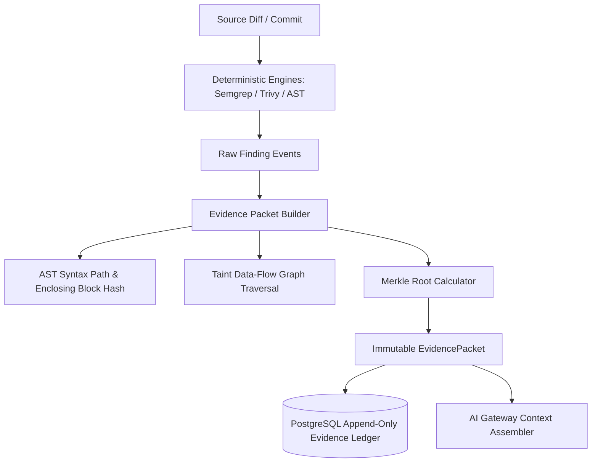

# Evidence Engine — Domain Architecture Specification

**Classification:** AUTHORITATIVE SPECIFICATION  
**Status:** APPROVED  
**Version:** 2.0.0  
**Engine Package:** `github.com/scandrix/scandrix/internal/evidence`

---

## 1. Executive Summary: Evidence Over Opinion Principle

In standard AI code review tools, findings are generated by ungrounded probabilistic language models, leading to high false-positive rates, developer fatigue, and hallucinations. 

The **Scandrix Evidence Engine** enforces the foundational axiom:
> **"A finding is only marked `CONFIRMED` when backed by deterministic cryptographic proof. AI reasoning is an interpretive synthesis layer, never the evidentiary source."**

Every security vulnerability, compliance violation, or architectural flaw reported by Scandrix must be backed by an immutable, cryptographically verifiable **Evidence Packet**. If an LLM asserts that a line is vulnerable, but deterministic AST queries or taint traces fail to corroborate the vulnerability sink, the finding is degraded to `PROBABILISTIC_ADVISORY` and cannot block a pull request or break a build.



---

## 2. Cryptographic Formulation & Merkle Proofs

Each Evidence Packet contains a composite SHA-256 Merkle root that immutably links the finding to the exact source commit, AST subtree, and tool execution record.

### 2.1 Merkle Root Mathematical Construction

$$\mathcal{H}_{\text{evidence}} = \text{SHA256}\left( \mathcal{H}_{\text{source}} \parallel \mathcal{H}_{\text{ast}} \parallel \mathcal{H}_{\text{taint}} \parallel \mathcal{H}_{\text{engine}} \parallel \text{Timestamp} \right)$$

Where:
- $\mathcal{H}_{\text{source}} = \text{SHA256}(\text{CommitSHA} \parallel \text{FilePath} \parallel \text{StartLine} \parallel \text{EndLine})$
- $\mathcal{H}_{\text{ast}} = \text{SHA256}(\text{ASTNodeType} \parallel \text{ASTCanonicalPath} \parallel \text{NormalizedNodeBytes})$
- $\mathcal{H}_{\text{taint}} = \bigoplus_{i=1}^{k} \text{SHA256}(\text{Hop}_i.\text{Source} \parallel \text{Hop}_i.\text{Sink} \parallel \text{Hop}_i.\text{SanitizerStatus})$
- $\mathcal{H}_{\text{engine}} = \text{SHA256}(\text{EngineName} \parallel \text{EngineVersion} \parallel \text{RuleID} \parallel \text{DeterministicOutputBytes})$

Any subsequent modification to the source code, line numbers, or AST representation invalidates the hash, preventing stale or forged security findings from being carried forward across git rebase operations.

---

## 3. Compilable Go 1.24+ Evidence Engine Implementation

```go
package evidence

import (
	"crypto/sha256"
	"encoding/hex"
	"errors"
	"fmt"
	"time"
)

// ConfirmationStatus designates the evidential weight of a finding.
type ConfirmationStatus string

const (
	StatusConfirmed             ConfirmationStatus = "CONFIRMED"
	StatusProbabilisticAdvisory ConfirmationStatus = "PROBABILISTIC_ADVISORY"
	StatusDisproved             ConfirmationStatus = "DISPROVED"
)

// TaintHop records an intermediate data-flow transition from source to sink.
type TaintHop struct {
	HopIndex        int    `json:"hop_index"`
	SourceFile      string `json:"source_file"`
	SourceLine      int    `json:"source_line"`
	SymbolName      string `json:"symbol_name"`
	IsSanitized     bool   `json:"is_sanitized"`
	SanitizerMethod string `json:"sanitizer_method,omitempty"`
}

// DependencyProof documents an SCA vulnerability with package provenance.
type DependencyProof struct {
	PackageManager string `json:"package_manager"` // e.g., "go.mod", "npm", "cargo"
	PackageName    string `json:"package_name"`
	Version        string `json:"version"`
	CVE            string `json:"cve"`
	GHSA           string `json:"ghsa,omitempty"`
	PURL           string `json:"purl"`
	VulnerableCall string `json:"vulnerable_call,omitempty"`
}

// ReachabilityProof documents whether a finding is reachable at runtime.
type ReachabilityProof struct {
	IsIngressReachable bool     `json:"is_ingress_reachable"`
	IngressRoute       string   `json:"ingress_route,omitempty"`
	NetworkExposed     bool     `json:"network_exposed"`
	ObservedTraces     []string `json:"observed_traces,omitempty"`
}

// EvidencePacket is the immutable canonical record backing every confirmed finding.
type EvidencePacket struct {
	PacketID            string             `json:"packet_id"`
	CommitSHA           string             `json:"commit_sha"`
	SourceFile          string             `json:"source_file"`
	StartLine           int                `json:"start_line"`
	EndLine             int                `json:"end_line"`
	Status              ConfirmationStatus `json:"status"`
	ASTNodePath         string             `json:"ast_node_path"`
	TaintDataflowTrace  []TaintHop         `json:"taint_dataflow_trace,omitempty"`
	DependencyProof     *DependencyProof   `json:"dependency_proof,omitempty"`
	RuntimeReachability *ReachabilityProof `json:"runtime_reachability,omitempty"`
	EvidenceHash        string             `json:"evidence_hash"`
	RecordedAt          time.Time          `json:"recorded_at"`
}

// ComputeEvidenceHash derives the cryptographic Merkle root for the packet.
func (p *EvidencePacket) ComputeEvidenceHash() string {
	h := sha256.New()
	h.Write([]byte(fmt.Sprintf("%s:%s:%s:%d:%d", p.PacketID, p.CommitSHA, p.SourceFile, p.StartLine, p.EndLine)))
	h.Write([]byte(fmt.Sprintf(":%s:%s", p.Status, p.ASTNodePath)))

	for _, hop := range p.TaintDataflowTrace {
		h.Write([]byte(fmt.Sprintf(":%d:%s:%d:%t", hop.HopIndex, hop.SymbolName, hop.SourceLine, hop.IsSanitized)))
	}

	if p.DependencyProof != nil {
		h.Write([]byte(fmt.Sprintf(":%s:%s:%s", p.DependencyProof.PackageName, p.DependencyProof.Version, p.DependencyProof.CVE)))
	}

	return hex.EncodeToString(h.Sum(nil))
}

// VerifyIntegrity verifies that the packet hash matches its contents.
func (p *EvidencePacket) VerifyIntegrity() bool {
	expected := p.ComputeEvidenceHash()
	return p.EvidenceHash == expected
}

// PacketBuilder constructs and cryptographically seals an EvidencePacket.
type PacketBuilder struct {
	packet EvidencePacket
}

// NewPacketBuilder initializes a new builder instance.
func NewPacketBuilder(id, commit, file string, startLine, endLine int) *PacketBuilder {
	return &PacketBuilder{
		packet: EvidencePacket{
			PacketID:   id,
			CommitSHA:  commit,
			SourceFile: file,
			StartLine:  startLine,
			EndLine:    endLine,
			RecordedAt: time.Now().UTC(),
		},
	}
}

// WithASTNode sets the syntax tree path.
func (b *PacketBuilder) WithASTNode(nodePath string) *PacketBuilder {
	b.packet.ASTNodePath = nodePath
	return b
}

// WithTaintTrace appends validated taint analysis transitions.
func (b *PacketBuilder) WithTaintTrace(hops []TaintHop) *PacketBuilder {
	b.packet.TaintDataflowTrace = hops
	return b
}

// Seal finalizes the packet and calculates the cryptographic Merkle root.
func (b *PacketBuilder) Seal(status ConfirmationStatus) (*EvidencePacket, error) {
	if b.packet.SourceFile == "" || b.packet.CommitSHA == "" {
		return nil, errors.New("source_file and commit_sha are mandatory for evidence sealing")
	}

	b.packet.Status = status
	b.packet.EvidenceHash = b.packet.ComputeEvidenceHash()
	return &b.packet, nil
}
```

---

## 4. Ledger Persistence & Immutability Guarantees

Evidence packets are persisted directly in the `evidence_packets` PostgreSQL table (defined in [`DATA-MODEL.md`](file:///home/tarun/Videos/kodus-ai/ScanDrix/SCANDRIX-DOCS/06-DATABASE/DATA-MODEL.md)):

```sql
-- Append-only evidence table enforcement
CREATE TABLE IF NOT EXISTS evidence_packets (
    id UUID PRIMARY KEY DEFAULT gen_random_uuid(),
    packet_id VARCHAR(64) NOT NULL UNIQUE,
    commit_sha VARCHAR(64) NOT NULL,
    source_file TEXT NOT NULL,
    start_line INTEGER NOT NULL,
    end_line INTEGER NOT NULL,
    status VARCHAR(32) NOT NULL,
    ast_node_path TEXT NOT NULL,
    evidence_hash CHAR(64) NOT NULL,
    payload JSONB NOT NULL,
    recorded_at TIMESTAMPTZ NOT NULL DEFAULT NOW()
);

-- Deny UPDATE and DELETE on evidence records to guarantee audit integrity
CREATE RULE prevent_evidence_update AS ON UPDATE TO evidence_packets DO INSTEAD NOTHING;
CREATE RULE prevent_evidence_delete AS ON DELETE TO evidence_packets DO INSTEAD NOTHING;
```
