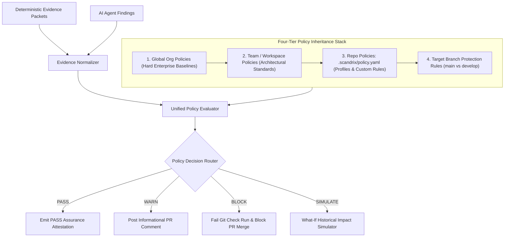
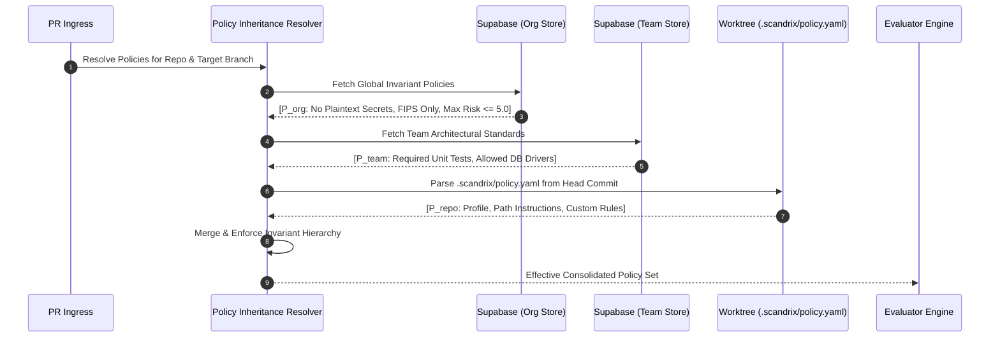
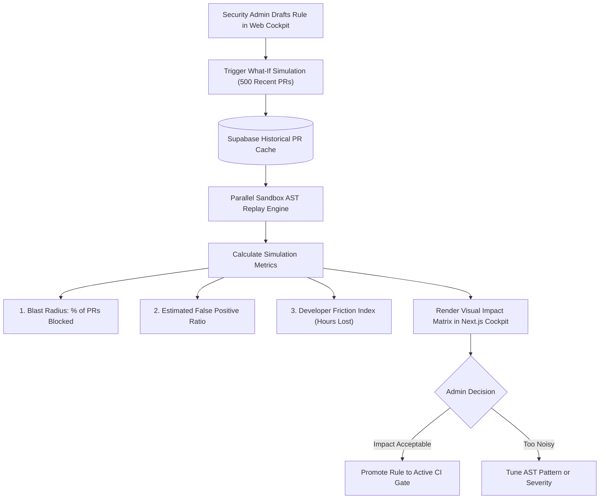

# Policy Engine, Rules Catalog & What-If Simulator — Domain Specification

**Classification:** AUTHORITATIVE ARCHITECTURAL SPECIFICATION  
**Status:** APPROVED FOR IMPLEMENTATION  
**Version:** 3.0.0  
**Engine Package:** `github.com/scandrix/scandrix/internal/policy`

---

## 1. Executive Summary & Policy Architecture

The Scandrix Policy Engine governs incoming pull request diffs, software bill-of-materials (SBOM), infrastructure manifests, and AI agent investigations against organizational compliance standards. Advancing beyond the repository rule capabilities of legacy code review bots with the rigorous mathematical assurance of Scandrix, the engine provides:

1. **Four-Tier Hierarchical Inheritance**: Global Organization $\to$ Workspace/Team $\to$ Repository (`.scandrix/policy.yaml`) $\to$ Protected Branch.
2. **Dual Review Profiles**: `assertive` (strict enterprise compliance & security gates) vs. `chill` (developer velocity, educational suggestions).
3. **Out-of-the-Box Policy Catalog**: Pre-built rulesets for OWASP Top 10, CWE Top 25, SANS Top 25, Go Concurrency, and Memory Safety.
4. **File-Path Instructions**: Context-specific guidance (e.g., forcing unit tests in `services/**` or forbidding plain HTTP in `clients/**`).
5. **What-If Historical Simulation**: Replays candidate rules against up to 500 merged PRs to compute blast radius before production activation.



---

## 2. Policy Hierarchy & Scoping Precedence

Scandrix enforces a strict inheritance model where higher administrative scopes establish non-overridable security baselines:



### Formal Decision Function

Given evidence packets $\mathcal{E}$ and the effective consolidated policy set $\mathcal{P} = \mathcal{P}_{\text{org}} \cup \mathcal{P}_{\text{team}} \cup \mathcal{P}_{\text{repo}}$, the evaluation function $\mathcal{D}(\mathcal{E}, \mathcal{P})$ produces:

$$\mathcal{D}(\mathcal{E}, \mathcal{P}) = \begin{cases} 
\text{BLOCK}, & \exists p \in \mathcal{P} : p.\text{action} = \text{BLOCK} \land p.\text{condition}(\mathcal{E}) = \text{TRUE} \\
\text{REQUIRE\_APPROVAL}, & \exists p \in \mathcal{P} : p.\text{action} = \text{GATE} \land p.\text{condition}(\mathcal{E}) = \text{TRUE} \\
\text{WARN}, & \exists p \in \mathcal{P} : p.\text{action} = \text{WARN} \land p.\text{condition}(\mathcal{E}) = \text{TRUE} \\
\text{PASS}, & \text{otherwise}
\end{cases}$$

---

## 3. Canonical Repository Configuration (`.scandrix/policy.yaml`)

Teams define repository-level behavior via `.scandrix/policy.yaml` placed at the root of their git repository:

```yaml
# yaml-language-server: $schema=https://scandrix.io/schemas/policy.v3.json
version: "3.0"

# Review Personality and Profile
review:
  profile: "assertive" # Options: "assertive" (strict security gating) or "chill" (educational, non-blocking)
  auto_review:
    enabled: true
    draft_prs: false
    trigger_on_push: true
  cognitive_budget:
    max_suggestions: 6 # Strictly caps inline PR comments to avoid developer review fatigue

# Project Management Alignment
issue_alignment:
  provider: "jira" # Options: "jira", "linear", "github"
  enforce_acceptance_criteria: true
  block_on_untracked_scope: false

# Targeted Path Instructions
file_path_instructions:
  - path: "internal/services/**"
    instructions: |
      Ensure every public service method accepts a context.Context as its first argument.
      Enforce table-driven unit tests for all domain business calculations.
  - path: "api/handlers/**"
    instructions: |
      Verify that request bodies are decoded using json.NewDecoder with DisallowUnknownFields().
      Ensure all handlers execute rate limiting and authentication checks.
  - path: "**/*.sql"
    instructions: |
      Verify all schema migrations follow expand/contract patterns.
      Ensure foreign key columns have explicit indexes created concurrently.

# Policy Catalog Activations
catalog:
  rulesets:
    - name: "owasp-top-10"
      severity_gate: "HIGH" # Block PRs on High or Critical violations
    - name: "go-concurrency-safety"
      severity_gate: "CRITICAL"
    - name: "cwe-top-25"
      severity_gate: "HIGH"

# Custom Repository Rules
custom_rules:
  - id: "RULE-REPO-001"
    name: "Forbid Raw Exec in Handlers"
    severity: "CRITICAL"
    action: "BLOCK"
    match:
      language: "go"
      pattern: 'exec.Command($CMD, ...)'
    explanation: "Executing subshell commands from web handlers is forbidden. Use internal Go packages instead."
```

---

## 4. Pre-Built Policy Catalog

Scandrix ships with an authoritative catalog of enterprise-grade security and architectural rulesets:

| Ruleset Name | Coverage Standard | Typical Violations Flagged | Default Action |
| :--- | :--- | :--- | :--- |
| **`owasp-top-10`** | A01-A10: Broken Access Control, Injection, SSRF, Cryptographic Failures | SQL concatenation, path traversal, untrusted XML parsing | `BLOCK` |
| **`cwe-top-25`** | CWE-79, CWE-89, CWE-20, CWE-22, CWE-78 | Buffer overflows, unvalidated redirects, command injection | `BLOCK` |
| **`go-concurrency-safety`** | Go Concurrency Idioms & Memory Model | Goroutine leaks on unbuffered channels, loop closure race conditions, sync.WaitGroup misuse | `BLOCK` |
| **`secret-entropy-shield`** | High-Entropy Tokens & API Keys | AWS keys, Stripe secrets, JWT tokens, private keys ($\mathcal{H} \ge 3.85$) | `BLOCK` |
| **`license-hygiene`** | Software Bill of Materials (SBOM) | Incompatible copyleft licenses (GPL/AGPL) inside proprietary binaries | `WARN` |
| **`typescript-strictness`** | Enterprise TypeScript Quality | `any` casts in public interfaces, unhandled Promise rejections, floating async | `WARN` |

---

## 5. What-If Historical Impact Simulator

To prevent broken build pipelines and developer backlash, security administrators can simulate any rule before enabling it in production CI:



### Simulation Mathematical Formulations

1. **PR Blast Radius Ratio ($B_R$)**:
   $$B_R = \frac{\sum_{i=1}^N \mathbf{1}(\text{Violates}(\text{PR}_i, \text{Rule}_{\text{candidate}}))}{N} \times 100\%$$
   *Threshold Gate: If $B_R > 12\%$, the simulator warns of high developer disruption.*

2. **Projected Developer Friction Index ($DFI$)**:
   $$DFI = B_R \times \text{Average PR Triage Time (minutes)} \times \text{Monthly PR Velocity}$$

---

## 6. Compilable Go 1.24+ Policy Evaluator Implementation

```go
package policy

import (
	"context"
	"errors"
	"fmt"
	"regexp"
	"strings"
	"time"
)

// PolicyAction defines the enforcement consequence.
type PolicyAction string

const (
	ActionPass            PolicyAction = "PASS"
	ActionWarn            PolicyAction = "WARN"
	ActionRequireApproval PolicyAction = "REQUIRE_APPROVAL"
	ActionBlock           PolicyAction = "BLOCK"
)

// ReviewProfile defines developer interaction tone.
type ReviewProfile string

const (
	ProfileAssertive ReviewProfile = "assertive"
	ProfileChill     ReviewProfile = "chill"
)

// PolicyRule defines an individual evaluation check.
type PolicyRule struct {
	ID          string       `json:"id"`
	Name        string       `json:"name"`
	Severity    string       `json:"severity"`
	Action      PolicyAction `json:"action"`
	Language    string       `json:"language"`
	Pattern     string       `json:"pattern"`
	Explanation string       `json:"explanation"`
	IsDryRun    bool         `json:"is_dry_run"`
}

// RepositoryPolicy mirrors the parsed .scandrix/policy.yaml.
type RepositoryPolicy struct {
	Version              string            `yaml:"version"`
	Profile              ReviewProfile     `yaml:"profile"`
	MaxSuggestions       int               `yaml:"max_suggestions"`
	FilePathInstructions []PathInstruction `yaml:"file_path_instructions"`
	Rulesets             []string          `yaml:"rulesets"`
	CustomRules          []PolicyRule      `yaml:"custom_rules"`
}

// PathInstruction binds contextual guidance to file globs.
type PathInstruction struct {
	PathGlob     string `yaml:"path"`
	Instructions string `yaml:"instructions"`
}

// PolicyEvaluator executes the consolidated policy set.
type PolicyEvaluator struct {
	catalog map[string][]PolicyRule
}

// NewPolicyEvaluator initializes the evaluator with pre-built catalogs.
func NewPolicyEvaluator() *PolicyEvaluator {
	pe := &PolicyEvaluator{
		catalog: make(map[string][]PolicyRule),
	}
	pe.loadStandardCatalog()
	return pe
}

func (pe *PolicyEvaluator) loadStandardCatalog() {
	pe.catalog["owasp-top-10"] = []PolicyRule{
		{
			ID:          "OWASP-A03-SQLI",
			Name:        "SQL Query Concatenation",
			Severity:    "CRITICAL",
			Action:      ActionBlock,
			Language:    "go",
			Pattern:     `db\.Query\(.*fmt\.Sprintf`,
			Explanation: "Untrusted string formatting inside SQL queries leads to SQL injection. Use parameterized queries ($1, ?).",
		},
	}
	pe.catalog["go-concurrency-safety"] = []PolicyRule{
		{
			ID:          "GO-CONC-LEAK",
			Name:        "Unbuffered Channel Goroutine Leak",
			Severity:    "HIGH",
			Action:      ActionBlock,
			Language:    "go",
			Pattern:     `make\(chan [a-zA-Z0-9]+, 0\)`,
			Explanation: "Unbuffered channels written inside uncoordinated goroutines can leak if readers exit early.",
		},
	}
}

// EvaluationResult packages the composite decision.
type EvaluationResult struct {
	OverallDecision PolicyAction   `json:"overall_decision"`
	Violations      []RuleMatch    `json:"violations"`
	EvaluatedAt     time.Time      `json:"evaluated_at"`
	ExecutionTimeMs int64          `json:"execution_time_ms"`
}

// RuleMatch records an individual triggered rule.
type RuleMatch struct {
	RuleID      string       `json:"rule_id"`
	File        string       `json:"file"`
	Line        int          `json:"line"`
	Severity    string       `json:"severity"`
	Action      PolicyAction `json:"action"`
	Explanation string       `json:"explanation"`
}

// Evaluate evaluates repository diffs against active policies.
func (pe *PolicyEvaluator) Evaluate(ctx context.Context, repoPolicy *RepositoryPolicy, diffContent string) (*EvaluationResult, error) {
	start := time.Now()
	res := &EvaluationResult{
		OverallDecision: ActionPass,
		EvaluatedAt:     start,
	}

	var rulesToTest []PolicyRule
	// Load catalog rules
	for _, setName := range repoPolicy.Rulesets {
		if catRules, exists := pe.catalog[setName]; exists {
			rulesToTest = append(rulesToTest, catRules...)
		}
	}
	// Append custom repo rules
	rulesToTest = append(rulesToTest, repoPolicy.CustomRules...)

	for _, rule := range rulesToTest {
		if rule.Pattern == "" {
			continue
		}
		re, err := regexp.Compile(rule.Pattern)
		if err != nil {
			return nil, fmt.Errorf("invalid pattern in rule %s: %w", rule.ID, err)
		}

		if re.MatchString(diffContent) {
			match := RuleMatch{
				RuleID:      rule.ID,
				Severity:    rule.Severity,
				Action:      rule.Action,
				Explanation: rule.Explanation,
			}
			res.Violations = append(res.Violations, match)

			// Elevate overall decision
			if rule.Action == ActionBlock && !rule.IsDryRun {
				res.OverallDecision = ActionBlock
			} else if rule.Action == ActionWarn && res.OverallDecision != ActionBlock {
				res.OverallDecision = ActionWarn
			}
		}
	}

	res.ExecutionTimeMs = time.Since(start).Milliseconds()
	return res, nil
}
```
