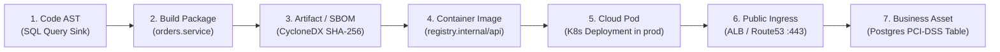

# Security Twin & Code-to-Cloud Continuum — Domain Architecture

**Classification:** AUTHORITATIVE SPECIFICATION  
**Status:** APPROVED  
**Version:** 2.0.0  
**Engine Package:** `github.com/scandrix/scandrix/internal/securitytwin`

---

## 1. Executive Summary: The 7-Hop Continuum

Traditional application security evaluates code vulnerabilities in isolation from their production reality. A SQL injection in an internal cron job that runs offline is treated identically to an unauthenticated SQL injection in an Internet-facing payment processing controller.

The **Scandrix Security Twin** models enterprise software as an interconnected digital twin spanning the **7-Hop Code-to-Cloud Continuum**:

$$\text{Code AST} \longrightarrow \text{Build / Package} \longrightarrow \text{Artifact / SBOM} \longrightarrow \text{Container Image} \longrightarrow \text{Cloud Deployment} \longrightarrow \text{Runtime Ingress} \longrightarrow \text{Business Asset}$$



---

## 2. Ingestion Plane Connectors

The Security Twin synthesizes metadata across four distinct organizational planes:
1. **SCM Plane**: Git commit history, pull request diffs, code ownership (`CODEOWNERS`), and AST taint graphs.
2. **Build & Supply Chain Plane**: CycloneDX SBOMs, compiler flags, and Cosign OCI layer signatures.
3. **Cloud Infrastructure Plane**: Kubernetes CRDs, AWS Route 53 / ALB ingress routes, IAM role bindings, and VPC security group egress boundaries.
4. **Runtime Telemetry Plane**: eBPF network socket connections, APM distributed trace spans, and CloudTrail access events.

---

## 3. Dynamic CVSS Risk Attenuation

The Security Twin dynamically attenuates static vulnerability severity scores based on verified live mitigations. The residual (attenuated) risk is the product of base severity and the unmitigated failure probabilities across all verified controls $\mathcal{M}$:

$$R_{\text{attenuated}} = \text{CVSS} \times \prod_{m \in \mathcal{M}} (1.0 - \text{Efficacy}(m))$$

Equivalently, expressing total defensive mitigation benefit as $\mathcal{B}_{\text{mitigation}} = 1.0 - \prod_{m \in \mathcal{M}} (1.0 - \text{Efficacy}(m))$, the attenuated risk is:

$$R_{\text{attenuated}} = \text{CVSS} \times (1.0 - \mathcal{B}_{\text{mitigation}})$$

Where $\mathcal{M}$ represents active verified runtime mitigations:
- AWS WAF SQLi inspection rule active on ALB: $\text{Efficacy} = 0.80$ (residual multiplier $= 0.20$)
- NetworkPolicy isolating pod from database egress: $\text{Efficacy} = 0.95$ (residual multiplier $= 0.05$)
- Inactive / dead code path (zero runtime trace invocations): $\text{Efficacy} = 0.90$ (residual multiplier $= 0.10$)

### 3.1 Correlated Control Mitigation Adjustment
When two or more compensating controls target the identical vulnerability layer (e.g., Cloudflare WAF regex and code-level ORM parameterization both addressing SQL injection), they cannot be assumed statistically independent. The engine applies a **Correlation Discount Factor** $\rho \in [0.0, 1.0]$:

$$\text{Efficacy}_{\text{effective}}(m_2 \mid m_1) = \text{Efficacy}(m_2) \times (1.0 - \rho \cdot \text{Similarity}(m_1, m_2))$$

For independent controls (e.g., NetworkPolicy + WAF), $\rho = 0.0$. For overlapping ingress filters, $\rho \ge 0.60$, preventing synthetic over-attenuation of critical vulnerabilities.

---

## 4. Compilable Go 1.24+ Security Twin Implementation

```go
package securitytwin

import (
	"context"
	"fmt"
	"sync"
	"time"
)

// ContinuumStage designates the 7-hop lifecycle position.
type ContinuumStage string

const (
	StageCodeAST         ContinuumStage = "CODE_AST"
	StageBuildPackage    ContinuumStage = "BUILD_PACKAGE"
	StageArtifactSBOM    ContinuumStage = "ARTIFACT_SBOM"
	StageContainerImage  ContinuumStage = "CONTAINER_IMAGE"
	StageCloudDeployment ContinuumStage = "CLOUD_DEPLOYMENT"
	StageRuntimeIngress  ContinuumStage = "RUNTIME_INGRESS"
	StageBusinessAsset   ContinuumStage = "BUSINESS_ASSET"
)

// TwinNode represents an entity in the Code-to-Cloud graph.
type TwinNode struct {
	ID         string         `json:"id"`
	TenantID   string         `json:"tenant_id"`
	Stage      ContinuumStage `json:"stage"`
	Identifier string         `json:"identifier"` // e.g. "arn:aws:elasticloadbalancing:..."
	Metadata   map[string]any `json:"metadata"`
	UpdatedAt  time.Time      `json:"updated_at"`
}

// TwinEdge represents a provenance or deployment connection.
type TwinEdge struct {
	SourceID     string  `json:"source_id"`
	TargetID     string  `json:"target_id"`
	RelationType string  `json:"relation_type"` // e.g., "COMPILES_TO", "DEPLOYS_TO"
	Mitigation   float64 `json:"mitigation"`    // [0.0, 0.95]
}

// DigitalTwin maintains the real-time graph model in memory.
type DigitalTwin struct {
	mu    sync.RWMutex
	nodes map[string]TwinNode
	edges []TwinEdge
}

// NewDigitalTwin creates an empty twin instance.
func NewDigitalTwin() *DigitalTwin {
	return &DigitalTwin{
		nodes: make(map[string]TwinNode),
		edges: make([]TwinEdge, 0),
	}
}

// UpsertNode updates an entity in the twin.
func (dt *DigitalTwin) UpsertNode(node TwinNode) {
	dt.mu.Lock()
	defer dt.mu.Unlock()
	node.UpdatedAt = time.Now().UTC()
	dt.nodes[node.ID] = node
}

// IsPubliclyExposed traces whether a Code AST node has an unbroken path to a public ingress.
func (dt *DigitalTwin) IsPubliclyExposed(astNodeID string) bool {
	dt.mu.RLock()
	defer dt.mu.RUnlock()

	visited := make(map[string]bool)
	queue := []string{astNodeID}

	for len(queue) > 0 {
		curr := queue[0]
		queue = queue[1:]

		if node, ok := dt.nodes[curr]; ok && node.Stage == StageRuntimeIngress {
			return true
		}

		visited[curr] = true
		for _, edge := range dt.edges {
			if edge.SourceID == curr && !visited[edge.TargetID] {
				queue = append(queue, edge.TargetID)
			}
		}
	}

	return false
}
```
