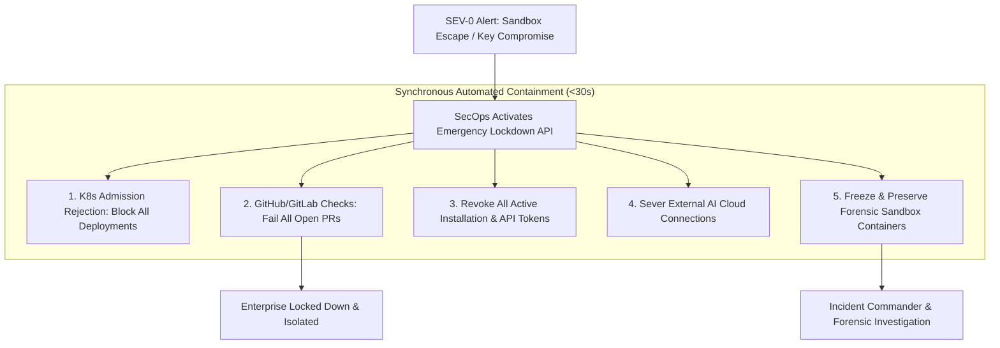

# Incident Response & Emergency Lockdown — Technical Specification

**Classification:** AUTHORITATIVE SPECIFICATION  
**Status:** APPROVED  
**Version:** 2.0.0  
**Package:** `github.com/scandrix/scandrix/internal/incident`

---

## 1. Executive Summary & Emergency Kill Switch

The Scandrix Incident Response subsystem provides automated and manual circuit breakers to mitigate zero-day exploits, compromised git provider tokens, or suspicious tenant activity. Through the **Emergency Security Lockdown Protocol (Kill Switch)**, authorized SecOps administrators can instantly halt code merging, revoke active credentials, and air-gap external AI dependencies within seconds.



---

## 2. Severity Classification Matrix & SLAs

| Severity | Definition | Initial Response SLA | Resolution Target | Escalation Protocol |
|---|---|---|---|---|
| **SEV-0** | Active sandbox breakout, cross-tenant data leak, or compromised master KMS key | **$\le 15\text{ minutes}$** | $\le 4\text{ hours}$ | Immediate PagerDuty to CISO, VP Eng, and SecOps Commander |
| **SEV-1** | Confirmed critical zero-day exploit in core service or total webhook ingestion outage | **$\le 30\text{ minutes}$** | $\le 8\text{ hours}$ | Primary On-Call Engineer + Engineering Lead |
| **SEV-2** | Provider rate limit exhaustion, degraded AI fallback, or delayed queue execution | $\le 2\text{ hours}$ | $\le 24\text{ hours}$ | Engineering On-Call Slack notification |
| **SEV-3** | Non-blocking telemetry failure, single false-positive spike, or minor UI glitch | $\le 1\text{ business day}$ | Next Sprint | Standard backlog remediation |

---

## 3. Declarative Emergency Lockdown Policy

```yaml
emergency_lockdown:
  status: ACTIVE
  activated_by: "secops-commander@scandrix.internal"
  timestamp: "2026-08-29T03:40:00Z"
  enforced_controls:
    block_all_production_merges: true
    require_security_admin_override: true
    airgap_all_ai_providers: true
    enable_deep_security_profile_globally: true
    preserve_all_forensic_artifacts: true
    quarantine_affected_tenants:
      - "tenant-compromised-uuid"
```

---

## 4. Compilable Go 1.24+ Incident Coordinator

```go
package incident

import (
	"context"
	"fmt"
	"sync"
	"time"
)

// LockdownState represents the status of emergency containment.
type LockdownState string

const (
	StateNormal   LockdownState = "NORMAL"
	StateLockdown LockdownState = "ACTIVE_LOCKDOWN"
)

// Coordinator manages emergency containment and kill switches.
type Coordinator struct {
	mu     sync.RWMutex
	state  LockdownState
	reason string
}

// NewCoordinator initializes the incident manager in normal state.
func NewCoordinator() *Coordinator {
	return &Coordinator{state: StateNormal}
}

// IsLockdownActive returns true if the platform is currently locked down.
func (c *Coordinator) IsLockdownActive() bool {
	c.mu.RLock()
	defer c.mu.RUnlock()
	return c.state == StateLockdown
}

// TriggerLockdown activates the emergency kill switch across the platform.
func (c *Coordinator) TriggerLockdown(ctx context.Context, adminUser, reason string) error {
	c.mu.Lock()
	defer c.mu.Unlock()

	c.state = StateLockdown
	c.reason = reason

	// In production, triggers broadcast over Redis PubSub to immediately notify all API nodes
	fmt.Printf("[SECURITY EMERGENCY] Lockdown activated by %s at %s. Reason: %s\n",
		adminUser, time.Now().UTC().Format(time.RFC3339), reason)

	return nil
}

// ResetToNormal restores standard operations after incident resolution.
func (c *Coordinator) ResetToNormal(ctx context.Context, adminUser string) error {
	c.mu.Lock()
	defer c.mu.Unlock()

	c.state = StateNormal
	c.reason = ""

	fmt.Printf("[SECURITY NORMALIZED] Lockdown released by %s at %s\n",
		adminUser, time.Now().UTC().Format(time.RFC3339))

	return nil
}
```
