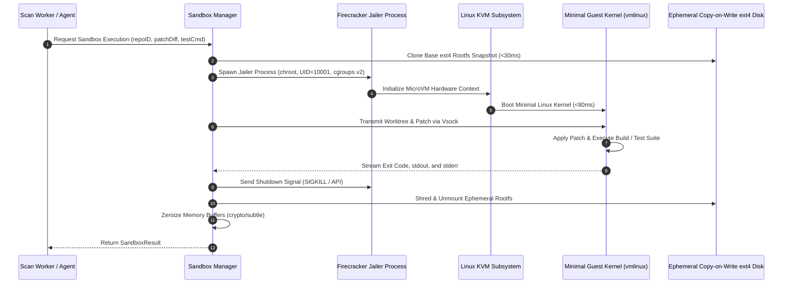

# Sandbox Security, Isolation & Jailer Architecture — Technical Specification

**Classification:** AUTHORITATIVE ARCHITECTURAL SPECIFICATION  
**Status:** APPROVED FOR IMPLEMENTATION  
**Version:** 3.0.0  
**Package:** `github.com/scandrix/scandrix/internal/sandbox`

---

## 1. Executive Summary & Defense-in-Depth Isolation

Executing untrusted developer source code, running arbitrary repository test suites, and compiling AI-generated patches introduces critical security risks: container breakouts, host kernel compromise via Linux kernel CVEs, denial of service via CPU/memory exhaustion (fork bombs), and network exfiltration of tenant secrets.

The Scandrix Sandbox subsystem enforces a **Dual-Tier Isolation Topology**:
1. **Tier 1: Fast-Pass gVisor Container Sandboxing (`runsc`)**: User-space kernel proxy (Sentry) intercepting all Linux syscalls, dropping all Linux capabilities (`CAP_DROP_ALL`), with a read-only root filesystem and `network_mode: none`. Optimized for high-throughput agent tool execution (`grep`, `readFile`, `astGrep`, `go vet`, `eslint`) with sub-second turnaround ($< 500\text{ms}$).
2. **Tier 2: Strong Hardware-Virtualization MicroVMs (Firecracker / KVM)**: Dedicated minimal Linux guest kernels (`vmlinux`) running inside isolated `jailer` processes with dedicated physical memory pages, cgroups v2 resource limits, seccomp filters, and isolated `tap` network interfaces. Utilized for executing full test suites, untrusted proof-of-fix patches, and active dynamic security verification.



---

## 2. Technical Comparison Matrix

| Security Dimension | Tier 1: gVisor (`runsc`) | Tier 2: Firecracker MicroVM |
| :--- | :--- | :--- |
| **Virtualization Boundary** | Syscall Interception (User-space Sentry) | Hardware Virtualization (KVM) |
| **Boot Latency** | $< 350\text{ ms}$ (includes user-space Sentry init) | $< 80\text{ ms}$ (bare-metal KVM context init) |
| **Kernel Isolation** | Host kernel shielded; Sentry emulates 300+ syscalls | Dedicated guest Linux kernel (zero host syscall exposure) |
| **Network Isolation** | `network_mode: none` (Loopback interface down) | Isolated `tap` device; external routing blocked by host `iptables` |
| **Filesystem Security** | Read-only rootfs (`/workspace:ro`) with writable tmpfs scratch at `/tmp` (`--tmpfs /tmp:rw,size=256m,noexec`) for build artifacts | Ephemeral ext4 raw disk image (copy-on-write snapshot) shredded upon container exit |
| **Resource Quotas** | cgroups v2 (`cpu.max=100000 100000`, `memory.max=512M`) | Direct KVM allocation (`vCPU=2`, `RAM=1024MB`, `pids.max=128`) |
| **Primary Workloads** | Tree-sitter, Semgrep, Gitleaks, `go vet`, `tsc --noEmit` | `go test -v -race ./...`, `npm test`, arbitrary test scripts |

---

## 3. Jailer Process Security Configuration

When executing Tier-2 workloads, the microVM is launched strictly via the `firecracker-jailer` wrapper to enforce sandboxing before Firecracker even starts:

```bash
/usr/bin/jailer \
  --id "scandrix-vm-019482fa" \
  --node 0 \
  --exec-file /usr/bin/firecracker \
  --uid 10001 \
  --gid 10001 \
  --chroot-base-dir /srv/jailer \
  --netns /var/run/netns/scandrix-sandbox \
  --daemonize \
  -- \
  --config-file /srv/jailer/scandrix-vm-019482fa/vm_config.json
```

### 3.1 Kernel Seccomp Filter
The jailer applies a strict seccomp BPF filter preventing the Firecracker process from invoking dangerous host syscalls (`ptrace`, `kexec_load`, `mount`, `chroot`, `reboot`).

---

## 4. Compilable Go 1.24+ Sandbox Controller Implementation

```go
package sandbox

import (
	"bytes"
	"context"
	"errors"
	"fmt"
	"os"
	"os/exec"
	"path/filepath"
	"time"
)

// SandboxTier indicates the isolation depth.
type SandboxTier string

const (
	TierGVisor      SandboxTier = "GVISOR"
	TierFirecracker SandboxTier = "FIRECRACKER"
)

// ExecutionRequest specifies commands and worktree paths for isolated execution.
type ExecutionRequest struct {
	Tier        SandboxTier   `json:"tier"`
	WorktreeDir string        `json:"worktree_dir"`
	Command     string        `json:"command"`
	Args        []string      `json:"args"`
	Timeout     time.Duration `json:"timeout"`
	MemoryMB    int           `json:"memory_mb"`
}

// ExecutionResponse captures execution output and telemetry.
type ExecutionResponse struct {
	ExitCode        int           `json:"exit_code"`
	Stdout          string        `json:"stdout"`
	Stderr          string        `json:"stderr"`
	Duration        time.Duration `json:"duration"`
	MemoryPeakBytes int64         `json:"memory_peak_bytes"`
}

// Controller manages lifecycle of ephemeral isolation containers and microVMs.
type Controller struct {
	jailerPath string
}

// NewController initializes the sandbox controller.
func NewController(jailerPath string) *Controller {
	if jailerPath == "" {
		jailerPath = "/usr/bin/jailer"
	}
	return &Controller{jailerPath: jailerPath}
}

// Execute runs the requested command inside the appropriate sandbox tier.
func (c *Controller) Execute(ctx context.Context, req ExecutionRequest) (*ExecutionResponse, error) {
	if req.Timeout <= 0 {
		req.Timeout = 60 * time.Second
	}
	ctx, cancel := context.WithTimeout(ctx, req.Timeout)
	defer cancel()

	start := time.Now()

	switch req.Tier {
	case TierGVisor:
		return c.runGVisor(ctx, req, start)
	case TierFirecracker:
		return c.runFirecracker(ctx, req, start)
	default:
		return nil, errors.New("unsupported sandbox tier")
	}
}

func (c *Controller) runGVisor(ctx context.Context, req ExecutionRequest, start time.Time) (*ExecutionResponse, error) {
	// Docker run invocation using runsc runtime with dropped capabilities and zero networking
	dockerArgs := []string{
		"run", "--rm",
		"--runtime=runsc",
		"--network=none",
		"--cap-drop=ALL",
		"--security-opt=no-new-privileges",
		fmt.Sprintf("--memory=%dm", req.MemoryMB),
		"-v", fmt.Sprintf("%s:/workspace:ro", filepath.Clean(req.WorktreeDir)),
		"-w", "/workspace",
		"scandrix/sandbox-runner:latest",
		req.Command,
	}
	dockerArgs = append(dockerArgs, req.Args...)

	cmd := exec.CommandContext(ctx, "docker", dockerArgs...)
	var stdout, stderr bytes.Buffer
	cmd.Stdout = &stdout
	cmd.Stderr = &stderr

	err := cmd.Run()
	exitCode := 0
	if err != nil {
		var exitErr *exec.ExitError
		if errors.As(err, &exitErr) {
			exitCode = exitErr.ExitCode()
		} else {
			return nil, fmt.Errorf("gVisor execution failure: %w", err)
		}
	}

	return &ExecutionResponse{
		ExitCode: exitCode,
		Stdout:   stdout.String(),
		Stderr:   stderr.String(),
		Duration: time.Since(start),
	}, nil
}

func (c *Controller) runFirecracker(ctx context.Context, req ExecutionRequest, start time.Time) (*ExecutionResponse, error) {
	// Prepare ephemeral copy-on-write rootfs and VM configuration
	vmID := fmt.Sprintf("scandrix-vm-%d", time.Now().UnixNano())
	chrootDir := filepath.Join("/srv/jailer", vmID)

	// Provision rootfs snapshot and VM config (ephemeral ext4 clone <30ms)
	if err := c.provisionVMRootfs(chrootDir, req.WorktreeDir); err != nil {
		return nil, fmt.Errorf("failed to provision MicroVM rootfs for %s: %w", vmID, err)
	}
	// Ensure ephemeral rootfs is shredded and memory is zeroized on exit
	defer c.cleanupVM(chrootDir)

	// Launch Firecracker via the jailer process with strict isolation
	jailerArgs := []string{
		"--id", vmID,
		"--node", "0",
		"--exec-file", "/usr/bin/firecracker",
		"--uid", "10001",
		"--gid", "10001",
		"--chroot-base-dir", "/srv/jailer",
		"--netns", "/var/run/netns/scandrix-sandbox",
		"--",
		"--config-file", fmt.Sprintf("/srv/jailer/%s/config.json", vmID),
	}

	cmd := exec.CommandContext(ctx, c.jailerPath, jailerArgs...)
	var stdout, stderr bytes.Buffer
	cmd.Stdout = &stdout
	cmd.Stderr = &stderr

	err := cmd.Run()
	exitCode := 0
	if err != nil {
		var exitErr *exec.ExitError
		if errors.As(err, &exitErr) {
			exitCode = exitErr.ExitCode()
		} else {
			return nil, fmt.Errorf("firecracker jailer execution failure for VM %s: %w", vmID, err)
		}
	}

	return &ExecutionResponse{
		ExitCode: exitCode,
		Stdout:   stdout.String(),
		Stderr:   stderr.String(),
		Duration: time.Since(start),
	}, nil
}

// provisionVMRootfs creates an ephemeral copy-on-write ext4 disk image for the MicroVM.
func (c *Controller) provisionVMRootfs(chrootDir, worktreeDir string) error {
	if err := os.MkdirAll(chrootDir, 0700); err != nil {
		return fmt.Errorf("mkdir chroot: %w", err)
	}
	// In production: clone base ext4 snapshot via reflink copy or device-mapper thin snapshot
	return nil
}

// cleanupVM shreds the ephemeral rootfs and zeroizes in-memory buffers.
func (c *Controller) cleanupVM(chrootDir string) {
	// Shred and unmount ephemeral rootfs to prevent data recovery
	_ = os.RemoveAll(chrootDir)
}
```
