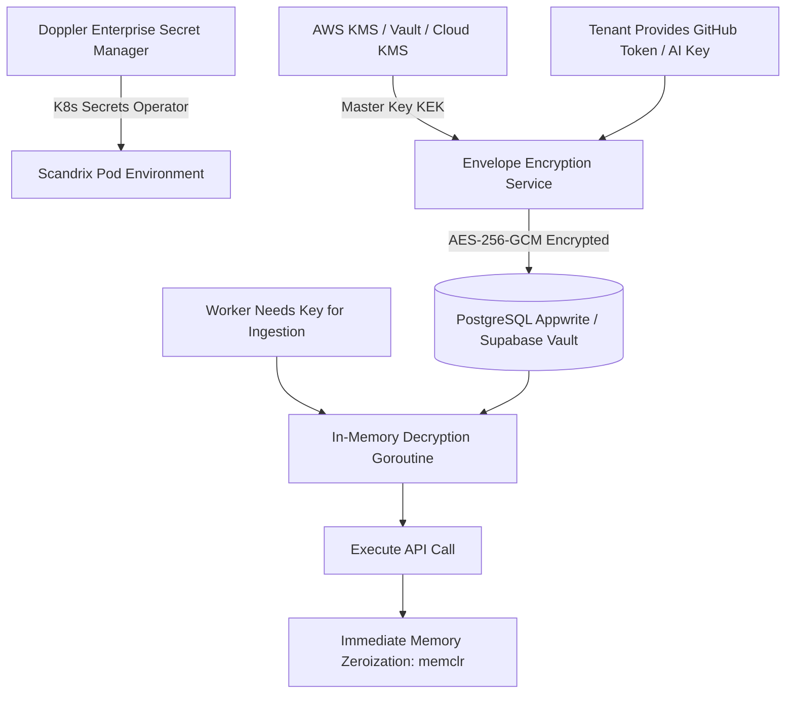

# Secret Management & Lifecycle Architecture — Technical Specification

**Classification:** AUTHORITATIVE SPECIFICATION  
**Status:** APPROVED  
**Version:** 2.0.0  
**Package:** `github.com/scandrix/scandrix/internal/secrets`

---

## 1. Executive Summary & Zero-Plaintext Architecture

The Scandrix platform manages sensitive credentials across three operational domains: platform infrastructure configurations, cryptographic root signing keys, and customer third-party repository/AI credentials. Scandrix enforces a **Zero-Plaintext In Rest & Transit Policy**: secrets are never logged, never checked into git, never stored unencrypted in databases, and zeroized in memory immediately following cryptographic operations.



---

## 2. Secrets Classification Taxonomy

| Category | Storage Tier | Encryption Standard | Rotation Frequency | Access Control |
|---|---|---|---|---|
| **Platform Secrets** (DB pass, RabbitMQ pass, Sentry DSN) | **Doppler** Secrets Platform | Encrypted in Transit (TLS 1.3) & At Rest | 90 days / Automated | Kubernetes Doppler Operator |
| **Root Master Keys** (KEK) | **AWS KMS / Vault / HSM** | FIPS 140-3 Level 3 Hardware HSM | Annual / Cloud Managed | IAM Role with strict condition keys |
| **Tenant Credentials** (GitHub tokens, BYOK AI keys) | **Supabase PostgreSQL** | AES-256-GCM Envelope Encryption (DEK) | On-demand / 90 days | Appwrite / Supabase RLS |
| **Internal RPC Auth** | Ephemeral mTLS Certificates | SPIFFE / SPIRE x509 SVIDs | 12 hours | Automated Envoy sidecar rotation |

---

## 3. Compilable Go 1.24+ Envelope Encryption Implementation

```go
package secrets

import (
	"crypto/aes"
	"crypto/cipher"
	"crypto/rand"
	"errors"
	"fmt"
	"io"
	"runtime"
)

// Vault handles envelope encryption and memory zeroization.
type Vault struct {
	keyEncryptionKey []byte // In production, retrieved from KMS/HSM
}

// NewVault initializes a secrets vault with a master key.
func NewVault(kek []byte) (*Vault, error) {
	if len(kek) != 32 { // AES-256 requires 32-byte key
		return nil, errors.New("key encryption key must be exactly 32 bytes (256 bits)")
	}
	return &Vault{keyEncryptionKey: kek}, nil
}

// EncryptedPayload bundles ciphertext with its unique initialization vector.
type EncryptedPayload struct {
	Ciphertext []byte `json:"ciphertext"`
	Nonce      []byte `json:"nonce"`
}

// Encrypt encrypts plaintext using AES-256-GCM.
func (v *Vault) Encrypt(plaintext []byte) (*EncryptedPayload, error) {
	block, err := aes.NewCipher(v.keyEncryptionKey)
	if err != nil {
		return nil, err
	}

	gcm, err := cipher.NewGCM(block)
	if err != nil {
		return nil, err
	}

	nonce := make([]byte, gcm.NonceSize())
	if _, err := io.ReadFull(rand.Reader, nonce); err != nil {
		return nil, err
	}

	ciphertext := gcm.Seal(nil, nonce, plaintext, nil)

	return &EncryptedPayload{
		Ciphertext: ciphertext,
		Nonce:      nonce,
	}, nil
}

// Decrypt returns plaintext and ensures caller zeroizes memory after use.
func (v *Vault) Decrypt(payload EncryptedPayload) ([]byte, error) {
	block, err := aes.NewCipher(v.keyEncryptionKey)
	if err != nil {
		return nil, err
	}

	gcm, err := cipher.NewGCM(block)
	if err != nil {
		return nil, err
	}

	plaintext, err := gcm.Open(nil, payload.Nonce, payload.Ciphertext, nil)
	if err != nil {
		return nil, errors.New("decryption failed: message authentication tag mismatch")
	}

	return plaintext, nil
}

// Zeroize explicitly clears sensitive bytes in memory with a runtime keepalive fence
// to ensure the compiler's dead-code elimination does not optimize away the wiping.
func Zeroize(data []byte) {
	for i := range data {
		data[i] = 0
	}
	runtime.KeepAlive(data)
}
```
