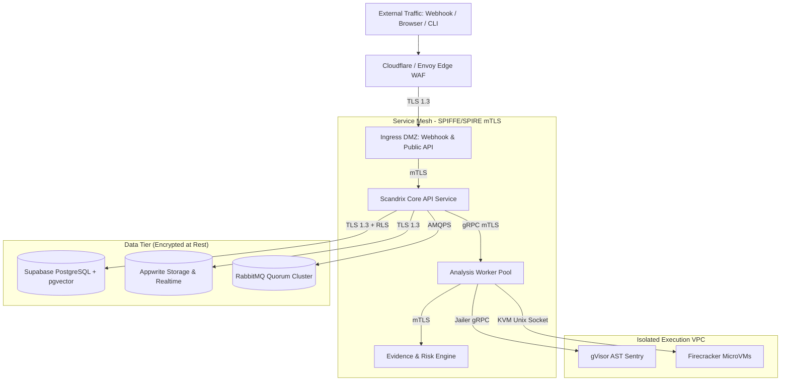

# Scandrix — Security Architecture Specification

**Classification:** AUTHORITATIVE SPECIFICATION  
**Status:** APPROVED  
**Version:** 2.0.0  
**Domain:** Enterprise Platform Security & Cryptography

---

## 1. Executive Summary & Zero-Trust Architecture

The Scandrix platform is engineered under the assumption that external network boundaries are penetrable and perimeter defenses will eventually be breached. Security is enforced through **Zero-Trust Network Architecture (ZTNA)**, **Cryptographic Workload Attestation (SPIFFE/SPIRE)**, **Mutual TLS 1.3 across all RPC boundaries**, and **strict least-privilege identity containment**.

---

## 2. Defense-in-Depth Security Matrix

| Layer | Primary Defense | Enforcement Mechanism | Monitoring & Response |
|---|---|---|---|
| **Perimeter / Edge** | DDoS Shielding & IP Reputation | Cloudflare Enterprise + Envoy Token Bucket Rate Limiting | Automated IP ban upon 100 failed HMAC attempts |
| **Authentication** | Enterprise SSO & Team API Keys | Supabase Auth (SAML 2.0 / OIDC) + SCIM 2.0 Provisioning | Automatic token revocation on user offboarding |
| **Internal RPC** | Mutual TLS 1.3 (mTLS) | SPIFFE/SPIRE X.509 SVIDs rotated every 12 hours | Strict mTLS cipher suites: `TLS_AES_256_GCM_SHA384` |
| **Data Isolation** | PostgreSQL Row-Level Security | Session variable `app.current_tenant_id` on every query | Zero cross-tenant data leaks guaranteed by DB engine |
| **Compute Sandbox** | Dual-Tier MicroVM & Syscall Jail | gVisor (`runsc`) + Firecracker MicroVMs (`CAP_DROP_ALL`) | OOM and syscall anomaly traps kill sandbox immediately |
| **AI Boundary** | Pre-Prompt Redaction Firewall | Shannon entropy tokenization of secrets before model dispatch | Models never receive raw AWS keys, tokens, or PII |
| **Software Supply Chain** | Cryptographic Manifests | In-Toto v1.0 + Ed25519 signatures verified by Kyverno K8s | Pod admission denied if signature is absent or invalid |

---

## 3. Cryptographic Tamper-Evident Audit Ledger

All administrative actions, policy modifications, and AI patch approvals are appended to a tamper-evident audit ledger using SHA-256 cryptographic hash chaining:

$$\mathcal{H}_i = \text{SHA256}(\mathcal{H}_{i-1} \parallel \text{EventID} \parallel \text{ActorID} \parallel \text{Action} \parallel \text{PayloadBytes} \parallel \text{Timestamp})$$

If an attacker modifies a historical audit row in the database, the cryptographic hash chain breaks, immediately alerting the SecOps monitoring daemon.
