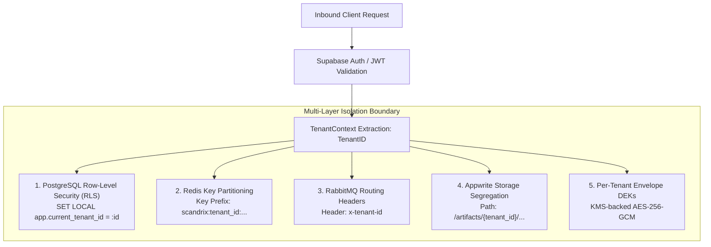

# Multi-Tenant Isolation Specification — Technical Architecture

**Classification:** AUTHORITATIVE SPECIFICATION  
**Status:** APPROVED  
**Version:** 2.0.0  
**Package:** `github.com/scandrix/scandrix/internal/tenant`

---

## 1. Executive Summary & Defense-in-Depth Isolation

In a multi-tenant enterprise code assurance platform, source code, commit metadata, AST graphs, and security vulnerabilities constitute strictly confidential intellectual property. Cross-tenant leakage represents a catastrophic failure.

Scandrix enforces strict **Cryptographic and Architectural Tenant Segregation** across five independent system layers:



---

## 2. Five-Layer Isolation Matrix

| System Layer | Isolation Mechanism | Guarantee | Failure Mode Defense |
|---|---|---|---|
| **Database** | PostgreSQL Row-Level Security (RLS) | Every table query filtered by `tenant_id` at the kernel DB layer | Accidental missing `WHERE` clause returns 0 rows, never leaks data |
| **Object Storage** | Appwrite Storage Buckets + Prefixing | Raw diffs & AST artifacts stored under `/{tenant_id}/{repo_id}/` | Short-lived signed URLs (15-minute TTL); direct bucket listing denied |
| **Message Queue** | RabbitMQ AMQP Header Routing | Messages stamped with `x-tenant-id`; consumer verifies context | Mismatched tenant jobs rejected and routed to dead-letter quarantine |
| **In-Memory Cache** | Key Prefixing & Valkey ACLs | Keys partitioned as `scandrix:{tenant_id}:{key}` | Redis FLUSHDB restricted; tenant wildcards isolated |
| **Cryptography** | Envelope DEK Encryption | Unique Data Encryption Key per tenant wrapped by AWS KMS / Vault | Compromise of one tenant's DEK leaves all other tenants encrypted |

---

## 3. Database RLS Policy Enforcement

Every database connection checked out from the Go connection pool executes an atomic session initialization before running business queries:

```sql
-- Executed inside transaction before user queries
SET LOCAL app.current_tenant_id = '019482fa-1234-7000-8000-abcdef123456';

-- Canonical RLS policy definition
CREATE POLICY tenant_isolation_policy ON evidence_packets
    FOR ALL
    USING (tenant_id = NULLIF(current_setting('app.current_tenant_id', true), '')::UUID);
```

---

## 4. Compilable Go 1.24+ Tenant Context Middleware

```go
package tenant

import (
	"context"
	"database/sql"
	"errors"
	"net/http"
)

type contextKey string

const tenantIDKey contextKey = "scandrix.tenant_id"

// ContextWithTenant injects the validated tenant ID into the context.
func ContextWithTenant(ctx context.Context, tenantID string) context.Context {
	return context.WithValue(ctx, tenantIDKey, tenantID)
}

// TenantFromContext extracts the active tenant ID from the context.
func TenantFromContext(ctx context.Context) (string, error) {
	val, ok := ctx.Value(tenantIDKey).(string)
	if !ok || val == "" {
		return "", errors.New("unauthorized: missing or invalid tenant context")
	}
	return val, nil
}

// Middleware extracts and validates tenant ID from claims or API keys.
func Middleware(next http.Handler) http.Handler {
	return http.HandlerFunc(func(w http.ResponseWriter, r *http.Request) {
		tenantID := r.Header.Get("X-Tenant-ID")
		if tenantID == "" {
			http.Error(w, `{"error":"missing X-Tenant-ID header"}`, http.StatusUnauthorized)
			return
		}

		ctx := ContextWithTenant(r.Context(), tenantID)
		next.ServeHTTP(w, r.WithContext(ctx))
	})
}

// ExecuteWithRLS runs a database transaction with the tenant session variable locked.
func ExecuteWithRLS(ctx context.Context, db *sql.DB, fn func(tx *sql.Tx) error) error {
	tenantID, err := TenantFromContext(ctx)
	if err != nil {
		return err
	}

	tx, err := db.BeginTx(ctx, &sql.TxOptions{Isolation: sql.LevelReadCommitted})
	if err != nil {
		return err
	}
	defer tx.Rollback()

	// Enforce session tenant for PostgreSQL Row-Level Security
	_, err = tx.ExecContext(ctx, "SET LOCAL app.current_tenant_id = $1", tenantID)
	if err != nil {
		return err
	}

	if err := fn(tx); err != nil {
		return err
	}

	return tx.Commit()
}
```
