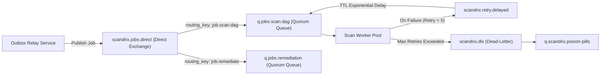

# Scandrix — Event & Message Queue Specifications

**Classification:** AUTHORITATIVE SPECIFICATION  
**Status:** APPROVED  
**Version:** 2.0.0  
**Broker Topology:** RabbitMQ 3.13+ (Quorum Queues & Dead-Letter Exchanges)  
**Package:** `github.com/scandrix/scandrix/internal/events`

---

## 1. Executive Summary & Queue Architecture

The Scandrix distributed event system coordinates asynchronous workloads across ingestion, AST parsing, deterministic scanners, AI reasoning, and webhook dispatching. Built on **RabbitMQ Quorum Queues** (Raft-based replicated message queues), the architecture guarantees high availability, zero message loss during node failover, strict deduplication via the **Transactional Inbox Pattern**, and deterministic retry with exponential backoff.



---

## 2. Exchange & Queue Topology

### 2.1 Exchanges
1. `scandrix.jobs.direct`: Direct exchange routing actionable tasks to dedicated worker pools.
2. `scandrix.events.topic`: Topic exchange publishing lifecycle notifications (`scandrix.finding.confirmed`, `scandrix.scan.completed`).
3. `scandrix.retry.delayed`: RabbitMQ Delayed Message Exchange routing failed tasks with exponential backoff ($2^n \times 5\text{s}$).
4. `scandrix.dlx`: Fanout Dead-Letter Exchange collecting permanently failed jobs for operator inspection.

### 2.2 Standard Event Envelopes

#### Scan Job Request Envelope
```json
{
  "job_id": "019482fa-1234-7000-8000-abcdef123456",
  "idempotency_key": "gh-pr-42-commit-e12fa89",
  "tenant_id": "tenant_acme_corp",
  "repository_id": "repo_payments_service",
  "git_provider": "GITHUB",
  "git_ref": "refs/pull/42/head",
  "commit_sha": "e12fa89b2c3d4e5f67890123456789abcdef0123",
  "base_sha": "a1b2c3d4e5f67890123456789abcdef012345678",
  "priority": "HIGH",
  "attempt": 1,
  "max_retries": 5,
  "created_at": "2026-08-29T03:30:00Z"
}
```

---

## 3. Compilable Go 1.24+ Event Dispatcher Implementation

```go
package events

import (
	"context"
	"encoding/json"
	"errors"
	"fmt"
	"time"

	amqp "github.com/rabbitmq/amqp091-go"
)

// PriorityLevel indicates job scheduling urgency.
type PriorityLevel string

const (
	PriorityCritical PriorityLevel = "CRITICAL"
	PriorityHigh     PriorityLevel = "HIGH"
	PriorityNormal   PriorityLevel = "NORMAL"
)

// ScanJobEnvelope encapsulates an asynchronous scan request.
type ScanJobEnvelope struct {
	JobID          string        `json:"job_id"`
	IdempotencyKey string        `json:"idempotency_key"`
	TenantID       string        `json:"tenant_id"`
	RepositoryID   string        `json:"repository_id"`
	CommitSHA      string        `json:"commit_sha"`
	BaseSHA        string        `json:"base_sha"`
	Priority       PriorityLevel `json:"priority"`
	Attempt        int           `json:"attempt"`
	MaxRetries     int           `json:"max_retries"`
	CreatedAt      time.Time     `json:"created_at"`
}

// Publisher publishes durable messages to RabbitMQ quorum exchanges.
type Publisher struct {
	channel *amqp.Channel
}

// NewPublisher creates an event publisher.
func NewPublisher(ch *amqp.Channel) *Publisher {
	return &Publisher{channel: ch}
}

// PublishScanJob publishes a scan job to the direct exchange.
func (p *Publisher) PublishScanJob(ctx context.Context, job ScanJobEnvelope) error {
	raw, err := json.Marshal(job)
	if err != nil {
		return fmt.Errorf("failed to serialize job: %w", err)
	}

	msg := amqp.Publishing{
		DeliveryMode: amqp.Persistent, // Persistent disk storage
		ContentType:  "application/json",
		MessageId:    job.JobID,
		Timestamp:    time.Now().UTC(),
		Headers: amqp.Table{
			"x-idempotency-key": job.IdempotencyKey,
			"x-tenant-id":       job.TenantID,
		},
		Body: raw,
	}

	return p.channel.PublishWithContext(
		ctx,
		"scandrix.jobs.direct", // exchange
		"job.scan.dag",         // routing key
		false,                  // mandatory
		false,                  // immediate
		msg,
	)
}
```
