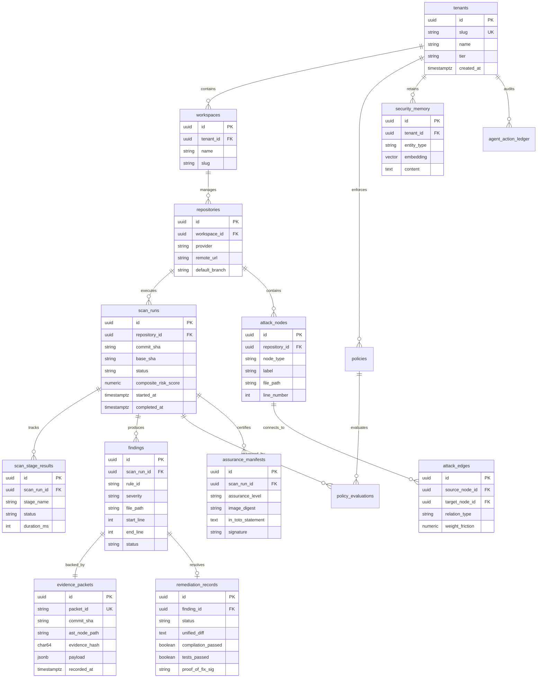

# Scandrix — Entity Relationship Diagram (ERD) Specification

**Classification:** AUTHORITATIVE SPECIFICATION  
**Status:** APPROVED  
**Version:** 2.0.0  
**Database Engine:** PostgreSQL 16+ (Supabase) with `pgvector` extension

---

## 1. Executive Summary & Relational Schema Topology

The Scandrix relational schema is partitioned across four core functional domains:
1. **Multi-Tenant Hierarchy & Repositories**: Organization boundaries, workspaces, and Git provider metadata.
2. **Assurance Execution & Evidence**: Scan runs, DAG stage execution records, deterministic findings, and immutable Merkle-tree rooted evidence packets.
3. **Graph & Attack Surface Intelligence**: Code-to-Cloud attack nodes, weighted friction edges, and shortest-path Dijkstra traversals.
4. **Governance, AI & Audit**: Semantic security memory (pgvector), policy evaluation decisions, remediation proof-of-fix attestations, and cryptographic action ledgers.

---

## 2. Cardinality & Relational Invariants

1. **Evidence Immutability**: Every `findings` record has a strict $1:1$ relationship with an `evidence_packets` record. Updating or deleting an `evidence_packets` row is prohibited by PostgreSQL database rules.
2. **Tenant Scoping**: All operational tables possess a foreign key reference or inherited composite key bound to `tenant_id`, guaranteeing PostgreSQL Row-Level Security (RLS) enforcement.
3. **Graph Referential Integrity**: Deleting a repository cascades to its associated `attack_nodes` and `attack_edges`, preventing orphaned graph states in the Attack Path Engine.
