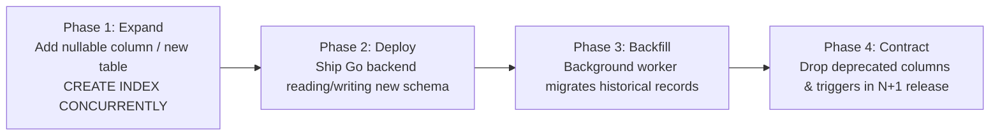

# Database Migration Architecture & Standards — Technical Specification

**Classification:** AUTHORITATIVE SPECIFICATION  
**Status:** APPROVED  
**Version:** 2.0.0  
**Migration Tool:** `golang-migrate/migrate/v4` & Supabase CLI  
**Package:** `github.com/scandrix/scandrix/internal/database/migrations`

---

## 1. Executive Summary & Zero-Downtime Philosophy

In enterprise production deployments where Scandrix processes continuous, mission-critical pull request webhooks, database maintenance downtime is prohibited ($0\text{ downtime SLA}$). All schema evolutions must be executed using the **Expand/Contract Design Pattern**, ensuring that both old and new service versions can operate concurrently against the database without transaction aborts or table lockouts.



---

## 2. DDL Lock Safety & PostgreSQL Invariants

Standard PostgreSQL DDL statements acquire `ACCESS EXCLUSIVE` locks that block all concurrent reads and writes, risking complete system stalls under heavy webhook loads. Scandrix migrations must strictly adhere to the following safety rules:

1. **Strict Lock & Statement Timeouts**:
   Every migration file must begin by capping lock acquisition time to prevent connection pool exhaustion:
   ```sql
   SET LOCAL lock_timeout = '3s';
   SET LOCAL statement_timeout = '60s';
   ```
2. **Concurrent Index Construction**:
   Indexes on production tables (`findings`, `evidence_packets`, `scan_runs`) must always use the `CONCURRENTLY` keyword:
   ```sql
   CREATE INDEX CONCURRENTLY IF NOT EXISTS idx_findings_scan_run_id ON findings (scan_run_id);
   ```
3. **Safe Column Addition**:
   New columns must either be nullable or have a constant default value (which in PostgreSQL 11+ is an $O(1)$ metadata-only change):
   ```sql
   ALTER TABLE scan_runs ADD COLUMN IF NOT EXISTS trigger_source VARCHAR(32) DEFAULT 'WEBHOOK';
   ```

---

## 3. Migration File Naming Convention & Directory Layout

Migrations are managed as paired idempotent SQL files inside the `migrations/` directory:

```
migrations/
├── 000001_init_schema.up.sql
├── 000001_init_schema.down.sql
├── 000002_add_pgvector_hnsw.up.sql
├── 000002_add_pgvector_hnsw.down.sql
├── 000003_outbox_events_table.up.sql
└── 000003_outbox_events_table.down.sql
```

---

## 4. Compilable Go 1.24+ Migration Runner Implementation

```go
package migrations

import (
	"database/sql"
	"errors"
	"fmt"

	"github.com/golang-migrate/migrate/v4"
	"github.com/golang-migrate/migrate/v4/database/postgres"
	_ "github.com/golang-migrate/migrate/v4/source/file"
)

// Runner manages database schema migrations.
type Runner struct {
	db *sql.DB
}

// NewRunner creates a migration coordinator.
func NewRunner(db *sql.DB) *Runner {
	return &Runner{db: db}
}

// Up applies all pending database migrations.
func (r *Runner) Up(migrationsPath string) error {
	driver, err := postgres.WithInstance(r.db, &postgres.Config{})
	if err != nil {
		return fmt.Errorf("failed to create postgres driver: %w", err)
	}

	m, err := migrate.NewWithDatabaseInstance(
		"file://"+migrationsPath,
		"postgres",
		driver,
	)
	if err != nil {
		return fmt.Errorf("failed to initialize migration instance: %w", err)
	}

	if err := m.Up(); err != nil && !errors.Is(err, migrate.ErrNoChange) {
		return fmt.Errorf("failed to execute migrations up: %w", err)
	}

	return nil
}
```
