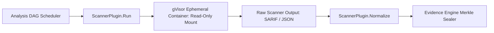

# Developer Guide: Adding a New Security Scanner Plugin

**Classification:** NORMATIVE DEVELOPER SPECIFICATION  
**Status:** APPROVED  
**Target Version:** v1.0 Enterprise  
**Package:** `github.com/scandrix/scandrix/internal/scanners`

---

## 1. Executive Summary & Plugin Architecture

The Scandrix Multi-Engine Analysis DAG is extensible: developers and security engineers can integrate new deterministic analyzers (e.g., SAST engines, secret scanners, IaC linters, license auditors) without modifying the core DAG orchestration engine. Every scanner plugin must implement the uniform `ScannerPlugin` interface, execute within an ephemeral sandboxed gVisor container, and emit findings normalized into SARIF v2.1.0 or the canonical Scandrix `Finding` schema.



---

## 2. Compilable Go 1.24+ Scanner Plugin Interface

```go
package scanners

import (
	"context"
	"time"
)

// ScannerCategory categorizes the finding domain.
type ScannerCategory string

const (
	CategorySAST      ScannerCategory = "SAST"
	CategorySecrets   ScannerCategory = "SECRETS"
	CategorySCA       ScannerCategory = "SCA"
	CategoryIaC       ScannerCategory = "IAC"
	CategoryContainer ScannerCategory = "CONTAINER"
)

// ScanOptions configures scanner runtime execution.
type ScanOptions struct {
	TargetDirectory string        `json:"target_directory"`
	ExcludePaths    []string      `json:"exclude_paths"`
	Timeout         time.Duration `json:"timeout"`
	MaxMemoryMB     int           `json:"max_memory_mb"`
	SeverityFilter  []string      `json:"severity_filter"`
}

// RawScanResult wraps raw stdout/stderr output.
type RawScanResult struct {
	ScannerID    string        `json:"scanner_id"`
	ExitCode     int           `json:"exit_code"`
	StdoutBytes  []byte        `json:"stdout_bytes"`
	StderrBytes  []byte        `json:"stderr_bytes"`
	ExecutionDur time.Duration `json:"execution_dur"`
}

// NormalizedFinding represents the universal finding representation.
type NormalizedFinding struct {
	RuleID      string          `json:"rule_id"`
	Category    ScannerCategory `json:"category"`
	FilePath    string          `json:"file_path"`
	StartLine   int             `json:"start_line"`
	EndLine     int             `json:"end_line"`
	Severity    string          `json:"severity"` // CRITICAL, HIGH, MEDIUM, LOW
	Title       string          `json:"title"`
	Description string          `json:"description"`
	CWE         int             `json:"cwe,omitempty"`
	RawEvidence string          `json:"raw_evidence"`
}

// ScannerPlugin is the mandatory interface for all static analysis tools.
type ScannerPlugin interface {
	ID() string
	Name() string
	Version() string
	Category() ScannerCategory
	Run(ctx context.Context, opts ScanOptions) (*RawScanResult, error)
	Normalize(raw *RawScanResult) ([]NormalizedFinding, error)
}

// Registry maintains the loaded active scanner plugins.
type Registry struct {
	plugins map[string]ScannerPlugin
}

var defaultRegistry = &Registry{plugins: make(map[string]ScannerPlugin)}

// RegisterPlugin adds a scanner plugin to the global engine registry.
func RegisterPlugin(plugin ScannerPlugin) {
	defaultRegistry.plugins[plugin.ID()] = plugin
}

// GetPlugin retrieves a registered scanner by ID.
func GetPlugin(id string) (ScannerPlugin, bool) {
	p, ok := defaultRegistry.plugins[id]
	return p, ok
}
```

---

## 3. Concrete Implementation Example: `GitleaksPlugin`

```go
package gitleaks

import (
	"context"
	"encoding/json"
	"fmt"
	"os/exec"
	"time"

	"github.com/scandrix/scandrix/internal/scanners"
)

type GitleaksPlugin struct{}

func NewPlugin() scanners.ScannerPlugin {
	return &GitleaksPlugin{}
}

func (g *GitleaksPlugin) ID() string                    { return "gitleaks" }
func (g *GitleaksPlugin) Name() string                  { return "Gitleaks Secret Scanner" }
func (g *GitleaksPlugin) Version() string               { return "8.18.2" }
func (g *GitleaksPlugin) Category() scanners.ScannerCategory { return scanners.CategorySecrets }

func (g *GitleaksPlugin) Run(ctx context.Context, opts scanners.ScanOptions) (*scanners.RawScanResult, error) {
	start := time.Now()
	// Executed inside gVisor sandbox with read-only workspace
	cmd := exec.CommandContext(ctx, "gitleaks", "detect",
		"--source="+opts.TargetDirectory,
		"--report-format=json",
		"--no-git",
		"-v",
	)
	out, _ := cmd.CombinedOutput()
	
	return &scanners.RawScanResult{
		ScannerID:    g.ID(),
		ExitCode:     cmd.ProcessState.ExitCode(),
		StdoutBytes:  out,
		ExecutionDur: time.Since(start),
	}, nil
}

type gitleaksRecord struct {
	RuleID      string `json:"RuleID"`
	Description string `json:"Description"`
	File        string `json:"File"`
	StartLine   int    `json:"StartLine"`
	EndLine     int    `json:"EndLine"`
	Secret      string `json:"Secret"`
}

func (g *GitleaksPlugin) Normalize(raw *scanners.RawScanResult) ([]scanners.NormalizedFinding, error) {
	var records []gitleaksRecord
	if err := json.Unmarshal(raw.StdoutBytes, &records); err != nil {
		return nil, fmt.Errorf("failed to parse gitleaks output: %w", err)
	}

	findings := make([]scanners.NormalizedFinding, 0, len(records))
	for _, r := range records {
		findings = append(findings, scanners.NormalizedFinding{
			RuleID:      r.RuleID,
			Category:    scanners.CategorySecrets,
			FilePath:    r.File,
			StartLine:   r.StartLine,
			EndLine:     r.EndLine,
			Severity:    "CRITICAL",
			Title:       "Exposed Secret: " + r.Description,
			Description: fmt.Sprintf("High-entropy credential detected by rule %s", r.RuleID),
			CWE:         798, // CWE-798: Use of Hard-coded Credentials
			RawEvidence: "REDACTED_SECRET_HASH",
		})
	}
	return findings, nil
}
```
