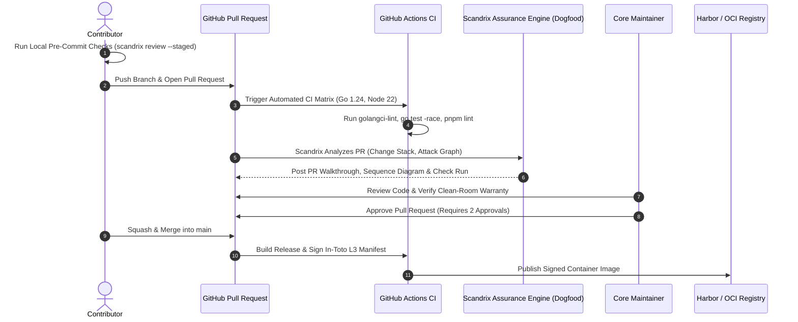

# Contributing to Scandrix — Engineering Guidelines & Clean-Room Warranty

**Classification:** NORMATIVE DEVELOPER SPECIFICATION  
**Status:** APPROVED FOR IMPLEMENTATION  
**Version:** 3.0.0  
**Domain:** Open Source & Internal Enterprise Contributor Standards

---

## 1. Clean-Room Intellectual Property Warranty & DCO

To maintain absolute legal and copyright independence, all contributors must certify adherence to the **Clean-Room Engineering Protocol**:
1. **Developer Certificate of Origin (DCO)**: Every commit must include a signed-off-by trailer (`git commit -s`):
   ```text
   Signed-off-by: Jane Developer <jane@company.com>
   ```
2. **Strict Clean-Room Guarantee**: All submitted code, algorithms, and documentation must be original works authored from scratch or derived strictly from permissively licensed open-source dependencies (MIT, Apache-2.0, BSD-3-Clause).
3. **Prohibition of Copyleft & Decompiled Code**: Copying or adapting code from AGPL-3.0 repositories (including Kodus AI or external copyleft engines), proprietary closed-source binaries, or decompiled assemblies is strictly forbidden.

---

## 2. Pull Request Lifecycle & Dogfooding Pipeline

Every pull request submitted to `scandrix/scandrix` undergoes strict automated gating and dogfooding:



---

## 3. Commit Message Conventions (Conventional Commits v1.0.0)

All commit messages must adhere to the Conventional Commits specification:

| Prefix | Meaning | Example |
| :--- | :--- | :--- |
| `feat` | A new user-facing feature or domain capability | `feat(aigateway): add parallel agent swarm orchestrator` |
| `fix` | A bug fix or patch addressing a vulnerability | `fix(evidence): prevent race condition in merkle tree hasher` |
| `perf` | Code change improving execution speed or memory | `perf(cpg): optimize Tree-sitter AST symbol resolution` |
| `refactor` | Code restructuring without altering external behavior | `refactor(policy): simplify OPA rule evaluator dispatch` |
| `test` | Adding missing unit, integration, or benchmark tests | `test(sandbox): add Firecracker jailer isolation tests` |
| `docs` | Documentation updates across `SCANDRIX-DOCS` | `docs(prd): expand enterprise feature specifications` |

---

## 4. Code Quality & Pre-Commit Standards

Before submitting a pull request, verify that all local checks pass:

### 4.1 Go Backend Standards
```bash
# 1. Format and tidy dependencies
go fmt ./...
go mod tidy

# 2. Execute strict linter suite (zero warnings permitted)
golangci-lint run --timeout=5m

# 3. Execute unit and race tests
go test -v -race -covermode=atomic -coverprofile=coverage.out ./...

# 4. Enforce minimum 80% test coverage
go tool cover -func=coverage.out | grep total | awk '{print $3}'
```

### 4.2 Web Frontend Standards (Next.js 15 / Radix UI / Tailwind 4)
```bash
# 1. Typecheck and lint Next.js dashboard
pnpm --filter @apps/web type-check
pnpm --filter @apps/web lint

# 2. Format with Prettier
pnpm format
```

---

## 5. Contributor PR Checklist

Prior to requesting review, confirm that:
- [ ] Added unit tests covering positive, boundary, and negative error conditions.
- [ ] Zero unhandled errors or raw panics in production runtime code.
- [ ] Database schema changes adhere to zero-downtime expand/contract patterns (`NOT VALID` on foreign keys).
- [ ] No hardcoded secrets, test credentials, or internal IPs introduced.
- [ ] All new public Go symbols have comprehensive godoc comments.
- [ ] Tested locally with `scandrix review --staged`.
