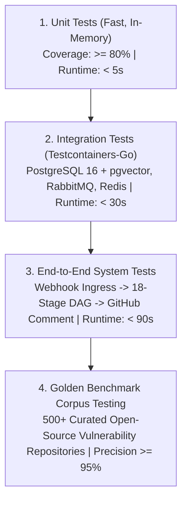

# Testing Strategy, Testcontainers & Golden Corpus — Technical Specification

**Classification:** NORMATIVE DEVELOPER SPECIFICATION  
**Status:** APPROVED FOR IMPLEMENTATION  
**Version:** 3.0.0  
**Domain:** Software Reliability, Continuous Verification & Benchmark Rigor

---

## 1. Executive Summary & The Four-Tier Testing Pyramid

To guarantee continuous software assurance and eliminate false-positive regressions, Scandrix implements a four-tier testing hierarchy:



1. **Unit Tests**: Blazing fast, pure in-memory tests utilizing Go's native `testing` framework and `testify`. Zero network or database dependencies.
2. **Integration Tests**: Tests real PostgreSQL RLS queries, `pgvector` similarity searches, and RabbitMQ message routing using **Testcontainers-Go**.
3. **End-to-End (E2E) Tests**: Executes the complete 18-stage assurance DAG against mock GitHub webhooks, validating that the outbox relay, workers, and PR comment generators function seamlessly.
4. **Golden Benchmark Corpus Testing**: Automated regression suite testing 500+ real-world repositories with known vulnerabilities (OWASP Juice Shop, WebGoat, DVWA, Vulnerable-Go-App) to empirically measure precision and recall.

---

## 2. Test Execution Commands & CI Gating

### 2.1 Unit Tests with Race Detector
All packages must execute with thread-sanitizer race detection enabled (`-race`):
```bash
go test -v -race -covermode=atomic -coverprofile=coverage.out ./internal/...
```

### 2.2 Integration Tests (Testcontainers-Go)
```bash
go test -v -tags=integration -timeout=10m ./tests/integration/...
```

### 2.3 Microbenchmarks & Memory Allocations
Performance-critical graph routing (Dijkstra) and Tree-sitter AST queries must verify allocation budgets:
```bash
go test -bench=BenchmarkAttackPathTraversal -benchmem ./internal/attackpath/...
```

---

## 3. Testcontainers-Go Integration Harness Example

Scandrix utilizes Testcontainers-Go to spin up ephemeral, production-identical database containers for testing:

```go
package tests

import (
	"context"
	"database/sql"
	"fmt"
	"testing"
	"time"

	_ "github.com/lib/pq"
	"github.com/stretchr/testify/require"
	"github.com/testcontainers/testcontainers-go"
	"github.com/testcontainers/testcontainers-go/wait"
)

// SetupTestDatabase spins up an ephemeral PostgreSQL 16 container with pgvector.
func SetupTestDatabase(t *testing.T) (*sql.DB, func()) {
	ctx := context.Background()

	req := testcontainers.ContainerRequest{
		Image:        "pgvector/pgvector:pg16",
		ExposedPorts: []string{"5432/tcp"},
		Env: map[string]string{
			"POSTGRES_DB":       "scandrix_test",
			"POSTGRES_USER":     "test_user",
			"POSTGRES_PASSWORD": "test_password",
		},
		WaitingFor: wait.ForListeningPort("5432/tcp").WithStartupTimeout(30 * time.Second),
	}

	container, err := testcontainers.GenericContainer(ctx, testcontainers.GenericContainerRequest{
		ContainerRequest: req,
		Started:          true,
	})
	require.NoError(t, err)

	host, err := container.Host(ctx)
	require.NoError(t, err)

	port, err := container.MappedPort(ctx, "5432")
	require.NoError(t, err)

	dsn := fmt.Sprintf("postgres://test_user:test_password@%s:%s/scandrix_test?sslmode=disable", host, port.Port())
	db, err := sql.Open("postgres", dsn)
	require.NoError(t, err)

	// Apply schema migrations
	_, err = db.Exec("CREATE EXTENSION IF NOT EXISTS vector;")
	require.NoError(t, err)

	cleanup := func() {
		_ = db.Close()
		_ = container.Terminate(ctx)
	}

	return db, cleanup
}
```

---

## 4. Golden Benchmark Corpus Framework

The Golden Corpus contains 500+ repositories with verified CVE annotations used to measure detection accuracy:

$$\text{Precision} = \frac{\text{True Positives}}{\text{True Positives} + \text{False Positives}} \ge 95\%$$

$$\text{Recall} = \frac{\text{True Positives}}{\text{True Positives} + \text{False Negatives}} \ge 90\%$$

```bash
# Run the automated golden benchmark evaluation harness
go test -v -tags=benchmark ./tests/golden/... --golden-dir=/var/data/golden-repos
```

If any commit causes Precision to fall below $95\%$ or Recall below $90\%$, the pull request is automatically blocked by CI.

---

## 5. Best Practices for Deterministic Testing

1. **Zero Uncontrolled Sleeps**: Tests must never invoke `time.Sleep()`. Use `require.Eventually()` or synchronization channels.
2. **Table-Driven Tests**: Group multiple test cases using standard Go table-driven structs (`tests := []struct{ ... }`).
3. **Hermetic Test State**: Every test function must run against its own isolated tenant ID or database transaction that rolls back on completion (`t.Cleanup(func() { tx.Rollback() })`).
