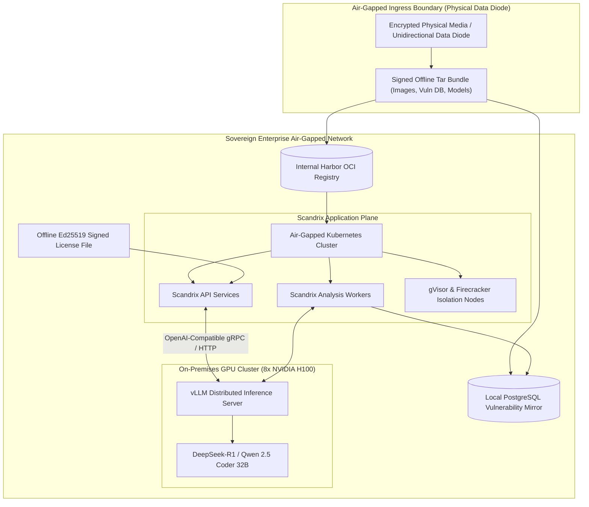
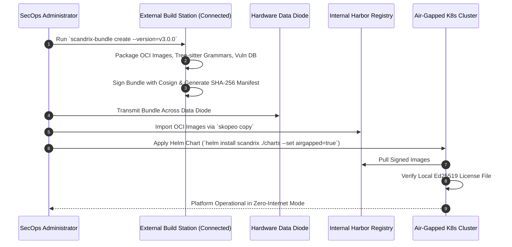

# Air-Gapped & Sovereign Enterprise Deployment — Technical Specification

**Classification:** RESTRICTED / AUTHORITATIVE ARCHITECTURAL SPECIFICATION  
**Status:** APPROVED FOR IMPLEMENTATION  
**Version:** 3.0.0  
**Domain:** Classified, Defense, Banking & Sovereign Zero-Internet Operations

---

## 1. Executive Summary & Zero-Network Operational Guarantee

The Scandrix Air-Gapped Deployment Profile guarantees **$100\%$ zero outbound internet connectivity**. Designed for classified defense agencies, tier-1 financial institutions, and sovereign cloud environments, this profile eliminates all external SaaS calls:
1. **On-Premises Local LLM Inference**: Replaces cloud APIs with an internal GPU inference cluster running **vLLM** hosting open-weights frontier models (`DeepSeek-R1-Distill-Qwen-32B`, `Qwen2.5-Coder-32B-Instruct`).
2. **Private Harbor OCI Registry Mirroring**: All container images, base sandbox runtimes, Tree-sitter parsers, and dependencies are imported via signed offline tar bundles.
3. **Offline Asymmetric Cryptographic Licensing**: Platform licenses are verified locally using embedded Ed25519 public keys without any phone-home telemetry.
4. **Data Diode Vulnerability Sync**: OSV, GHSA, and NVD vulnerability databases are mirrored via unidirectional hardware data diodes or encrypted physical media.



---

## 2. Air-Gapped Bootstrap & Delivery Workflow



---

## 3. On-Premises GPU Inference Topology (vLLM)

For code reasoning and patch synthesis, Scandrix interfaces with local vLLM daemons exposing OpenAI-compatible endpoints:

```yaml
apiVersion: apps/v1
kind: Deployment
metadata:
  name: vllm-qwen-coder
  namespace: scandrix-ai
spec:
  replicas: 2
  template:
    spec:
      containers:
        - name: vllm
          image: vllm/vllm-openai:v0.6.0
          args:
            - "--model"
            - "/models/Qwen2.5-Coder-32B-Instruct-AWQ"
            - "--tensor-parallel-size"
            - "4"
            - "--max-model-len"
            - "32768"
            - "--gpu-memory-utilization"
            - "0.95"
            - "--port"
            - "8000"
          resources:
            limits:
              nvidia.com/gpu: "4"
          volumeMounts:
            - name: model-weights
              mountPath: /models
              readOnly: true
```

---

## 4. Offline Cryptographic License Verification (Go 1.24+)

The licensing subsystem performs purely mathematical signature validation using an embedded Ed25519 public key:

```go
package licensing

import (
	"crypto/ed25519"
	"encoding/base64"
	"encoding/json"
	"errors"
	"fmt"
	"time"
)

// Embedded trusted public key of Scandrix Licensing Authority.
const TrustedAuthorityPublicKey = "MCowBQYDK2VwAyEA..."

type LicenseClaims struct {
	TenantID     string    `json:"tenant_id"`
	Organization string    `json:"organization"`
	MaxSeats     int       `json:"max_seats"`
	MaxRepos     int       `json:"max_repos"`
	IssuedAt     time.Time `json:"issued_at"`
	ExpiresAt    time.Time `json:"expires_at"`
	IsAirGapped  bool      `json:"is_air_gapped"`
}

type SignedLicense struct {
	ClaimsRaw    string `json:"claims"`
	SignatureB64 string `json:"signature"`
}

func VerifyOfflineLicense(licenseJSON []byte) (*LicenseClaims, error) {
	var sl SignedLicense
	if err := json.Unmarshal(licenseJSON, &sl); err != nil {
		return nil, errors.New("malformed license file")
	}

	pubKeyBytes, err := base64.StdEncoding.DecodeString(TrustedAuthorityPublicKey)
	if err != nil {
		return nil, err
	}

	sigBytes, err := base64.StdEncoding.DecodeString(sl.SignatureB64)
	if err != nil {
		return nil, errors.New("invalid signature encoding")
	}

	// Mathematical signature verification
	if !ed25519.Verify(pubKeyBytes, []byte(sl.ClaimsRaw), sigBytes) {
		return nil, errors.New("cryptographic license signature mismatch")
	}

	var claims LicenseClaims
	if err := json.Unmarshal([]byte(sl.ClaimsRaw), &claims); err != nil {
		return nil, err
	}

	if time.Now().After(claims.ExpiresAt) {
		return nil, fmt.Errorf("license expired on %s", claims.ExpiresAt.Format(time.RFC3339))
	}

	return &claims, nil
}
```
