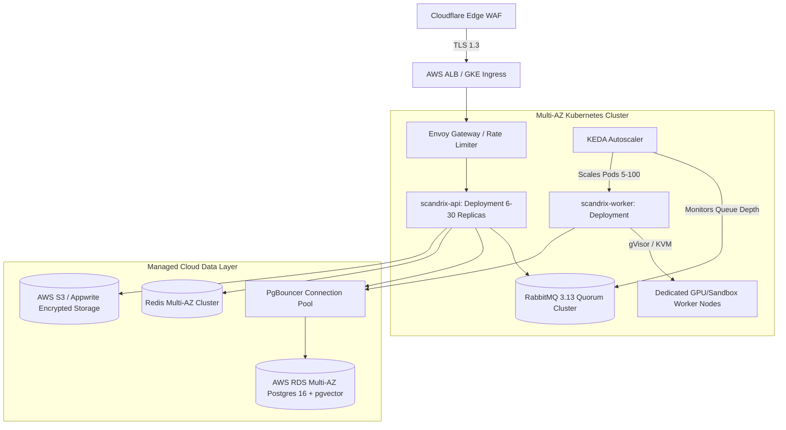

# Production Environment Deployment Specification

**Classification:** AUTHORITATIVE INFRASTRUCTURE SPECIFICATION  
**Status:** APPROVED  
**Target Version:** v1.0 Enterprise  
**Orchestration:** Multi-AZ Kubernetes (EKS / GKE) with KEDA Autoscaling

---

## 1. Executive Summary & Cluster Architecture

The Scandrix Production Environment is architected for **99.99% Availability**, zero data loss, and seamless horizontal scaling under unpredictable pull request traffic surges. Running on Multi-AZ Kubernetes clusters, workloads are divided into stateless API gateways and dynamic worker pools managed by **KEDA (Kubernetes Event-driven Autoscaling)** querying RabbitMQ queue depths.



---

## 2. KEDA Worker Autoscaling Policy

Worker replicas scale dynamically based on the number of unacknowledged and pending jobs in `q.jobs.scan.dag`:

```yaml
apiVersion: keda.sh/v1alpha1
kind: ScaledObject
metadata:
  name: scandrix-worker-scaler
  namespace: production
spec:
  scaleTargetRef:
    name: scandrix-worker
  minReplicaCount: 5
  maxReplicaCount: 100
  cooldownPeriod: 300
  triggers:
    - type: rabbitmq
      metadata:
        queueName: q.jobs.scan.dag
        mode: QueueLength
        value: "5" # Spin up 1 worker per 5 queued jobs
      authenticationRef:
        name: keda-rabbitmq-auth
```

---

## 3. High-Availability Database & Connection Pooling (K8S-004)

- **PostgreSQL Configuration**: Multi-AZ RDS instance with synchronous standby replication and automated continuous WAL archiving to S3 with 35-day point-in-time recovery (PITR).
- **PgBouncer Architecture**: Deployed as a dedicated, horizontally-scaled `Deployment` (3–10 pods, anti-affinity across AZs) fronted by an internal `ClusterIP` service (`scandrix-pgbouncer.production.svc.cluster.local`). In transaction pooling mode (`pool_mode = transaction`, `max_client_conn = 5000`, `default_pool_size = 50`), this shields PostgreSQL from backend connection exhaustion during sudden scale-up events.

---

## 4. Core Kubernetes Resource Manifests (K8S-002)

### 4.1 Core API Deployment (`scandrix-api.yaml`)
```yaml
apiVersion: apps/v1
kind: Deployment
metadata:
  name: scandrix-api
  namespace: production
  labels:
    app.kubernetes.io/name: scandrix-api
    app.kubernetes.io/part-of: scandrix
spec:
  replicas: 6
  strategy:
    type: RollingUpdate
    rollingUpdate:
      maxSurge: 25%
      maxUnavailable: 0
  selector:
    matchLabels:
      app.kubernetes.io/name: scandrix-api
  template:
    metadata:
      labels:
        app.kubernetes.io/name: scandrix-api
    spec:
      serviceAccountName: scandrix-api-sa
      securityContext:
        runAsNonRoot: true
        runAsUser: 10001
        runAsGroup: 10001
        fsGroup: 10001
        seccompProfile:
          type: RuntimeDefault
      containers:
        - name: scandrix-api
          image: registry.scandrix.internal/scandrix/api:v2.0.0
          imagePullPolicy: IfNotPresent
          ports:
            - name: http
              containerPort: 8080
            - name: metrics
              containerPort: 9090
          resources:
            requests:
              cpu: "1000m"
              memory: "1Gi"
            limits:
              cpu: "4000m"
              memory: "4Gi"
          securityContext:
            allowPrivilegeEscalation: false
            readOnlyRootFilesystem: true
            capabilities:
              drop: ["ALL"]
          livenessProbe:
            httpGet:
              path: /api/v1/healthz
              port: http
            initialDelaySeconds: 10
            periodSeconds: 10
          readinessProbe:
            httpGet:
              path: /api/v1/healthz
              port: http
            initialDelaySeconds: 5
            periodSeconds: 5
```

---

## 5. Zero-Trust Kubernetes NetworkPolicy (K8S-003)

```yaml
apiVersion: networking.k8s.io/v1
kind: NetworkPolicy
metadata:
  name: default-deny-and-scandrix-isolation
  namespace: production
spec:
  podSelector:
    matchLabels:
      app.kubernetes.io/name: scandrix-worker
  policyTypes:
    - Ingress
    - Egress
  ingress:
    # Workers only accept internal Prometheus metric scrapes
    - from:
        - namespaceSelector:
            matchLabels:
              kubernetes.io/metadata.name: monitoring
      ports:
        - protocol: TCP
          port: 9090
  egress:
    # Egress allowed only to RabbitMQ, PgBouncer, and Vault/KMS
    - to:
        - podSelector:
            matchLabels:
              app.kubernetes.io/name: scandrix-pgbouncer
      ports:
        - protocol: TCP
          port: 6432
    - to:
        - podSelector:
            matchLabels:
              app.kubernetes.io/name: rabbitmq
      ports:
        - protocol: TCP
          port: 5671
    - ports:
        - protocol: UDP
          port: 53 # CoreDNS
```

---

## 6. Kyverno Cryptographic Admission Policy (K8S-001)

```yaml
apiVersion: kyverno.io/v1
kind: ClusterPolicy
metadata:
  name: enforce-scandrix-provenance-attestation
  annotations:
    policies.kyverno.io/title: Verify Scandrix In-Toto Provenance
    policies.kyverno.io/severity: critical
spec:
  validationFailureAction: Enforce
  background: false
  rules:
    - name: verify-image-passport
      match:
        any:
          - resources:
              kinds: ["Pod", "Deployment", "StatefulSet"]
              namespaces: ["production"]
      verifyImages:
        - imageReferences: ["registry.scandrix.internal/scandrix/*"]
          attestors:
            - entries:
                - keys:
                    publicKeys: |
                      -----BEGIN PUBLIC KEY-----
                      MCowBQYDK2VwAyEA9Z9H1u4vD5K7c8W2e1Y0pLxQ8z7mN3kJ9vF2g1H4wA8=
                      -----END PUBLIC KEY-----
          attestations:
            - predicateType: https://slsa.dev/provenance/v1
              conditions:
                - all:
                    - key: "{{ @.predicate.runDetails.metadata.assuranceLevel }}"
                      operator: Equals
                      value: "L3"
                    - key: "{{ @.predicate.runDetails.metadata.scandrixRiskVector[0] }}"
                      operator: LessThanOrEquals
                      value: 3.0
```
