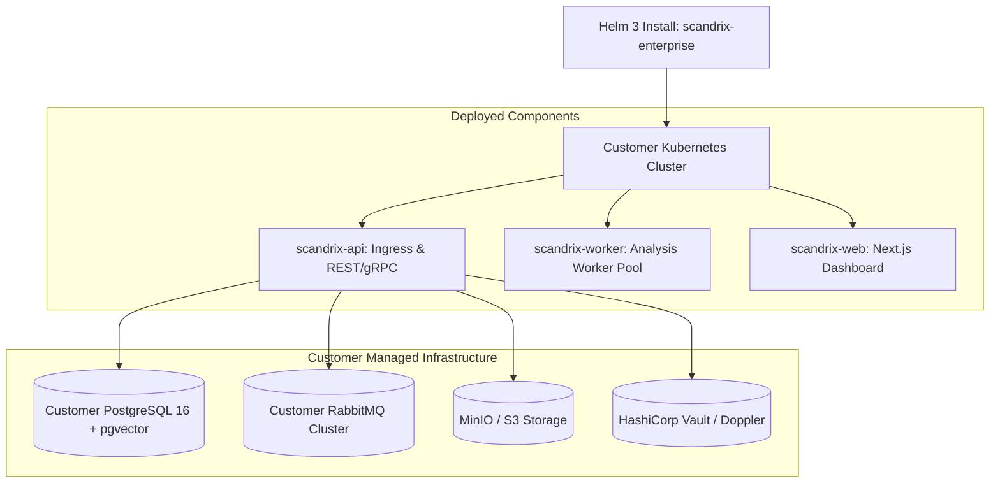

# Self-Hosted Enterprise Deployment Guide

**Classification:** AUTHORITATIVE SPECIFICATION  
**Status:** APPROVED  
**Target Version:** v1.0 Enterprise  
**Distribution:** Helm 3 Chart & OCI Package

---

## 1. Executive Summary & Helm Architecture

Enterprise organizations requiring on-premises deployment or sovereign cloud infrastructure (AWS GovCloud, Azure Government, private OpenShift clusters) deploy Scandrix via the official **Scandrix Enterprise Helm Chart** (`scandrix/scandrix-enterprise`).



---

## 2. Production `values.yaml` Configuration

```yaml
global:
  environment: "production"
  domain: "scandrix.corp.internal"
  tlsSecretName: "scandrix-wildcard-tls"

scandrixApi:
  replicaCount: 3
  resources:
    limits:
      cpu: "2000m"
      memory: "4096Mi"
    requests:
      cpu: "500m"
      memory: "1024Mi"

scandrixWorker:
  replicaCount: 5
  sandboxBackend: "gvisor" # Options: "gvisor", "firecracker"
  resources:
    limits:
      cpu: "4000m"
      memory: "8192Mi"

database:
  host: "postgres.corp.internal"
  port: 5432
  name: "scandrix_db"
  sslMode: "require"
  existingSecret: "scandrix-db-credentials"

secrets:
  provider: "vault" # "vault", "doppler", "kubernetes"
  vaultAddress: "https://vault.corp.internal:8200"
```
