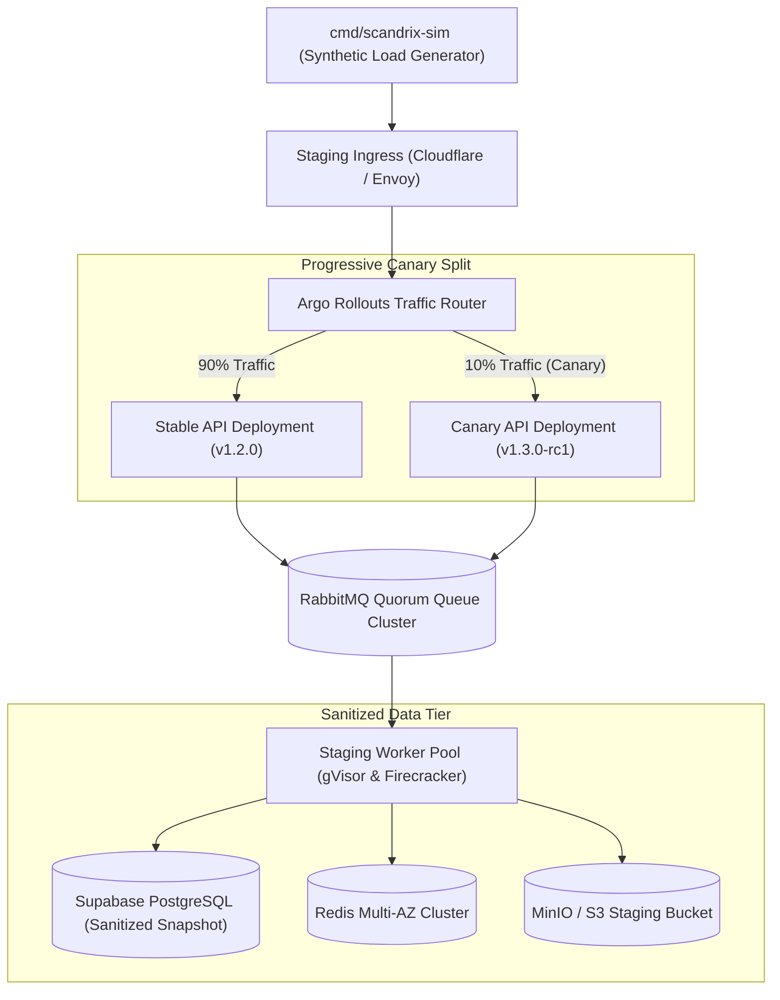
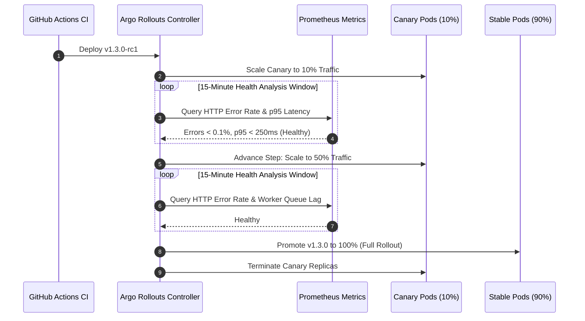
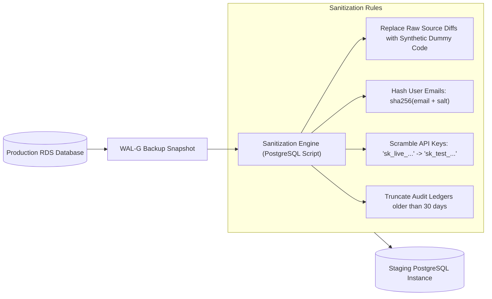

# Staging Environment Deployment & Canary Specification

**Classification:** AUTHORITATIVE INFRASTRUCTURE SPECIFICATION  
**Status:** APPROVED FOR IMPLEMENTATION  
**Version:** 3.0.0  
**Domain:** Pre-Production Verification, Canary Rollouts & Chaos Engineering

---

## 1. Executive Summary & Topology

The Scandrix Staging Environment is an exact, high-fidelity architectural mirror of production running on a dedicated multi-zone Kubernetes cluster. It isolates pre-release code to validate:
1. **Automated Progressive Delivery (Canary)**: Validating new Go microservices, database migrations, and AI gateway versions with Argo Rollouts before 100% promotion.
2. **What-If Historical Policy Backtesting**: Simulating new organizational policies against sanitized repository datasets to measure false-positive rates and blast radius.
3. **Synthetic High-Throughput Ingestion**: Validating webhook throughput ($\ge 5,000\text{ req/s}$) using an internal mock load generator (`cmd/scandrix-sim`).
4. **Chaos Engineering & Resilience**: Injecting simulated network latency, RabbitMQ cluster node kills, and database failovers.



---

## 2. Progressive Canary Rollout Workflow

Scandrix uses **Argo Rollouts** for automated canary promotion with real-time Prometheus metric analysis:



### Automated Rollback Trigger Conditions
The rollout controller halts and initiates an immediate, automatic rollback if:
- HTTP 5xx error rate exceeds $0.5\%$ over a 3-minute sliding window.
- API p95 request latency exceeds $500\text{ms}$.
- RabbitMQ unacknowledged message queue lag increases by $> 20\%$.

---

## 3. Production Data Sanitization Pipeline

Staging database state is refreshed nightly from production using an automated anonymization pipeline that strips all customer proprietary assets:



---

## 4. Synthetic Load Generation (`cmd/scandrix-sim`)

To ensure staging accurately reflects enterprise peak loads, the `scandrix-sim` daemon continuously generates realistic webhook traffic:

```bash
# Executing continuous synthetic webhook simulation
scandrix-sim \
  --target-url https://staging-api.scandrix.internal/api/v1/webhooks/github \
  --concurrency 50 \
  --rate 500 \
  --pr-size-mean 250 \
  --duration 2h \
  --include-slash-commands=true
```

---

## 5. Argo Rollout Kubernetes Manifest

```yaml
apiVersion: argoproj.io/v1alpha1
kind: Rollout
metadata:
  name: scandrix-api-staging
  namespace: staging
spec:
  replicas: 6
  strategy:
    canary:
      analysis:
        templates:
          - templateName: success-rate-analysis
        args:
          - name: service-name
            value: scandrix-api-canary
      steps:
        - setWeight: 10
        - pause: { duration: 15m }
        - setWeight: 50
        - pause: { duration: 15m }
  template:
    metadata:
      labels:
        app: scandrix-api
    spec:
      containers:
        - name: api
          image: registry.scandrix.io/scandrix-api:v1.3.0-rc1
          resources:
            requests:
              cpu: "500m"
              memory: "1024Mi"
            limits:
              cpu: "2000m"
              memory: "2048Mi"
          envFrom:
            - secretRef:
                name: doppler-staging-secrets
```
