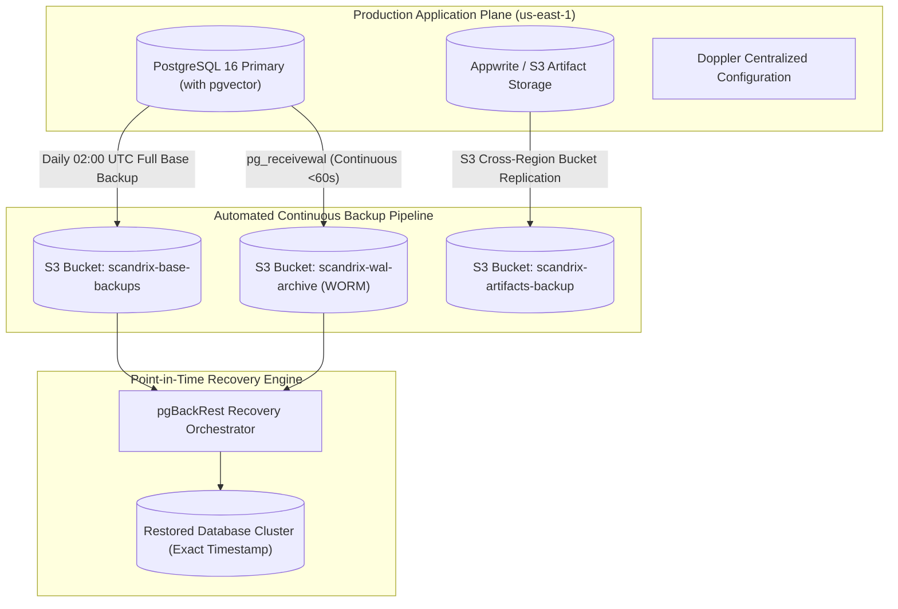
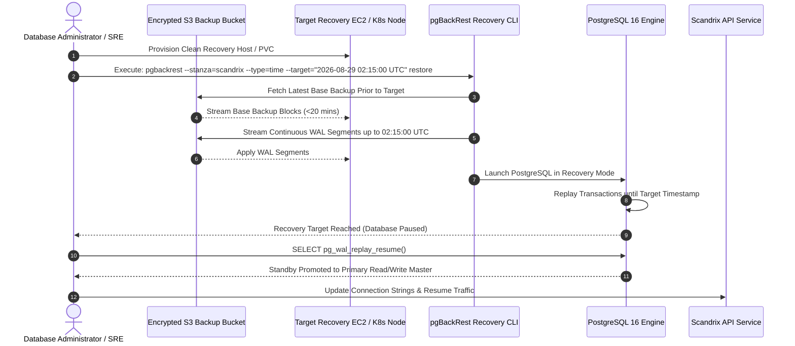

# Backup, Restore & Point-in-Time Recovery (PITR) — Technical Specification

**Classification:** AUTHORITATIVE OPERATIONAL SPECIFICATION  
**Status:** APPROVED FOR IMPLEMENTATION  
**Version:** 3.0.0  
**Domain:** Business Continuity, Data Preservation & Disaster Resilience

---

## 1. Executive Summary & Enterprise SLAs

Scandrix implements an automated **3-2-1 Backup Strategy** across all transactional databases, vector embeddings (`pgvector`), object storage artifacts, and configuration secrets:
- **3 Copies of Data**: Primary active data, local standby replica, and offsite cross-region encrypted backups.
- **2 Different Storage Media**: Fast NVMe block storage for production workloads and durable multi-AZ cloud object storage (Amazon S3 / Google Cloud Storage) with Object Lock.
- **1 Offsite Geographic Copy**: Asynchronous replication to a geographically separated cloud region (`us-west-2`).

### Service Level Objectives (SLOs)
- **Recovery Point Objective (RPO)**: $\le 5\text{ minutes}$ (guaranteed by continuous PostgreSQL WAL archiving).
- **Recovery Time Objective (RTO)**: $\le 60\text{ minutes}$ for complete petabyte-scale cluster recovery.
- **Retention Schedule**: 35-day continuous Point-in-Time Recovery (PITR); annual immutable WORM snapshots preserved for 7 years for SOC 2 Type II, ISO 27001, and HIPAA compliance.



---

## 2. Point-in-Time Recovery (PITR) Execution Sequence Diagram



---

## 3. Automated pgBackRest Configuration (`pgbackrest.conf`)

The primary database utilizes `pgBackRest` with multi-threaded compression and direct S3 streaming:

```ini
[global]
repo1-type=s3
repo1-s3-bucket=scandrix-db-backups-useast1
repo1-s3-endpoint=s3.us-east-1.amazonaws.com
repo1-s3-region=us-east-1
repo1-path=/pgbackrest
repo1-s3-key-type=auto
repo1-cipher-type=aes-256-cbc
repo1-cipher-pass=ENV:PGBACKREST_CIPHER_PASSPHRASE
repo1-retention-full=35
repo1-retention-diff=7
process-max=8
log-level-console=info
log-level-file=debug
start-fast=y
compress-type=lz4
compress-level=3

[scandrix]
pg1-path=/var/lib/postgresql/16/main
pg1-user=postgres
```

---

## 4. Step-by-Step Recovery Runbook

### Step 1: Prepare Recovery Target Node
Stop any running database service and clear corrupted data directories:
```bash
sudo systemctl stop postgresql-16
sudo rm -rf /var/lib/postgresql/16/main/*
```

### Step 2: Execute Point-in-Time Restoration
Restore database files to the precise second prior to corruption:
```bash
sudo -u postgres pgbackrest \
  --stanza=scandrix \
  --type=time \
  --target="2026-08-29 02:15:00.000+00" \
  --target-action=pause \
  restore
```

### Step 3: Verify Integrity & Resume Normal Writes
```bash
# Start PostgreSQL engine
sudo systemctl start postgresql-16

# Verify current transaction timestamp matches target
psql -U postgres -c "SELECT pg_last_xact_replay_timestamp();"

# Resume normal write transactions
psql -U postgres -c "SELECT pg_wal_replay_resume();"
```

---

## 5. Automated Backup Validation & Restore Drills

To guarantee backups are never silently corrupted:
1. **Automated Weekly Headless Restore**: Every Sunday at 04:00 UTC, a Kubernetes CronJob restores the latest base backup into an ephemeral namespace, verifies data table row counts, checks `pgvector` indexes, and destroys the namespace.
2. **Prometheus Monitoring Alerts**: Alerts fire immediately if no new WAL segment has been archived for $> 10\text{ minutes}$ or if base backup age exceeds $> 26\text{ hours}$.
