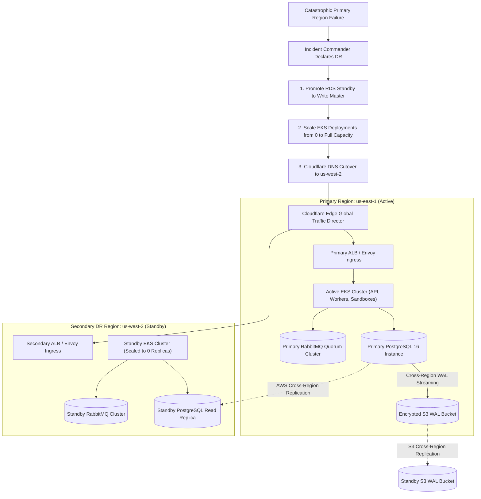
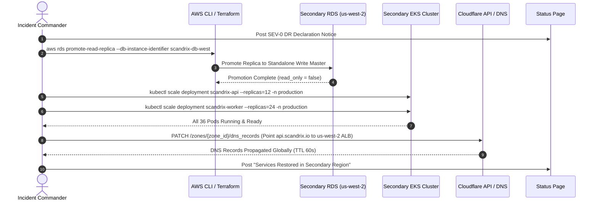

# Disaster Recovery (DR) Plan & Multi-Region Failover Specification

**Classification:** RESTRICTED / AUTHORITATIVE OPERATIONAL SPECIFICATION  
**Status:** APPROVED FOR IMPLEMENTATION  
**Version:** 3.0.0  
**Domain:** Business Continuity, Multi-Region Resilience & Catastrophic Recovery

---

## 1. Executive Summary & Recovery Objectives

Scandrix maintains a dual-region **Active-Passive Disaster Recovery Topology** between Primary (`us-east-1`, North Virginia) and Secondary DR Standby (`us-west-2`, Oregon). The platform is engineered against total cloud region loss, physical datacenter destruction, or critical infrastructure compromise.

### Recovery Objectives
- **Recovery Point Objective (RPO)**: $\le 15\text{ minutes}$ (maximum potential data loss, bounded by continuous cross-region asynchronous WAL streaming).
- **Recovery Time Objective (RTO)**: $\le 45\text{ minutes}$ from formal Incident Commander DR declaration to full live customer traffic restoration.



---

## 2. Step-by-Step Regional Failover Runbook



### Detailed Command Execution Steps

#### Phase 1: Database Promotion & Fencing
To prevent split-brain writes, fence the primary region if accessible, then promote the secondary RDS replica:
```bash
# 1. Promote secondary read replica in us-west-2
aws rds promote-read-replica \
  --db-instance-identifier scandrix-db-west-replica \
  --region us-west-2

# 2. Verify database accepts writes
psql "postgres://scandrix_admin@scandrix-db-west.internal:5432/scandrix" \
  -c "CREATE TABLE IF NOT EXISTS _dr_test (id int); DROP TABLE _dr_test;"
```

#### Phase 2: Compute Autoscaling
Scale warm-standby deployments on the secondary Kubernetes cluster:
```bash
# Scale API services and RabbitMQ workers
kubectl --context=dr-us-west-2 scale deployment scandrix-api --replicas=12 -n production
kubectl --context=dr-us-west-2 scale deployment scandrix-worker --replicas=24 -n production
kubectl --context=dr-us-west-2 scale deployment scandrix-outbox-relay --replicas=3 -n production

# Verify pods are passing readiness probes
kubectl --context=dr-us-west-2 rollout status deployment/scandrix-api -n production --timeout=180s
```

#### Phase 3: Global DNS Cutover
```bash
# Update Cloudflare DNS to route all customer traffic to Oregon ALB
curl -X PUT "https://api.cloudflare.com/client/v4/zones/${CF_ZONE_ID}/dns_records/${CF_RECORD_ID}" \
  -H "Authorization: Bearer ${CF_API_TOKEN}" \
  -H "Content-Type: application/json" \
  --data '{"type":"CNAME","name":"api.scandrix.com","content":"scandrix-alb-west-12345.us-west-2.elb.amazonaws.com","ttl":60,"proxied":true}'
```

---

## 3. Failback Protocol (Restoring Primary Region)

Once cloud provider recovery is verified in `us-east-1`:
1. Re-establish PostgreSQL replication from `us-west-2` back to `us-east-1` (reversing replication direction).
2. Schedule a planned 5-minute maintenance window during low traffic.
3. Drain worker queues in `us-west-2`.
4. Promote `us-east-1` RDS back to master and swing Cloudflare DNS back to Virginia.
5. Scale `us-west-2` compute deployments back to 0 replicas.

---

## 4. Disaster Recovery Gameday Testing

Every quarter, the SRE team executes a live fire drill simulating primary region loss:
- Gamedays rotate through unannounced failure injections during business hours.
- Requires full execution of this runbook with verified RTO $\le 45\text{m}$.
- Findings are tracked as mandatory SRE backlog tickets.
