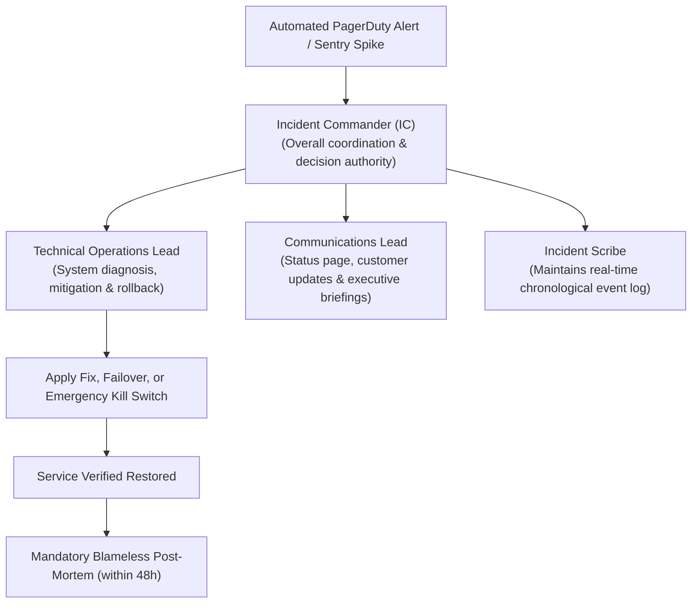
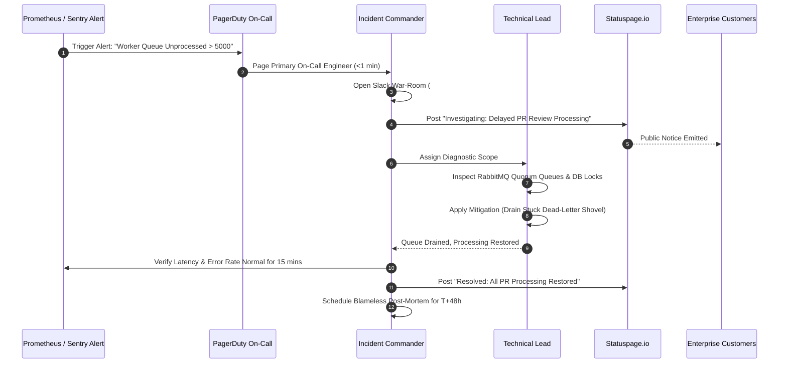

# Incident Management, On-Call Protocols & Post-Mortems

**Classification:** AUTHORITATIVE OPERATIONAL SPECIFICATION  
**Status:** APPROVED FOR IMPLEMENTATION  
**Version:** 3.0.0  
**Domain:** Site Reliability Engineering, Incident Command & Blameless Retrospectives

---

## 1. Executive Summary & Incident Command System (ICS)

When an active service degradation, security anomaly, or pipeline blockage occurs, Scandrix activates the **Incident Command System (ICS)**. The first responding on-call engineer assumes the role of **Incident Commander (IC)** until explicitly handed off to an engineering lead.



---

## 2. Severity Classification & Response SLA Matrix

| Severity | Customer & Business Impact | Response SLA | Update Cadence | Dedicated Bridge | Escalation Triggers |
| :--- | :--- | :--- | :--- | :--- | :--- |
| **SEV-0** | Total platform outage, data loss risk, active security exploit, cross-tenant leakage | $\le 5\text{ mins}$ | Every 15 mins | `#incident-sev0-active` + Live Zoom bridge | VP Eng, CISO, CEO alerted immediately |
| **SEV-1** | Scan worker queues stalled, PR webhooks delayed $> 5\text{m}$, primary DB failover in progress | $\le 15\text{ mins}$ | Every 30 mins | `#incident-sev1-active` + Slack huddle | Director of Eng alerted |
| **SEV-2** | AI provider latency spike $> 5\text{s}$ (automatic fallback active), single customer integration failure | $\le 1\text{ hour}$ | Every 2 hours | Dedicated `#incidents` Slack thread | Team On-Call Lead |
| **SEV-3** | Minor dashboard UI glitch, non-critical metrics lag | $\le 24\text{ hours}$ | Daily | Jira issue tracking | Sprint planning grooming |

---

## 3. Incident Lifecycle Sequence Diagram



---

## 4. Blameless Post-Mortem Standard Template

Every resolved SEV-0 and SEV-1 incident requires a documented retrospective completed within 48 hours:

```markdown
# Blameless Post-Mortem: [INCIDENT-ID] — [Incident Title]

**Date of Incident:** 2026-08-29  
**Duration:** 42 minutes (14:12 UTC to 14:54 UTC)  
**Severity:** SEV-1  
**Incident Commander:** @sarah.eng  
**Technical Lead:** @david.ops  
**Status Page Link:** https://status.scandrix.io/incidents/xyz

---

## 1. Executive Summary
At 14:12 UTC, an unexpected database lock timeout during an unindexed foreign key migration caused the outbox relay daemon to stall. This delayed GitHub PR review comments for 120 customer repositories. The database connection was cleared at 14:45 UTC, and queue processing fully normalized by 14:54 UTC. No customer source code or audit records were lost.

---

## 2. Chronological Timeline (UTC)
- **14:05**: Routine migration `004_accounts.sql` applied in production.
- **14:12**: Prometheus alert `OutboxRelayStalled` fires; PagerDuty pages on-call.
- **14:14**: IC declares SEV-1 and initializes war-room `#incident-2026-08-29`.
- **14:20**: Technical Lead identifies exclusive table lock in PostgreSQL `pg_stat_activity`.
- **14:35**: Query terminated via `SELECT pg_terminate_backend(pid)`.
- **14:45**: Migration reapplied with `CONCURRENTLY` flag.
- **14:54**: All queued PR webhooks drained; incident declared resolved.

---

## 3. Root Cause Analysis (The 5 Whys)
1. **Why were PR comments delayed?** The outbox relay daemon couldn't write event status updates.
2. **Why couldn't it write?** The `outbox_events` table was locked waiting for a foreign key check.
3. **Why was it waiting?** The migration added a foreign key without `NOT VALID`.
4. **Why was `NOT VALID` omitted?** The migration was written manually rather than using the expand/contract template.
5. **Why did CI not catch it?** The staging canary run did not have high enough simulated write load to trigger the lock contention.

---

## 4. Corrective & Preventative Action Items
| Action Item | Type | Owner | Target Date | Jira Ticket |
| :--- | :--- | :--- | :--- | :--- |
| Add CI linter forbidding non-concurrent index additions | Prevent | @david | 2026-09-05 | `SRE-401` |
| Add lock timeout limit `SET lock_timeout = '3s'` to all migrations | Mitigate | @alex | 2026-09-02 | `DB-112` |
| Increase staging load simulation concurrency to 5,000 req/s | Detect | @elena | 2026-09-10 | `QA-209` |
```
