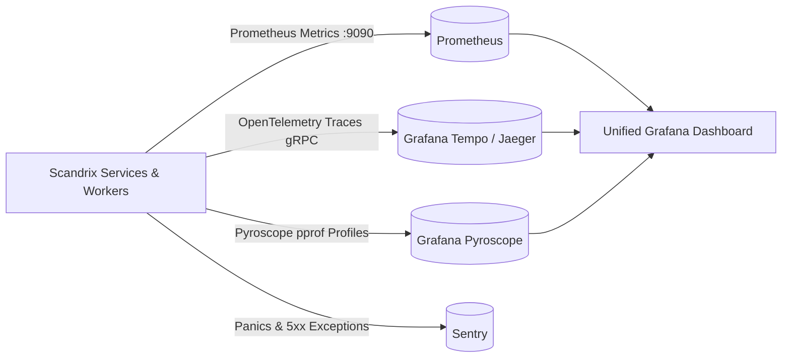

# Monitoring, Metrics & Observability Guide — Technical Specification

**Classification:** AUTHORITATIVE OPERATIONAL SPECIFICATION  
**Status:** APPROVED  
**Target Version:** v1.0 Enterprise  
**Domain:** Site Reliability Engineering & Observability

---

## 1. Executive Summary & Four Pillars of Observability

Scandrix maintains full observability across its distributed microservices, worker pools, and sandbox execution runtimes through **Prometheus metrics**, **OpenTelemetry distributed traces**, **Grafana Pyroscope continuous profiling**, and **Sentry error tracking**.



---

## 2. Core Prometheus Metrics Matrix

| Metric Name | Type | Labels | Description | Alerting Threshold |
|---|---|---|---|---|
| `scandrix_scan_duration_seconds` | Histogram | `status`, `repository_tier` | End-to-end duration of scan DAG execution | P95 $> 30\text{s}$ for 10m |
| `scandrix_findings_total` | Counter | `severity`, `rule_id`, `category` | Count of confirmed security and compliance findings | 10x anomalous surge |
| `scandrix_ai_tokens_total` | Counter | `provider`, `model`, `type` | Token usage tracking (input vs output vs cached) | Budget quota breach |
| `scandrix_queue_depth` | Gauge | `queue_name` | Pending message count in RabbitMQ quorum queues | $> 500$ messages for 5m |
| `scandrix_sandbox_executions_total` | Counter | `tier`, `exit_code` | gVisor and Firecracker execution counts and results | Error exit rate $> 5\%$ |

---

---

## 3. Service Level Objectives (SLOs), SLIs & Error Budgets

Scandrix commits to strict enterprise SLAs backed by quantified 30-day rolling error budgets:

### 3.1 Formal SLO Matrix

| Objective (SLO) | Target | Indicator (SLI) | Measurement Window | 30-Day Error Budget |
|---|---|---|---|---|
| **API Availability** | $\ge 99.99\%$ | $1.0 - \frac{\sum \text{5xx responses}}{\sum \text{Total API requests}}$ | 30-day rolling | $4.32\text{ minutes}$ downtime ($0.01\%$) |
| **Webhook Ingestion Latency** | P99 $< 15\text{ms}$ | Duration from ingress connection to outbox `COMMIT` | 30-day rolling | $1\%$ of requests $> 15\text{ms}$ |
| **API Response Latency** | P95 $< 250\text{ms}$ | Non-streaming REST endpoint latency | 7-day rolling | $5\%$ of requests $> 250\text{ms}$ |
| **Scan Turnaround (Standard PR)** | P95 $< 30\text{s}$ | Duration from webhook commit to PR comment publish | 30-day rolling | $5\%$ of scans $> 30\text{s}$ |
| **Evidence Immutability** | $100.0\%$ | Cryptographic Merkle tree verification match | Continuous | $0.00\%$ (Zero-tolerance SEV-0) |

---

## 4. Comprehensive Production Prometheus Alerting Rules (`alerts.yaml`)

```yaml
groups:
  - name: scandrix-production-alerts
    rules:
      # --- INGESTION & QUEUE HEALTH ---
      - alert: HighQueueLagCritical
        expr: scandrix_queue_depth{queue_name="q.jobs.scan.dag"} > 500
        for: 5m
        labels:
          severity: critical
          tier: queue
        annotations:
          summary: "Scan worker queue backlog exceeding SLA"
          description: "Over 500 scan jobs are queued; workers may be failing or throttled."

      - alert: RabbitMQUnroutableMessages
        expr: rate(rabbitmq_messages_unroutable_total[5m]) > 0
        for: 2m
        labels:
          severity: critical
          tier: queue
        annotations:
          summary: "RabbitMQ dead letter exchange receiving unroutable messages"
          description: "Messages are failing routing keys; queue topology mismatch."

      - alert: OutboxRelayLagging
        expr: (time() - max(scandrix_outbox_oldest_pending_timestamp)) > 30
        for: 2m
        labels:
          severity: high
          tier: ingestion
        annotations:
          summary: "Transactional outbox relay lag > 30 seconds"
          description: "Events committed to database are not being dispatched to RabbitMQ."

      # --- API & ERROR BUDGET HEALTH ---
      - alert: API5xxErrorRateHigh
        expr: (sum(rate(http_requests_total{status=~"5.."}[5m])) / sum(rate(http_requests_total[5m]))) * 100 > 0.05
        for: 3m
        labels:
          severity: critical
          tier: api
        annotations:
          summary: "API 5xx error rate exceeds 0.05% (Burn rate warning)"
          description: "Consuming 30-day 99.99% error budget at >14.4x normal rate."

      - alert: APILatencyBreachP95
        expr: histogram_quantile(0.95, sum(rate(http_request_duration_seconds_bucket[5m])) by (le)) > 0.25
        for: 5m
        labels:
          severity: high
          tier: api
        annotations:
          summary: "API P95 latency exceeds 250ms SLA"
          description: "Current P95 latency is {{ $value }}s over last 5m."

      # --- DATABASE & MULTI-TENANCY ---
      - alert: DatabaseConnectionPoolSaturated
        expr: pg_stat_activity_count / pg_settings_max_connections > 0.85
        for: 3m
        labels:
          severity: warning
          tier: database
        annotations:
          summary: "PostgreSQL connections near saturation"
          description: "Active database connections exceed 85% of pool capacity."

      - alert: DatabaseReplicationLag
        expr: pg_stat_replication_lag_bytes > 524288000 # 500MB
        for: 5m
        labels:
          severity: critical
          tier: database
        annotations:
          summary: "PostgreSQL synchronous replica lag exceeds 500MB"
          description: "Standby node replication falling behind; failover risk."

      # --- CRITICAL SECURITY & AUDIT INVARIANTS ---
      - alert: EvidencePacketTamperDetected
        expr: scandrix_evidence_tamper_events_total > 0
        for: 0m
        labels:
          severity: page
          tier: security
        annotations:
          summary: "SEV-0: Cryptographic evidence packet Merkle verification failure!"
          description: "An evidence packet hash mismatch was detected. Potential tampering."

      - alert: CrossTenantQueryAttempt
        expr: rate(scandrix_rls_security_violations_total[5m]) > 0
        for: 0m
        labels:
          severity: page
          tier: security
        annotations:
          summary: "SEV-0: Row-Level Security policy violation detected"
          description: "A query attempted to read across tenant boundaries."

      # --- SANDBOX RUNTIME HEALTH ---
      - alert: SandboxExecutionErrorRateHigh
        expr: (sum(rate(scandrix_sandbox_executions_total{exit_code!="0"}[5m])) / sum(rate(scandrix_sandbox_executions_total[5m]))) * 100 > 5.0
        for: 5m
        labels:
          severity: high
          tier: sandbox
        annotations:
          summary: "Sandbox execution failure rate > 5%"
          description: "gVisor or Firecracker sandboxes are failing during AST/test execution."

      - alert: FirecrackerVMPoolExhaustion
        expr: scandrix_firecracker_available_vms < 5
        for: 2m
        labels:
          severity: critical
          tier: sandbox
        annotations:
          summary: "Firecracker pre-warmed MicroVM pool exhausted (< 5 VMs available)"
          description: "High concurrency tier-2 test validation is bottlenecked."

      # --- AI GATEWAY & SAFETY ---
      - alert: AIPromptInjectionSpike
        expr: rate(scandrix_prompt_injections_quarantined_total[10m]) > 5
        for: 5m
        labels:
          severity: high
          tier: ai-gateway
        annotations:
          summary: "Anomalous surge in prompt injection attempts detected"
          description: "Adversarial PR payloads detected at rate of {{ $value }}/s."

      - alert: AIFallbackRateHigh
        expr: (sum(rate(scandrix_ai_fallback_calls_total[5m])) / sum(rate(scandrix_ai_calls_total[5m]))) * 100 > 10.0
        for: 5m
        labels:
          severity: warning
          tier: ai-gateway
        annotations:
          summary: "AI Gateway provider fallback rate > 10%"
          description: "Primary LLM provider (Anthropic) rate limits or latency triggering fallback."

      - alert: AIBudgetApproachingLimit
        expr: scandrix_tenant_ai_spend_dollars / scandrix_tenant_ai_budget_dollars > 0.90
        for: 10m
        labels:
          severity: warning
          tier: ai-gateway
        annotations:
          summary: "Tenant AI budget consumed > 90%"
          description: "Tenant nearing monthly quota; auto-downgrade to Tier 1 fast model soon."

      # --- INFRASTRUCTURE & HOST HEALTH ---
      - alert: DiskSpaceLowCritical
        expr: node_filesystem_avail_bytes{mountpoint="/"}/node_filesystem_size_bytes{mountpoint="/"} * 100 < 10
        for: 5m
        labels:
          severity: critical
          tier: infra
        annotations:
          summary: "Root filesystem available disk space < 10%"
          description: "Worker node host storage nearing exhaustion."

      - alert: TLSCertificateExpiringSoon
        expr: (scandrix_cert_expiry_timestamp - time()) / 86400 < 15
        for: 1h
        labels:
          severity: warning
          tier: infra
        annotations:
          summary: "TLS certificate expiring in less than 15 days"
          description: "mTLS or public domain ingress TLS certificate requires renewal."
```
