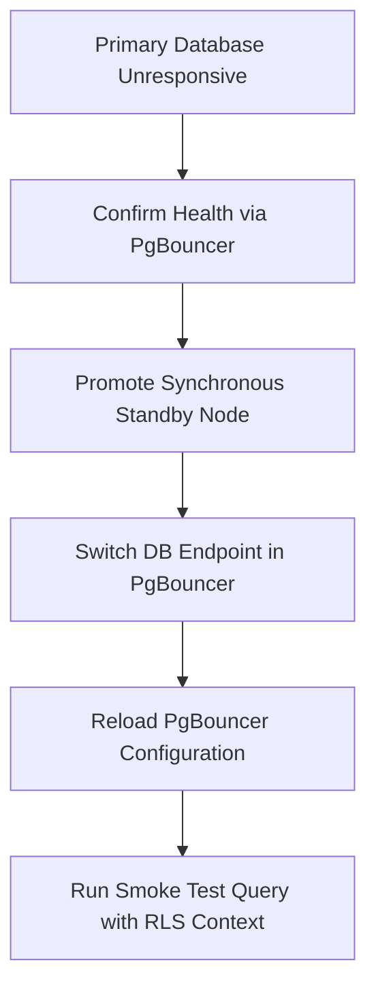

# Operational Runbook 01: PostgreSQL Database Failover

**Classification:** AUTHORITATIVE OPERATIONAL RUNBOOK  
**Status:** APPROVED  
**Target Version:** v1.0 Enterprise  
**Trigger:** Primary database node unresponsive, hardware failure, or high replication lag ($> 1\text{GB}$)

---

## 1. Failover Execution Workflow



---

## 2. Step-by-Step Execution Commands

### Step 1: Confirm Primary Outage
Verify whether the primary instance is unreachable or simply experiencing high CPU:
```bash
pg_isready -h pg-primary.scandrix.internal -p 5432 -t 5
```

### Step 2: Promote Standby Node
If the primary is unrecoverable, promote the standby node to write master:
```bash
# On standby node
pg_ctl promote -D /var/lib/postgresql/16/main
# Or via AWS RDS CLI
aws rds reboot-db-instance --db-instance-identifier scandrix-primary --force-failover
```

### Step 3: Update PgBouncer Connection Targets
Update the upstream connection string in `/etc/pgbouncer/pgbouncer.ini`:
```ini
[databases]
scandrix_db = host=pg-standby.scandrix.internal port=5432 dbname=scandrix_db
```
Reload PgBouncer without dropping active client connections:
```bash
psql -p 6432 -U pgbouncer -d pgbouncer -c "RELOAD;"
```

### Step 4: Verification & Smoke Test
Execute a test transaction asserting that Row-Level Security (RLS) remains active:
```bash
psql -h 127.0.0.1 -p 6432 -U scandrix_app -d scandrix_db -c "
  BEGIN;
  SET LOCAL app.current_tenant_id = '00000000-0000-0000-0000-000000000001';
  SELECT count(*) FROM evidence_packets;
  COMMIT;
"
```
