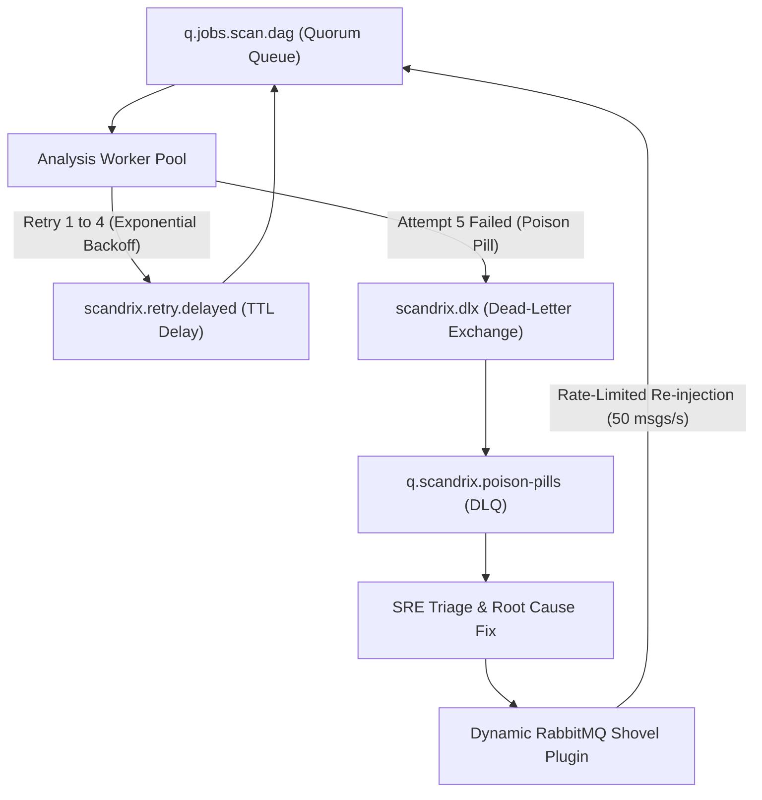

# Operational Runbook 02: RabbitMQ Quorum Queue Drain & Dead-Letter Retry

**Classification:** AUTHORITATIVE OPERATIONAL RUNBOOK  
**Status:** APPROVED FOR IMPLEMENTATION  
**Version:** 3.0.0  
**Trigger:** Dead-letter queue (`q.scandrix.poison-pills`) exceeds 10 messages, or worker pool requires graceful drain for cluster upgrade.

---

## 1. Executive Summary & Dead-Letter Lifecycle

In the Scandrix distributed architecture, tasks that fail five consecutive execution attempts across workers are automatically dead-lettered to prevent blocking the Quorum Queues. The **Dead-Letter Shovel Lifecycle** enables SREs to inspect, triage, repair, and safely re-inject poisoned messages into the active worker pool without message loss or worker starvation.



---

## 2. Dead-Letter Inspection & Triage Runbook

### Step 1: Query Current Queue Depths
```bash
# Check dead-letter and active queue counts
curl -s -u "$RABBITMQ_USER:$RABBITMQ_PASS" \
  http://rabbitmq.scandrix.internal:15672/api/queues/%2F \
  | jq -r '.[] | select(.name | contains("poison") or contains("jobs")) | "\(.name): \(.messages) messages (\(.messages_unacknowledged) unack)"'
```

### Step 2: Non-Destructive Message Inspection
Fetch and inspect the payload of the first 5 poisoned messages without removing them from the queue:
```bash
curl -s -u "$RABBITMQ_USER:$RABBITMQ_PASS" \
  -H "Content-Type: application/json" \
  -X POST http://rabbitmq.scandrix.internal:15672/api/queues/%2F/q.scandrix.poison-pills/get \
  -d '{"count": 5, "ackmode": "ack_requeue_true", "encoding": "auto"}' \
  | jq '.[].payload | fromjson'
```

### Step 3: Identify Failure Cause in Headers
Inspect the `x-death` array in the message headers to determine the exact failure reason:
```json
{
  "x-death": [
    {
      "count": 5,
      "exchange": "scandrix.jobs.direct",
      "queue": "q.jobs.scan.dag",
      "reason": "rejected",
      "time": 1724989200
    }
  ]
}
```

---

## 3. Rate-Limited Re-queueing via RabbitMQ Shovel

Once the underlying issue is mitigated, move messages from the dead-letter queue back into the active work queue using a rate-limited dynamic shovel:

```bash
# 1. Enable dynamic shovel to re-inject messages at 50 per second
rabbitmqctl set_parameter shovel retry-poison-pills \
  '{
    "src-uri": "amqp://",
    "src-queue": "q.scandrix.poison-pills",
    "dest-uri": "amqp://",
    "dest-queue": "q.jobs.scan.dag",
    "prefetch-count": 50,
    "ack-mode": "on-confirm",
    "delete-after": "queue-length"
  }'

# 2. Monitor shovel transfer progress
rabbitmqctl shovel_status | grep retry-poison-pills

# 3. Clear shovel configuration once queue is empty
rabbitmqctl clear_parameter shovel retry-poison-pills
```

---

## 4. Graceful Worker Pool Drain (Cluster Upgrade Procedure)

When rolling out worker cluster updates, gracefully drain active workers without dropping in-flight jobs:

```bash
# 1. Stop ingesting new jobs by setting worker prefetch to 0
kubectl scale deployment scandrix-outbox-relay --replicas=0 -n production

# 2. Monitor unacknowledged messages until they reach 0
watch -n 2 'curl -s -u "$RABBITMQ_USER:$RABBITMQ_PASS" http://rabbitmq.scandrix.internal:15672/api/queues/%2F/q.jobs.scan.dag | jq .messages_unacknowledged'

# 3. Proceed with rolling restart of worker pods
kubectl rollout restart deployment/scandrix-worker -n production
kubectl rollout status deployment/scandrix-worker -n production

# 4. Resume outbox relay
kubectl scale deployment scandrix-outbox-relay --replicas=3 -n production
```
