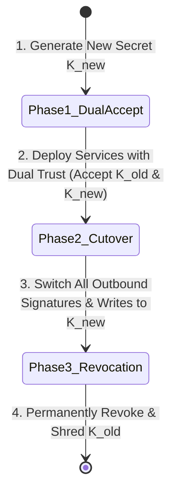
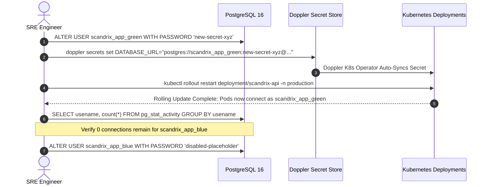

# Operational Runbook 03: Zero-Downtime Secret & Key Rotation

**Classification:** AUTHORITATIVE OPERATIONAL RUNBOOK  
**Status:** APPROVED FOR IMPLEMENTATION  
**Version:** 3.0.0  
**Trigger:** Scheduled 90-day rotation, suspected credential leak, or employee offboarding.

---

## 1. Executive Summary & Three-Phase Rotation Lifecycle

Rotating production credentials, encryption keys, and database passwords without service downtime requires adherence to the **Three-Phase Rotation Lifecycle**:



1. **Phase 1: Dual-Accept Phase**: Both $K_{\text{old}}$ and $K_{\text{new}}$ are loaded into service memory. Verification routines accept either key.
2. **Phase 2: Cutover Phase**: All new outbound tokens, database connections, and signed attestations are minted strictly with $K_{\text{new}}$.
3. **Phase 3: Revocation Phase**: After existing tokens with $K_{\text{old}}$ have expired (TTL elapsed), $K_{\text{old}}$ is revoked in Doppler and KMS.

---

## 2. Zero-Downtime PostgreSQL Database Password Rotation

Scandrix rotates database passwords without dropping in-flight transactions using dual alternating PostgreSQL roles (`scandrix_app_blue` and `scandrix_app_green`):



---

## 3. Doppler Configuration & Automated Sync Commands

### Step 1: Update Credential in Doppler Production Project
```bash
# Update secret in Doppler production configuration
doppler secrets set GITHUB_WEBHOOK_SECRET="new-generated-high-entropy-secret" \
  --project scandrix \
  --config prd
```

### Step 2: Trigger Operator Secret Synchronization
The Doppler Kubernetes Operator detects changes within 60 seconds. To accelerate synchronization immediately:
```bash
# Force immediate Kubernetes Secret reload
kubectl annotate secret scandrix-prod-secrets \
  secret.doppler.com/reload="$(date +%s)" \
  -n production --overwrite

# Perform a zero-downtime rolling restart of services
kubectl rollout restart deployment/scandrix-api -n production
kubectl rollout restart deployment/scandrix-worker -n production

# Verify rolling update completed cleanly without HTTP 5xx errors
kubectl rollout status deployment/scandrix-api -n production --timeout=180s
```

---

## 4. Ed25519 Signing Key & JWT Verification Rotation

When rotating the platform's Ed25519 signing key used for In-Toto v1.0 / SLSA Level 3 attestations:
1. **Generate New Keypair**:
   ```bash
   scandrix-admin pki generate-keypair --out /tmp/scandrix-new-key
   ```
2. **Publish New Public Key**: Add the new public key to the Kyverno admission controller `ClusterPolicy` so Kubernetes admits images signed with either key during transition.
3. **Switch Active Signing Key**: Update the worker deployment secret with the new private key.
4. **Deprecate Old Public Key**: Remove the old public key from the Kyverno policy after 14 days.

---

## 5. Emergency Revocation Runbook (Active Credential Leak)

If an API key or database credential is leaked publicly:
```bash
# 1. Execute immediate secret overwrite
doppler secrets set LEAKED_KEY="REVOKED_$(date +%s)" --project scandrix --config prd

# 2. Terminate all active database connections using the compromised user
psql "postgres://scandrix_admin@rds.scandrix.internal:5432/scandrix" \
  -c "SELECT pg_terminate_backend(pid) FROM pg_stat_activity WHERE usename = 'compromised_user';"

# 3. Force instant pod restart across all nodes
kubectl rollout restart deployment -n production
```
