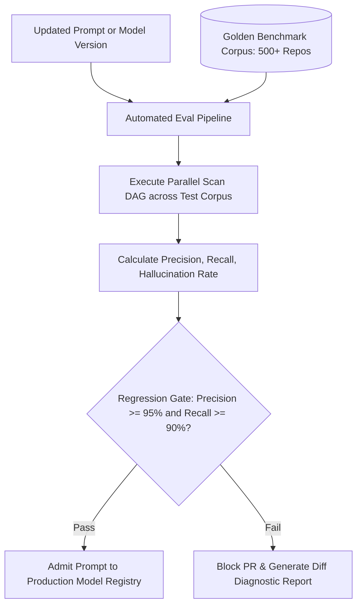

# AI Evaluation Harness & Precision Benchmarks — Technical Specification

**Classification:** AUTHORITATIVE SPECIFICATION  
**Status:** APPROVED  
**Version:** 2.0.0  
**Eval Package:** `github.com/scandrix/scandrix/internal/aigateway/eval`

---

## 1. Executive Summary: Objective Measurement Harness

To prevent prompt regressions, model drift, and hallucination spikes, the Scandrix platform includes an automated **AI Evaluation Harness**. Every modification to a system prompt, routing threshold, or foundation model provider version must pass through an offline regression test suite executed against standard vulnerability benchmark corpora.



---

## 2. Quantitative Metric Formulations

### 2.1 Precision ($\mathcal{P}$)
The ratio of confirmed, legitimate security vulnerabilities to total reported findings:
$$\mathcal{P} = \frac{\text{True Positives (TP)}}{\text{True Positives (TP)} + \text{False Positives (FP)}} \ge 0.95$$

### 2.2 Recall ($\mathcal{R}$)
The proportion of known reference vulnerabilities detected across the corpus:
$$\mathcal{R} = \frac{\text{True Positives (TP)}}{\text{True Positives (TP)} + \text{False Negatives (FN)}} \ge 0.90$$

### 2.3 Hallucination Rate ($\mathcal{H}$)
The proportion of findings citing non-existent variables, incorrect line numbers, or invalid CVE identifiers:
$$\mathcal{H} = \frac{\text{Hallucinated Findings}}{\text{Total Findings Evaluated}} \le 0.01 \quad (1.0\%)$$

### 2.4 Patch Success Rate ($\mathcal{S}_{\text{patch}}$)
The percentage of synthesized remediation diffs that cleanly compile and pass unit tests within the sandbox:
$$\mathcal{S}_{\text{patch}} \ge 0.85 \quad (85.0\%\text{ on 1st iteration}), \quad \ge 0.95 \quad (95.0\%\text{ within 3 iterations})$$

---

## 3. Reference Golden Datasets

The Scandrix evaluation harness tests against standard open and proprietary security test suites:
1. **OWASP Benchmark v1.2**: 2,740 test cases covering injection, path traversal, insecure cryptography, and XSS.
2. **NIST Juliet Test Suite v1.3**: Synthetic test cases covering C/C++, Java, and C# common weakness enumerations (CWEs).
3. **GoSec Vulnerability Corpus**: 150+ real-world Go open-source commits with confirmed CVE patches.
4. **Scandrix Internal Adversarial Suite**: 200 pull requests containing concealed prompt injections, obfuscated taints, and multi-file indirect calls.

---

## 4. Compilable Go 1.24+ Evaluation Harness Implementation

```go
package eval

import (
	"context"
	"fmt"
	"time"
)

// TestCase represents an individual golden benchmark test.
type TestCase struct {
	ID             string   `json:"id"`
	RepoName       string   `json:"repo_name"`
	TargetFile     string   `json:"target_file"`
	ExpectedLine   int      `json:"expected_line"`
	ExpectedCWE    int      `json:"expected_cwe"`
	ExpectedRuleID string   `json:"expected_rule_id"`
	IsVulnerable   bool     `json:"is_vulnerable"` // False for negative/clean controls
}

// EvalMetrics captures aggregate statistical performance.
type EvalMetrics struct {
	TruePositives     int           `json:"true_positives"`
	FalsePositives    int           `json:"false_positives"`
	TrueNegatives     int           `json:"true_negatives"`
	FalseNegatives    int           `json:"false_negatives"`
	Hallucinations    int           `json:"hallucinations"`
	TotalEvaluated    int           `json:"total_evaluated"`
	Precision         float64       `json:"precision"`
	Recall            float64       `json:"recall"`
	F1Score           float64       `json:"f1_score"`
	HallucinationRate float64       `json:"hallucination_rate"`
	TotalDuration     time.Duration `json:"total_duration"`
}

// BenchmarkRunner coordinates offline testing.
type BenchmarkRunner struct {
	GoldenSet []TestCase
}

// NewBenchmarkRunner initializes a test runner with benchmark cases.
func NewBenchmarkRunner(cases []TestCase) *BenchmarkRunner {
	return &BenchmarkRunner{GoldenSet: cases}
}

// CalculateMetrics derives statistical scores from raw counts.
func (m *EvalMetrics) Calculate() {
	if m.TruePositives+m.FalsePositives > 0 {
		m.Precision = float64(m.TruePositives) / float64(m.TruePositives+m.FalsePositives)
	}
	if m.TruePositives+m.FalseNegatives > 0 {
		m.Recall = float64(m.TruePositives) / float64(m.TruePositives+m.FalseNegatives)
	}
	if m.Precision+m.Recall > 0 {
		m.F1Score = 2 * (m.Precision * m.Recall) / (m.Precision + m.Recall)
	}
	if m.TotalEvaluated > 0 {
		m.HallucinationRate = float64(m.Hallucinations) / float64(m.TotalEvaluated)
	}
}

// PassesThresholds checks compliance against production deployment gates.
func (m *EvalMetrics) PassesThresholds() (bool, error) {
	if m.Precision < 0.95 {
		return false, fmt.Errorf("precision %.2f%% below 95.0%% requirement", m.Precision*100)
	}
	if m.Recall < 0.90 {
		return false, fmt.Errorf("recall %.2f%% below 90.0%% requirement", m.Recall*100)
	}
	if m.HallucinationRate > 0.01 {
		return false, fmt.Errorf("hallucination rate %.2f%% exceeds 1.0%% threshold", m.HallucinationRate*100)
	}
	return true, nil
}
```
