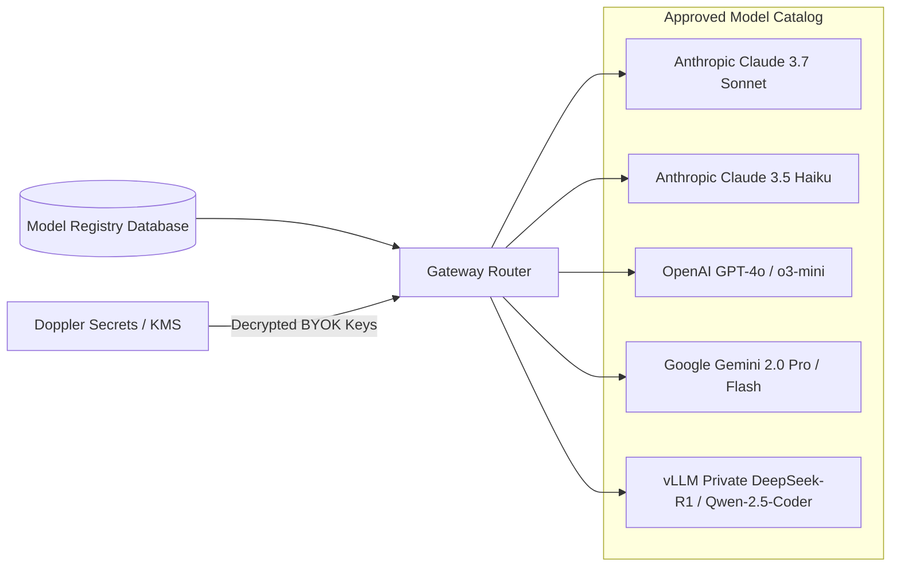

# AI Model Registry & Class Specifications

**Classification:** AUTHORITATIVE SPECIFICATION  
**Status:** APPROVED  
**Version:** 2.0.0  
**Registry Package:** `github.com/scandrix/scandrix/internal/aigateway/registry`

---

## 1. Executive Summary & Registry Architecture

The Scandrix Model Registry maintains the dynamic runtime catalog of foundation models, pricing structures, context window limits, token latency profiles, and enterprise compliance certifications. Decoupled from static configuration, the registry allows enterprise administrators to adjust routing policies, swap default models, or enforce on-premises air-gapped models without restarting Scandrix microservices.



---

## 2. Exhaustive Model Catalog & Capability Matrix

| Model Identifier | Provider | Context Window | Max Output | Input Cost / 1M | Output Cost / 1M | Cache Read / 1M | Zero Data Retention (ZDR) | Approved Workload |
|---|---|---|---|---|---|---|---|---|
| `claude-3-7-sonnet-20250219` | Anthropic | $200,000$ | $64,000$ | $\$3.00$ | $\$15.00$ | $\$0.30$ | Verified (Enterprise BAA) | Complex Vulnerability Triage, AST Proof-of-Fix |
| `claude-3-5-haiku-20241022` | Anthropic | $200,000$ | $8,192$ | $\$0.80$ | $\$4.00$ | $\$0.08$ | Verified | Fast Triage, Semantic Linting, PR Summaries |
| `gpt-4o-2024-11-20` | OpenAI | $128,000$ | $16,384$ | $\$2.50$ | $\$10.00$ | $\$1.25$ | Verified | Secondary Triage, Cross-File Dependency Verification |
| `gemini-2.0-flash` | Google Cloud | $1,000,000$ | $8,192$ | $\$0.10$ | $\$0.40$ | $\$0.025$ | Verified | Massive Monorepo Diff Ingestion ($> 50\text{k}$ tokens) |
| `deepseek-r1-distill-qwen-32b` | vLLM (On-Prem) | $64,000$ | $8,192$ | $\$0.00$ (Compute) | $\$0.00$ | N/A | $100\%$ Air-Gapped | Sovereign & Classified Enterprise Infrastructure |

*Note: Pricing and limits current as of Q1 2026. Production deployments sync live token rates dynamically via provider billing APIs without microservice restarts.*

---

## 3. Bring-Your-Own-Key (BYOK) & Key Vault Governance

Scandrix supports full multi-tenant BYOK:
1. **Zero Central Persistence of Plaintext Keys**: Customer-provided API keys (Anthropic, OpenAI, Azure OpenAI) are encrypted client-side or during API submission using AES-256-GCM envelope encryption backed by AWS KMS, HashiCorp Vault, or Doppler.
2. **Ephemeral Memory Injection**: Decrypted keys exist only inside the goroutine handling the immediate LLM completion call and are scrubbed immediately upon response completion.
3. **Usage & Budget Caps**: Tenants can enforce monthly dollar budget quotas. If a tenant's spend reaches $90\%$ of quota, the gateway alerts administrators and automatically downgrades non-critical scans to Tier 1 fast models.

---

## 4. Compilable Go 1.24+ Model Registry Implementation

```go
package registry

import (
	"context"
	"errors"
	"fmt"
	"sync"
	"time"
)

// ModelCapability bitmask tags.
type ModelCapability int

const (
	CapFastTriage ModelCapability = 1 << iota
	CapDeepReasoning
	CapPatchSynthesis
	CapExtendedThinking
	CapAirGapped
	CapLongContext
)

// ModelDescriptor specifies performance, cost, and compliance attributes.
type ModelDescriptor struct {
	ID                 string          `json:"id"`
	Provider           string          `json:"provider"`
	DisplayName        string          `json:"display_name"`
	ContextWindow      int             `json:"context_window"`
	MaxOutputTokens    int             `json:"max_output_tokens"`
	Capabilities       ModelCapability `json:"capabilities"`
	InputCostPerM      float64         `json:"input_cost_per_m"`
	OutputCostPerM     float64         `json:"output_cost_per_m"`
	CacheReadCostPerM  float64         `json:"cache_read_cost_per_m"`
	SupportsCaching    bool            `json:"supports_caching"`
	ZeroDataRetention  bool            `json:"zero_data_retention"`
	IsActive           bool            `json:"is_active"`
}

// Registry manages in-memory model metadata with dynamic updates.
type Registry struct {
	mu     sync.RWMutex
	models map[string]ModelDescriptor
}

// NewRegistry initializes an empty registry.
func NewRegistry() *Registry {
	return &Registry{
		models: make(map[string]ModelDescriptor),
	}
}

// Register adds or updates a model descriptor.
func (r *Registry) Register(m ModelDescriptor) error {
	if m.ID == "" || m.Provider == "" {
		return errors.New("model ID and provider cannot be empty")
	}

	r.mu.Lock()
	defer r.mu.Unlock()
	r.models[m.ID] = m
	return nil
}

// Get finds a model descriptor by identifier.
func (r *Registry) Get(id string) (ModelDescriptor, error) {
	r.mu.RLock()
	defer r.mu.RUnlock()

	m, exists := r.models[id]
	if !exists {
		return ModelDescriptor{}, fmt.Errorf("model descriptor not found: %s", id)
	}
	return m, nil
}

// FindByCapability returns all active models matching a requested capability bitmask.
func (r *Registry) FindByCapability(cap ModelCapability) []ModelDescriptor {
	r.mu.RLock()
	defer r.mu.RUnlock()

	var matches []ModelDescriptor
	for _, m := range r.models {
		if m.IsActive && (m.Capabilities&cap) == cap {
			matches = append(matches, m)
		}
	}
	return matches
}
```
