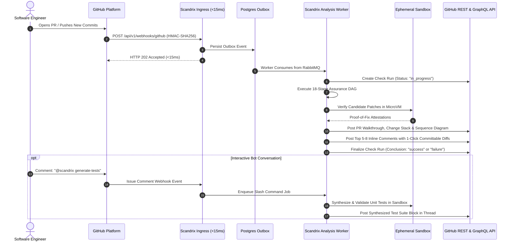
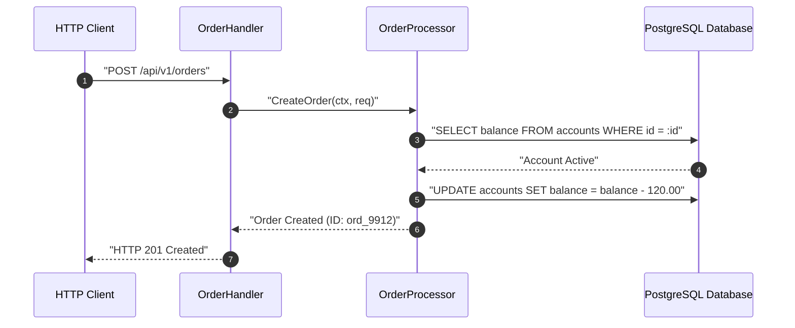

# GitHub App Integration, Interactive Bot & Walkthrough — Technical Specification

**Classification:** AUTHORITATIVE ARCHITECTURAL SPECIFICATION  
**Status:** APPROVED FOR IMPLEMENTATION  
**Version:** 3.0.0  
**Integration Package:** `github.com/scandrix/scandrix/internal/integrations/github`

---

## 1. Executive Summary & App Lifecycle

The Scandrix GitHub App provides frictionless, automated, and interactive code review inside GitHub repositories. Operating via asymmetric RSA-256 JWT installation token exchange, the integration handles webhook events, manages GitHub Check Runs, renders structured PR walkthroughs with automated Mermaid sequence diagrams, posts one-click committable suggestions, and executes interactive `@scandrix` slash commands.



---

## 2. Granular Permissions & App Authentication Flow

### 2.1 Required Granular Permissions
| Scope | Access Level | Business Justification |
|---|---|---|
| `checks` | Read & Write | Creating and updating Check Runs with detailed evidence summaries |
| `pull_requests` | Read & Write | Reading diffs, publishing inline review comments, and posting walkthroughs |
| `contents` | Read-only | Fetching `.scandrix/policy.yaml`, AST source trees, and lockfiles |
| `issues` | Read & Write | Responding to `@scandrix` interactive bot commands in PR discussions |
| `statuses` | Read & Write | Setting legacy commit statuses for strict branch protection rules |
| `metadata` | Read-only | Resolving repository IDs, default branches, and team memberships |

### 2.2 RS256 JWT & Installation Access Token Exchange
1. Sign an RS256 JWT using the GitHub App's private key (`iss`: `AppID`, `exp`: 10 minutes).
2. Call `POST https://api.github.com/app/installations/{installation_id}/access_tokens`.
3. Cache the resulting token in Redis/Valkey with a TTL of 50 minutes (tokens expire in 60 minutes).

---

## 3. The Scandrix PR Walkthrough Comment Template

Scandrix posts an authoritative executive walkthrough comment on the pull request:

````markdown
# 🛡️ Scandrix Assurance Review — PR #104

**Assurance Level:** `L3 (SLSA Provenance Verified)` | **Review Profile:** `assertive`  
**6D Continuous Risk Score:** `0.8 / 10.0 (Low Risk)` | **Estimated Review Time:** `8 mins`

---

### 🏛️ Architectural Logic Flow
The changes in this PR alter the order fulfillment call sequence:



---

### 📦 Change Stack (Layer-by-Layer Review)
Changes are ordered from foundational persistence up to client interface:

| Layer | Component | Files | Risk Profile |
| :--- | :--- | :--- | :--- |
| **Layer 1: Database** | Account Balance Schema | `migrations/004_accounts.sql` | `Low` (Zero-downtime expand) |
| **Layer 2: Domain** | Order Processor Service | `internal/services/order.go` | `Low` (Concurrency safe) |
| **Layer 3: Ingress API**| Chi Order Handler | `internal/handlers/orders.go` | `Low` (Auth & rate limited) |
| **Layer 4: UI** | Order Confirmation Dialog | `apps/web/components/order.tsx`| `Low` (Accessible Radix primitive) |

---

### 🎯 Key Actionable Recommendations (Top Findings)
*Scandrix capped recommendations to 2 actionable items to preserve review velocity.*

1. **`internal/handlers/orders.go:42`** — Unchecked JSON Decoder EOF error (`BUG-001`). [Jump to inline comment](#).
2. **`internal/services/order.go:88`** — Goroutine leak risk on unbuffered notification channel (`GO-CONC-LEAK`). [Jump to inline comment with Proof-of-Fix](#).

---
*Interact with this review: `@scandrix explain` | `@scandrix generate-tests` | `@scandrix proof-of-fix`*
````

---

## 4. Interactive `@scandrix` Slash Command Handler

The bot listens for issue and review comments mentioning `@scandrix` and dispatches specialized worker jobs:

```go
package github

import (
	"context"
	"fmt"
	"strings"
)

// CommandType identifies the parsed developer request.
type CommandType string

const (
	CmdReview         CommandType = "review"
	CmdFullReview     CommandType = "full review"
	CmdExplain        CommandType = "explain"
	CmdGenerateTests  CommandType = "generate-tests"
	CmdSequenceDiagram CommandType = "sequence-diagram"
	CmdProofOfFix     CommandType = "proof-of-fix"
	CmdResolve        CommandType = "resolve"
	CmdUnknown        CommandType = "unknown"
)

// ParseSlashCommand parses PR comment text for bot instructions.
func ParseSlashCommand(commentBody string) (CommandType, []string) {
	lines := strings.Split(commentBody, "\n")
	for _, line := range lines {
		trimmed := strings.TrimSpace(line)
		if strings.HasPrefix(trimmed, "@scandrix") {
			parts := strings.Fields(trimmed)
			if len(parts) < 2 {
				return CmdReview, nil
			}
			subCmd := parts[1]
			if len(parts) >= 3 && parts[1] == "full" && parts[2] == "review" {
				return CmdFullReview, parts[3:]
			}
			switch subCmd {
			case "review":
				return CmdReview, parts[2:]
			case "explain":
				return CmdExplain, parts[2:]
			case "generate-tests":
				return CmdGenerateTests, parts[2:]
			case "sequence-diagram":
				return CmdSequenceDiagram, parts[2:]
			case "proof-of-fix":
				return CmdProofOfFix, parts[2:]
			case "resolve":
				return CmdResolve, parts[2:]
			default:
				return CmdUnknown, parts[1:]
			}
		}
	}
	return CmdUnknown, nil
}
```

---

## 5. Compilable Go 1.24+ GitHub Integration Client

```go
package github

import (
	"bytes"
	"context"
	"crypto/hmac"
	"crypto/rsa"
	"crypto/sha256"
	"encoding/hex"
	"encoding/json"
	"errors"
	"fmt"
	"io"
	"net/http"
	"sync"
	"time"

	"github.com/golang-jwt/jwt/v5"
)

// Client encapsulates authenticated GitHub App operations.
type Client struct {
	appID          string
	privateKey     *rsa.PrivateKey
	webhookSecret  string
	httpClient     *http.Client
	tokenCache     map[int64]string
	tokenExpiry    map[int64]time.Time
	mu             sync.RWMutex
}

// NewClient initializes the GitHub App client.
func NewClient(appID string, key *rsa.PrivateKey, secret string) *Client {
	return &Client{
		appID:         appID,
		privateKey:    key,
		webhookSecret: secret,
		httpClient:    &http.Client{Timeout: 10 * time.Second},
		tokenCache:    make(map[int64]string),
		tokenExpiry:   make(map[int64]time.Time),
	}
}

// VerifyWebhookSignature verifies constant-time HMAC-SHA256.
func (c *Client) VerifyWebhookSignature(payload []byte, signatureHeader string) bool {
	if !strings.HasPrefix(signatureHeader, "sha256=") {
		return false
	}
	expectedSigHex := strings.TrimPrefix(signatureHeader, "sha256=")
	expectedSig, err := hex.DecodeString(expectedSigHex)
	if err != nil {
		return false
	}

	mac := hmac.New(sha256.New, []byte(c.webhookSecret))
	mac.Write(payload)
	actualSig := mac.Sum(nil)

	return hmac.Equal(actualSig, expectedSig)
}

// GetInstallationToken exchanges an RS256 JWT for an installation access token.
func (c *Client) GetInstallationToken(ctx context.Context, installationID int64) (string, error) {
	c.mu.RLock()
	tok, ok := c.tokenCache[installationID]
	exp := c.tokenExpiry[installationID]
	c.mu.RUnlock()

	if ok && time.Now().Before(exp.Add(-5*time.Minute)) {
		return tok, nil
	}

	c.mu.Lock()
	defer c.mu.Unlock()

	// Double-check under lock
	if tok, ok := c.tokenCache[installationID]; ok && time.Now().Before(c.tokenExpiry[installationID].Add(-5*time.Minute)) {
		return tok, nil
	}

	// Generate RS256 JWT
	claims := jwt.MapClaims{
		"iat": time.Now().Add(-60 * time.Second).Unix(),
		"exp": time.Now().Add(10 * time.Minute).Unix(),
		"iss": c.appID,
	}
	jwtToken := jwt.NewWithClaims(jwt.SigningMethodRS256, claims)
	signedJWT, err := jwtToken.SignedString(c.privateKey)
	if err != nil {
		return "", fmt.Errorf("failed to sign JWT: %w", err)
	}

	url := fmt.Sprintf("https://api.github.com/app/installations/%d/access_tokens", installationID)
	req, err := http.NewRequestWithContext(ctx, http.MethodPost, url, nil)
	if err != nil {
		return "", err
	}
	req.Header.Set("Authorization", "Bearer "+signedJWT)
	req.Header.Set("Accept", "application/vnd.github+json")

	resp, err := c.httpClient.Do(req)
	if err != nil {
		return "", fmt.Errorf("token exchange request failed: %w", err)
	}
	defer resp.Body.Close()

	if resp.StatusCode != http.StatusCreated {
		body, _ := io.ReadAll(resp.Body)
		return "", fmt.Errorf("unexpected status %d: %s", resp.StatusCode, string(body))
	}

	var res struct {
		Token     string    `json:"token"`
		ExpiresAt time.Time `json:"expires_at"`
	}
	if err := json.NewDecoder(resp.Body).Decode(&res); err != nil {
		return "", err
	}

	c.tokenCache[installationID] = res.Token
	c.tokenExpiry[installationID] = res.ExpiresAt
	return res.Token, nil
}
```
